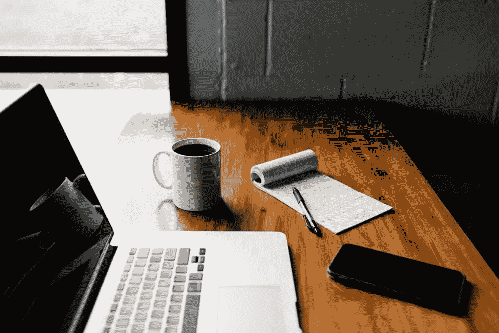
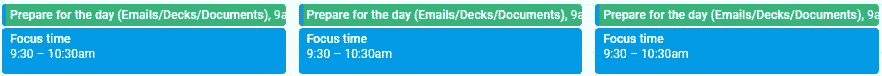
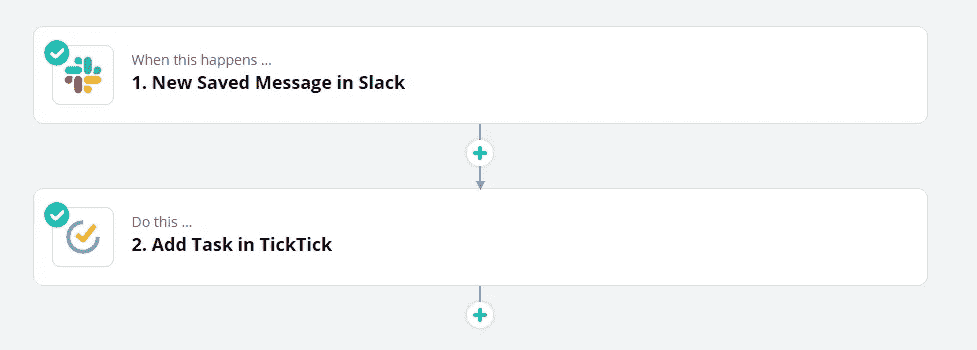
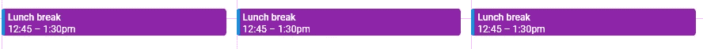

# 今天你可以实施的 7 个可行的 WFH 技巧

> 原文：<https://medium.datadriveninvestor.com/7-actionable-wfh-tips-you-can-implement-today-3b649c83e797?source=collection_archive---------19----------------------->

当我三月份开始在家工作时，我完全不知道该做什么？尽管我喜欢远程工作的概念，但我从未意识到这很难。多种多样的会议、电子邮件和松散的信息经常让我分心，我总是争先恐后地赶在最后期限前完成。我后来才知道，这是因为计划不周。因此，我花了一些时间阅读书籍，尝试了各种各样的东西，然后才专注于以下“在家工作”的建议。在过去的六周里，我几乎每天都使用这些建议，它们真的很有帮助。

 [## 释放结果的简单哲学|数据驱动的投资者

### 这是我们播客中帕迪·布鲁斯南的一段话。帕迪是一个正念和冥想老师，一个…

www.datadriveninvestor.com](https://www.datadriveninvestor.com/2020/03/16/a-simple-philosophy-to-unlock-results/) 

所以，我决定把它写下来。我在这里讨论的建议简单易行，有助于你保持注意力集中。最棒的是，你可以从今天开始实施这些建议。就像，现在！

所以，我们开始吧。

# 前 30 分钟花在小事情上

较小的任务是那些在工作中花费大量时间的任务。如果你把它们结合在一起，并在开始工作时处理它们，你会有更多的空闲时间。

一个好的做法是在你的日历上留出 30-45 分钟，用这段时间回复邮件(紧急邮件除外)，更新你的日历，安排会议，提交费用报告，审查内容等。这将释放你一天的剩余时间，并帮助你专注于重要的事情。

注意:如果你不愿意把它作为早晨的第一件事，你可以在一天中的任何时候封锁这个时间。

# 将你的电子邮件和空闲时间与待办事项联系起来

我们通过各种渠道接收任务和提醒，如电子邮件、会议、电话交谈和 Slack 消息(或微软团队)。而且，有时我们很难记住它们。有一个待办事项列表是很神奇的，但是必须从你的电子邮件和空闲频道手动添加所有的任务会很耗时。我最近发现了一个简单的方法来做到这一点。

我用 [Zapier](https://zapier.com/home) 将我的电子邮件和备用账户与我的待办事项列表联系起来。zap 工作方式是，每当我在电子邮件中添加一个特定的标签(比如“待办事项”)，它就会被添加到我的待办事项列表中。我还以这样一种方式配置了这个流，即我的待办事项列表中有详细信息，比如发件人的姓名、描述中的电子邮件内容等。这样，当我开始工作时，我就有了足够的任务背景。

我也为 Slack 做过类似的事情。每当我保存发给我的时差消息时，它将被创建为我的待办事项列表中的一个项目。这样，我就不必手动输入任务细节，还可以在一个地方看到我的所有任务。

我一直使用 [Todoist](https://todoist.com/) 作为我的待办事项应用，但最近发现 [TickTick](https://ticktick.com/) 更有用，因为他们提供了一个非常慷慨的免费计划。但是，Zapier 几乎可以与你使用的任何待办事项应用程序兼容。

为了了解如何创建 Zaps 并将其连接到您的帐户，请点击[此处](https://zapier.com/how-it-works)。

# 第 60-90 分钟用于重点工作

我最近读了一本很棒的书，书名是《腾出时间:如何专注于每天重要的事情》,作者杰克·纳普和约翰·泽拉特斯基在书中谈到如何为专注的工作找到时间。

诀窍很简单。每天花 60-90 分钟专注于一件重要的任务，不做其他事情。这听起来可能非常简单。但是，我们很容易走神，因为我们在工作时经常会遇到分心的事情。它可以是任何东西，从一个可爱的猫的视频，一个有争议的推文，一个有趣的博客(像我的)到一个寻求帮助的同事。

而且，当我们回到手头的任务时，我们已经完成了一天的工作。所以，每天安排一些时间，专注于一件你想当天完成的重要事情。你也可以根据自己的日程安排，在工作日创建 2-3 个这样的重点区域。

此外，当你处于焦点区域时，确保你暂停通知，将手机设置为静音或飞行模式，并关闭浏览器中的所有其他标签。最小化你的分心帮助你最大化你的结果。

# 安排午餐和咖啡休息时间

当你在家工作时，你的个人空间和职业空间之间只有一条很细的线，而且这条线经常被淡化。

为了明确区分，为个人活动留出时间，比如午餐和喝咖啡休息时间。这在两个方面帮助了你:

1.  这有助于你暂时忘掉工作
2.  它让那些试图阻碍你时间的人看得见。

想象一下，你饿了，想吃午饭，有人在那个时候安排了一个 60 分钟的会议。设定界限并根据具体情况放松界限总是好的。

# 做笔记

做笔记是掌控日常工作的终极秘诀。每天，我们都被太多的信息和多个会议轰炸。这使得我们很难记住所有的事情。我们经常忘记一些事情，在后续会议中毫无头绪。做笔记在会议中非常有帮助，可以迅速为你提供足够的信息，从而有效地切换上下文。

苹果有一个令人惊叹的 notes 应用程序。我还会推荐[微软 OneNote](https://www.onenote.com/) 和 [Dynalist](https://dynalist.io/) 。在过去的几周里，我一直在使用 Dynalist 作为我的个人笔记应用程序，我非常喜欢它。

创建文件夹，如会议笔记、每日站立、个人笔记、功能发布时间表、跟进、阅读文章等。并在它们下面添加注释。这使得浏览笔记变得容易。

# 下班后关闭时差通知

这个小窍门可以让你少想工作，帮助你平静地与家人和爱人共度夜晚。

我已经从手机上卸载了 Slack 应用程序，因为我在家工作，笔记本电脑和手机挨着。因此，在两个不同的设备上接收相同的通知对我来说没有意义。如果我回到办公室工作，我肯定会再次安装这个应用程序。但是，只要你在家工作，请在下班后关闭你的空闲通知

# 无所事事地坐一会儿，结束你的一天

完成工作后，去你的客厅或卧室，坐在那里休息五到十分钟。不要看手机、看书或看电视。让自己舒服就好，什么都不用做。如果可能的话，闭上眼睛，专注于你的呼吸。

这个小运动可以让你感觉好很多。我们周围有如此多的分心事物，我们几乎不给大脑一些空闲时间。给你这段空闲时间将有助于你的大脑从一天的工作中休息一下，让你精神焕发。

谈到在家工作，我不是专家。很多人都有几年的远程工作经验。但是，无论我现在做什么都在很大程度上帮助了我，我想与你分享。我相信这些建议中至少有一条会有所帮助。很快会看到另一篇有趣的文章。

在那之前，呆在室内，保持安全。

*喜欢这个博客吗？分享给你的朋友。另外，请通过订阅***来表达一些爱。每周给你发一个惊艳的故事。不再发邮件了。我保证！**

**原载于*[*https://endangered.substack.com*](https://endangered.substack.com/p/7-actionable-wfh-tips-you-can-implement)*。**