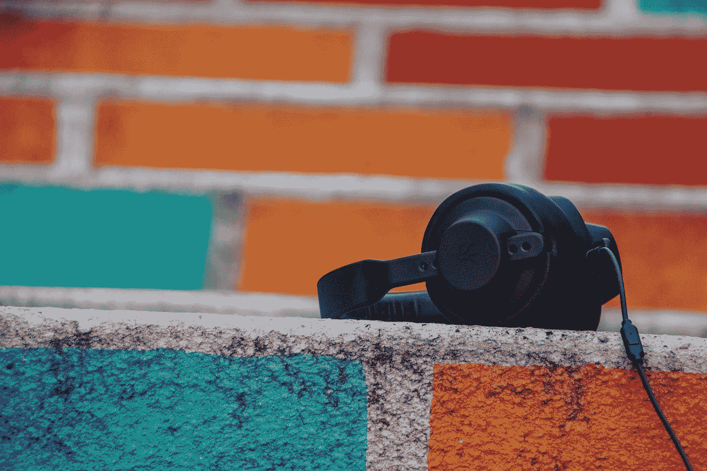
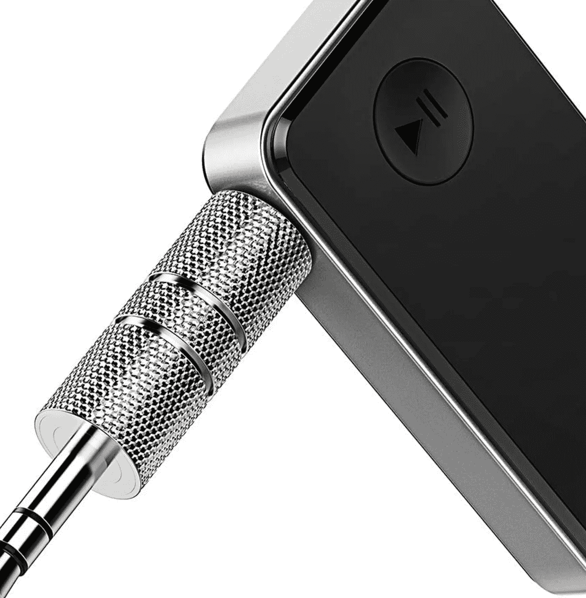

# 如果你想学习并成长为一名企业家，你必须听 7 个精彩的播客

> 原文：<https://medium.datadriveninvestor.com/7-amazing-podcasts-you-have-to-listen-to-if-you-want-to-learn-and-grow-as-an-entrepreneur-ea22dc8a625?source=collection_archive---------22----------------------->

## 可能会改变生活的习惯

Photo by [FPVmat A](https://unsplash.com/@fpvmat?utm_source=unsplash&utm_medium=referral&utm_content=creditCopyText) on [Unsplash](https://unsplash.com/s/photos/podcast?utm_source=unsplash&utm_medium=referral&utm_content=creditCopyText)

# 有很多发明彻底改变了我的生活。

其中之一就是播客。

看似微不足道，实则不然。

很久以前，我决定在多次通勤或任何其他“暂停”时停止听新闻。

> 我是一个电台迷，一个我崇拜的媒体频道。因为我醒来直到一天结束，我在听收音机。这是我生活的一部分。没有它我活不下去。

然后发生了什么？ **4 个重要问题:**

1.  我受够了广告。
2.  我厌倦了听悲剧和坏消息。
3.  我厌倦了听完全相同的新闻，相同的历史，相同的问题。
4.  播客诞生了。

作为一个狂热的学习者，寻找我感兴趣的内容类型是必须的。

> 播客让我可以在任何时间、任何地点听到我想要的内容。

后来，另一件愚蠢的事情发生在我身上。我发现了这个小装置。

Photo by Author

20 块钱，**我的生活完全改变了**。

你通常不知道你的生活什么时候可以改变。

有时候你在努力做某件事，却没有任何结果。在其他情况下，你在一个培训项目上花了很多钱，却什么也没得到。

> 但是在你生命中的某一天，你投资 20 美元在一个小设备上，这将改变你的生活。生活就是这样…

这个小小的设备使我的手机内的蓝牙连接成为可能。这个装置与我汽车的无线电输入相连。这让我可以在车内轻松收听我的播客。

 [## 不见面就做交易？风投和企业家的 5 个指南|数据驱动…

### 自从 covid 六个月前登陆美国以来，全球的风险投资家和企业家都不得不适应新的现实…

www.datadriveninvestor.com](https://www.datadriveninvestor.com/2020/09/20/doing-deals-without-meeting-in-person-5-guidelines-for-vcs-and-entrepreneurs/) 

> 如你所见，一个愚蠢的解释，却彻底改变了我的生活。

能够在我的车里听我的播客让我提高了我的英语水平，开始学习法语，结识迷人的人，并了解了很多我感兴趣的话题(生产力、自我提高、创业、金融……)。

你不能为了区区 20 美元要求更多！

> 播客使得为你创造时间成为可能。几年前你浪费了一段时间。

我们不欣赏这样的事情，但这是事实。

> 如果你每天听播客，就我而言，每天听 2 个小时，你会有 700 多个小时专注于对你真正有帮助的内容。

这相当于将近 90 天每天花 8 小时学习。

> 一年的 1/4 用于训练。

**这是真正改变生活的过程。**

现在，让我们来看看我最喜欢的播客，因为这是你阅读这篇文章的原因…

## 超人学院播客(乔纳森·李维)

乔纳森·李维是一个痴迷于元学习的人，元学习就是学习如何学习。

我上过他的几门课，还经常听他的播客。他总是采访了不起的人。

> 在这里，你不仅仅是通过听来学习，关键是要和所有的被采访者接触，他们都是令人难以置信的人。你可以得到他们的网站，他们的书，他们的播客。

乔纳森在第 300 节停止了他的播客，但你无法想象你能从中获得所有的好东西！

## [头脑&机器](https://mindandmachine.libsyn.com/)(奥古斯特·布拉德利)

八月是“生产力机器”。我真的很佩服他。

他创造了一种叫做 PPV(支柱、管道和金库)的生产力方法，这令人印象深刻，并且是我今天用来管理我所有的目标、项目和任务的方法。**我甚至会更进一步:我的一生。**

> 他还将这种 PPV 方法应用到了 ideal 中，如果你不知道的话，我推荐你看看这个软件。

在他的播客中，奥古斯特采访了令人着迷的人，重点关注变革性技术。正如他所说，“探索未来技术、未来主义思想以及这些指数变化的社会学、道德和哲学影响”。

## [没有多想](https://notoverthinking.com/)(阿里&蒂亚穆尔·阿卜达尔)

阿里和 Taimur Abdaal 主持这个播客“基于社会互动，生活方式设计，心理模型…”。

他们两个都是生产力极客，我推荐[阿里的 YouTube 频道](https://www.youtube.com/channel/UCoOae5nYA7VqaXzerajD0lg)，充满实用主义，如果你想提高你的生产力，让你的生活变得更轻松，这些都是有用的东西。

有时他们也会采访属于这个世界的人:企业家、生产力书呆子，以及你总能从中获得一些建议的人。

## 扩大你的业务规模(尼克·布拉德利)

尼克是一名教练，帮助人们和公司“加速到下一个水平”。

> 我喜欢务实的人，他就是其中之一。

我总是希望不要浪费我的时间，这就是为什么我总是准确地知道我在听什么，我把时间花在什么上面。

这个播客是值得的！

## [知识项目](https://fs.blog/knowledge-project/)(沙恩·帕里什，法尔南街)

Shane 和 Farnam 将他们的播客集中在“掌握别人已经发现的最好的东西”上。

> 如果你想从伟大的人身上学到新的东西，这里就有。

在这里你可以聆听首席执行官、神经科学家、运动员、音乐家、扑克明星…

任何一种侧写都可以去掉大部分！

## 每日的坚忍(赖安假日)

我很肯定你已经知道 Ryan 了，因为他很有名，有很多畅销书，我没有说什么新的东西，但我把他列入名单，以防万一，因为这是我经常听的播客。

> 我热爱哲学，因为它是人类的本质。你可以找到生活中重大问题的答案。

在这里你可以理解古代哲学家和我们今天生活的联系。他们没什么不同。我甚至会说更多:它们完全一样，但今天我们有了智能手机。

## 蒂姆·费里斯秀

我必须包括这一条，因为我听蒂姆的播客，我读过他的书，我订阅了他的每周简讯。

**没什么新东西可说。**

他是一个世界范围的参考，尽管我总是说你必须努力寻找不同的人，因为这个世界充满了未知的天才，听听蒂姆和他的客人们的意见是值得的。

## 结论

学习是一个人为了过上有意义的生活所能采取的最佳行动之一。

> 学习会让你进步，进化，成为更好的自己，成长，为你的生活感到骄傲。感觉你没有在这个星球上浪费时间。

对我来说，学习给了我这一切。

> 对我来说，找到播客时代之前没有的时间是一个伟大的发现。

我要感谢所有那些思考这些发明并花时间将它们变成现实的伟大天才。

这是像我这样的普通人每天都能感觉更好的方法。

## 访问专家视图— [订阅 DDI 英特尔](https://datadriveninvestor.com/ddi-intel)