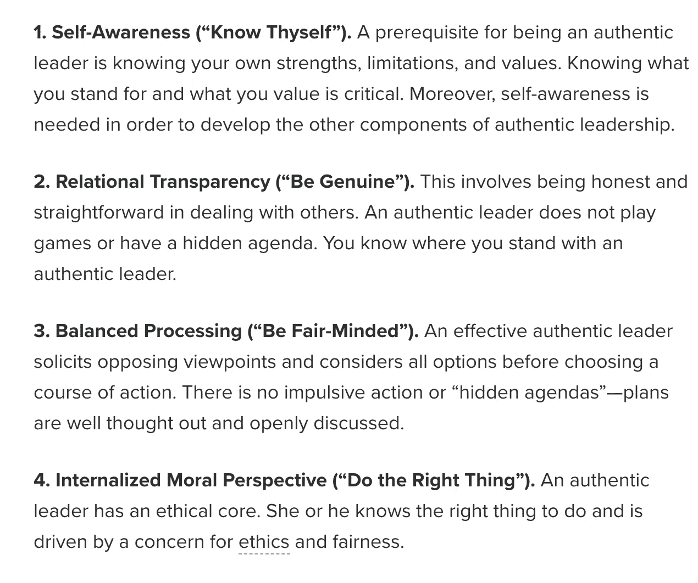
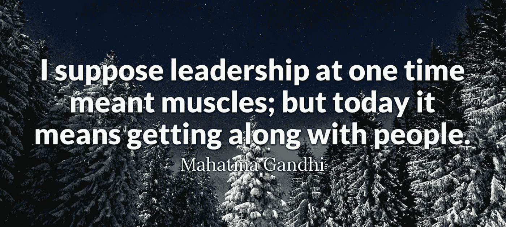
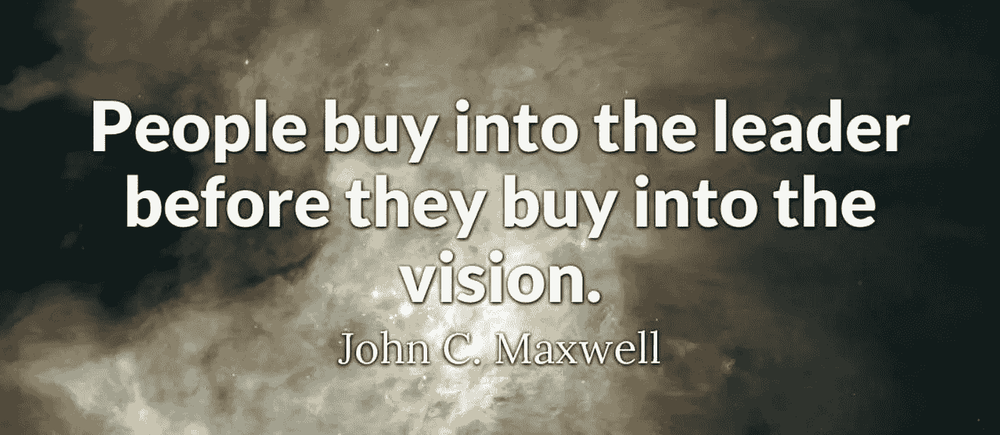

# 2020 年的 7 堂真正的领导理论课

> 原文：<https://medium.datadriveninvestor.com/7-authentic-leadership-theory-lessons-in-2020-aeab9764d9e3?source=collection_archive---------9----------------------->

## 一个 2x-NBA 的失败和 2020 年商业，创业公司和企业家领袖的真实领导理论的专业主教练

Photo by [Matteo Vistocco](https://unsplash.com/@mrsunflower94?utm_source=medium&utm_medium=referral) on [Unsplash](https://unsplash.com?utm_source=medium&utm_medium=referral)

# 7 堂真正的领导理论课

## 对于 2020 年的企业、初创公司和企业家来说，什么是真正的领导力？更重要的是，你有吗？

我职业教练的第一年教会了我很多。嗯，首先，我在很多事情上都很糟糕。我从未执教过，然后砰的一声，“让我们把特雷弗放在世界十大篮球联盟里，看看他表现如何！”

当然，我的成长心态开始起作用了，我说:“去做吧！”

我用我的健身创业公司做了这个。作为一名球员，我在欧洲打篮球。我没有什么可失去的总是我的口头禅。

但我从未管理过整个团队。我从来不知道真正的领导是一种理论。

 [## 良好的生活是习惯的形成|数据驱动的投资者

### 过度思考是过度紧张。仅仅几个简单的习惯就会在一天中产生巨大的影响。那是…

www.datadriveninvestor.com](https://www.datadriveninvestor.com/2020/01/17/a-good-life-is-habit-forming/) 

作为一名球员和队友，我一直相信脆弱、诚实、个人成长和通过对话来完成事情。我是一名运动员，我在日记中思考并写下我们如何改进。

## 作为一名职业运动员，我如何提高真正的领导力:

> 我是要求更多的队友，但总是买第一轮饮料。
> 
> 在每一次训练和操练中，我都是比任何人都更加努力的队友。
> 
> 我为自己的努力和职业道德感到骄傲，甚至超过了我的成功(好吧，但他们真的很接近)。

我并不总是成功。赛季结束时只有一个赢家。但这个过程教会了我对真正领导力的宝贵见解，它在许多方面都适用于成功。

人们在一英里之外就能闻到假货、骗子或庸医的味道。正如我在高中、大学和职业篮球和足球比赛中多次获得全国或州冠军时所反映的那样，我总是试图自我反省，在问我的队友之前，先问自己还能做得更好。

最后，我进入了 10 个四强，精英八强，赢得了州和全国冠军，但我真正做的是学习如何领导自己。

## 正宗领导理论来自[罗纳德·E·里吉奥博士](https://www.psychologytoday.com/us/experts/ronald-e-riggio-phd):

photo credit: psychology today

## 我还添加了一些真实领导力的常见主题，希望能帮助你更有效地领导:

> 情商——理解你的团队，通过关心、沟通和理解让他们达到更高的标准。

每个玩家都有不同的交流方式，但是每个玩家都想赢。如果你理解别人，他们就会学会信任你。你如何创造一个让玩家和员工信任你的环境？我有一个对话，关于我们需要一起做些什么来达到一个共同的目标。

> 积极——给你的团队带来热情、热情和不懈的努力，他们会追随你。

我生命中有几个我喜欢为之效力的教练——他们都完全不同。我指导过各种不同的球员，其中一些是我喜欢的教练。他们之间的一个共同主题是积极和热情地参与他们所做的任何事情。

> 真实——做你自己。如果你不是坏蛋，就不要表现得像个坏蛋。要真实。真实一点。对自己和周围的人诚实。

没有什么比为一个自大的汽车经销商领导工作更糟糕的了，他认为他拥有权力是因为他的头衔。无标题领导。观察你的团队如何回应。创造你想参与其中的体验。

> 工作效率——你能多快完成工作？当你与你的潜在客户、顾客和团队保持联系的时候，你的效率如何？

这一点很重要，因为要创造价值，你必须把事情做好。创造流动。尝试新事物。瑜伽课。流动训练。集体锻炼。午餐时间打篮球(史蒂夫·卡罗尔在办公室度过了有史以来最精彩的一集)。当你回顾这一周的时候，创造你引以为豪的工作节奏。

> 愿景——团队的愿景是什么？为了实现这一愿景，他们将每天生活和达到什么样的价值观、习惯和短期目标？

视野是巨大的。本季度要完成的前三件事是什么？你希望你的团队每天练习的大习惯是什么？这是巨大的。一个练习是找出每个员工或团队成员的五大价值观是什么，然后强调所有的共同主题，并围绕团队的价值观和优势构建您的愿景。

> 信任——你的团队信任你吗？

你关心队外的生活吗？你会出现在他们工作之外的生活中吗？如果没有，为什么？多走一英寸，他们就会多走一英里。你不用打听。你可以只是关心。如果有人需要家里的东西，给他们一天假。如果有人需要帮助他们的伴侣，让他们离开。

> 幽默——你能对自己的错误一笑置之吗？你能否带着一种潜在的认识来处理每一个紧张的局面，即后退一步并不是世界末日。

和你的团队一起享受当下。除了这时刻，你别无选择。我选择用幽默感来应对，因为恐惧是一种幻觉。

## 谢谢你读到这里！

我真的很喜欢给像你这样的人写信，是的，谢谢你妈妈的阅读。我希望你喜欢我的“2020 年职业教练的 6 堂真正的领导理论课”如果你没有，告诉我为什么。如果你有，告诉我为什么。或者直接报名我的下一篇文章！

*   请加入我的特雷弗霍夫曼简讯: [**这里**](https://mailchi.mp/fdc3300e1a3a/pro-athletes-best-sports-blog-post-game) 。

 [## 在比利时的美国蔻驰:新冠肺炎时代的隔离

### 我是比利时冠状病毒自我隔离的美国职业篮球教练。这是我的故事…

medium.com](https://medium.com/sportsraid/american-coach-belgium-self-quarantine-covid-19-coronavirus-health-basketball-corona-virus-dfd8e3de9204)  [## 将改变你 2019 年的 5 个自我认知工具

### 一名职业运动员如何运用意志力来改变你的成长和定义自己的成功

medium.com](https://medium.com/datadriveninvestor/5-self-awareness-tools-that-will-change-your-2019-b6fbedeecc9e)  [## 斯多葛派的生活:奔向失败，过一种更简单的生活

### 我的职业体育博客是关于如何度过失败、不确定性，以及如何保持坚忍不拔的精神。

medium.com](https://medium.com/the-ascent/the-stoic-life-stoicism-pro-athlete-blog-on-failure-2642e45e61a3)  [## 守卫斯蒂芬·马布里是什么感觉

### 对于一个自由球员新秀来说，这就像试图在绿巨人变绿时把他关进笼子

level.medium.com](https://level.medium.com/what-it-feels-like-to-guard-stephon-marbury-f78e137e640d)  [## 2020 年，在生活、运动、写作和创业中，你每天需要做的 3 件事

### 你好。我是特雷弗，世界级的体育和动机作家(好吧，不是真正的世界级，但我相信这个过程…

medium.com](https://medium.com/datadriveninvestor/3-things-you-need-to-do-every-day-to-rock-in-life-sports-writing-and-startups-in-2020-51022b74e894) 

感谢您从一天中抽出最宝贵的时间来阅读我的职业运动员和教练生活中的体育智慧思想……:)

# [特雷弗·霍夫曼](https://medium.com/u/5e7157084b29?source=post_page-----aeab9764d9e3--------------------------------)