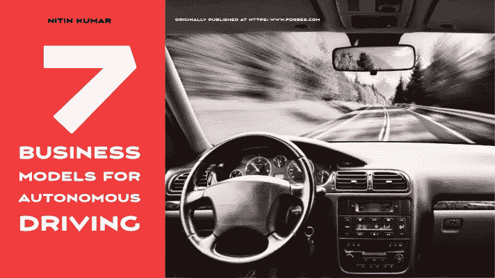
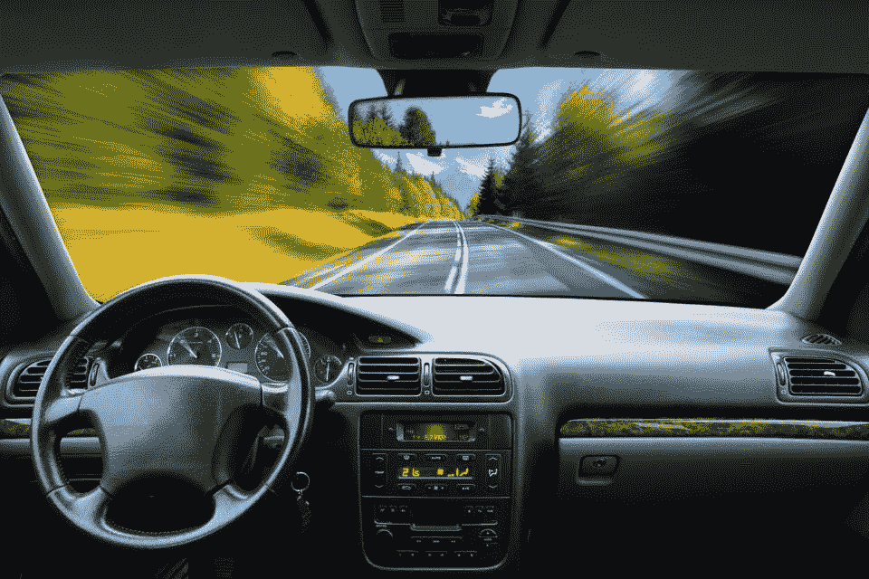

# 自动驾驶的 7 种商业模式

> 原文：<https://medium.datadriveninvestor.com/7-autonomous-driving-business-models-930cd4de6b86?source=collection_archive---------18----------------------->

Image created by author using Pixabay

*了解自动驾驶的商业模式*

# 介绍

自动驾驶是最具颠覆性的发展之一。它将改变我们对城市、道路、停车、通勤、休闲和所有权的看法，随着商业模式的发展，它将催生新的工作岗位。当涉及到商业模式、基础设施、技术方向和发展时，许多开放性问题都有了答案。

Image from author’s original article on Forbes

# **TaaS(交通即服务)**

自动驾驶是最具颠覆性的发展之一。它将改变我们对城市、道路、停车、通勤、休闲和所有权的看法，随着商业模式的发展，它将催生新的工作岗位。当涉及到商业模式、基础设施、技术方向和发展时，许多开放性问题都有了答案。

# **操作系统支持的价值链**

许多汽车原始设备制造商(OEM)认为，交通运输注定会发生根本性的变革，未来将会大不相同。像宝马这样的原始设备制造商现在直接向消费者销售，但也在尝试拼车、车队销售和分时租赁，创造交通即服务(TaaS)的商业模式。按需商业模式将改变运输行业的利润池配置，价值将从经销商或硬件转移到技术、数据、设计和平台。

操作系统是任何生态系统的心脏，但技术玩家以不同的方式将其货币化。苹果(iOS) [对硬件收取额外费用](https://www.businessinsider.com/why-apple-products-are-so-expensive-iphone-macbook-2019-11)，谷歌(Android)带来更多[广告收入](https://venturebeat.com/2020/02/12/liftoff-2020-may-be-the-year-android-ad-revenue-eclipses-ios/)，而微软(Windows)[直接货币化](https://www.zdnet.com/article/running-windows-10-heres-how-microsoft-plans-to-milk-more-profits-out-of-its-cash-cow/)。对操作系统的控制对自动驾驶价值链至关重要，因为它通过控制影响客户体验和关系。

底特律和硅谷都在竞相创造和控制这种操作系统。当特斯拉正在模仿 iOS 模式时，百度正在关注 T2 的开源技术，将辅助产品/服务货币化，而优步正在建立合作伙伴生态系统，以形成规模。多种模式将可能出现、共存和竞争，影响资本化、规模、利润、营销、销售和未来投资。

# **车队和物流**

鉴于对硬件的关注和打造卓越的设计，特斯拉式的商业模式应该在美学上更具吸引力，而百度模式可能会依赖于更便宜的设计，同时提高配件、服务和支持。传感器的正确封装和数量也将取决于所采用的操作系统策略，从而影响辅助玩家的价值。操作系统的开放和封闭策略(例如，iOS 对 Android)也会产生安全立法、竞争动态和基础设施标准化等后果。

随着商业车队限制的消除，现有的物流方法将发生变化，因为行驶时间限制可以提高资产利用率、减少停工时间、加快货物运输、减少拥堵和降低运营成本。已经有关于政府考虑[自治区域](https://www.zdnet.com/article/the-obstacles-to-autonomous-vehicles-liability-societal-acceptance-and-disaster-stories/)和减少[停车场](https://techcrunch.com/2018/08/02/will-self-driving-cars-kill-parking/)需求的讨论。

# **数据驱动的价值链**

新的商业专长和机会将通过新的参与者出现在城市规划和车队管理/监控等领域。车队围绕访问频率、使用时间或消耗的里程创建商业模式。考虑到现有车队的长折旧周期和创建 AV 车队的成本因素，存在半自主或改装能力作为短期收入流。

自动驾驶汽车将以前所未有的水平消耗和产生数据。数据来自各种来源和组件，如相机、雷达、激光雷达、GPS、传感器、地图和智能基础设施。所有这些数据都必须实时聚合，并经过训练以导航道路、避开障碍、提供安全、遵守规则和创建个性化体验。这些数据的数量、速度和接收将需要新的基础设施、软件定义的处理能力和新的业务模式。例如，许多合作伙伴关系已经发展到共同创建新数据集或像高清地图一样访问数据集。

 [## 技术成瘾-是真的吗？数据驱动的投资者

### 通知铃声响起。你很想检查一下。你拿起手机检查了一下。“哇...再来一个喜欢的…

www.datadriveninvestor.com](https://www.datadriveninvestor.com/2020/12/16/technology-addiction-is-it-real/) 

# **软件定义的价值链**

最初，人类和机器学习模型必须训练这些数据——人在回路中的方法。虽然深度学习将发生在云中，但机器学习在车辆本身上执行。所有这些数据的所有权、消费和货币化将告知商业模式，因为许多新的创业公司仅围绕这一数据价值链出现。

科技公司通过高效的渠道，将供应商商品化，将消费者货币化，从而创造价值。在交通领域，优步和 Lyft 等拼车公司也通过一个渠道(平台技术)聚合了需求，并将供应端商品化，使得这种车辆对乘客来说不那么重要。优步和 Lyft 都希望通过[投资](https://www.cnbc.com/2019/11/05/lyft-is-developing-self-driving-cars-at-its-level-5-lab-in-palo-alto.html)自动驾驶项目，巩固其作为未来[交通焦点](https://www.cnbc.com/2020/01/28/ubers-self-driving-cars-are-a-key-to-its-path-to-profitability.html)的地位。

# **车联网和 V2X**

价值链中有许多参与者——如谷歌、旧的原始设备制造商、新的参与者如特斯拉和汽车供应商——在竞争。汽车和车队的电气化以及新动力系统的可行性将直接影响 AVs 的固定成本和运营成本；一个新的交通和移动生态系统预计将在各个方面更快、更便宜、更清洁、更安全、更定制化和更高效。价值链的高端将为基金会创造更强的地位，以加速这一新生但充满希望的领域。

# **监管驱动的商业模式**

利用多种模式的 C-V2X 的商业模式包括信息娱乐、交通信息、实时地图、远程信息处理和数据分析。基于网络的数据分析、监控和机会也是存在的。虽然 V2I 可能会因地方政府缺乏进步动力和预算赤字而推迟，但它们将成为商业模式的重要影响者(获得服务、获得空间等。).

监管机构一直在与大型科技公司斗争，反之亦然，而快速的技术进步很难跟上时代的步伐。监管机构是自动驾驶革命的重要利益攸关方，并影响参与者转向更低污染、更少拥堵和更高效的通勤。他们还必须考虑从人类驾驶到自动驾驶的过渡时间，同时考虑共存期。

随着空间的发展，监管者将对经济价值的分布感兴趣。例如，如果对行驶的英里数征税，那么靠近行动中心将会受到激励。如果税收是由停车时间或空间占用来驱动的，那么商业模式将会转变，以最大限度地减少闲置时间。在行业引导监管和让监管指引行业未来之间，将是一个“鸡对蛋”的局面。

# **结论**

商业模式和利润动机将为自动驾驶的技术、监管和社会采用提供信息。这是一个生态系统游戏，价值创造于传统汽车制造商之外，如技术、媒体、电信、保险、医疗保健、能源和政府。

# 其他相关条款:

1.[自动驾驶技术栈](https://medium.com/predict/the-autonomous-driving-technology-stack-f0b53ab08f99)

2.[自动驾驶:为什么大数据价值是一个神话](https://medium.com/datadriveninvestor/autonomous-driving-why-big-data-value-is-a-myth-584427b50f05)

3.[自动驾驶的七大数据挑战](https://medium.com/datadriveninvestor/7-data-challenges-in-autonomous-driving-e21d05dacc3a)

4.[七大自动驾驶商业模式](https://medium.com/datadriveninvestor/7-autonomous-driving-business-models-930cd4de6b86)

5.[支持自动驾驶商业模式的 12 项技术](https://medium.com/datadriveninvestor/12-technologies-enabling-autonomous-driving-business-models-33088ba89474)

6.[采用自动驾驶基础设施的途径](https://medium.com/the-innovation/pathways-to-adoption-for-autonomous-driving-infrastructure-676438a7aaa3)

## 访问专家视图— [订阅 DDI 英特尔](https://datadriveninvestor.com/ddi-intel)