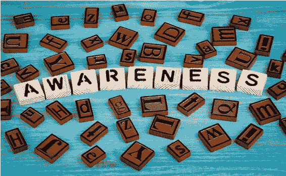
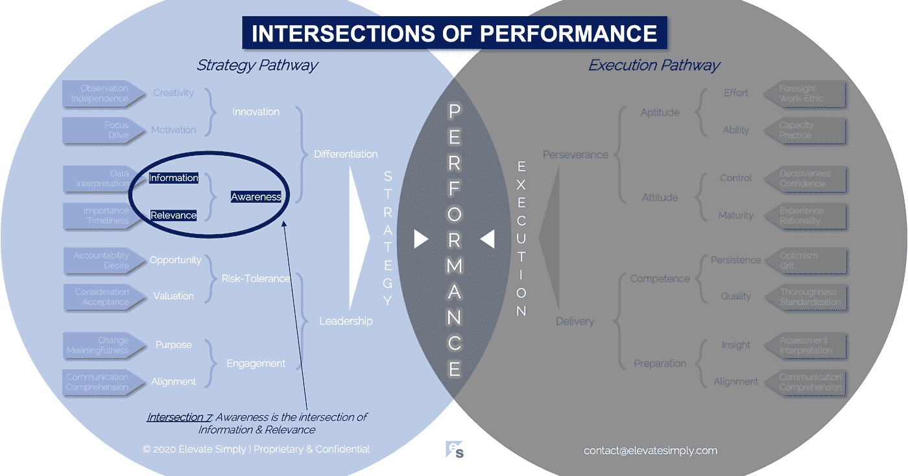

# 意识:信息和相关性的交集

> 原文：<https://medium.datadriveninvestor.com/7-awareness-the-intersection-of-information-relevance-f0fd5322bcb7?source=collection_archive---------16----------------------->

想想你最后一次做出正确的选择。是什么让你想到它的？意思是，你怎么知道那是正确的选择？现在，想想上一次你做了一个被证明是错误的选择。是什么让你这么做的，为什么结果是错的？

选择归结于做出选择时的意识。你有没有想过，“为什么公司…这个月推出一个产品/选择那个策略/做 A 而不是 B /雇佣那个人/把办公室设在那里/发布那个营销活动？”我们每个人都对许多公司的选择有过这样的想法。大多数时候，我们永远不会知道他们的基本原理，因此我们自己的结论或评估是基于不完整的知识。

就像宝丽来的画或资产负债表一样，意识是在某个时间点上理解的表现。它驱动信心，包括有保证的和虚假的。它告诉我们选择，无论是对还是错。它辨别差异和相似性。它拓宽了视野，因此接受或拒绝。它引发判断，迫使人们站在一边。它是当前状态的总结。然而，至关重要的是，这并不能保证未来的成功。

意识通常是根据过去来评估的。

*   什么是已知的，什么时候？
*   是否进行了成本效益分析？它显示了什么？
*   预期的结果是什么？实际结果如何？
*   谁参加了？他们合格吗？

在分析结果时，意识往往是事后才想到的。重要的是要认识到意识是一种技能和能力，需要一直使用。领导者的认知能力及其过程决定了团队和公司的绩效之路。

**什么是认知交集？**

意识是信息和相关性的交叉点*(见下图交叉点 7)*。信息和相关性本身是不完整的，如果不结合起来考虑，可能会导致有害的结果。

*信息*

"把你掌握的关于这个题目的所有信息都发给我。"这是常见的商业用语。人们的假设是，成堆的纸张，或者更恰当地说，千兆字节的文件是有帮助的。一方面，信息真的很神奇。它是我们追踪和用来尝试做出最佳选择的东西。另一方面，我见过许多由无关信息组成的无用演示文稿。

我最喜欢的展示信息傲慢的方式是，当一个人或一个团队与高管开会，扔下几英寸厚的文书工作来“证明”他们做了多少工作，处理了多少信息，当然，他们为企业增加了多少价值，他们知道没有人想翻阅那么多信息。

在我职业生涯的早期，我可能真的这样做过一两次(也就是说，这确实发生过)，骄傲而愚蠢地认为我真的增加了价值。我现在知道的是，没有上下文的信息是没有价值的，不管它有多少。

交叉点 7:认知=信息+相关性

*相关性*

相关性是信息的语境创造者。它塑造信息，使其有用和可用。相关性为信息用户提供了从中获取价值所需的知识。

相关性是一个总括术语，当应用于信息时，可以包含以下内容:

*   及时->信息是最新的吗？
*   质量->信息是否纯净无污染？
*   合适->该信息对所讨论的机会或问题有用吗？
*   完整->信息是否足够？
*   定量/定性->信息是否包含所需的定量/定性因素？
*   可用->获取信息的难易程度，频率如何？
*   有效->信息是否能被最终用户接受？
*   可靠->信息来源合法吗？

相关性是意识中的秘方。上面的术语指的是相关性的“科学”,但是将相关性应用于信息也是一门艺术。艺术在于如何忽略噪音，也在于如何找到相关信息。

可用的信息量是巨大的。筛选、分类和识别一组可以应用相关性的信息需要技巧。知道哪些信息适用，哪些信息不适用非常重要。这就是为什么有人、团队、整个公司和职业都致力于此。

**领导者能做什么？**

领导者必须首先意识到意识是决策和绩效的先决条件。接下来，他们需要教育他们的团队和其他利益相关者，没有上下文的信息是无用的，会导致效率低下。语境来源于关联。领导者应该在他们的团队和公司内部建立一种思维模式，即相关性是每个人都需要的关注细节的期望的一部分。

根据我的经验，这种类型的范式转换最好通过非常注重策略的工具来实现，例如创建一个包含上面列出的信息相关性要素的清单(即，及时性、质量等)。如果坚持下去，提高认识将很快以更快、更好的选择和更有用的报告的形式显现出来。

意识是优秀领导者已经掌握的一种能力，尽管有时很难准确定位。

**总结&下一个**

好消息是意识是可以学习和提高的。它需要领导者的勤奋和专注，以确保它在团队或公司中根深蒂固。

下一次，我们将考察绩效的第八个交叉点，即**创新交叉点**。

在这一系列文章中，我们探索了性能*的交叉点，共有 30 个。*绩效的交叉点*框架是基于*[*Brett Simpson*](https://www.linkedin.com/in/brettjsimpson/)*[*的常务董事*](https://www.linkedin.com/company/elevatesimply/) *的经验和见解，他在大大小小的组织中担任了 20 多年的领导，并且是一名企业家、顾问和投资者。**

***绩效-文章链接的交集***

*1.[业绩:战略的交集&执行](https://medium.com/the-innovation/1-performance-the-intersection-of-strategy-execution-2bf06329f8d4)*

*2.[战略:领导力的交叉点&差异化](https://medium.com/the-innovation/2-strategy-the-intersection-of-leadership-differentiation-a568b17731ab)*

*3.[领导力:参与的交集&风险承受能力](https://medium.com/the-innovation/3-leadership-the-intersection-of-engagement-risk-tolerance-f8c887e6c1d3)*

*4.[差异化:创新的交叉点&意识](https://medium.com/@brettjsimpson/4-differentiation-the-intersection-of-innovation-awareness-a21d053ecf12)*

*5.[啮合:目的交点&对准](https://medium.com/@brettjsimpson/5-engagement-the-intersection-of-purpose-alignment-953747437c26)*

*6.[风险承受能力:机会的交叉点&估值](https://medium.com/@brettjsimpson/6-risk-tolerance-the-intersection-of-opportunity-valuation-29cf4d9a0ac)*

*7.[认知:信息的交集&关联性](https://medium.com/@brettjsimpson/7-awareness-the-intersection-of-information-relevance-f0fd5322bcb7)*

*8.[创新:创造力的交汇点&动机](https://medium.com/@brettjsimpson/8-innovation-the-intersection-of-creativity-motivation-7c1a12e0d5e2)*

*9.[目的:变化的交集&意义的交集](https://medium.com/@brettjsimpson/9-purpose-the-intersection-of-change-meaningfulness-9f12b0153e1)*

*10.[估价:对价的交集&验收](https://medium.com/@brettjsimpson/valuation-the-intersection-of-consideration-acceptance-eebe7b15e763)*

*11.[机会:欲望的交汇&责任](https://medium.com/the-innovation/opportunity-the-intersection-of-desire-accountability-7e81adb1e195)*

*12.[相关性:重要性的交集&及时性](https://medium.com/@brettjsimpson/relevance-the-intersection-of-importance-timeliness-56cc748eb066)*

*13.[信息:数据的交集&解读](https://medium.com/@brettjsimpson/information-the-intersection-of-data-interpretation-62acc94ba8bf)*

*14.[驱动:焦点的交点&驱动](https://medium.com/@brettjsimpson/14-motivation-the-intersection-of-focus-drive-d9ebd3ca9951)*

*15.[创造力:观察的交集&独立性](https://medium.com/@brettjsimpson/15-creativity-the-intersection-of-observation-independence-57f7294acb2b)*

*16.执行力:毅力与交付的交集*(即将推出！)**

*17.交付:准备与能力的交集*(即将推出！)**

*18.毅力:天资与态度的交汇*(即将推出！)**

*19.准备:洞察力和一致性的交集*(即将推出！)**

*20.能力:坚持与质量的交汇点*(即将推出！)**

*21.态度:控制与成熟的交集*(即将推出！)**

*22.资质:努力与能力的交汇点*(即将推出！)**

*23.洞察力:评估与解释的交集*(即将推出！)**

*24.质量:彻底性和标准化的交汇点*(即将推出！)**

*25.坚持:乐观与勇气的交汇*(即将推出！)**

*26.成熟:经验与理性的交集*(即将推出！)**

*27.控制:果断与自信的交汇*(即将推出！)**

*28.能力:能力与实践的交集*(即将推出！)**

*29.努力:远见和职业道德的交集*(即将推出！)**

*30.对齐:传播与综合的交汇点*(即将推出！)**