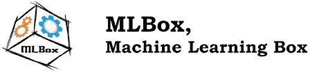
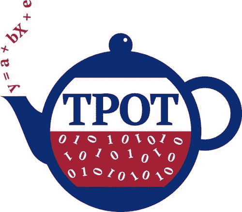
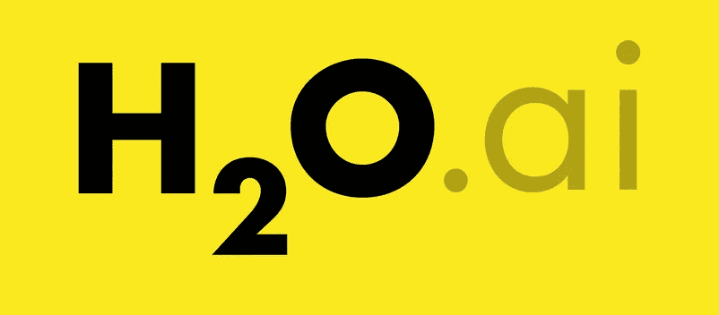
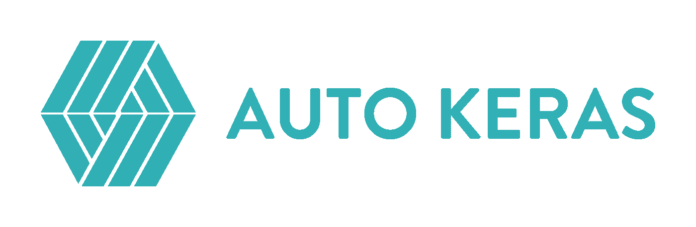
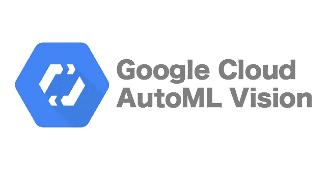

# 7 个 2020 年最佳自动机器学习框架

> 原文：<https://medium.datadriveninvestor.com/7-best-automatic-machine-learning-frameworks-2020-437f5aec03d3?source=collection_archive---------3----------------------->

自动机器学习系统有什么有趣的地方？有哪些适合 AutoML 的框架？到目前为止有哪些局限性？我们将在文章中回答这些问题。

假设有一个数据集，我们想通过它获得一个预测模型。传统的机器学习方法需要以下动作序列:

*   初步数据处理；
*   确定构建新功能的典型特征；
*   选择正确的学习模式；
*   超参数的优化；
*   用最佳参数训练。

这个过程可能很长，因此也很昂贵。事实上，为了得到更好的结果，有必要反复检验假设，而且，每一步都可以进一步完善。

自动机器学习(AutoML)的任务是在不损失预测准确性的情况下自动化所有或至少一些步骤。理想的 AutoML 策略假设任何用户都可以获取原始数据，在此基础上构建模型，并获得尽可能准确(对于可用样本)的预测。

但这是否意味着不需要数据分析专家的那一天会到来？当然不是。AutoML 技术旨在消除常规的操作序列和手工枚举模型，以便专家可以将更多的时间投入到问题的创造性方面。

考虑上面描述的机器学习的“传送带”。每个阶段都需要自己的方法。例如，为了准备数据，可能需要自动化:

*   确定列的类型(数字数据、文本、布尔值等。);
*   语义内容，例如，如果字段是文本，那么它代表什么:姓氏、日期、地理标记等。；
*   任务检测:集群分配、排名等。

特别注意寻找最佳模型超参数的过程。找到它们的两种最常见的方法是:

*   网格搜索。
*   随机搜索(Random search)。

显然，这些方法的流行是因为易于实现。这两种方法仅适用于少数超参数。其他算法用于优化参数:贝叶斯优化、模拟退火、进化算法等。让我们更详细地考虑允许您找到合适的模型并配置其参数的框架。

MLBox 框架很好地证明了自己。MLBox 解决以下任务:

*   数据准备(图书馆最发达的部分)
*   型号选择
*   超参数搜索

在缺点中，我们注意到在 Linux 系统上比在 Mac 或 Windows 上更容易安装。

顾名思义，Auto Sklearn 框架建立在流行的 scikit-learn 机器学习库之上。Auto Sklearn 能做什么:

*   特征(框架的一个显著特征)
*   型号选择
*   超级设置

Auto Sklearn 在小数据集上做得很好，但不会“消化”大数据集。

TPOT 被定位为机器学习管道完全自动化的框架。为了找到最佳模型，使用了遗传算法。许多不同的模型正在建立，选择预测准确性最好的模型。

和 Auto Sklearn 一样，这个框架是 scikit-learn 的附加组件。但是 TPOT 有自己的回归和分类算法。缺点包括 TPOT 无法与自然语言和分类线进行交互。

H2O 汽车公司支持传统的机器学习模型和神经网络。特别适合那些正在寻找深度学习自动化方法的人。

Auto Keras 遵循经典 scikit-learn API 的设计，但使用 Keras 对模型参数进行强大的神经网络搜索。

Cloud AutoML 使用神经网络架构。这个 Google 产品有一个简单的用户界面来学习和部署模型。

但是平台是付费的，长期来看只在商业项目中使用是有意义的。另一方面，有限制的 Cloud AutoML 可以全年免费用于研究目的。

优步·路德维希项目的目标是用最少的代码实现深度学习过程的自动化。这个框架只对深度学习模型起作用，忽略了其他 ML 模型。当然，正如深度学习通常的情况一样，数据量起着重要的作用。

所以，AutoML 已经相当擅长跟老师教学了，也就是用高质量的标注数据。但是到目前为止，他还不能在没有老师或帮助的情况下解决学习问题。后者给现实世界中的机器人或游戏中的对手的人工智能等场景的实现带来困难。

强化学习成功实施的一个罕见例子是 DeepMind 开发的 AlphaZero。在她的例子中，显示了在人工智能与自己竞争的训练中提高围棋比赛质量的可能性。

AutoML 技术在处理复杂的原始数据和优化构建新特征的过程(特征工程)方面仍然存在困难。因此，重要特征的选择仍然是模型学习过程的基石之一。

然而，在所有这些领域都观察到了进步，这种进步随着汽车竞赛数量的增加而加速。

分享你的必备机器学习框架列表，写信给我们[【邮件保护】](https://geniusee.com/cdn-cgi/l/email-protection)；)

*最初发表于*[T5【https://geniusee.com】](https://geniusee.com/single-blog/7_best_automatic_machine_learning_frameworks_2020)*。*