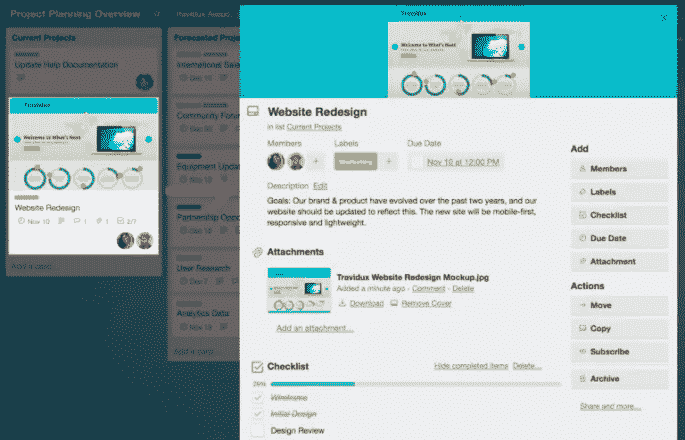
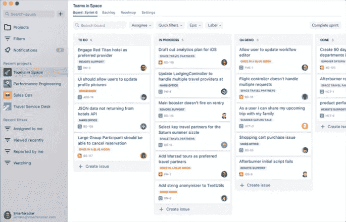
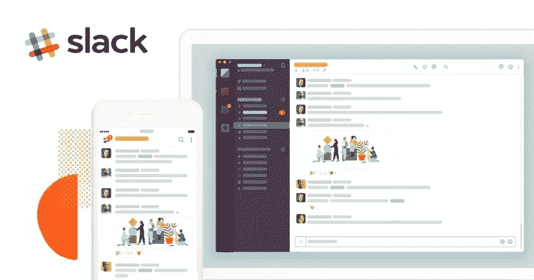
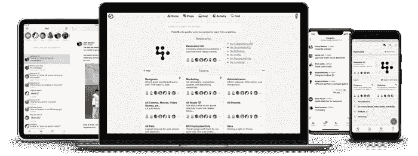
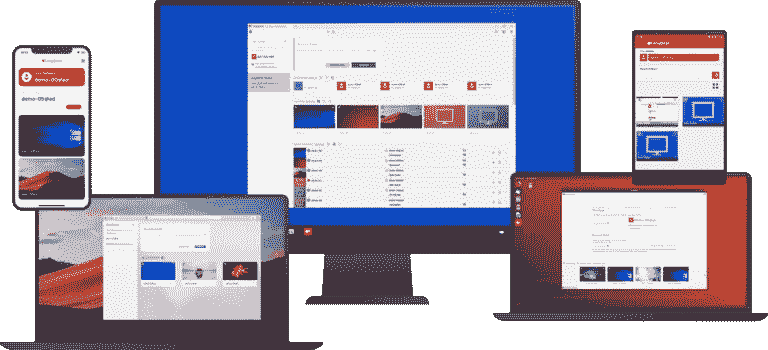
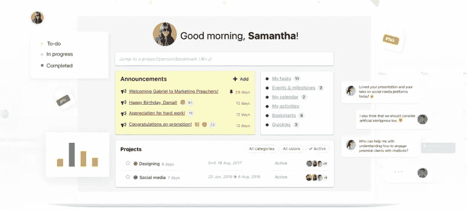

# 在 Corona-Times 中与远程团队举行会议的 7 个最佳工具

> 原文：<https://medium.datadriveninvestor.com/7-best-tools-to-conduct-meeting-with-remote-teams-in-corona-times-a45129de7a18?source=collection_archive---------25----------------------->

谁说“工作不需要坐在特定的地方才能成功完成”？他没有错，尤其是在这种情况下，当冠状病毒爆发将我们锁在家中，我们正在练习社交距离以保护自己并体现公民精神。

冠状病毒如何影响我们作为设计师/开发人员的工作生活:

*   不再有客户会议
*   不再有办公室会议
*   不再有头脑风暴和社交
*   由于新冠肺炎病毒的广泛传播而引起的焦虑
*   因分心而浪费时间

由于有了远程工作工具，我们仍然可以高效工作，并与来自世界各地的团队进行无缝协作。在本文中，我们分享了远程工作团队在会议和演示中广泛使用的工具列表:

 [## 使用谷歌搜索趋势预测首次申请失业救济人数|数据驱动的投资者

### 几年来，我的重点一直是使用多种替代数据来预测宏观经济统计数据…

www.datadriveninvestor.com](https://www.datadriveninvestor.com/2020/03/25/using-google-search-trends-to-predict-initial-jobless-claims/) 

****:****

**Trello 是一个协作工具，它将任务和项目组织成看板。它用便利贴代替了白板，每张便利贴都包含了您和您的团队的任务。**

****

****Trello-协作工具****

****这里有利于远程工作:****

1.  **Trello 告诉我们目前正在做什么工作，谁在做什么项目，有什么事情正在进行中。**
2.  **所有信息都会实时更新，并全天候保留在工具中。因此，不需要面对面的澄清会议。**
3.  **您可以通过创建一个专门的论坛来组织每周或每天的会议，该论坛以结构化的方式包含您团队的议程。**
4.  **您可以为重要项目(如项目和团队活动)创建卡片，以提供概述。为任何想了解更多信息的人链接文档、相关公告板和聊天频道。**
5.  **您还可以设置可配置的预警，以通知 Trello 中活动的松弛渠道。**

****定价****

**Trello 的免费版本是可用的。 **Pro 版 9.99 美元/月/用户起。****

**[**缩放**](https://zoom.us/) **:****

**Zoom 是一种广泛使用的视频通信工具，越来越多地被远程工作团队采用。Zoom 配备了一个简单可靠的云平台，用于跨桌面、移动设备、电话和房间系统的音频和视频会议、聊天、协作和网络研讨会。**

****

**用于视频会议的缩放工具**

****为什么对远程团队工作有好处:****

1.  **该工具允许团队的不同成员通过网络摄像头、视频会议或电话参加面对面的会议。**
2.  **它允许移动屏幕共享，这样即使在远程工作时，您也可以与同事保持联系。**
3.  **您可以将会议录制到您的设备或 Zoom cloud，以便以后查看。**
4.  **Zoom 可以很容易地同步到 Slack。**

****定价:****

**这款应用的基础版是免费的。**专业版起价 1.67 美元/月/用户。****

**[**吉拉**](https://www.atlassian.com/software/jira) **:****

**吉拉是一个项目管理工具，用于缺陷跟踪、问题跟踪和项目管理。这是一个问题跟踪平台，技术和开发团队使用它来更快地完成工作。**

****

**吉拉-项目管理工具**

****为什么适合远程团队工作:****

1.  **对于开发和技术支持团队来说，它是更快完成工作的完美之选。**
2.  **吉拉通过给你的团队一个地方来跟踪每天的进度，对估计进行调整，并检查其他团队成员正在进行的任务，从而提供了透明度。这样就不需要去问你的同事他们在做什么。**
3.  **吉拉使沟通更容易，因为它允许项目经理向吉拉的团队成员分配任务，并通过电子邮件通知他们。当他们处理任务时，他们可以添加注释并标记他们团队的进度。**
4.  **像特雷罗一样，吉拉也使用灵活的看板，让你的团队充分了解未来的任务。**
5.  **它为您提供了对大量现成报告的访问，这些报告提供了关于 sprint 进度的实时和可操作的见解。因此，消除了面对面报告的需要。**
6.  **您可以将您最喜欢的版本控制、部署或功能标记工具中的信息带入吉拉。这为您提供了对开发管道的即时可见性。**

****定价:****

**该工具的基本版本是免费的。 **Pro 版工具 7 美元/月/用户起。****

**[**时差:**](http://slack.com/)**

**Slack 是一个聊天室，旨在取代电子邮件带来的麻烦，并允许您通过创建不同的小组来组织交流。对于远程工作的团队来说，这是最好的协作工具之一。**

****

**松弛-有效沟通的工具**

****为什么远程工作对团队有好处:****

1.  **这是一个与您的团队进行沟通的快速而简单的解决方案。你可以记下你的观点，很快得到答案。**
2.  **你可以使用机器人，它可以帮助你管理任务，投票办公室，运行你的团队站立等等。**
3.  **您可以组织视频会议和进行面对面的会议(不传播病毒)。**
4.  **您可以与合作伙伴、供应商和客户共享渠道，因此无需旅行和离开您的个人空间。**
5.  **您可以将会议移动到频道，这意味着您可以通过固定一天中的特定时间来设置每周状态会议，在该时间内，每个人都应该在为该特定项目创建的频道中发布他们的状态。**

****定价:****

**该工具的基本版本是免费的。专业版起价 6.67 美元/月/用户。**

**[**大本营**](http://basecamp.com)**

**Basecamp 是一个实时通讯工具，可以帮助团队保持一致。它为团队提供了跟踪优先级和可操作项目的方法。**

****

**Basecamp 作业工具**

****为什么它对远程工作的团队有好处:****

1.  **Basecamp 中的每个项目都包括团队远程协同工作所需的工具；待办事项、文档、文件存储、留言板、自动签到问题和实时群聊。**
2.  **Basecamp 的实时群聊功能被称为 Campfires，让你可以提出问题并快速获得他们的答案。所有这些都不需要单独的应用程序。**
3.  **你可以和团队的个别成员进行私人谈话。**
4.  **Basecamp 还允许您更改 Basecamp 界面的颜色，这使得远程工作更具交互性。**

****定价:****

**Basecamp 不提供免费的基础版。**其付费版 99/月/队起**。**

**[any desk:](http://anydesk.com)**

**AnyDesk 是一款远程桌面软件，允许用户从世界任何地方远程连接到计算机。为此，你只需要有一个互联网连接。能够远程连接对于拥有移动员工和 IT 专业人员的公司很有帮助。**

****

**any desk-远程桌面软件工具**

****为什么远程工作对团队有好处？****

1.  **无论您是在举行演示或在线会议，还是在世界的另一端处理同一份文档，您都可以顺畅地进行交流和协作。**
2.  **你可以得到每次谈话的录音。**
3.  **你可以从任何地方访问你的办公室电脑。如果你把笔记本电脑忘在办公室，或者由于政府突然封锁而不得不呆在家里，你需要担心。使用 Anydesk，您可以从个人笔记本电脑访问工作笔记本电脑。你只需要一个密码。**
4.  **Anydesk 是高度安全的，您的计算机不会受到未经授权的访问。**

****定价。****

**该软件的基础版是免费的，专业版从€8.99 英镑/月起。**

**[**ProofHub:**](http://www.proofhub.com)**

**ProofHub 是一个项目管理工具，被各种规模的团队用来管理他们的工作。它取代了您计划、协作和管理日常任务所需的各种工具。此外，ProofHub 易于使用的界面使入职变得毫不费力。**

****

**proof hub-项目管理工具**

**为什么远程工作对团队有好处？**

1.  **你可以分配任务，创建一个截止日期，并添加标签来区分不同的任务。**
2.  **团队可以通过评论和聊天进行无缝协作。**
3.  **您可以使用多个计时器甚至手动记录来跟踪时间**
4.  **团队的每个成员都会收到实时通知，随时了解任务的进展情况。**
5.  **您可以使用工作量报告来查看项目的进度和工作组的工作量，以便有效地分配工作。**

****定价:** **ProofHub 提供 89 美元/月的终极控制计划，没有按用户收费。** **最终想法****

**你检查过你的团队尝试过的这些可能很好的工作工具吗？这些工具将帮助您增强团队的虚拟协作。远程工作对员工和雇主都有好处。它帮助你实现工作与生活的平衡，这是所有现代工作者都非常需要的。**

***原载于 2020 年 4 月 3 日 https://graffersid.com**的* [*。*](https://graffersid.com/blogs/tools-to-conduct-meetings-with-remote-team-in-corona/)**