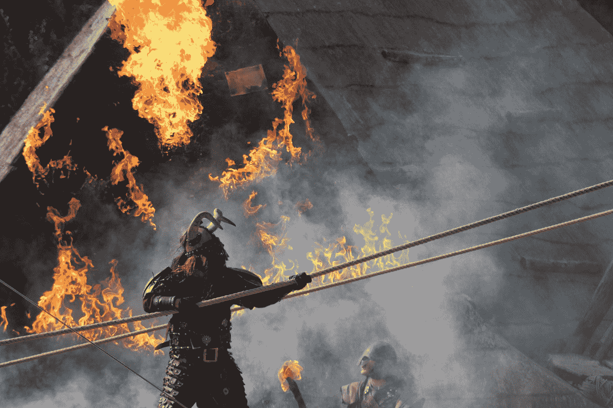
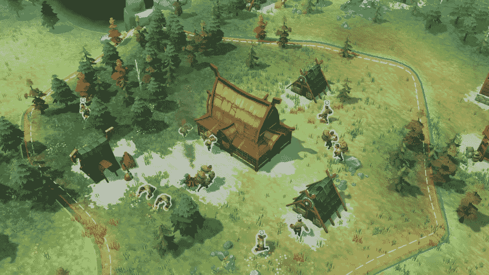
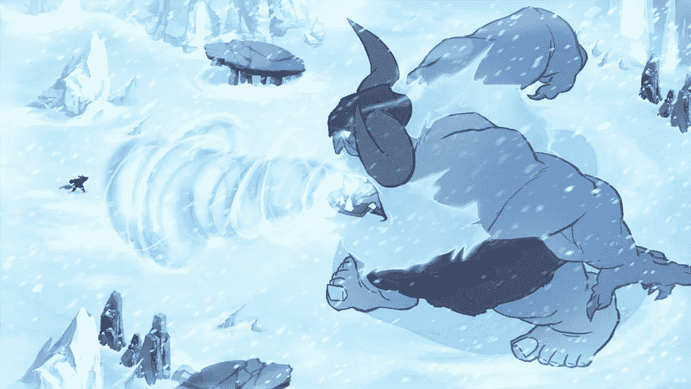
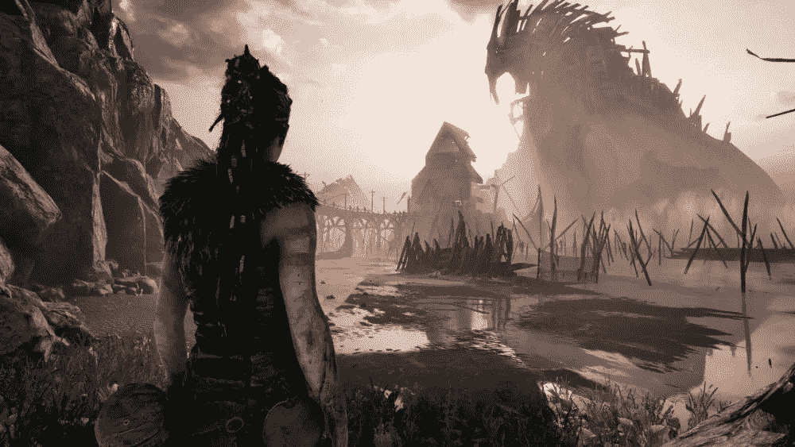
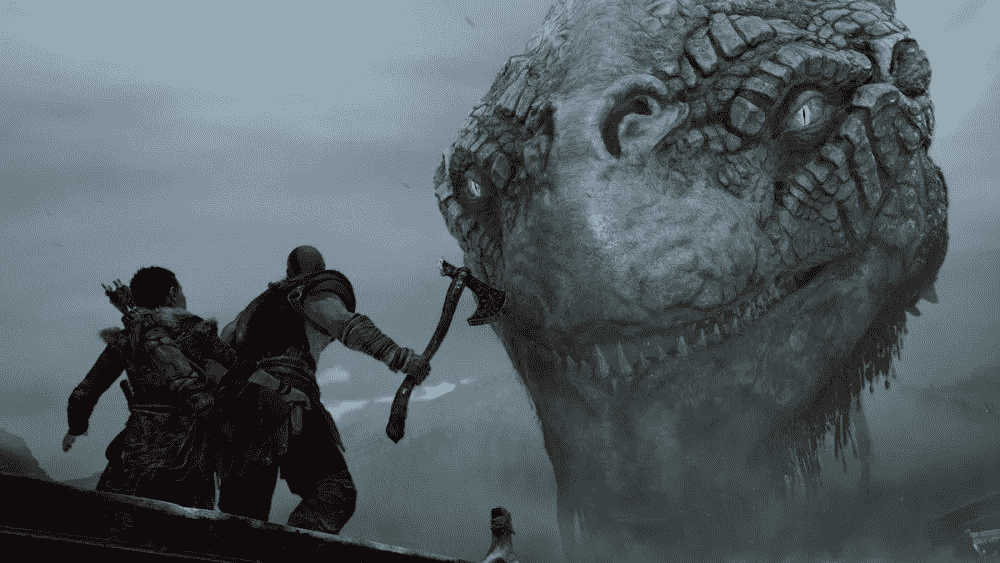
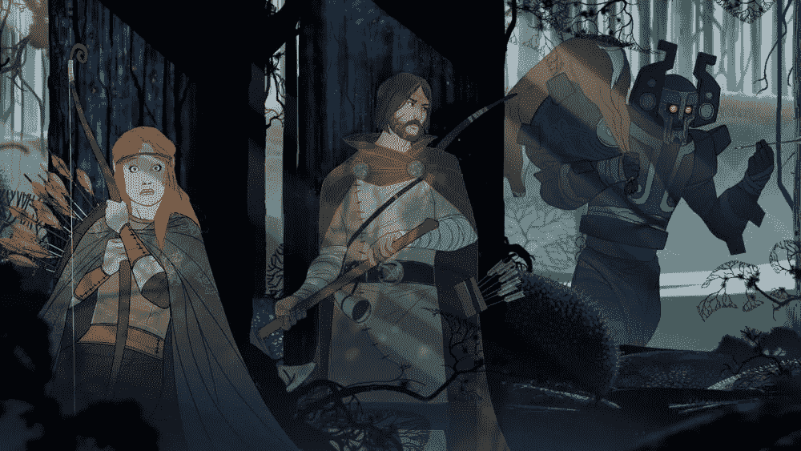
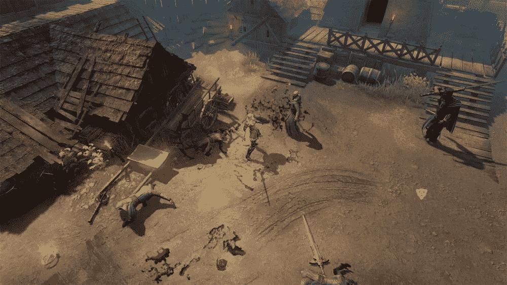
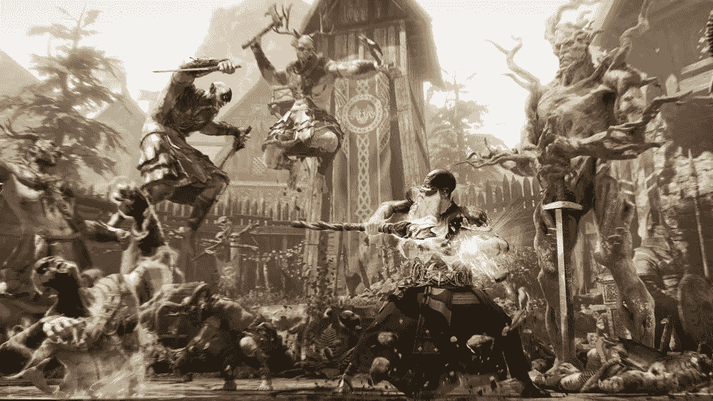

# 7 款最佳维京主题游戏，同时等待 AC: Ragnarok

> 原文：<https://medium.datadriveninvestor.com/7-best-viking-themed-games-while-waiting-for-ac-ragnarok-cc378a269d01?source=collection_archive---------3----------------------->

*其中一些还暗指北欧神话*

Photo by [Victor B.](https://unsplash.com/@vbchr?utm_source=medium&utm_medium=referral) on [Unsplash](https://unsplash.com?utm_source=medium&utm_medium=referral)

*刺客信条*特许经营*远未脱离概念，因为仍有无数的历史和文化背景有待提高。最新的 AC 标题，据报道将于今年公布，据传将携带维京主题，探索历史背景厚重的北欧神话。*

*在等待这款史诗冒险游戏出现的时候，这里有 7 款最好玩的维京主题游戏。*

# *1.诺斯加德*

**

*《诺斯加德》是一款基于北欧神话的策略游戏，可在 Steam 上下载。在这个游戏中，玩家控制着一群试图控制一个神秘新大陆的维京人。除了贯彻*即时战略*的机制，Northgard 还配备了有趣的*桌游*元素。*

* [## 幸福的算法？数据驱动的投资者

### 从一开始，我们就认为技术正在使我们的生活变得更好、更快、更容易和更实用。社交媒体…

www.datadriveninvestor.com](https://www.datadriveninvestor.com/2019/03/08/an-algorithm-for-happiness/) 

此外，还有许多维京团队可供选择，每个团队都提供*不同的*游戏风格。Northgard 本身于 2018 年发布，并获得了许多积极的*评论*。

# 2.约顿巨人

Jotun 是一款来自独立开发商*动作冒险*流派的游戏，很少被*游戏玩家*所知。玩家扮演苏拉——以可耻的方式死去的维京人。为了打动众神，苏拉据说要去瓦尔哈拉，打败各种约顿(北欧神话中众神的异己巨人)。

Jotun 的特别之处在于其手绘的视觉风格如此诱人。此外，带来的各种大佬也颇具挑战性，难以击败。

# 3.地狱之刃:塞纳的牺牲

《地狱之刃:塞努阿的牺牲》于 2017 年上映，此后获得多项大奖。《地狱之刃》以维京时代为背景，讲述了一个名叫塞努阿的女人的故事——她去维京地狱拯救死去爱人的灵魂。

这款游戏的主要强项在旁白，这也是最重要的一个方面。此外，Hellblade 还采用了一种独特的心理学概念，邀请玩家感受 Senua 在整个冒险过程中经历的精神问题。

# 4.战神

《战神》在发行前受到了太多的炒作，这很正常。这见证了奎托斯在沉睡了很久之后的重生。这款专为 PS4 发行的游戏不再像前作那样探索希腊神话，而是转向更“新鲜”的北欧神话。

维京人可能不经常被提及，但是神秘的存在和神被详细地讲述。此外，克瑞托斯不再是独自一人，他的儿子阿特柔斯陪伴着他。

# 5.旗帜传奇

旗帜传奇的背景是一个受北欧神话启发的虚构世界。这款游戏采用互动的故事风格，每个玩家的决定都会影响故事情节的发展。

就像 Jotun 一样，Banner Saga 也采用了简单但很酷的视觉*手绘*风格。简单来说，玩家在这款游戏中的工作就是照顾大篷车(一种房子跑)，处理路上的各种障碍比如土匪、背叛、闪电等。

# 6.维京人:米德加德之狼

从概念上来说，《维京人:米德加德之狼》与《暗黑破坏神 3》有相似之处，但背景是维京世界。《T2》的游戏机制仅仅是*的黑客攻击*，但是在每一关都有额外的*谜题*，支线任务和反派角色。

玩家有两个选择，从两个可用角色中选择一个，即维京战士和女弓箭手，每个角色都有不同的游戏风格。除此之外，这款游戏还承载了尼弗海姆、巴尔海姆、米德加德等北欧神话中的各个著名地点。

# 7.阿斯加德的愤怒

与前作不同，《阿斯加德之怒》提供了不同的游戏体验。由 Sanzaru 工作室开发的 Asgard 的愤怒是一款动作冒险游戏。

这已经成为最海量的 VR 游戏之一，多条*评论*称至少需要 25 个小时才能完成主要故事情节。也就是说，在主要任务之外，还有很多东西可以探索。在这款游戏中，玩家可以扮演各种角色，招募动物朋友。* 

*这是评论，也是等待《刺客信条:仙境传说》时最好玩的维京主题游戏的推荐。以上七款游戏，你都玩过什么吗？*