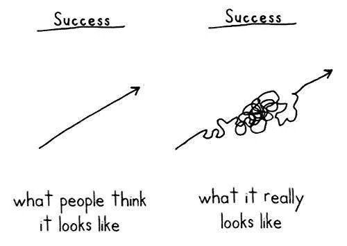
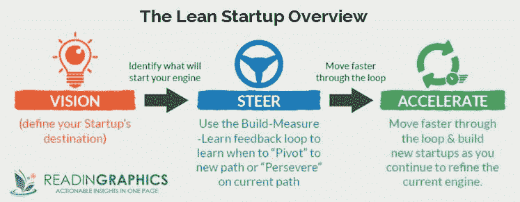

# 所有企业家都会面临的 7 个挑战

> 原文：<https://medium.datadriveninvestor.com/7-challenges-that-all-entrepreneurs-face-at-some-point-32b73e5ef8cc?source=collection_archive---------17----------------------->

## 以及如何解决它们

Photo by [Austin Distel](https://unsplash.com/@austindistel?utm_source=medium&utm_medium=referral) on [Unsplash](https://unsplash.com?utm_source=medium&utm_medium=referral)

尽管企业家的生活方式提供了很多自由和创造性的控制，但通往成功的道路从来都不是一帆风顺的。

创业的时候，有冒名顶替综合症和自我怀疑就够难的了。企业家经常面临来自他人的批评，难以做出艰难的决定，并为他们业务中发生的任何事情承担责任。

以下是所有企业家在他们的旅程中都会面临的 7 个最常见的挑战，并在通往成功的道路上解决这些问题。

# 放弃你的旧工作

这是企业家面临的最早(也是最激烈)的挑战之一。

在放弃原来的工作之前，有几件事你应该做:

## 弥合失业和成为企业家之间的差距

如果你还没有为你的新事业制定计划，现在可能还不是辞职的好时机。

辞职前，确保你有余地在旧工作和新业务之间度过一段时间是至关重要的。这可能意味着确定一个财务计划，与潜在投资者交谈以评估兴趣，雇佣一些团队成员，或者存更多的钱。

## 确保你的想法是可行的

不要辞职，直到你知道你的商业想法是可行的。要想知道你的企业是否有机会成功，可以考虑做以下事情:

*   征求有经验的专业人士的反馈
*   研究市场
*   确定您的付费客户/目标受众
*   优化您的营销策略，充分利用您的投资

## 检查你的核心价值观

放弃全职工作成为一名企业家是一个巨大的进步。在迈出这一步之前，检查你的核心价值观和人生目标以确保你走在正确的道路上是很重要的。考虑问自己几个自我反省的问题，例如:

*   我想做出什么样的改变？
*   *我想解决什么问题？*
*   *我适合哪种工作结构？*

一旦你确定了你想从生活和职业中得到什么，你会更有信心向前迈进。

## 你没有丢掉旧工作，你只是得到了一份新工作

辞职看起来像是一种损失，但如果你走上了一条更有成就感的道路，最终只会有所收获。

在这个转变过程中保持乐观的心态&当你经历这些变化时，你会感到更加镇定。不断提醒自己辞职成为企业家的好处。你在寻求财务自由吗？长久的遗产？更灵活的工作时间表？

回到你的核心价值观，你会比以往任何时候都更兴奋地开始你的创业之旅。

# 选择要卖的东西

选择卖什么可能是创业中最重要的*和最困难的*。企业家知道他们可以填补市场空白，但很难确定这些空白是什么。

如果你不知道卖什么，找出最有利可图的利基市场&尽早利用这些趋势。

不要一个人做研究！

寻找你所追求的行业中有技能的专业人士，确保你的想法是可行的。

为了弄清楚你的想法是否有利可图，问问你自己:

*   *你的产品有足够的需求，顾客会以那个价格购买吗？*
*   *这对客户来说比对我来说更有价值吗？*
*   需求大到足以让你获利吗？

最终，你卖的东西应该解决客户的痛点。如果你对你销售的产品充满热情并且知识渊博，这是一个额外的奖励！

# 放弃你最初的愿景

Photo By: [Everything Supply Chain](https://www.everythingsupplychain.com/the-road-to-success-is-easy-no-obstacles-no-hard-work-easy-street/)

作为一名企业家，最重要的是要灵活。

保持前进并获得动力的唯一方法是拥抱变化。

企业家是有远见的人。即使他们最初的目标和最终的结果是一样的，通往成功的道路永远不会是他们所计划的。

即使事情进展顺利，预见到作为企业家的曲折也是至关重要的。具有讽刺意味的是，灵活和提前计划是相辅相成的。提前计划可以最小化风险，给你更多的空间去犯(不可避免的)错误。

## 精益创业

Photo By: [Readingraphics](https://readingraphics.com/book-summary-the-lean-startup/)

当优先考虑灵活性时，精益创业是一个很好的模式。

为了缩短产品开发周期并快速发现你的产品是否可行，假设驱动的实验是一条可行之路。

精益创业还敦促企业家开发消费者已经表现出兴趣的产品，从而拉平学习曲线并立即获利。

**当采用这些策略时，企业家被迫一次又一次地放弃他们最初的愿景。**

一旦你不再对你的商业模式过于浪漫，开始变得更加灵活，成功就会更快地来到你身边。

# 时间管理

> "关键不在于优先处理你日程表上的事情，而在于安排好你的优先事项."—斯蒂芬·柯维

当你成为企业家时，你必须剔除非必需品。

虽然社会会试图让你相信大学、朝九晚五的工作和避免精疲力尽都是需要优先考虑的重要事情，但这些并不一定对所有企业家都有利。

通常，企业家喜欢工作更长时间，因为他们对商业的热情驱使他们这样做。此外，作为一名企业家，收获好处的一部分是选择自己的时间，制定灵活的时间表。这意味着放弃你的朝九晚五或者不再去上学。

时间管理就是要分清主次&不断地问自己想从企业家的生活方式中得到什么。更重要的是，要问问自己，你想给别人提供什么。

永远不要接受不符合你人生目标的人的建议。

如果其他人给你如何管理时间的建议，记住你最清楚。如果他们过的不是企业家的生活方式，你可能不想把他们的时间管理建议当作生活的准则。

# 现金流管理

作为一家初创企业或小企业，要生存下去，现金流是必不可少的。然而，许多企业主可能会在等待他们的最新付款到来时挣扎着维持运营。不管是你的房租，你的雇主，还是你的承包商，你都有账单要付。

为了更好地管理现金流，请考虑:

*   需要为您的产品支付定金
*   更加严格的预算
*   仅使用电子支付
*   设置更快的发票付款
*   要求立即付款
*   为提前付款提供折扣

# 耐心

作为一名企业家，你生活在一个重视立即行动和快速思考的世界。讽刺的是，你也生活在一个耐心是一种美德的世界。

作为企业家，急躁是自我破坏。通常，不耐烦会让你失望，甚至在结果到来之前。

保持耐心就是要灵活并对变化持开放态度。伟大的事情需要时间，而伟大的成果需要更长的时间。

# 批评和自我怀疑

当你和他人都怀疑你的生意时，保持耐心和坚持并不容易。

**成为企业家意味着朝着只有你能看到的愿景努力。**

支持会很少，但掌声会很大。

在通往成功的道路上要灵活，但对结果要严格。

无论你是一个不被视为聪明的年轻企业家，还是一次又一次失败的企业主，在企业家的眼中，这两件事都证明了一致性和不屈不挠。

*想和我保持联系并获得更多写作技巧，请点击这里* *加入我的简讯* [*！*](https://mailchi.mp/387776a3b7da/join-my-newsletter)