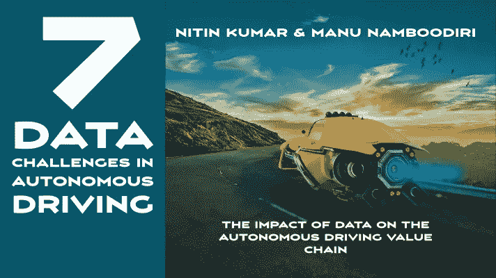
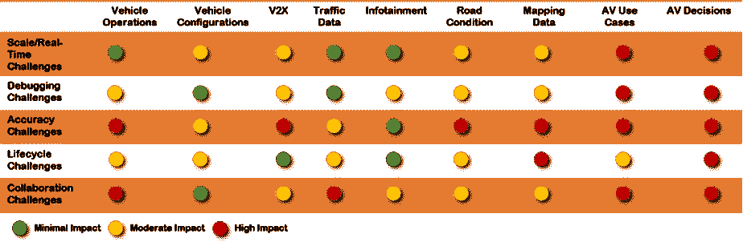

# 自动驾驶中的 7 大数据挑战

> 原文：<https://medium.datadriveninvestor.com/7-data-challenges-in-autonomous-driving-e21d05dacc3a?source=collection_archive---------2----------------------->

Image created by author using Pixabay

了解自动驾驶领域的数据挑战

> ***自动驾驶汽车价值链中存在大量的数据挑战，其中很多会影响特定的使用案例和结果。这篇文章强调了挑战的性质及其对整个数据价值链的影响。***

# 介绍

A 由于数据的多样性和复杂性、其多种来源以及持续生成的大量数据，汽车数据备受关注。在自动驾驶背景下，围绕导航、安全和收入模式的实时要求带来了新的挑战。

# 一般 AV 数据挑战

随着车辆向更高的自主水平发展，深度学习模型利用大量数据进行决策，例如来自传感器、摄像头、激光雷达、行人行为、路况等。谈到自动驾驶中的数据价值链，有许多不同的挑战，我们将在这里研究几个关键主题。

> *AV 商业模式是由理解和克服数据挑战的能力驱动的。*

# 实时和规模挑战

几十辆带摄像头的汽车组成的车队将在几个月内产生超过 100 万小时的视频，这些视频一旦被捕获，就需要通过深度学习神经网络进行传输、存储、标记和处理，以便进行训练。躲避每一个物体，行人，汽车，障碍等。如果不以模块化的方式分解数据，这可能会成为一项艰巨的任务。庞大的数据集，如驾驶条件、天气、行为、当地法律等。极端的计算和功率要求给实时操作带来了挑战。

# 调试/故障排除挑战

海量数据集、复杂的加权特征、非确定性人工智能模型和实时处理

一个难以诊断和解释的混合体。如果机器学习模型失败，数据的质量、完整性、相互依赖性和相关性(包括所有异常值和角落用例的覆盖范围)将更加难以检测、预测和纠正。神经网络可能变得不可靠，并且对变化敏感，例如，照明条件的变化、图像的大小调整、不同角度的裁剪，使得难以以标准化的方式解决所有安全方面的问题，并且难以实时排除故障。

# 准确性挑战

安全系统需要实时检测，具有复杂计算和通信限制的非确定性人工智能模型的准确性，这些要求可能会使当今的系统不堪重负。这些系统有望在各种天气条件、能见度、基础设施质量和外部行人行为下准确运行。

# 生命周期挑战

数据的规模、准确性、记录、监控和报告必须考虑整个数据管理生命周期，即创建、获取、收集、修改、处理、传输、共享、存储和处置。鉴于数据收集的非标准格式，例如相机和激光雷达之间的差异、价值链中公司的专有分析、数据量和速度，我们面临着失去数据完整性的许多重要属性的风险，即易腐见解或黑暗数据。

# 协作挑战

反病毒公司、基础设施公司、监管机构和其他利益相关者之间缺乏标准化的实时和测试数据共享，这些利益相关者希望控制他们的叙述、限制专有信息、扩大竞争优势和不产生共享成本，这使得更难快速通知和开发安全功能并获得可重复的结果。

 [## 规划和建立您的房地产业务|数据驱动的投资者

### 房地产行业是有史以来最受欢迎的五大职业之一。原因很简单。它确实…

www.datadriveninvestor.com](https://www.datadriveninvestor.com/2020/12/14/plan-and-build-your-real-estate-business/) 

# 其他各种挑战

1.模拟和现场真实数据的最佳同步，复制驱动算法，反之亦然

2.处理运营和供应/需求数据，以最大限度地增加收入，同时最大限度地减少里程，例如汽车健康状况、电池电量、车队管理和车队定位数据等。

3.四个关键乘车阶段(登机前、登机、中转、下机)的乘客实时数据，以确保乘客安全和健康、支付、行李、儿童安全等。需要来自传感器数据、第三方集成的实时决策的复杂和安全的相互作用

4.聚合和管理来自生态系统(即车辆边缘和云)的实时数据，通过 API 将移动服务货币化

这些数据挑战的解决方案将重点放在正在处理的特定自主用例上，不要让大量和高速的数据淹没系统。关注特定用例有助于决定数据的价值、缩小范围、以更精确的方式应对挑战，并有助于架构、合作伙伴关系、安全和监管决策，最终实现有价值且有利可图的自主服务。

Image created by author using Pixabay

# AV 数据价值链挑战

这些数据挑战在自动驾驶数据链中各有不同的表现。下表试图将挑战映射到数据价值链。准确性挑战对整个价值链的影响最大。所有挑战都会影响 AV 决策。下面的图 1 总结了对应于用例的数据挑战。

AV Data Challenges Mapping (Framework by Authors)

# 结论:

由于汽车和自主数据用于实时和安全关键决策，并且这些数据会影响各种各样的使用案例，因此管理这些数据具有多样性和挑战性。需要注意的一点是，挑战不在于缺乏数据，而在于理解数据及其挑战，并有效地对 AV 数据要求和系统设计进行优先排序，以实施具体的自主用例。

# 其他相关条款:

1.[自动驾驶技术栈](https://medium.com/predict/the-autonomous-driving-technology-stack-f0b53ab08f99)

2.[自动驾驶:为什么大数据价值是一个神话](https://medium.com/datadriveninvestor/autonomous-driving-why-big-data-value-is-a-myth-584427b50f05)

3.[自动驾驶面临七大数据挑战](https://medium.com/datadriveninvestor/7-data-challenges-in-autonomous-driving-e21d05dacc3a)

4.[七大自动驾驶商业模式](https://medium.com/datadriveninvestor/7-autonomous-driving-business-models-930cd4de6b86)

5.[支持自动驾驶商业模式的 12 项技术](https://medium.com/datadriveninvestor/12-technologies-enabling-autonomous-driving-business-models-33088ba89474)

6.[采用自动驾驶基础设施的途径](https://medium.com/the-innovation/pathways-to-adoption-for-autonomous-driving-infrastructure-676438a7aaa3)

# 关于作者:

## 尼廷·库马尔

尼廷·库马尔在高科技行业有 20 年的经验。他目前是 Appnomic 的首席执行官，但也担任过各种管理职务，包括首席执行官、首席增长官、首席转型官、M&A 整合/分离负责人、BU 主管和管理咨询合伙人(公司和 PE 投资组合公司)。Nitin Kumar 是福布斯技术委员会的成员，定期在论坛上分享他的想法和想法。作为前管理咨询合伙人，Nitin 参与了软件、硬件、半导体和自动技术领域的多项战略和 M&A 项目，获得了对价值链、技术和商业模式的宝贵见解。他还是经过认证的自动驾驶专业人士。

## 马努·南布迪里

Manu Namboodiri 在自动驾驶汽车、安全、物联网、软件等行业工作了 20 年，在战略、产品、营销和生态系统开发方面拥有丰富的经验。他居住在旧金山湾区，为处于不同市场采纳阶段的公司提供建议。

## 访问专家视图— [订阅 DDI 英特尔](https://datadriveninvestor.com/ddi-intel)