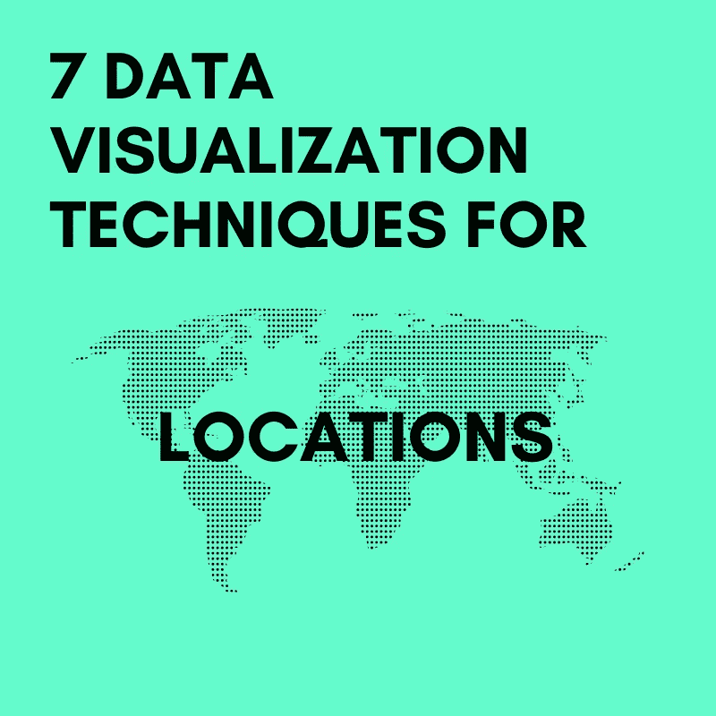
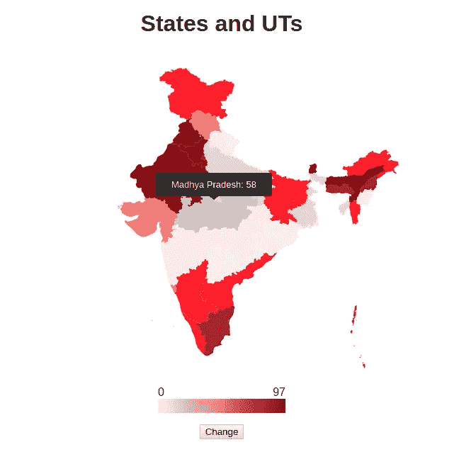
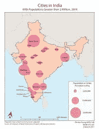
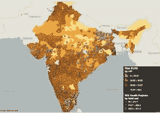
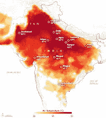
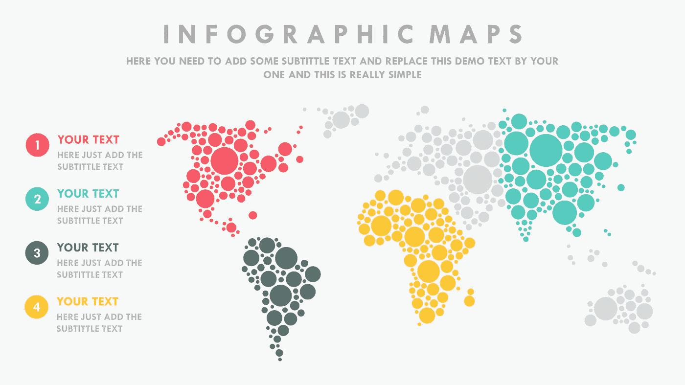
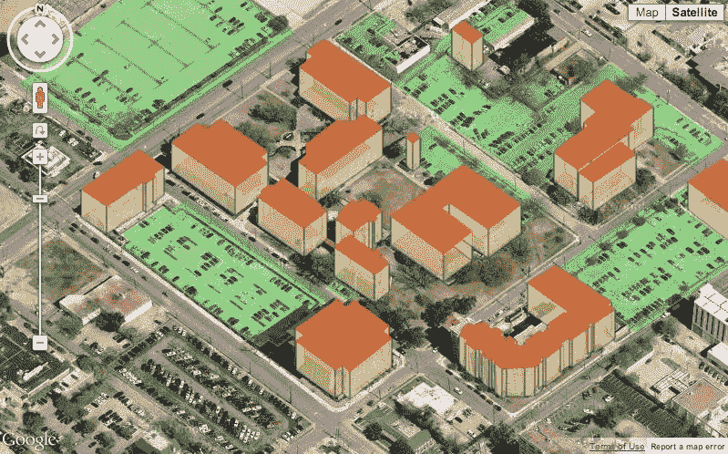

# 7 基于位置的数据的数据可视化技术。

> 原文：<https://medium.datadriveninvestor.com/7-data-visualization-techniques-for-location-based-data-5d81821c34b4?source=collection_archive---------5----------------------->

当我们谈到数据可视化时，地图是人们最喜欢的东西。地图比其他可视化类型更有趣和有效，并且位置数据的重要性在快速增长，使用地图的数据可视化也变得越来越重要。

# 1.Choropleth 地图

Choropleth 地图是最常用的基于数据值显示区域的地图类型。当你有一个跨地理区域的数值范围时，
choropleth 图是非常合适的。这种地图可用于国家、子市场边界、邮政编码等数据趋势。颜色在地图中起着重要的作用。

# 2.分度圆

使用分度圆，可以在单个可视化中显示多个数据维度的趋势。圆圈的大小可以表示数量，颜色可以表示范围，圆圈的位置可以表示数据的空间趋势。

# 3.点分布

非常密集的点数据中的密度趋势可以通过点分布适当地传达。社交媒体帖子、网站流量、车辆遥测等。可以通过点分布法有效地表示出来。

# 4.热图

要显示密集点数据的位置趋势，可以使用热图。颜色
渐变用于显示位置趋势。热图使人们能够轻松识别数据组之间的关联。如果你有一个旅游网站，你可以使用热图显示特定酒店附近的餐馆密度。

# 5.动画片

Template to deploy your data for presentation.

借助动画，您可以展示数据如何随时间变化。你可以想象一些事情，比如你所在州一年内失业率的变化等等。

# 6.3D 环境

当您创建一个令人印象深刻的 3D 环境时，您允许您的观众从内部探索数据。想象一些事情，比如如果你进行改造，增加真实世界的功能，你的户外空间会是什么样子。这种类型的可视化更容易。

# 7.三维拉伸

3D 拉伸是一种很好的数据可视化工具，可用于可视化密集区域之间的相对差异。

# 感谢您阅读这篇文章。随时欢迎反馈。如果你喜欢它，请点击拍手按钮，并分享这篇文章。

你可以在[Github](https://github.com/tejamaddimsetty)&[LinkedIn](http://www.linkedin.com/in/tejmaddimsetty)上联系我

[*Tej Maddimsetty*](https://medium.com/@tejmaddimsetty)