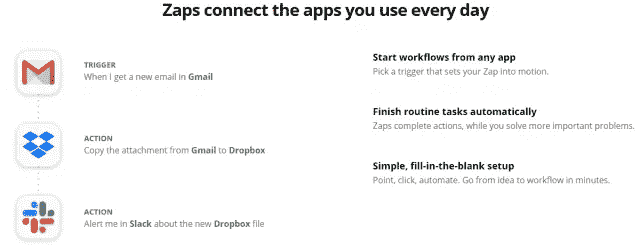

# 7 个数字工具让你在冠状病毒疫情(新冠肺炎)期间保持联系

> 原文：<https://medium.datadriveninvestor.com/7-digital-tools-to-keep-you-connected-during-coronavirus-pandemic-covid-19-7f46ba44ecc5?source=collection_archive---------11----------------------->

Photo by [🇨🇭 Claudio Schwarz | @purzlbaum](https://unsplash.com/@purzlbaum?utm_source=medium&utm_medium=referral) on [Unsplash](https://unsplash.com?utm_source=medium&utm_medium=referral)

您是否正在寻找在家远程工作的最佳数字工具？我们让你在这篇文章中！

在全球范围内，冠状病毒的爆发导致组织和企业要求员工在家工作。专家和政府也鼓励自我隔离、在家远程工作和社会距离。

一些州和国家已经限制了进出其边界的行动。虽然这些措施将有助于减少新冠肺炎疫情的影响，在家工作也有其挑战。

在家远程工作的一些挑战是缺乏团队协作、办公室文化、家庭干扰等等。那么，在冠状病毒爆发期间，你如何有效地在家工作并与其他人合作呢？

我收集了一些在家远程工作、与他人协作和高效工作所需的最佳商业工具。

 [## 艾预测:“颠覆，然后是生产力”|数据驱动的投资者

### 人们越来越担心，随着机器学习和互联网的普及，所有白领工作都将消失

www.datadriveninvestor.com](https://www.datadriveninvestor.com/2018/08/06/ai-forecast-disruption-then-productivity/) 

# 新冠肺炎课程中远程工作的 7 大数字工具

无论您是自由职业者、博客作者、员工、企业主、内容营销人员还是数字营销领域的其他人，这些在家工作的工具都将帮助您联系、互动、协作项目，并提高效率和生产力。

# 1.用于交流&聊天和发信息

## 松弛的

当你远程工作时，与团队成员和同事的沟通是一个挑战， [Slack](https://slack.com/) 软件应用程序是你与他人保持联系所需要的。这个数字工具将您的所有团队和互动聚集在一起，帮助您保持工作效率和生产力。

它是市场上最好的即时通讯应用之一，几家公司正在使用它与他们在家远程工作的团队联系。

该软件对许多人来说是一个虚拟办公室，因为它提供了团队成员、部门和整个组织之间的无缝通信。例如，在处理一个项目时，您可以从个人协作者或您的团队获得即时反馈。

所以，举例来说，如果你是一个博客写手或自由撰稿人，你可以很快[从其他人那里集思广益出内容创意](https://www.mossmedia.biz/blog-topic-ideas/)。但是，松弛时间有几种替代方法，包括:

*   谷歌视频
*   微软团队
*   网络电话
*   群众
*   电线
*   Mattermost

你可以使用这些数字工具来提高你的工作效率。

> *相关阅读:* [*冠状病毒影响期间如何在家有效工作*](https://www.mossmedia.biz/how-work-from-home-coronavirus-outbreak/)

# 2.对于视频会议

## 一款云视频会议软件

我在家工作时视频会议的首选是 [Zoom](https://zoom.us/) 应用。这可能是业内最好的，因为无论你在哪里，任何人都可以使用它。该软件帮助您开始会议，并通过视频快速合作。

它确实是最受欢迎的在家工作协作工具。为什么？因为它通过向你展示会议中其他人的面部表情来复制你经常参加的面对面会议。

你可以看到每个人对建议或意见的反应。所以，如果你是一个数码产品销售者，有了 Zoom，你就有了一个易于使用的网络研讨会数码工具。难怪 Zoom 是这次冠状病毒影响期间的顶级市场赢家之一。

据 [SEMrush 数据](https://www.semrush.com/blog/market-winners-losers-coronavirus/)显示，在股市暴跌的同时，视频会议应用却获得了巨大的收益，从 3 月 16 日的 108 美元上涨到 3 月 23 日的 162 美元。七天内增长了 50%。这还不是全部；对 Zoom 的搜索也使网络流量在一个月内增加了 108%。

一些备选方案包括:

*   加入我
*   全球会议
*   谷歌聚会
*   蓝战士。
*   思科 Webex 会议。

因此，有了这些数字营销工具，你可以在家无缝地工作，并与其他人合作。

# 3.项目管理和生产力

## Evernote

Source image via Evernote

Evernote 是你理想的项目管理和生产力工具，因为它可以在所有平台上工作，包括智能手机和平板电脑。您可以在设备之间快速同步您的笔记和所有文件。

一些营销人员称之为“个人数字助理”(PDA)。这是因为 Evernote 可以帮助你:

*   在旅途中记笔记
*   创建每日、每月或每年的待办事项列表
*   将任务分配给整个团队
*   创建编辑内容日历
*   集思广益，让你持续不断地写博客，而不会失去内容。
*   协作，等等。

作为最好的项目管理工具之一，Evernote 可以让你在一个地方管理项目，并自动跨操作系统同步它们。

但是，您可以使用几个替代方案。以下是其中的一些:

1.  特雷罗
2.  阿萨纳
3.  Google 工作表和 Excel
4.  大本营

使用这些数字工具来分解任务，管理您的产品，提高工作效率。

> *相关帖子:* [*如何利用 Evernote 提高生产力和营销*](https://www.mossmedia.biz/how-use-evernote/)

# 4.时间管理工具

## 托格尔

Toggle: time tracking software

你在用 [Toggl](https://toggl.com/) 吗？无论你是博客写手、自由职业者还是雇员，你都需要充分利用你所拥有的时间。这是你变得更有效率和生产力的唯一方法。所以，问问你自己，如果你不能赶上最后期限，你是如何管理你的时间来建立信任和信誉的？

你的雇主和客户可能会认为你是一个不可信的人。所以，为了提高产量和生产率，你应该排除一切干扰，专注于工作。

因此，你可以通过使用最好的时间管理工具来完成你的努力。最适合我的是 Toggl。这个商业工具是一个易于使用的时间跟踪报告工具，允许你确定你的理想工作时间并坚持下去。

它有一个令人难以置信的时间表计算器，可以让你计算出你每天可以工作的时间，并保持头脑清醒。应用软件帮助你平衡你的时间和监控你的进度。此外，它有一个跟踪提醒，分解你的项目，并提醒你什么时候去休息。

Toggl 的主要替代方案有:

1.  新书
2.  Hubstaff
3.  桌面时间
4.  佩莫
5.  重新计算时间
6.  每小时

# 5.云存储和文件共享软件数字工具

## Google Drive

每个营销人员或雇主都需要一个可持续的空间来组织和存储有价值的文件。为此，我使用并推荐 [Google Drive](https://www.google.com/drive/) 。这个软件应用程序可以让你在一个地方创建、存储和共享来自世界各地的文档和数据。

只需一个谷歌账户，你就可以访问所有谷歌产品，包括 Drive、Sheets、Docs、Slide 等等。而且，它还配有免费的 15g 存储空间。

尽管如此，Google Drive 还有许多替代产品，包括:

1.  Dropbox
2.  OneDrive
3.  同步
4.  pCloud
5.  坎托大坝。

您可以在任何地方的任何设备上通过这些数字工具快速访问您的文档和文件。此外，通过将您的贵重物品传输到云存储系统，您可以确保您、您的团队和各方能够不间断地访问任何格式的所有文档。

此外，这些云存储工具还具有文件共享功能。这意味着您可以快速与同事和团队成员共享存储中的文件，并让每个人都了解最新情况。

> *精选:* [*21 款最佳博客工具，让你成为更好的博客作者*](https://www.mossmedia.biz/best-blogging-tools/)

# 6.工作流自动化软件

## 扎皮尔

source via Zapier

Zapier 是一款应用软件，它可以让你像程序员一样构建流程和自动化业务，即使你不知道如何编码。只需点击几下，这个数字工具就能帮助您将应用程序连接和集成到一个主系统中。
你可以轻松地将它与其他一些应用程序集成在一起，比如:

*   快速图书
*   Google 工作表和文档
*   脸书领先广告
*   松弛的

它可以让您将您的系统连接在一起，并在一个 portalㅡhelping 下管理您的工作流程，从而专注于最重要的事情。换句话说，Zapier 为您提供了一种自动化工作和提高生产率的方法，而不是手动执行任务。

所以，它是每个营销人员或公司的必备。

# 7.密码管理器数字工具

## 仪表板

Source image via Dashlane

作为一名远程在线工作者，您可能有几个配置文件和其他帐户需要您的密码才能访问。你记得你所有的密码吗？有时候这很有挑战性，但是一个神奇的密码管理工具将会帮你度过难关。

[Dashlane](https://www.dashlane.com/) 就是其中的佼佼者。只需点击几次，它就会记住你的许多登录信息。该业务工具经过加密、安全且易于使用。它节省了你的时间和精力，因为你不必担心用户名和密码。

Dashlane 的一些顶级替代产品包括:

1.  真正的关键。
2.  Enpass
3.  最后一关。
4.  保管员密码管理员
5.  1 密码
6.  机器人形态。

此外，Dashlane 还有一个支持 Chrome、Firefox 和 Safari 的扩展。

> *相关文章:* [*6 个强大的编辑日历工具，帮助你保持有序和高效*](https://www.mossmedia.biz/editorial-calendar-tools/)

# 在冠状病毒爆发期间为远程工作人员包装顶级数字工具

新冠肺炎迫使许多人在家成为远程工作者。尽管这种致命的病毒继续占据中心位置，但更多的人将继续在家里兼职工作，或者转变为全职的远程工作者。

这种新的生活方式带来了挑战，许多人可能难以适应。因此，本文中列出的新冠肺炎疫情中部远程工作者的八种数字工具将帮助您与团队成员有效相处和工作，在项目上合作，并提高您的产量。

你还想把其他有趣的工具添加到上面的列表中吗？请告诉我们！

这篇文章最初出现在[https://www.mossmedia.biz/](https://www.mossmedia.biz/digital-tools-working-remotely-course-of-covid-19/)