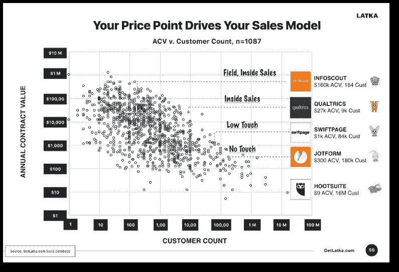

# 软件产品的 7 种不同的走向市场运动

> 原文：<https://medium.datadriveninvestor.com/7-distinct-go-to-market-motions-for-software-products-769673c612be?source=collection_archive---------2----------------------->

Image created by author using Pixabay

每个科技产品 CEO 都必须明白的一点

*走向市场行动的效率和效果是复杂的，通常不容易理解。如果说多年的管理咨询、高级管理经验和两次 CEO 任期教会了我什么，那就是走向市场运动不是一件简单的事情。它必须在恰当的背景下、恰当的时机以及与其他变量协同应用。*

R 云、人工智能、虚拟现实、区块链、平台等颠覆性技术的出现。创造了三大转变，即新产品外形、客户购买行为的改变和新渠道的出现。这些趋势从根本上改变了产品的制造、组织的建立和销售活动的配置。

> **走向市场运动是一个组织通过内部和外部资源向客户提供价值、创造增长和规模的配置。**

新渠道的出现创造了指数级的机会，通过有效设计走向市场的动作来提高速度，并在初创企业与现有企业竞争时为它们创造公平的竞争环境。初创企业以快得多的速度解决产品与市场匹配的难题，而无需消耗大量的销售收入。然而，走向市场的动议很难理解，实施起来很复杂，而且对于降低风险来说也很重要。这需要知识经验和犯一些错误，让我试着在这里解开一些元素。

有许多不同类型的走向市场运动，即直接运动、远程运动、部落运动、零接触运动等。其中每一种都有不同的驱动因素、适用性和适用性。让我们在下面更详细地检查每一个。

# 走向市场行动的类型

如前所述，走向市场运动有多种形式，设计正确运动的背景很重要。首席执行官和创始人有时会在错误的时间选择正确的动议，或者为正确的产品选择错误的动议，从而破坏走向市场的努力或使其效率低下。

鉴于当今的业务发展速度，变化非常快。过去十年和现在十年有很大的不同。最显著的变化是从“推”式(即通过列表或关系锁定用户)到“拉”式(即允许在从网站、移动应用和云实例购买之前先尝试)的转变，以获得采用率和市场份额。为了实现、拉动、推动采用和产生使用，企业用户需要接受有效的培训，从而创造销售和客户采用曲线必须始终同步的运动需求。

# 自上而下的运动

自上而下的走向市场行动通常通过部署外部销售人员(即，在现场与客户一起)来配置。这是最容易理解的行动，销售代表亲自会见潜在客户，讨论棘手问题、解决方案、预算、时间表，并在起草合同之前协调组织中的各种利益相关方。

> 大多数公司并不是因为缺乏想法、创新或市场规模而失败，而是因为他们没有围绕寻找和留住客户建立一个可预测、可重复且高效的行动。

# 顺行

关系对于确保与高层企业买家的长期承诺至关重要，销售团队需要在决策中心导航，并在整个集团内形成一致。该动议围绕售前、客户资格、预算确定、价格谈判、技术教育等展开。销售周期需要几个季度或几个月。我甚至看到这一动议有时长达一年。

自上而下的销售成本高昂，并且始终需要销售、售前、客户和产品管理之间高度的同步。它还背负着机票、餐费等销售成本，并将推高 CAC(客户获取成本)。这些成本对于建立潜在客户和客户的信任和信誉至关重要。

产品团队总是有压力和动力去创造更多的功能来吸引和赢得客户决策者的注意力。运动驱动器具有丰富的命题燃烧工程马力，其中许多功能可以是非增值的，但可能需要勾选框。这种现象会增加产品的复杂性，牺牲可伸缩性、部署、无缝集成和用户体验等。

这种走向市场的行动更适合大型企业、大约 ACV(年度合同价值)> 10 万美元、需要配置、集成或定制的复杂产品，以及数字化程度低到中等的客户。

> **关键的成功因素是需求、关系、预算和时机。高管的变动或重新配置的关系可能会完全扼杀这一动议。**

# 发现驱动运动

有时，在走向市场的行动中还会增加一个发现供应商的过程。供应商发现是由 Gartner、Forrester 等分析师推动的。在右上象限中寻找您产品的竞争甚至会引起大型企业采购组织的注意。企业将为产品评估创建一个 RFP，由采购部门牵头，通过可能的“概念证明”来确定价值，然后协商条款。这一行动需要营销资金、会议游行和销售团队无情的敲门，增加了本已复杂的自上而下的行动。

发现驱动的动作给 CAC 增加了更多负担，并增加了已经很复杂的自上而下的动作的复杂性，很少有人能够逃脱部署现场销售来实现发现驱动的动作。尽管触发因素不同，但自上而下走向市场的大部分机制是相同的。

# 远程运动

走向市场动议在没有直接关系的情况下运作，更多地依赖于与潜在客户的陌生来电，进行产品演示、多次入职培训和部署概念验证。通常，客户会指派一名专门的客户代表来保持连续性和发展关系，在线走向市场活动保留了人情味，同时还允许销售团队扩展到更多客户，并通过降低 CAC 来降低销售成本。根据我的经验，远程行动是由内部销售团队实现的，适用于中端市场企业客户、已经销售给 100–500 个客户的产品公司以及大约在 25K-100K 之间的 ACV。关键的成功因素将包括可靠的产品、数字化程度高的目标客户，如科技、媒体、电信、银行等新经济公司。

# 自下而上的运动

一种不太为人所知且不断发展的走向市场运动。在当今时代，是业务用户直接推动走向市场的行动。他们很少受到推销、分析师报告或非增值功能的影响。唯一的焦点是产品是否能解决他们眼前的问题。事实上，他们很乐意不与销售团队打交道。“先试后买”的方法开始发挥作用，自下而上的销售活动开始实施，它具有非常不同的机制、速度和渗透能力。如果满足某个实质性的阈值，组织现在允许业务用户在没有采购过程的情况下使用生产力工具。销售活动现在适合企业内的多个独立决策点，并针对更快的速度进行了配置。

质量、成本、一致性、经验和速度是评估产品解决问题能力的主要因素。产品的简单性变得至关重要，UX 增加了竞争的维度，当用户做出决定时，产品优势占上风。产品可以保持简单，因为在采购过程中并没有真正需要向复选框添加复杂的功能。

一个简单的产品和出色的客户体验可以抵消传统播放器的上市规模优势。自下而上的行动更像是针对特定市场中的消费者(例如，企业)，决策就像是消费者销售，需要投入大量营销资金来推动采用。营销渠道、社区方法、用户旅程、病毒循环都是在这个领域生存的关键。

# 部落运动

这种动作被认为是科技化和低接触的，它利用科技来最大限度地减少人与人之间的互动。这种方法的目标是在用户和软件本身之间创造更多的交互性的同时，进行一到两次人机交互。人们通常在网站上看不到演示调度按钮，并驱使用户在云实例上或通过本地安装来使用该软件。

一旦一个用户或一组用户采用了该产品，他们就传播了这个词，使部落增长创造了更快的运动。企业也有太多的供应商声称类似的事情，而且总是引入新的参与者很麻烦，企业也决定依靠有机动力。采用速度和销售行动协同工作，快速推动规模。

部落运动适用于中小型市场客户、在费用权限范围内运营的较小 ACV(1000 美元至 1000 美元 10K)、数字化程度较高的行业，并对最终用户有吸引力。这些动作可以在基础产品有多个变体但不提供定制的情况下更快地创造价值。

精心策划的部落运动可以成倍地提高公司以较低的 CAC 和较高的效率吸引、取悦和留住客户的能力。对于跟踪、监控、报告和增长而言，总体销售分析比客户层面的指标更重要。部落运动可以被认为是自下而上运动的一种变体。

 [## 给数字营销工作者的 5 本书推荐|数据驱动的投资者

### 随着就业率的上升，由于疫情和人们花更多的时间在网上，数字营销的技巧…

www.datadriveninvestor.com](https://www.datadriveninvestor.com/2020/10/28/5-book-recommendations-for-those-who-work-with-digital-marketing/) 

# 零接触运动

随着 2020 年全球疫情在我们面前展开，出现了一场实施零接触销售和扩大销售规模的竞赛。我们的目标是在没有人际互动的情况下吸引、留住和发展客户——大部分营销工作直接转化为新客户，即零电话、零演示、零入职等。这听起来像一个梦想和乌托邦世界，但有像 DirectIQ，Lemlist 等公司。他们成功地做到了这一点。这是一项需要有效实施的大量工作，只有少数具有清晰轮廓的公司能够踏上这一征程，更不用说完成这项工作了，即他们需要拥有小型 B2B 客户、小额合同价值(如 1000 美元以下)、单点解决方案产品、直接的最终用户价值主张和良好的数字化行业。

# 混合运动

如今，对于多产品公司来说，根据客户群、产品成熟度、ACV、目标用户群等为其产品部署单独的运动并不罕见。另一种常见的情况是启动自下而上的运动，完善产品与市场的匹配，收集一些规模、增长和动力，然后加入自上而下的直接上市运动，提高交易规模，并向企业买家销售。

公司努力优化一种运动，混合运动要复杂得多。在创建走向市场动议时，有许多问题和陷阱需要考虑，尤其是防止一个动议蚕食另一个动议。

# 走向市场行动:常见设计问题

为一家公司选择正确的走向市场行动有许多驱动因素，包括产品复杂性、资本结构、目标客户、价格点等。很多时候，公司选择一条道路，然后转向另一条。在创建运动之前，了解核心驱动因素、设计考虑因素、单位经济性、规模效率非常重要。有许多设计问题需要注意，我在这里试着强调几个:

# 产品、运动偏差

产品姿态和走向市场的行动需要保持一致。现成的、不太复杂的产品适合用户自己采用，这些产品不需要大量集成或专业服务来提供价值。需要大量配置、集成和实现工作的更复杂的产品不适合自下而上的采用。一个动作可以通过自下而上的攻击造成破坏，即使在历史上运行自上而下的动作的类别中。如果它具有正确的产品姿态，市场(数字化行业)需要准备好消费它，并且产品需要简单。在产品上编织一个错误的动作会导致效率低下、规模受阻并侵蚀价值。

# 思想共享与采用

用户采用是自下而上运动的圣杯。随着采用曲线从早期采用者(偏向于产品)发展到落后者(不容忍错误)，获取新用户变得昂贵。高流失率的付费客户获取渠道会对单位经济产生负面影响，甚至会削弱走向市场的行动。一个常见的错误是利用这种情况，当付费渠道没有转变时，试图转向直接和自上而下的销售活动。将企业销售放在不感兴趣的最终用户之上，只会产生不感兴趣的结果。在进行付费用户获取之前，确保最终用户绝对喜欢你的产品。否则，你购买的用户将很快消失，并玷污品牌。

# 度量的冲突

传统的走向市场活动包含围绕单个客户或整个细分市场的指标，即 ARR、ASP、CAC、CLTV、用户数量等。这些通常不适合衡量增长速度，我们需要通过消费者风格的活跃用户增长跟踪来跟踪自下而上的销售活动，即 MAU、WAU、DAU、参与时长、用户保持率和旅程中的转化点等。人物角色的行为可变性对于理解采用速度的驱动因素也很重要。用户数量和新徽标是自上而下运动中的典型指标，仔细分析后发现，只有%的付费用户使用该产品，这是一个早期警告信号，表明增长运动与销售运动不同步，更新周期中总会出现流失数字。

最终，收入决定了产品的市场发现价值——很多时候，从用户少的免费增值模式到企业范围内的渗透率再到更大的用户群的转换漏斗并不明显。在自下而上和增长销售的时代，dau 通常会告诉我们更多关于哪些产品是赢家的信息，而不是回顾性的指标。

# 时间问题

非常快速地将自上而下的销售活动分层会导致上市机器效率低下。最初的动机永远不会成熟，你最终会和不同的人物角色跳舞，一个是顾客认识你的，另一个是他们不认识的。在一次推销中，你向最终用户推销产品体验，而在另一次推销中，你向执行决策者和技术购买者提出复杂的 ROI 案例。在这个场景中，您承担了两个走向市场运动的执行复杂性，而它们之间没有任何积极的关系。

# 自相残杀的风险

在某些情况下，无论付出多大的努力，有机用户的存在实际上并不能提高销售额。也许增长运动实际上没有将产品连接到正确的购买者，或者如果用户对基本层非常满意，而没有为高级功能付费，自下而上的采用会蚕食您的企业销售机会。这种情况是最危险的，因为增长永远是为了用户量(采用率)而优化的，而没有释放收入。如果免费增值模式没有为企业销售打开一条有希望的道路，那么将产品转化为可行的业务将会非常困难。

# 权衡风险

为了自上而下的销售而牺牲增长并不是一种最佳方式。一个好的走向市场行动是关于很好地传递一件事，即，对用户的价值，随后为企业购买者创造价值，而不牺牲用户的体验。一旦重点转移到只为企业购买者服务，人们通常会观察到产品中的功能级别创新放缓，UX 下降滞后，品牌价值侵蚀。产品一旦随着销售运动全面启动，就会通过竞争对手自下而上的运动暴露在竞争对手的攻击之下。一旦终端用户对产品不满意，他们可以去部落和病毒认可新进入者。在进行自上而下的分层销售后，不要忘记最终用户和自下而上的承诺，这一点非常重要，否则你将处于与你的产品曾经扰乱的公司相同的位置。

# 总结想法

企业销售更加复杂，周期更长，ASPs(平均售价)更高，CAC(采购成本)更高，并且需要更加严格地协调走向市场的行动。通常，如果 ASP 低于 15000-20000 美元，那么在航班、建立关系、客户娱乐等方面产生的费用将变得非常昂贵，无法证明在这个价位达成交易是合理的。

Price vs GTM Motion (From Latka.com)

这些较低的平均销售价格不适合自上而下的销售或部署现场销售人员。另一方面，超过 10 万美元的价格点不会引起无接触动议，没有人会在没有确定合法性、舒适性和与销售专业人员建立关系的情况下拿出这样的预算。因此，定价是设计走向市场活动的一个关键考虑因素。

请参考图 1，了解价格和走向市场运动之间的相互关系。(来源:Latka.com)

找到适合你的产品和受众的销售活动，并在头脑中建立你的团队。请记住，在每一个动作中，都有无数独特的方法和策略可以利用。

# 其他相关条款

[剖析软件墓地](https://medium.com/the-innovation/anatomy-of-the-software-graveyard-c506d1c6bb9f)

[加快产品周转的 6 种方法](https://medium.com/the-innovation/6-ways-to-fu-k-up-a-product-turnaround-d7dc637d740f)

[“产品与服务”的难题](https://medium.com/the-innovation/the-product-vs-services-conundrum-516a762f6c53)

[产品管理——招聘的艺术&科学](https://medium.com/the-innovation/product-management-the-art-science-of-hiring-ecfa37038ca8)

[产品战略停滞的 8 个警告信号](https://medium.com/the-innovation/stalled-product-strategy-8-warning-signs-1d2a2504f322)

[软件产品:8 个可扩展性陷阱](https://medium.com/the-innovation/software-products-8-scalability-traps-59e4a01e2241)

[AI 产品化:5 大显著障碍](https://nitkumar.medium.com/productization-of-ai-5-notable-barriers-9eba5c366313)

[产品爆炸:来自地狱的 7 种完美食谱](https://nitkumar.medium.com/product-detonations-7-perfect-recipes-from-hell-a4e4ce95f773)

# 词汇表

**CLTV** 客户终身价值

年度经常性收入

**CAC** 收购成本

**MAU** 月活跃用户

**DAU** 日活跃用户

**WAU** 每周活跃用户

**SaaS** 软件即服务

平均销售价格

**B2B** 企业对企业

**ACV** 年度联络值

## 访问专家视图— [订阅 DDI 英特尔](https://datadriveninvestor.com/ddi-intel)