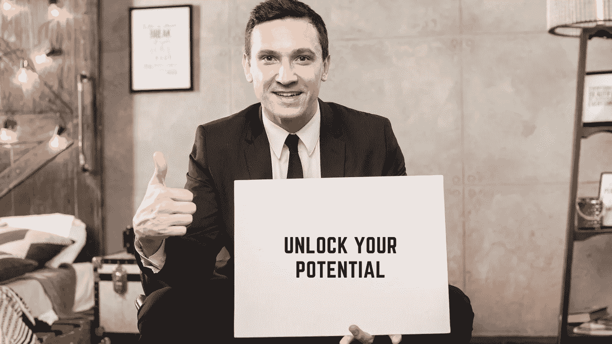
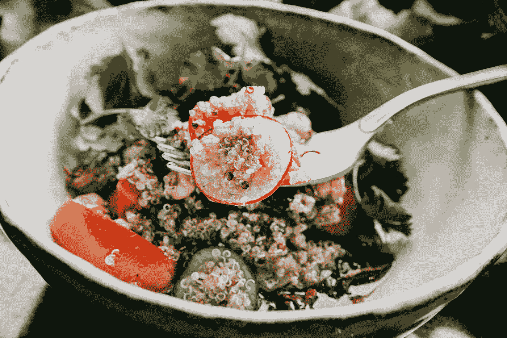

# 释放你真正潜力的 7 种有效方法

> 原文：<https://medium.datadriveninvestor.com/7-earnest-ways-to-unleash-your-true-potential-15c18256977d?source=collection_archive---------9----------------------->

## 知道是谁阻碍了你过上梦想的生活。

Image Credit Freepik

如果你写你的生活故事会怎么样？你会写什么？你希望你的生活如何展开？你的生活发挥了全部潜力吗？

现在不要跳到你认为的你的局限上，那会出什么问题呢？

你对自己最大的不公就是没有按照自己想要的方式生活。不是**释放你身上的潜力**。

你有巨大的潜力，有能力过上你梦想的生活。你是那个没有意识到隐藏在你内心的力量的人。你可以把你所有的精力都用在正确的方向上，用你的力量去实现你在生活中应得的东西。

为此，你必须释放你的力量。大多数时候你关注的是问题，而不是关注什么是正确的。为了将你的精力引向你的梦想，你应该遵循一些惯例。这些仪式将帮助你变得活跃起来，并充分发挥你的潜力。

我们低估了自己在生活中取得更大成就的能力。我们没有意识到我们真正的潜力。一旦你开始释放你的力量，你会看到你的生活变得更好，更令人满意。

**你的突破正在等待。**

这里有 7 种方法可以帮助你释放你真正的潜力。

1.  **吃健康食品**

照顾好你的身体是释放你真正潜力的第一步。因为没有健康的身体，就无法正常运转。你的身体是一座庙宇，你的整个生命都居住在那里。

为了健康的身体，吃健康的食物。我们的身体是一台机器。它被照顾得很好。如果我们忽视它，那么我们肯定会走向灾难。

为了达到最佳表现和成功的人生，我们的身体需要在最佳水平上运作。

为了达到最佳表现，我们需要能量和更好的睡眠。只有健康的食物才能给你提供进行日常活动的能量，这也能让你睡得安稳。

什么是健康饮食？为我们的身体提供适量的营养和矿物质。不是避免脂肪，而是摄入健康的脂肪。不要过量食用某些食物。拥有我们身体所需的所有食物。

Image by Ponyo Sakana from Pexels

大多数损害我们身体的疾病都可以通过改变生活方式来预防，比如进行体育锻炼和吃健康食品。

避免血糖含量高的食物，如软饮料、蛋糕、白面包等。高糖低纤维的饮食会增加胃部炎症。

富含新鲜蔬菜、水果、全谷类、豆类的饮食对胃有好处。包括酸奶、泡菜、泡菜、味噌等发酵食品，它们有助于肠道内有益菌的增加和繁殖。记住，快乐的内脏意味着快乐的你。

我发誓要坚持这四个习惯。

不要吃到饱，要保持胃里的⅓是空的。

*晚上 8 点以后不要吃东西。*

*避免糖、麦达(万能面粉)和加工食品。*

*喝足够的水。*

**2。从事体育活动**

清晨进行几分钟的体育活动，度过激动人心的美好一天。

我们是物质存在。我们的核心活动是体育活动。没有它，我们的身体就会生锈，失去做日常琐事的耐力和力量。

体育活动增强你的肌肉，增强你的耐力。一次简单的散步可以帮助你向体内输送大量氧气。当你沉迷于体育活动时，它会改善血液循环，反过来，它会给你容光焕发的皮肤和充足的氧气，让你表现良好。

运动帮助你燃烧卡路里，这可以控制你的体重。早晨的第一件事就是进行一次良好的体育活动，这是你快乐、健康和成功的一剂良药。它有助于提升你的情绪，有助于多巴胺的释放。多巴胺只不过是一种快乐的荷尔蒙。

体育活动也会以汗液的形式排出体内的毒素。

没有必要去设备齐全的健身房或者做一些高强度的锻炼。像跑步、慢跑和游泳这样的简单运动非常有益。爬楼梯或和孩子一起玩是好习惯。

Image by Sasin Tipchai from Pixabay

**3。注意你的想法**

你的想法塑造了你的现实。你的思想间接地操纵着你的生活。所以注意你的想法。

我们的思想非常强大。它遵循我们输入的指令。那些指令只不过是我们的想法。如果我们对它产生怀疑，它永远也不能发挥到巅峰。不要因为思想狭隘和消极而限制了你的潜力。

你的想法成为你的信仰。你的信仰塑造了你的生活。上帝赋予我们每个人独特而巨大的天赋。但是我们不知何故未能利用它，我们的一生都生活在错误的信念和消极的想法中。

但是你总是可以改变你的思维方式。把你的消极想法变成积极的。它创造了奇迹。你的想法需要改变，以实现你的全部潜力。

如果你想要过上你梦想的生活，想要实现你的目标，你首先要做的就是把你的想法从消极和平庸转移到乐观和伟大。你的思想有能力改变你和他人的世界。

> 马克·吐温写道:“生活主要是由不断在一个人头脑中流动的思想风暴组成的。”

当我们陷入困境时，我们试图修复外部世界。但事实是我们应该关注我们的内心世界和思想。

情况和环境不由我们控制，但我们的思想可以。

你的思想创造了你的信仰。信念只不过是你思想的集合。你根据自己的信念生活，不管是积极的还是消极的。根据字典的解释，信仰的意思是— ***接受某事存在或为真，尤其是没有证据的。***

这些信念会阻碍你的生活。要想成功，一个人必须赋予自己的思想力量。永远不要让消极的想法浮现在你的脑海中。

**4。做自己喜欢的事**

人生苦短…..为什么做自己不喜欢的事会不开心，以后会后悔一生。当你做你喜欢的事情时，你会充分发挥潜力。反过来，这导致成功和充实的生活。这个没有特别的公式。懂得这一点的人会过着幸福的生活。

你上班，只是为了领工资吗？我们是来工作、付账和死亡的吗？不，我说的对吗？我们都在这里过着充实的生活。我们在这里做我们喜欢的事情。

当你做自己热爱的事情时，一切都会在你的生活中流动，而不需要你去要求。你会成功，有更多的钱和一个名字。

做我们喜欢做的事能提升我们的精神和情感健康。做取悦别人的事，不值得你浪费时间和生命。做你爱做的事，你在这里是为了取悦自己而不是别人。

你妈做你爱吃的菜会怎么样？你迫不及待地想要得到它，没有她邀请你一起吃饭。首先，你闻它，然后你看它的方式。你开始用你所有的感官吃东西。

你真正的力量在于做你爱做的事，毫不犹豫，如果你这么做了，别人会怎么看你。

**5。有意义的关系**

我们生活中最重要的是牢固而有意义的关系。这些关系在我们生活的各个方面都帮助我们。有意义的关系从内在滋养我们，帮助我们过上充实的生活。

我们的幸福取决于我们关系的质量。一个支持和理解的伴侣是生活中所有压力的解药。正如我常说的，爱是生命的灵丹妙药。朋友和家人是生活中的幸事。

有时候，你需要的唯一治疗是一个你可以信任和倾诉的人，让他释放你的情感。一个在人生的所有季节都能和你站在一起的人。它间接地给了你一个健康平和的生活。没有什么比你的伴侣允许你做自己更好的了。

生活中的人帮助我们认识真正的自己。我们也应该花时间和我们生活中的人在一起，以加强我们的联系，培养我们的关系。

Image by StockSnap from Pixabay

我们忘记做的最重要的事情是从繁忙的日程中抽出时间陪伴他们，欣赏他人的努力，感谢他们。为了过上幸福的生活，我们必须在我们的关系上投入时间，否则生活将变得毫无意义。

同时，你应该避免有害的关系。与对你弊大于利的人保持距离。一段健康的关系可以让你的生活充满幸福，同时，如果你紧紧抓住一段不健康的关系不放，它会让你的生活变成地狱。

为了在职业上表现出色，我们应该有有意义的关系。良好和令人满意的关系会从各个方面改善我们的生活。

在你生命中正确的时间遇到正确的人会帮助你发挥出最好的一面。他们挑战你去探索真实的自我。

**6。冥想**

我们从周围环境中吸收了很多消极的东西。冥想帮助你避开生活中的消极因素。

冥想帮助我们控制我们的思想。它赋予平衡、和平、宁静、专注和有效处理事情的能力。如果你每天花几分钟时间冥想，那是非常有益的。

它让你的思想、身体和灵魂保持一致。你只需要安静下来，静坐，专注于呼吸。更多关于冥想[的信息，请点击这里。](https://fatimanisaar10.medium.com/why-meditation-is-a-super-pill-will-blow-your-mind-ae68373d2b45)

**7。灵性**

灵性是一个不断变化的庞大概念。这是对生命真谛的探索。，连接至高无上的力量，更好地了解我们的内在自我。当我们在精神上有所觉察时，我们会感到活着，并产生一种满足感。

一个精神上满足的人会找到平静、满足和感激。这导致了情感上的幸福，反过来，改善了生活的方方面面。

灵性有助于改变我们的思想，以寻求目标，更好地了解自己，过上充实的生活。环境和外部因素不会影响灵性的人失去他的生活方向。他内心是如此平静祥和。通过灵性，我们发现自己的内心世界。

不管你认为你能还是不能，你都是对的。

亨利·福特

你现在知道是谁在拖你的后腿了吗？不是别人，正是你。

你内心深处的潜力正等待被激发。

你应该把自己从你设定的旧信仰、恐惧和限制中解放出来。

请注意，释放你真正的潜力没有捷径可走。你必须虔诚地遵循仪式。

生活是这 7 种成分的组合，如果我们能很好地平衡它们，它的味道会很棒。如果我们过量使用一种成分而忽略了一些，它就会变得无味。

那么，你希望你的生活是怎样的？

**访问专家视图—** [**订阅 DDI 英特尔**](https://datadriveninvestor.com/ddi-intel)