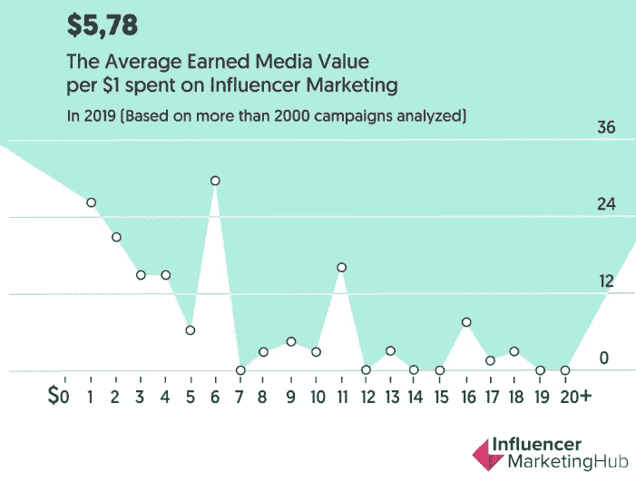
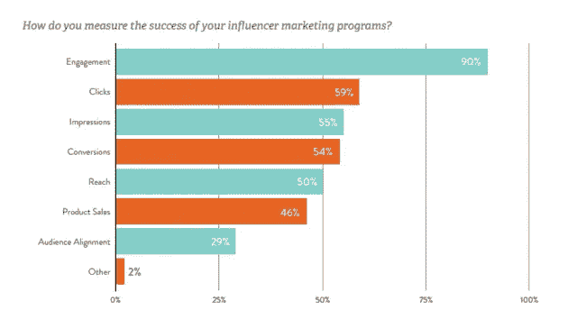

# 关于 2020 年影响者营销，你应该知道的 7 个基本事实

> 原文：<https://medium.datadriveninvestor.com/7-essential-facts-you-should-know-about-influencer-marketing-in-2019-b3e629464ee7?source=collection_archive---------11----------------------->

Image via [Unsplash by Henk Mohabier](https://unsplash.com/photos/nbwQA50pvlA)

如果你认为影响者营销在 2019 年很大，你猜对了，因为超过 60%的营销人员正在增加他们今年的影响者营销预算。此外，对影响者营销的搜索从 2015 年的 150 次增加到 2019 年的 70，000 次月度搜索。

因此，考虑到每投资 1 美元将产生 5.78 美元的平均投资回报率，影响者营销为营销人员带来了巨大的收益。这是根据“2020 年影响者营销状况[基准报告”的一份报告](https://influencermarketinghub.com/influencer-marketing-benchmark-report-2020/)

Source graphic via Influencer Marketing Hub

所以 2020 影响者营销即将爆发。如果你是一个品牌或公司，你应该已经很好地利用了影响者营销，因为这是这一代人最好的营销策略。

然而，如果你是数字营销的新手，你可能想知道什么是影响者营销。所以让我们来解决这个问题。

# 什么是影响者营销？

影响者营销是公司与行动者和震撼者合作的过程，营销影响者以达到更广泛和更相关的受众。他们主要通过脸书、Instagram、YouTube 和 Snapchat 等社交媒体营销渠道来完成这一营销过程。

此外，他们利用网站和博客来实现营销者的目标。描述影响者营销的最佳例子是，例如，像[凯莉·詹娜这样的名人影响者与一家名为时尚新星](https://www.instagram.com/p/BOhlX_IBeIn/?utm_source=ig_web_copy_link)的在线零售商合作。在这次合作中，她发布了一张自己穿着时尚 Nova 牛仔裤的照片。

 [## 您的企业今天需要虚拟现实营销的 3 个原因|数据驱动的投资者

### 新冠肺炎是并将继续是一个前所未有的全球性事件，将医疗保健系统和全球经济带到…

www.datadriveninvestor.com](https://www.datadriveninvestor.com/2020/04/09/3-reasons-why-your-business-needs-vr-marketing-today/) 

在标题中，她陈述了她是如何痴迷于时尚诺拉牛仔裤，同时在该品牌的 Instagram 页面和网站上贴标签。通过这篇帖子，她收到了 200 多万个赞和 50 多万条评论。

拥有更多受众的社交媒体影响者，如拥有超过 1.4 亿 Instagram 粉丝的凯莉·詹娜，解释了为什么特定公司希望与这些影响者合作。他们有更好的机会获得网站流量，提高投资回报率。

然而，你可以与之合作的不仅仅是一线明星或有巨大影响力的人。你也可以和宏观或微观的影响者一起工作。这些类别的影响者包括博客作者、视频博客作者和作家。

因此，这一切都归结到你的品牌的利基和目标。您希望通过影响者营销活动实现什么目标？有鉴于此，**关于影响者营销，你需要知道的七个关键事实是什么？**

在这篇文章中，你将了解影响者营销的七个重要事实**。**

# 1:始终进行研究以选择合适的人

真实性是社交媒体影响力营销成功的关键。您需要花一些时间来研究和选择合适的影响者计划候选人。通过这样做，你将增加通过口碑和其他营销渠道带来新的潜在客户和客户的几率。

尽管如此，当你开始你的影响者营销计划时，普遍发现如果你不能提供金钱奖励，人们不会热衷于参与。金钱，免费服务，商品，a，都可以作为交易的考虑因素。

然而，一旦你建立了自己的品牌影响力，你最终会看到更有可能与你合作的高层影响者。

# 2:影响者是品牌；像对待商业伙伴一样对待他们

有必要记住，影响者营销是品牌和影响者之间的业务关系。这种数字营销资产是一种双赢的投资，因为它将使双方受益。你的品牌和影响者都将享受这些优势。这就是为什么你应该[投资影响者营销](https://inspiretothrive.com/invest-in-influencer-marketing/)。

你的品牌信息将会被一个真实的、积极参与的观众所听到，同时也接触到一群新的人。另一方面，影响者将在生产反映其品牌激情和体验的内容的同时创造收入。

此外，为了取得成功，请确保与您选择合作的影响者分享您的计划目标，并为他们提供实现目标所需的工具。明确定义内容要求，给他们展示创造力和个性的空间。

# 3:影响力不是影响者营销中最重要的指标

从品牌的角度来看，在评估影响者营销活动时，影响者的影响力似乎是最重要的营销指标。

然而，参与度(影响者推动读者行动的能力)是一个更可靠的成功指标。在为你的项目寻找合适的社交媒体影响者时，这是你一直想要寻找的东西。

为什么会这样呢？这是因为当人们参与进来时，他们更有可能分享你的帖子，喜欢，评论，并把他们对你产品的想法传递给他们的同伴。这些行动表明，读者已经积极地与内容联系起来，而不是被动地浏览它。

# 4:内容、参与度、存在和人口统计

由于大多数公司不知道在影响者身上寻找什么，对营销人员来说，找到最适合他们业务的人仍然是一个挑战。然而，为了帮助您为您的活动确定合适的影响者，有四个影响者的顶级品质，其中包括:

1.  内容
2.  约会
3.  出席
4.  观众

让我们考虑一下每一种凭证。

**内容**:你要把精力集中在那些制作真实内容的人身上，这些内容能引起你的观众的共鸣，引发讨论，并在社交媒体平台上产生更多的分享。
**参与度**:将你的注意力引向影响者的参与度水平也很重要。最常见的互动形式是在社交媒体网站上发表评论、点赞、提问、转发和分享。

**形象** : [研究并寻找在多个社交媒体渠道保持活跃形象的影响者](https://seedx.us/how-to-leverage-social-media-influencers/)。我的意思是，毕竟，你会希望你的影响者能够发布并接触到更广泛的受众。

**受众人口统计**:找出影响者的受众人口统计范围也很重要。例如，如果你的目标是有新生儿的母亲，那么选择谈论育儿和怀孕的博客将非常适合你的活动。

> *精选:*

## 为影响者营销活动定义最佳人选时，需要衡量更多指标

*Source:* [*Linqia*](http://www.linqia.com/wp-content/uploads/2017/12/Linqia-The-State-of-Influencer-Marketing-2018.pdf)

除了上述衡量标准，您还应该监控其他指标，以便为您的业务确定合适的人员或营销影响者。可量化指标包括:

*   约会
*   点击
*   印象
*   转换策略
*   到达
*   产品销售
*   受众定位
*   等等。

# 5.受赞助的影响者营销内容更可信

当您与您支付报酬的影响者合作时，确保他们遵守美国联邦贸易委员会规则(FTC)的信息披露规则至关重要。

## 为什么这很重要？

联邦贸易委员会的影响者披露规则至关重要，因为这些规则将使消费者能够识别付费广告和有机内容之间的差异。此外，联邦贸易委员会规则的披露将进一步帮助用户了解他们是否只是在与他们喜欢的影响者打交道，或者这是向他们推销的一种手段。

此外，影响者有权对你的产品或服务发表意见。然而，适当的披露加上真实可信的评论会更有说服力和可信度。

此外，做你的研究，找到合适的影响者，他们符合你的定位，对你提供的东西真正感兴趣，而不是和那些只寻求报酬的人在一起。追随影响者的消费者可以很容易地看穿任何虚假和不诚实的帖子。

# 6.影响者营销人员重视真实的内容来创造信任

消费者追随影响者是因为他们的真实性，也因为他们重视他们创造的内容。因此，当发布内容时，影响者努力在处理赞助内容时始终保持真实的自我。

有影响力的人不是粗制滥造价值较低、质量较低的帖子材料，而是创造[经过充分研究的内容](https://www.mossmedia.biz/write-stunning-blog-posts/)片段，为读者增加价值。这样，你的营销影响者将通过有用的博客内容帮助你与目标受众建立信任。

它可以是任何材料——博客帖子、产品或服务评论内容等。事实是，影响者努力提供质量。

# 7.社交媒体超过广告

[社交媒体营销](https://www.mossmedia.biz/social-media-marketing-content-strategy/) (SMM)通过开发一种消费者可以即时获取信息的环境，改变了品牌与消费者互动的方式。社交媒体允许用户根据他们所发现的内容轻松地做出关于品牌和产品的购买决定。

它允许品牌和客户通过积极参与在线对话保持联系。如今，人们对参与和谈论一个话题更感兴趣，这意味着广告没有社交媒体强大。

因此，通过与有影响力的人合作，品牌可以利用社交媒体互动来提高参与度，吸引新客户，并增加销售额。

# 总结:你需要知道的影响者营销的现实

总体而言，影响者营销是 2020 年数字营销领域的下一个最佳选择。这是建立你的品牌的可信度，同时与潜在客户建立信任的有效方法。此外，它还能帮助你与业内有影响力的人建立互惠互利的关系。

有鉴于此，你可以选择与影响者营销机构、Instagram 营销影响者、影响者营销平台或任何支持你的营销影响者活动的社交媒体影响者营销合作伙伴合作。

*本文首发于*[*【https://mossmedia.biz/】*](https://www.mossmedia.biz/facts-influencer-marketing/)*。*

**访问专家视图—** [**订阅 DDI 英特尔**](https://datadriveninvestor.com/ddi-intel)