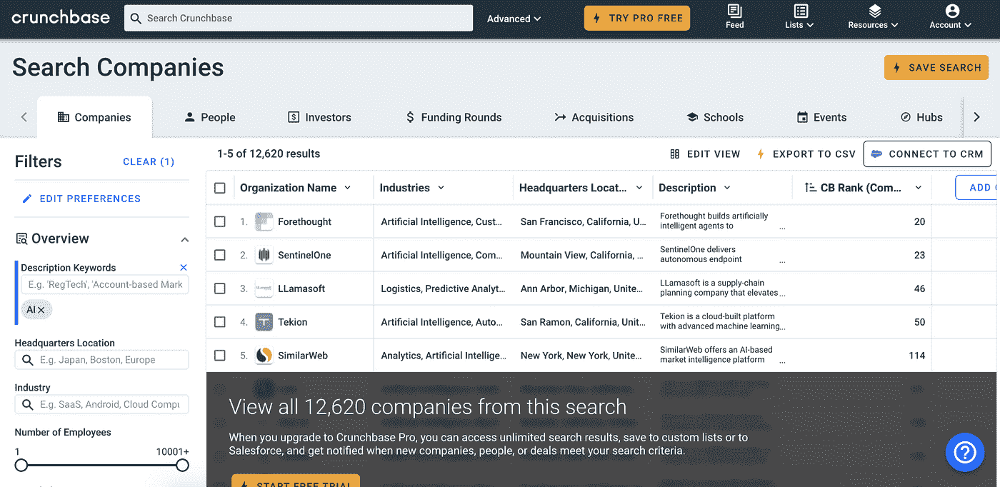
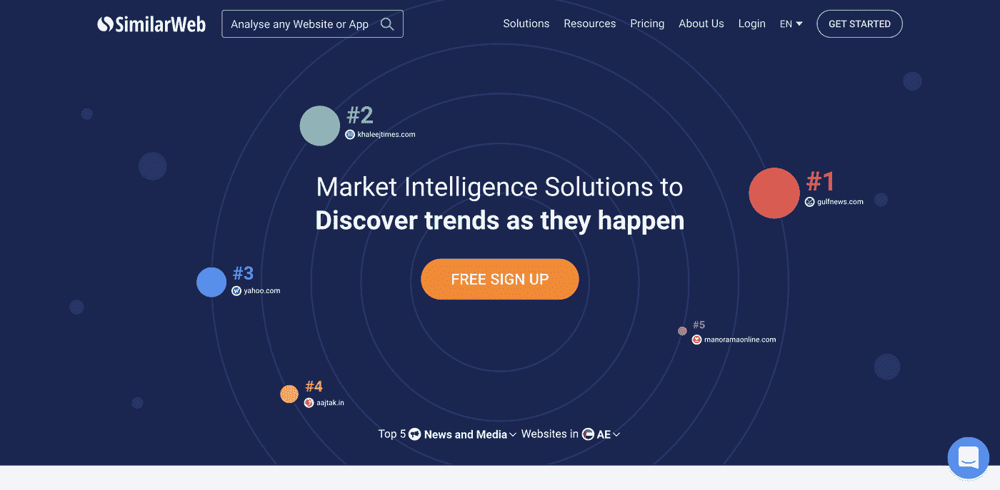
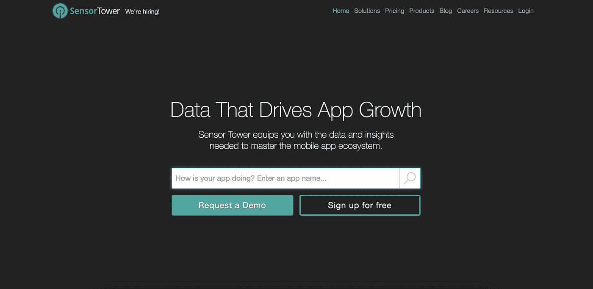
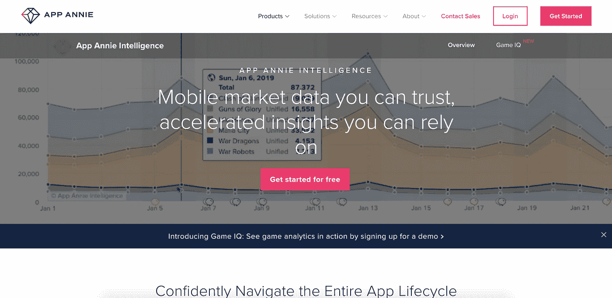
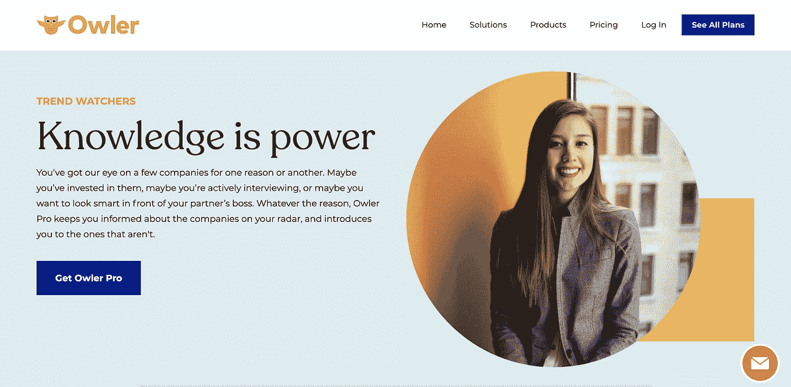
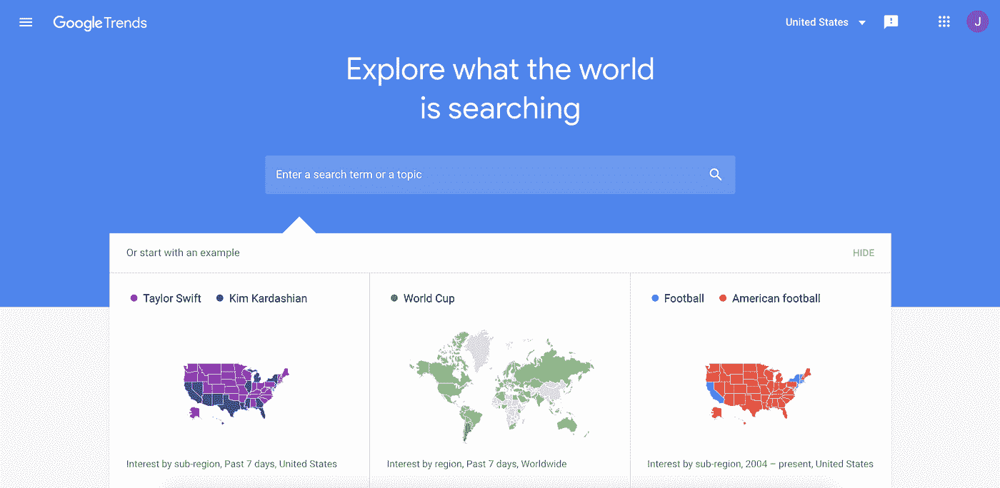
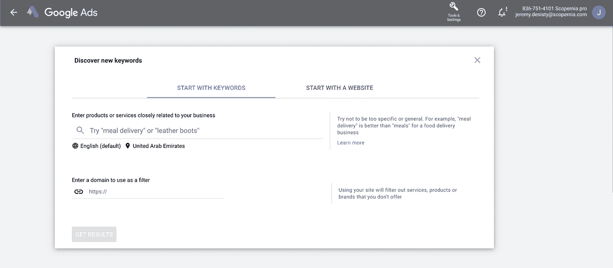

# 7 个(免费)市场研究和商业智能工具

> 原文：<https://medium.datadriveninvestor.com/7-free-tools-for-market-research-business-intelligence-2df1414907dd?source=collection_archive---------15----------------------->

Photo by Cesar Carlevarino Aragon on Unsplash

在过去的 10 年里，市场研究和商业智能的方法发生了很大的变化。

 [## 女性领导给你的企业带来的五大优势|数据驱动型投资者

### 从通用汽车和好时到 Ulta Beauty 和百思买，世界各地的大型企业都在证明…

www.datadriveninvestor.com](https://www.datadriveninvestor.com/2020/11/20/five-advantages-female-leadership-brings-to-your-business/) 

今天，您需要一种更全面的方法，一种提升您的视角并帮助您做出业务决策的方法，这种方法将使您的组织在未来几十年中经得起考验。

新的方法需要新的工具，使您能够以有限的成本快速获得显著的效果。

 [## 传统的市场研究已经死亡

### 了解如何在后 covid 时代进行市场研究，以做出最佳商业决策

medium.com](https://medium.com/datadriveninvestor/traditional-market-research-is-dead-f73e61f4d175) 

以下是我们用来引导市场研究的一些常用工具的非详尽列表。它们都允许访问免费版本或者至少是重要的免费试用版本。

# [Crunchbase](https://www.crunchbase.com/home)

> “Crunchbase 是专业人士发现创新公司、联系创新公司背后的人以及追求新机遇的领先平台。”

我们使用 Crunchbase 来发现和查找有关特定行业或特定研究主题中的初创公司、规模扩大公司和中小企业的详细信息。

数据库很大，工具使用方便，可以通过关键词、地点或行业引导研究，促进快速和相关的发现。

# [相似网](https://www.similarweb.com/)

> “SimilarWeb 为您提供全球多设备市场情报，以了解、跟踪和扩大您的数字市场份额。”

我们使用类似 Web 的“研究情报”解决方案来揭示市场趋势，分析、衡量和绘制特定行业的竞争环境，或者收集特定受众的在线行为数据。

# [传感器塔](https://sensortower.com/)

> “Sensor Tower 为您提供掌握移动应用生态系统所需的数据和见解。”

Sensor Tower 被许多人视为最佳的移动智能提供商，它将为您提供您需要了解的任何应用程序、其性能和关键指标的一切信息。

# [App Annie](https://www.appannie.com/en/product/intelligence/)

> " App Annie 是全球领先的移动数据和分析提供商."

App Annie 提供的信息与 Sensor Tower 非常相似。我们使用这两种工具是因为我们发现在 App Annie 上发现快速增长的市场和竞争对手概况更容易。

此外，免费提供的功能比传感器塔更广泛。

# [奥勒](https://corp.owler.com/)

> “Owler 在一个地方为您提供了您需要了解的关于公司的所有信息！年收入、员工人数、总部所在地、主要竞争对手、融资历史、最新新闻等。”

一旦你盯上了一家公司、竞争对手或收购目标，Owler 就是一个很好的工具。我们用它来引导对潜在合作机会的详细竞争分析或尽职调查。

# [谷歌趋势](https://trends.google.com/trends/?geo=US)

> "谷歌趋势提供了对谷歌实际搜索请求的大量未经过滤的样本."

当试图在一个相对较长的时期内确定趋势(谁会想到……)时，在早期阶段必须使用 Google Trends。

我们大部分时间使用它来识别关键话题和主题，以便使用更精确的工具，如 Google Keyword Planner。

# [谷歌关键词规划器](https://ads.google.com/intl/en_ae/home/tools/keyword-planner/)

> “关键字规划器帮助您发现与您的业务相关的新关键字，查看他们收到的搜索的估计值以及锁定他们的成本。”

Google Keyword Planner 不仅用于规划 Google 广告，它还是一个很好的工具，可以在关键字和搜索主题之间进行比较分析，识别机会，并快速评估广告在特定主题上的竞争力。

你有什么其他的工具可以推荐吗？

— —

如果你正在寻找外部的帮助来领导一个特定主题的研究，不要犹豫去接触。

是时候改变你的观点了🚀

 [## 你一直在做错误的商业情报

### 这是一个实际可行的模型

jeremy-denisty.medium.com](https://jeremy-denisty.medium.com/you-have-been-doing-business-intelligence-wrong-2a173887ec77) 

## 获得专家观点— [订阅 DDI 英特尔](https://datadriveninvestor.com/ddi-intel)