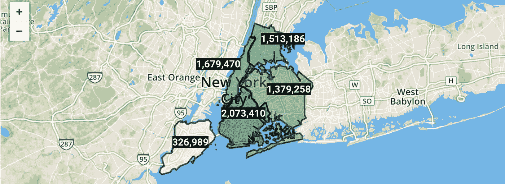

# 700 万个不资助 NYPD 的理由

> 原文：<https://medium.datadriveninvestor.com/7-million-reasons-not-to-defund-the-nypd-76577245336a?source=collection_archive---------13----------------------->

## 从 2006 年以来的 NYPD 投诉数据集中获得洞察力

**Not a map of New York**. Each red dot is the location of an NYPD complaint. By author.

在 T2 削减了 10 亿美元的预算后，NYPD 今年获得了 109 亿美元的收入，这主要是因为呼吁“解散警察”。

我分析了 2006 年至 2019 年向 NYPD 报告的所有重罪、轻罪和违规犯罪，以了解警方真正做了什么——以及它们是否像我们认为的那样有必要。

之前，我分析了针对 NYPD 官员的[指控](https://medium.com/analytics-vidhya/bad-cops-analyzing-33-358-allegations-against-nypd-officers-280ff0f1645f)，以及发生在三藩市的[事件](https://medium.com/datadriveninvestor/you-wont-believe-crime-rates-in-san-francisco-67cd3db04d97)。

# 探索 NYPD 投诉

总的来说，[数据集](https://data.cityofnewyork.us/Public-Safety/NYPD-Complaint-Data-Historic/qgea-i56i)包含 698 万份报告，包括每起犯罪的日期、时间、地点和分类，以及嫌疑人和受害者的年龄、种族和性别。

我们可以看到投诉有明显的下降趋势，从 2007 年超过 535，000 的峰值下降到 2019 年略高于 450，000 的低谷。请注意，数据集中不包括 2020 年。

Background by [Gianandrea Villa](https://unsplash.com/@gianviphotos?utm_source=unsplash&utm_medium=referral&utm_content=creditCopyText) on [Unsplash](https://unsplash.com/s/photos/nypd?utm_source=unsplash&utm_medium=referral&utm_content=creditCopyText). Visualization by author.

使用 Mapbox，我们可以看到人口最稠密的行政区经历了最多的犯罪。

Created using [Mapbox](https://www.mapbox.com/about/maps/) and [OpenStreetMap](https://openstreetmap.org/about/). By author.

将数据上传到 Apteo，我们可以看到这些犯罪差异逐年增加。布鲁克林一直是犯罪率最高的地方，其次是曼哈顿、布朗克斯和皇后区，而斯塔滕岛的犯罪率要低得多。

Created using [Apteo](http://apteo.co). By author.

结合小盗窃、大盗窃、抢劫和入室盗窃，我们可以看到“盗窃”约占犯罪的三分之一。攻击和骚扰加在一起占了犯罪的四分之一以上。

By author.

“其他”类别是在 700 万个犯罪数据集中大约 10 万个或更少的犯罪。例如，尽管堕胎在纽约是合法的，但已经有 7 次呼吁“堕胎”。从数据来看，这些都发生在私人住宅或街道上，因此是重罪。

从更轻松的角度来看，有 11 起关于“算命”的投诉，这确实是非法的。

Fortune cookie photos by [Elena Koycheva](https://unsplash.com/@lenneek?utm_source=medium&utm_medium=referral) on [Unsplash](https://unsplash.com?utm_source=medium&utm_medium=referral). Edited by author.

总体而言，最常见的投诉地点是住宅，其次是街道，发生在商业建筑、百货商店、公交和其他地点的投诉要少得多。

By author.

投诉数量最少的地方是日托设施，自 2006 年以来，在这些地方只有 16 起投诉。不出所料，礼拜场所、墓地和书店也在榜单上排名靠后。

我们可以看到，轻罪是最常见的，其次是重罪和违规。

By author.

最后，策划所有犯罪实质上是重新创建了一幅纽约地图。相当惊人。

By author.

# 不仅仅是虚假的关联:热与犯罪

“伪相关”是指两个不相关的数据集相关。这是一个常见的统计假象，因为有如此多的数据，随机相关性不可避免地会发生。

例如，另一个数据集显示，美国奶酪消费量[与高尔夫球场收入](http://tylervigen.com/view_correlation?id=341)密切相关。

在 NYPD 的数据集中，我们发现温度和投诉之间存在有趣的正相关关系。如果我们放大到 2019 年，我们可以清楚地看到，投诉在夏季达到峰值，在冬季达到底部。

By author. Weather data from [TimeAndDate](https://www.timeanddate.com/weather/usa/new-york/historic?month=12&year=2019).

这种趋势在整个数据集上都可以看到——自 2006 年以来，投诉量每年冬天都会下降，每年夏天都会达到峰值。

Monthly complaints over time, showing seasonality. By author.

这可能看起来只是另一个虚假的相关性，但实际上有许多研究为因果关系提供了证据。例如，南加州大学的[研究人员的一项研究显示了犯罪和炎热之间的相关性，其中有几个潜在的原因。](https://www.nber.org/papers/w25961?utm_campaign=ntwh&utm_medium=email&utm_source=ntwg23)

 [## 一瞬间学会数据科学！？数据驱动的投资者

### 在我之前的职业生涯中，我是一名训练有素的古典钢琴家。还记得那些声称你可以…

www.datadriveninvestor.com](https://www.datadriveninvestor.com/2020/07/23/learn-data-science-in-a-flash/) 

最明显的因果联系是，人们不愿意在寒冷的冬季外出，所以冬天的犯罪较少。当天气晴朗、阳光明媚时，数百万人会更多地外出，这自然会导致犯罪率上升。

以下是另外八项研究，为热量和犯罪之间的联系提供了证据:

*   [2017 年城市健康研究杂志](https://www.ncbi.nlm.nih.gov/pubmed/28687898)
*   [2014 年司法局统计报告](https://www.bjs.gov/content/pub/pdf/spcvt.pdf)
*   将人们在温暖的天气外出与犯罪活动的可能性增加联系起来
*   [2014 年论文](https://www.sciencedirect.com/science/article/abs/pii/S0095069613001289)显示气候变化将导致犯罪增加
*   [环境温度和暴力犯罪:线性和曲线假设的测试](https://pubmed.ncbi.nlm.nih.gov/6694060/) (1984)
*   [气候与犯罪:联邦调查局假设的测试](https://journals.sagepub.com/doi/10.1177/0013916584162003)
*   [环境温度与暴力犯罪](https://onlinelibrary.wiley.com/doi/abs/10.1111/j.1559-1816.1986.tb01168.x) (1986)
*   [全球变暖和美国犯罪率:日常活动理论的应用](https://journals.sagepub.com/doi/10.1177/0013916503255565)

显然，有重要的因果证据支持这种有趣的相关性。

# 道德考量

该数据集包含嫌疑人的种族、性别和年龄组的信息。然而，误解这些数据会使人们得出错误的结论。

例如，数据集中某个种族的高犯罪率也可能是 911 呼叫者和/或警察有种族偏见的证据。这也可能表明，某些种族倾向于犯更多的罪行，因为他们倾向于生活在不利的、贫困的地区。

也许最令人担忧的是，如果执法部门认为某个种族因为他们的种族而犯下更多的罪行，他们会对那个种族进行更多的监管，从而形成一个破坏性的反馈循环。

SPLC 有一篇很棒的文章揭示了种族犯罪数据的真相:

 [## 白人至上主义宣传手册中最大的谎言:揭开真相…

### 1]奥黛丽·史沫特莱和布赖恩·d·史沫特莱，《北美的种族:世界观的起源和演变》，第 4 版…

www.splcenter.org](https://www.splcenter.org/20180614/biggest-lie-white-supremacist-propaganda-playbook-unraveling-truth-about-%E2%80%98black-white-crime) 

类似的问题适用于分析性别和年龄数据，如果被误解，可能会导致警务中的年龄歧视和性别歧视。最终，根据数据做出政策决定需要最大限度的道德考量。

# 结论

虽然治安是最近的热点问题，但我们不能假装世界是和平的。从 2006 年到 2019 年，NYPD 应对了 20，000 多起强奸案、80，000 多起性犯罪、约 100 万起人身攻击案以及近 6，000 起谋杀和非过失杀人案。在此期间，NYPD 总共处理了近 700 万起犯罪。

虽然警察的暴行是完全不可原谅的，但完全解除对警察的资助是过于简单化的解决方案。[真正的选择](https://www.livescience.com/evidence-police-brutality-reform.html)包括改革警察仲裁系统、增加降级培训预算和警察非军事化。

**访问专家视图—** [**订阅 DDI 英特尔**](https://datadriveninvestor.com/ddi-intel)