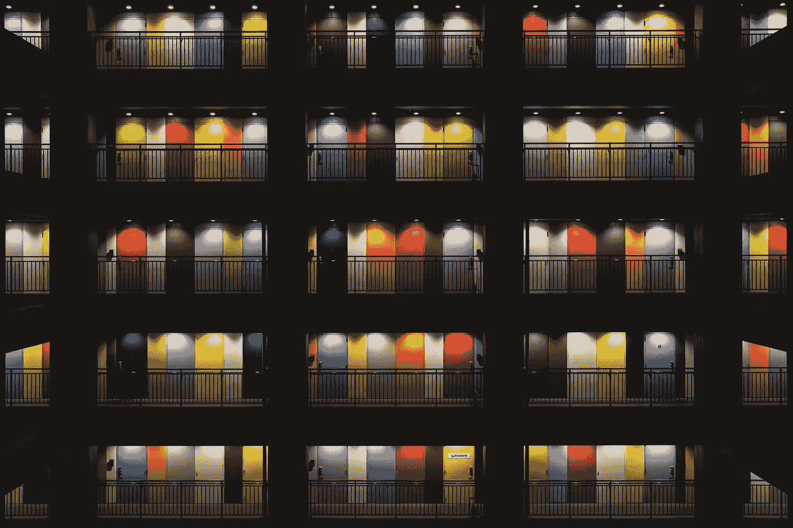

# 提高创造力的 7 种极简主义方法

> 原文：<https://medium.datadriveninvestor.com/7-minimalist-ways-to-be-more-creative-8972c28ae583?source=collection_archive---------14----------------------->

## 激发你创造力的最佳极简主义习惯

Picture by Joshua Fuller / [**Unsplash**](https://unsplash.com/photos/N2q8hRVzEg8)

极简主义和创造力是相辅相成的。无论你是作家、摄影师还是大学研究人员，极简主义的心态都可以激发你的创造力。在此基础上，这里有七种极简主义的方法可以让你更有创造力。

不管我们的职业是什么，我们经常需要创造性的热情来推进我们的项目。

学生们被鼓励跳出框框思考。员工始终需要证明自己的才华。没有令人兴奋的新想法，企业家就无法生存。

这就是你可以使用极简主义来更有创造性的地方。

# 提高创造力的最佳极简主义方法

整理你的空间，简化你的生活，会有激发创造力的效果。

从这个意义上说，下面的习惯会让你的创造力蓬勃发展，为新鲜的想法腾出空间。

# 使用数字极简主义来排除干扰

数字极简主义可以为你的创造力创造奇迹。

通过将你的在线状态减少到最低限度，你的创造力将不再被无用的社交媒体帖子、不断的电子邮件流量和重复的新闻周期所阻碍。

有很多方法可以抑制你的在线状态。

在大多数情况下，最好确定最有用的平台，并规范您的使用。选择*几个*社交媒体平台和新闻网站来关注，放弃所有其他的。

第二步是每个平台每天的时间限制。

举个例子，如果脸书只会妨碍你的工作，那就从你的大部分设备上卸载它。

相反，如果 Instagram 激发了你的创造力，那就把每天的时间限制在 30 分钟。

最后，一定要规范你的邮件流量。以下是我遏制邮件泛滥的三个主要技巧:

*   首先，根据主题、发件人和请求类型创建文件夹。
*   其次，定期管理你的电子邮件订阅。用一进一出的心态。
*   第三，根据重要性对邮件进行分类，并立即处理有标记的邮件。

# 将你的思想和创造力集中在一项活动上

作为一种心态，极简主义是关于*优先化*。通过将我们的精力集中在正确的领域，我们可以更有目的、更坚韧地追求我们的目标。

这同样适用于创造性的努力。

如果你正在为一个写作任务、专业任务或艺术任务而挣扎，把你的思想集中在一个*活动上。不要试图同时完成五项任务。*

在这方面，将任务中的创造性和管理性部分分开也很有效。这种分离包括明确界定创造性工作和行政事务的时间段。

例如，我的[早晨](https://medium.com/datadriveninvestor/7-creativity-unlocking-habits-to-overcome-your-drought-2ff4a9909928)被禁止进行创造性工作。午饭前，我不会查看邮件、安排会议或打电话。

本着同样的精神，我在下午留出几个小时做行政工作。这种清晰的划分有助于我集中思想，减少分心。

更好的是，这种分离为我的日常工作清单创造了一个直观的蓝图，也为[写日记](https://minimalistfocus.com/my-daily-journaling-routine-in-3-essential-parts/)和[冥想](https://medium.com/@jackkrier/6-ways-to-empty-your-mind-if-you-are-stressed-out-bacac7b080c6)腾出了时间。

# 整理你的环境，让你的创造力蓬勃发展

一些创作者在混乱的环境中茁壮成长。

马克·吐温和阿尔伯特·爱因斯坦是许多在凌乱的工作环境中表现出色的名人之一。

然而，大多数人不会从杂乱无章的工作环境中受益。

要想在一个组织混乱的环境中高效工作，创造力必须是一种*天赋*。你必须从一开始就排除干扰，而这对于 21 世纪的大多数人来说是不可能的。

在我们自己制造的混乱中工作可以推进预先存在的想法，但它首先不会培养创造力。

简单来说，如果你已经在创造伟大的东西，你喜欢的混乱类型可以作为一个额外的刺激物。然而，如果你想提高你的创造力，就会发生相反的情况。

这就是为什么一个整洁的工作空间会让你在创造力竞赛中领先。

另一方面，如果你在努力的开始就试图提高你的创造力，那么混乱会产生相反的效果。

这就是为什么一个整洁的工作空间会让你在创造力竞赛中领先。

此外，一个整洁有序的家会让你考虑项目，而不是你的吸尘器。

通过整理你的生活和工作空间，你的大脑将会自由地专注于下一个伟大的想法。因此，杂乱会成为一个障碍。这就是为什么你应该优先考虑清洁。

一旦你的创造力变得不言而喻，你脏乱的一面还是可以暴露出来的。

# 拥有更少，创造更多

类似于一个整洁的工作空间，减少你房子里松散物品的数量会产生影响。

除了显而易见的组织利益，拥有更少还具有促进创造力的精神成分。

一旦你不再担心最新的智能手机和最新的时尚趋势，你就释放了你的创造力。对短期物质快乐的追求会慢慢让位于新奇的追求。

因此，你的创造力不会被那些除了攀比之外没有其他目的的物质目标所阻碍。

作为一个创作者，把你的思想从过度的物质主义中解放出来可以产生新的艺术视野和想法。

不要误解我。你不必扔掉你所有的财产，停止购买新的东西。重点是释放你头脑中的空间。物质主义的减少通常会引发这种解放的效果。

# 定义价值观并做出决策

当谈到极简主义方式更具创造性时，对*价值观*的定义是必不可少的。

如果你是极简主义的新手，请记住以下几点:本质上，极简主义的态度是一套价值观。

你需要给商品、个人努力、关系和活动分配一个特定的*，意思是*。感谢你的价值观，你将能够做出合格的决定。这些决定最终将成为你创造力的来源。

你可能会在一个创造性的领域工作。或者你只是想加强你的艺术神韵。无论如何，创造力必须是你的首要价值观之一。

优先考虑创造力，而不是像流行文化这样的次要价值。

你决定进一步发挥你的创造力——例如，参加一个新的摄影班——而不是看另一集最新的网飞秀。

Picture by Dil / [**Unsplash**](https://unsplash.com/photos/8OECtq8rrNg)

# 用极简主义的生活方式来解放你的时间表

> “忙碌的日历和忙碌的头脑会摧毁你在这个世界上做大事的能力。如果你想做伟大的事情，无论你是音乐家还是企业家，你都需要自由的时间和自由的思想。”—海军拉维坎特

极简主义——作为一种整体态度——会解放你的时间表。

根据*你的*优先级来选择爱好、关系和工作相关的事情，你会有更多的时间可以支配。

在创意世界里，*时间*是你最宝贵的资源。

使用[极简方法](https://minimalistfocus.com/minimalist-mindset-10-steps/)来设计你的时间表。将创造力定义为基本价值后，确保创造性努力在你的日程表中占据足够的位置。

通过给予你的创意项目应有的关注，你的创造力将会蓬勃发展，你会慢慢进入创意的最佳状态。

举个例子，我总是努力找时间去追求摄影——我的一个爱好。缺少时间成了缺少想法和创造力的代名词。

解决办法是每周分配几个小时用于编辑。我的新习惯瞬间激发了灵感。

一旦我知道我总是会花一定的时间在摄影上，我就发展了思想自由，让思想绽放。

# 通过改善你的财务状况来激发你的创造力

我认为最简单的提高创造力的方法还包括改善财务状况。

与物质同等重要的是，不必担心财务限制，这将让你的创造力无限绽放。

这里有两点至关重要。

首先，不要让经济困难毁了你的艺术追求。管理你的期望。简而言之，永远不要指望一个缪斯项目来资助你的生活。

尽管现在许多数字创作者、作家和摄影师通过他们的艺术过着体面的生活，但金钱不应该是你唯一的野心。如果你想开一个博客，那是因为你热爱写作，而不是因为它在遥远的将来会变得有利可图。

其次，合理的预算和健康的理财习惯会让你有更多的时间和可支配收入。

额外的时间可以服务于你的创造性活动。同样，你可以把额外的收入花在创造力上——进一步购买像照相机、[笔记本电脑](https://minimalistfocus.com/the-best-minimalist-purchases-to-simplify-your-life/)，甚至是[漂亮的钢笔](https://minimalistfocus.com/my-minimalist-edc-7-things-i-never-leave-the-house-without/)。

## 如果你喜欢这篇文章，[**加入我的邮件列表，保持联系**](https://minimalistfocus.com/email-list/) 。

# 你可能也会喜欢

 [## 7 种创造力——释放习惯来克服你的干旱

### 如何走出创意空洞

medium.com](https://medium.com/datadriveninvestor/7-creativity-unlocking-habits-to-overcome-your-drought-2ff4a9909928) 

*原载于 2020 年 4 月 26 日 https://minimalistfocus.com***。**