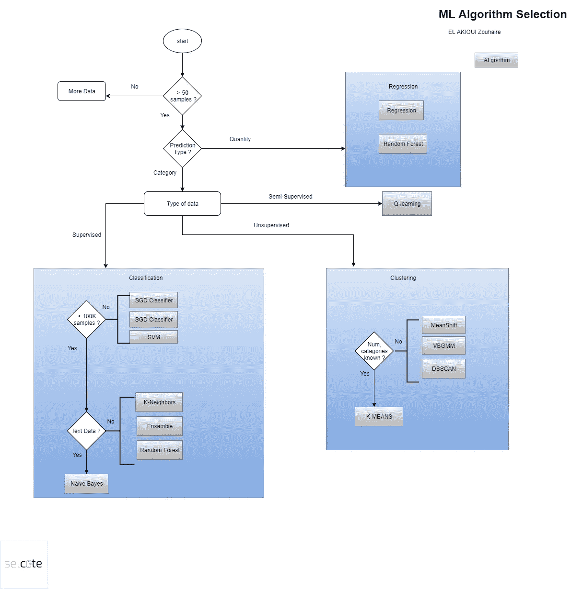
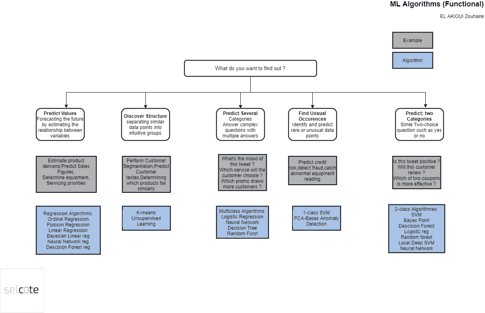

# 7 ML 算法将解决 95%的问题

> 原文：<https://medium.datadriveninvestor.com/7-ml-algorithms-will-solve-95-of-the-problems-64cbe5eb2dd4?source=collection_archive---------5----------------------->

Photo by [Olav Ahrens Røtne](https://unsplash.com/@olav_ahrens?utm_source=medium&utm_medium=referral) on [Unsplash](https://unsplash.com?utm_source=medium&utm_medium=referral)

数据科学家中流行一句话，*算法容易，难的是数据。*下面流程图中的每个方框都突出显示了您需要了解的关键算法。

ML Algorithm Selection

在浏览流程图时，决策节点取决于数据量和数据类型。

在某些情况下，你会发现你可以使用不止一种算法。一般的经验法则是从简单的开始，首先运行基本的算法。

有时 ML(机器学习)从业者采取一种更功能化的方法来选择算法。当云平台希望将用户从与选择算法所需的数据类型决策相关的复杂性中移除时，它们使用这种方法。微软 Azure ML 在使用这种方法帮助用户选择正确的算法方面做得特别好。

 [## 算法诱人的商业逻辑

### 某些机器行为总是让我感到惊讶。我对他们从自己的成就中学习的能力感到惊讶…

www.datadriveninvestor.com](https://www.datadriveninvestor.com/2019/03/22/the-seductive-business-logic-of-algorithms/) 

这个想法是问你自己一个简单的问题，“我想知道什么？”问题的答案会引导你找到正确的学习方式，然后是具体的算法。

下图描述了这个问题的一些答案:

ML Algorithms

结论:

上图，指导你选择最佳的 ML 算法。有了经验，你会发现屈指可数的算法就能解决你的大部分问题。

我认为你的工具箱中需要的最有用的七个 CML(经典机器学习)算法包括四个分类器和三个聚类算法:

朴素贝叶斯(分类)

随机森林(分类)

K-最近邻(分类)

支持向量机(分类)

DBSCAN(集群)

期望值最大化(集群)

K 均值(聚类)

当然，当你需要一个模糊的算法时，特殊的情况就会出现，但是 95%的情况下，这七个算法都会产生很好的结果。