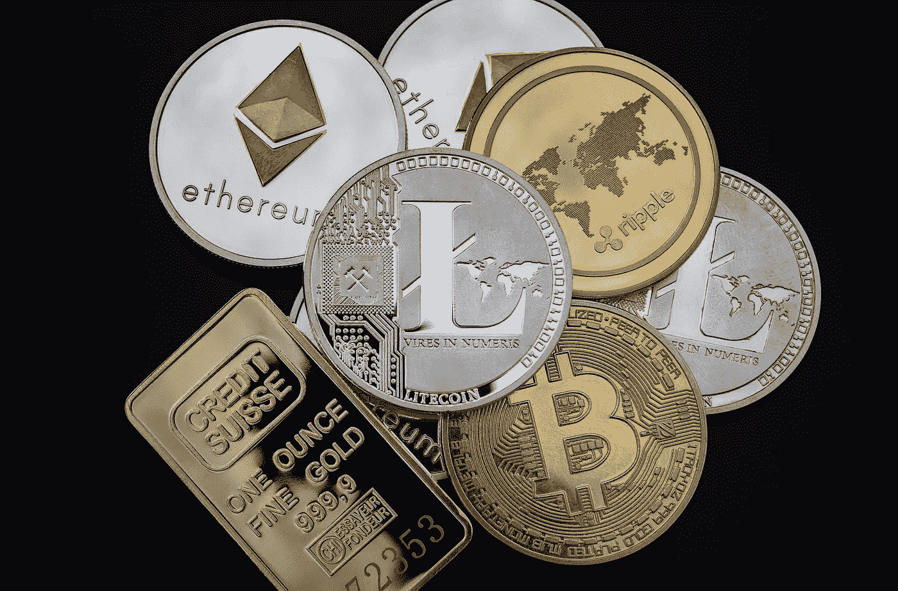

# 比特币之外值得投资的 7 种替代密码

> 原文：<https://medium.datadriveninvestor.com/7-most-important-cryptos-other-than-bitcoin-7f860424e589?source=collection_archive---------14----------------------->

Image by [WorldSpectrum](https://pixabay.com/users/worldspectrum-7691421/?utm_source=link-attribution&utm_medium=referral&utm_campaign=image&utm_content=3409725) from [Pixabay](https://pixabay.com/?utm_source=link-attribution&utm_medium=referral&utm_campaign=image&utm_content=3409725)

加密货币的引入从根本上改变了我们对金融机构的看法。它有助于我们理解当前金融交易方法的不稳定性和不安全性，以及为什么投资加密货币是保持金融安全的一种好方法。

在所有的加密货币中，比特币由于是市场上第一种加密货币，因此在其用户群中获得了很大的信任。它的巨大成功让许多人认为它是唯一的加密货币。

在 2017 年失去一点牵引力后，该货币似乎在 2020 年强势回归，突破 2 万美元。虽然比特币在市场上仍然是一种有吸引力的货币，但对于像你这样刚刚开始加密货币市场之旅的新手投资者来说，它也是一种昂贵且有风险的投资。

为了体验加密货币的滋味，同时又不至于倾家荡产，这里有几个你应该考虑投资的加密选项:

1.  **以太坊(ETC)**

自 2015 年成立以来，以太坊经历了指数级增长，并成为继比特币之后第二大最有价值的加密货币。作为一个核心的分散式网络，它为开发者提供了一个开发分散式应用(DApps)和智能合约的平台。加密利用它的令牌以太作为平台内交换的媒介。

目前，它的市值为 690 亿美元，是除比特币之外的一个很好的长期投资选择。

**2。莱特币**

这是继比特币之后推出的首批硬币之一，比特币通常被称为比特币黄金的白银。该平台利用开源支付，而没有一个中央机构来跟踪，从而消除了当局干预你的私人交易事宜的机会。

LItcoin 于 2011 年推出，是一种去中心化的点对点加密货币，也是一种开源软件。尽管它与比特币有很多相同的技术细节，但它的速度是比特币的四倍，而且资源消耗更少。

它目前的市值为 59 亿美元。

**3。涟漪(XRP)**

Ripple 同时是一种加密货币和一个网络，使交易者能够在没有现有第三方参与的情况下在世界各地转移资金。Ripple 拥有最快的处理时间和较低的交易费用，与主要金融机构的中央机构使用的 SWIFT 系统形成了激烈的竞争。

Ripple 市值排名第三，估值为 127 亿美元。

**4。Monero (XMR)**

自 2014 年以来，Monero 一直利用环签名验证来保护用户及其身份，使加密货币 100 %私有、安全、完全不可追踪。分散化和可伸缩性是它的主要关注领域。

Monero 有助于防止欺诈和身份盗窃，并为您提供对数据的完全控制。由于它伪装了你的地址，交易变得很难追踪或链接到任何特定用户的帐户。

目前，Monero 的市值为 23.1 亿美元。

 [## 另类投资——它们在后疫情时代的角色|数据驱动的投资者

### 全球疫情的经济影响继续波及全球各行各业。的…

www.datadriveninvestor.com](https://www.datadriveninvestor.com/2020/10/27/alternative-investments-their-role-in-the-post-pandemic-landscape/) 

**5。系绳(USDT)**

最初于 2014 年推出的 Realcoin 是加密行业首批稳定的硬币之一。作为一个用于存储和执行货币交易的区块链网络，Tether 不需要依赖昂贵的中介。为了最大限度地减少波动的影响，Tether 与美元挂钩，这意味着它保持与流通中的 USDT 硬币相等的美元储备。

它的稳定性让那些负担不起传统国际银行的人可以轻松兑换。目前，Tether 的市值为 40 亿美元。

**6。币安硬币(BNB)**

作为全球最大的加密货币交易平台上的代币，币安币让您以安全高效的方式交易所有类型的加密货币。你甚至可以用硬币在币安交易平台上支付交易费用。

这些硬币最初是在以太坊网络上以 ERC 20 代币的形式推出的。然而，在 2019 年，他们搬到了币安连锁店 mainnet。币安硬币利用拜占庭容错(BFT)共识机制，这意味着硬币不会被挖掘。目前，其市值为 52.9 亿美元。

7.**特佐斯(XTZ)**

Tezos 是为了促进智能合约而建立的，它允许用户直接控制网络规则，而无需签署协议，从而将这一想法向前推进了一步。由于 Tezos 本质上是灵活的，因此它能够很好地应对未来的需求和事件。你也可以通过一个烘焙的过程来参与治理网络。Tezos 的市值为 18.1 亿美元。

**加成:天秤座**

尽管脸书的天秤币仍然不可用，但我们应该谈谈这种扰乱加密社区的加密货币。

尽管仍在立法者的关注下，Libra 旨在帮助无法使用传统银行服务的人使用金融服务，安全无缝地进行交易。但是，由于脸书在隐私安全问题上的丑闻，它失去了主要投资者的信任。由于与脸书的联系，天秤座的未来仍然不确定。

加密货币市场仍在发展。拥有多样化的加密货币组合可以帮助您建立金融安全，而不必依赖当前的金融机构。尽管比特币目前统治着加密王国，但你永远不知道它的统治会持续多久。

## 访问专家视图— [订阅 DDI 英特尔](https://datadriveninvestor.com/ddi-intel)