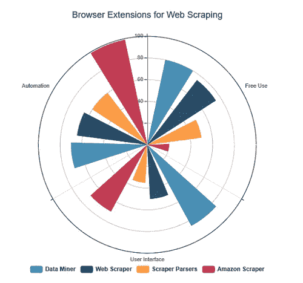
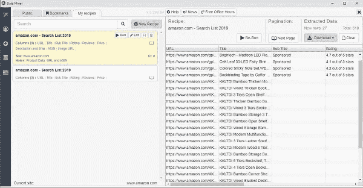
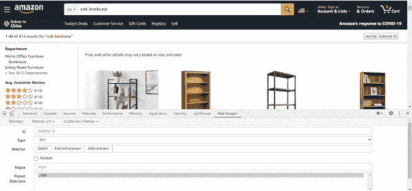
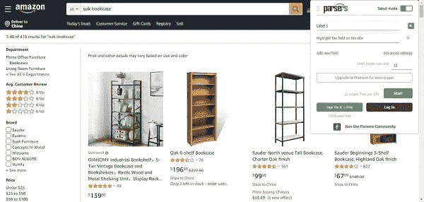
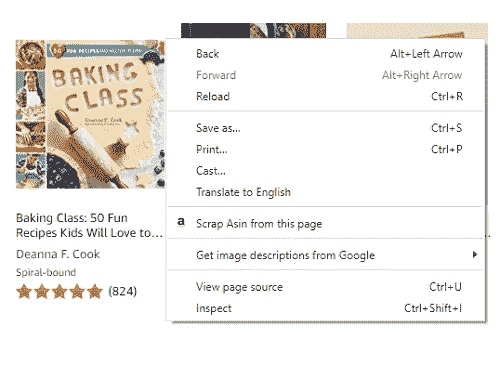
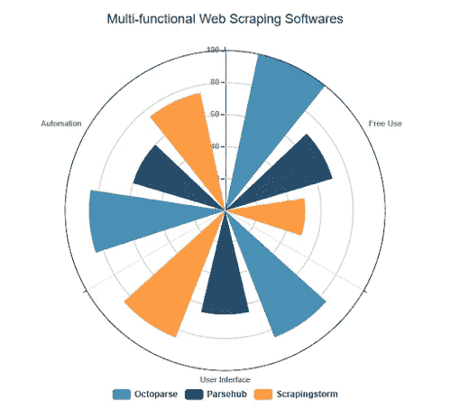
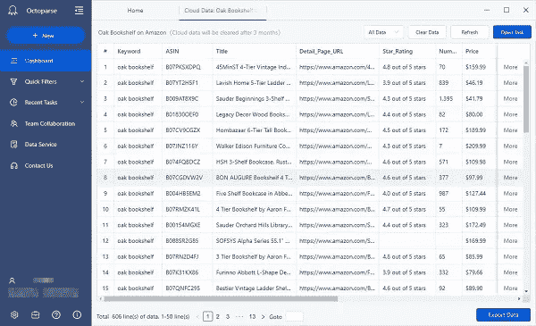
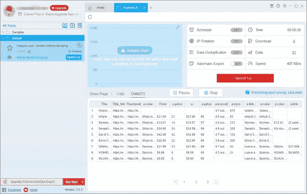
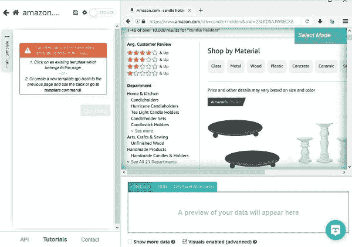

# 从亚马逊收集数据的 7 个最有用的工具

> 原文：<https://medium.datadriveninvestor.com/7-most-useful-tools-to-scrape-data-from-amazon-2ec7247059c0?source=collection_archive---------10----------------------->

这篇文章告诉你应该使用什么样的网络抓取工具来抓取亚马逊的数据。列表包括小型扩展工具和多功能网页抓取软件，在**三维**中进行比较:

*   自动化程度
*   用户界面有多友好
*   多少钱可以自由使用

分机的钥匙很容易拿到。你可以很快了解网络抓取的概念。这些选项具有相当基本的功能，适用于需要简单结构和少量信息的临时收集或小型企业。

# 浏览器扩展

分机的钥匙很容易拿到。你可以很快了解网络抓取的概念。这些选项具有相当基本的功能，适用于需要简单结构和少量信息的临时收集或小型企业。

## 数据挖掘器

[Data miner 是一个扩展工具](https://data-miner.io/)，可以在谷歌 Chrome 和微软 Edge 上运行。它可以帮助你将网页中的数据抓取到 CSV 文件或 Excel 电子表格中。有许多定制的方法可用于抓取 amazon 数据。如果那些提供的正是你所需要的，这可能是一个方便的工具，你只需点击几下就可以从亚马逊上找到。

**Data scraped by Data Miner**

数据矿工有一个循序渐进的友好界面和基本功能的网页抓取。它更适合小型企业或休闲使用。

Data Miner 的免费计划有页面限制(500/月)。如果需要多刮，专业的和其他付费的计划都有。

## 卷筒纸刮刀

[Web Scraper 是一个扩展工具](https://www.webscraper.io/)，在开发工具中集成了一个点击界面。如果没有电子商务或亚马逊抓取的特定模板，您必须通过在网页上选择您想要的列表信息来构建自己的爬虫。

**UI integrated in the developer tool**

Web scraper 配备了云提取、定时抓取、IP 轮换、API 访问等功能(可用于付费计划)。因此，它能够更频繁地抓取和抓取更大量的信息。

## 刮刀分析器

[Scraper Parsers 是一款浏览器扩展工具](https://parsers.me/)，用于提取非结构化数据，无需代码即可可视化。提取的数据可以在网站上查看或以各种形式下载(XLSX、XLS、XML、CSV)。提取数据后，数字可以相应地显示在图表中。

**Small draggable Panel**

解析器的 UI 是一个面板，你可以在浏览器上拖动并通过点击来选择，它还支持预定的抓取。然而，它似乎不够稳定，很容易卡住。对于一个访问者来说，每个网站的使用限制是 600 页。报名的话可以多拿 590。

# 亚马逊刮刀-试用版

[亚马逊 scraper 在 Chrome 的扩展商店上触手可及。](https://chrome.google.com/webstore/detail/amazon-scraper-trial-vers/cpaihklfamokgdbpnkkmeihednbefmom)它可以帮助从亚马逊搜索页面抓取价格、运费、产品标题、产品信息、产品图片、ASIN。

**Right-click and scrape**

去亚马逊网站搜索。当你在搜索页面上找到你想要的搜索结果时，点击鼠标右键，选择“从此页面中删除”选项。信息将被提取并保存为 CSV 文件。

这个试用版只能下载 2 页的任何搜索查询。您需要购买完整版来下载无限的页面，并获得 1 年的免费支持。

# 抓取软件

如果你需要定期从 Amazon 抓取数据，你可能会发现一些恼人的问题，这些问题会阻止你获取数据——IP ban、captcha、登录墙、分页、不同结构的数据等等。为了解决这些问题，你需要一个更强大的工具。

## 八解析

[Octoparse 是一款终身免费的网络抓取工具。](https://www.octoparse.com/)帮助用户快速抓取 web 数据，无需编码。与其他产品相比，这款产品的亮点在于其图形化、直观的用户界面设计。值得一提的是，它的自动检测功能可以节省你的努力，令人困惑地点击周围与混乱的数据结果。

 [## 数据启示录后期|数据驱动的投资者

### 思考一个不可知的未来并在其中运作是很困难的。但是数据驱动确实有助于解决这个问题。数据是…

www.datadriveninvestor.com](https://www.datadriveninvestor.com/2020/09/21/data-apocalypse-later/) 

除了自动检测，亚马逊模板甚至更方便。使用模板，您可以在 Amazon 上获得产品列表信息以及详细页面信息。你也可以在高级模式下自己创建一个更加定制化的爬虫。

**Plenty of templates available for use on Octoparse**

即使使用免费计划，只要每个任务的数据保持在 10，000 行以内，抓取的数据量也没有限制。

**Amazon data scraped using Octoparse**

强大的功能，如云服务，定期自动抓取，知识产权轮换(以防止知识产权禁令)提供了一个付费计划。如果你想定期监控一系列商店/产品的库存数量、价格和其他信息，它们肯定会很有帮助。

## 刮风风暴

[ScrapeStorm 是一款人工智能驱动的可视化网页抓取工具。](https://www.scrapestorm.com/)其智能模式的工作方式类似于 Octoparse 中的自动检测，智能识别数据，几乎不需要手动操作。所以你只需要点击并输入你想要抓取的亚马逊页面的网址。

它的预登录功能可以帮助你抓取需要登录才能查看内容的网址。总的来说，app 的 UI 设计像浏览器，用起来很舒服。

**Data scraped using ScrapeStorm**

ScrapeStorm 提供每天 100 行数据的免费配额，并且允许一次并发运行。当您有足够的数据用于分析时，数据的价值就显现出来了，因此如果您选择了该工具，您应该考虑升级您的服务。升级到 professional，这样每天就可以获得 10，000 行。

# ParseHub

ParseHub 是另一个免费的网页抓取工具，可以直接下载。与上面的大多数抓取工具一样，它支持以点击选择的方式构建爬虫，并将数据导出到结构化的电子表格中。

对于 Amazon 抓取器，Parsehub 不支持自动检测，也不提供任何 Amazon 模板，但是，如果您以前有使用抓取工具构建定制爬虫的经验，您可以尝试一下。

**Build your crawler on Parsehub**

您可以将图像和文件保存到 DropBox，如果您从标准计划开始，可以使用 IP 轮换和计划运行。免费计划用户每次运行将获得 200 页。不要忘记备份您的数据(14 天的数据保留)。

# 不仅仅是工具

工具是为了方便使用而创造的。他们通过点击几下一串按钮就可以进行复杂的操作。

然而，用户应对意外错误也很常见，因为不同站点的情况千变万化。你可以更深入一点，将自己从这样的困境中解救出来——学习[一些关于 html](https://www.w3schools.com/html/html_basic.asp) 和 [Xpath](https://helpcenter.octoparse.com/hc/en-us/articles/360041118892-What-is-XPath-and-how-to-use-it-in-Octoparse) 的知识。要成为一名程序员还没那么远，只需几步就能更好地了解这个工具。

# 相关资源

> [2020 年 9 款最适合初学者的免费网络爬虫](https://www.octoparse.com/blog/9-best-free-web-crawlers-for-beginners)
> 
> [3 种最实用的电子商务数据抓取工具](https://www.octoparse.com/blog/3-most-practical-uses-of-ecommerce-data-scraping-tools) [网络数据提取:2020 年权威指南](https://www.octoparse.com/blog/web-data-extraction-2020)
> 
> [Mac 最佳网页抓取器:用你的苹果设备从任何网站抓取数据](https://www.octoparse.com/blog/best-web-scraper-for-mac-apple-devices)
> 
> [视频:3 个简单步骤提升你的电子商务业务](https://youtu.be/jDLoF1nDIb0)

*原载于 2020 年 11 月 25 日*[*【https://www.octoparse.com】*](https://www.octoparse.com/blog/most-useful-tools-to-scrape-data-from-amazon)*。*

## 访问专家视图— [订阅 DDI 英特尔](https://datadriveninvestor.com/ddi-intel)