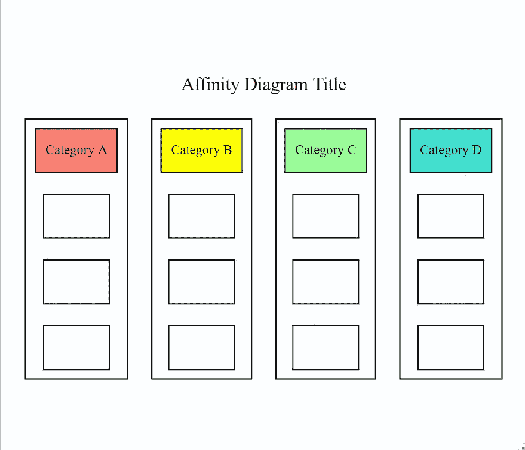
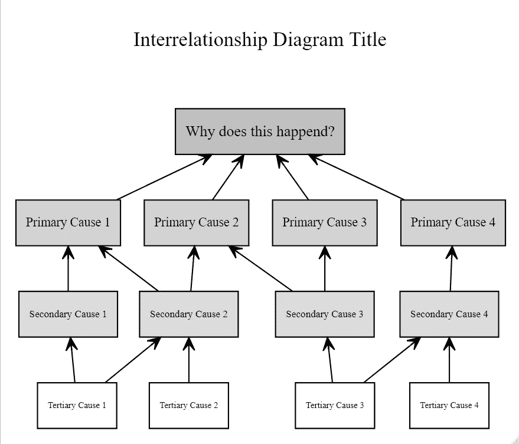
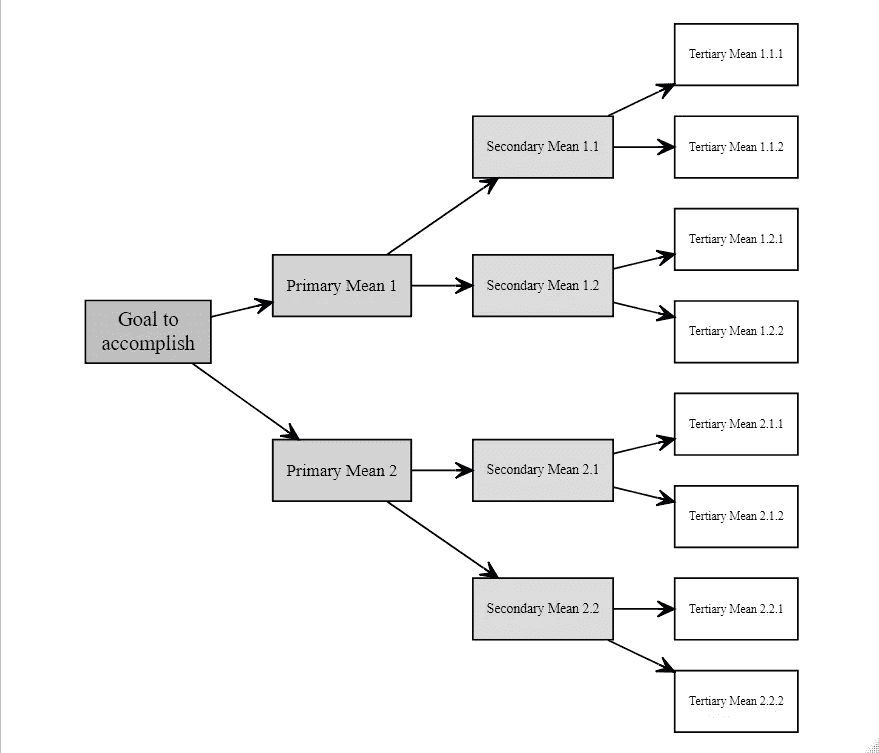
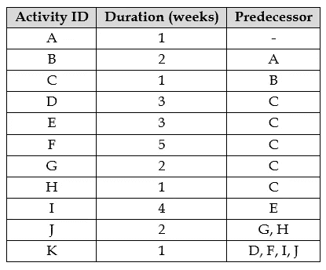
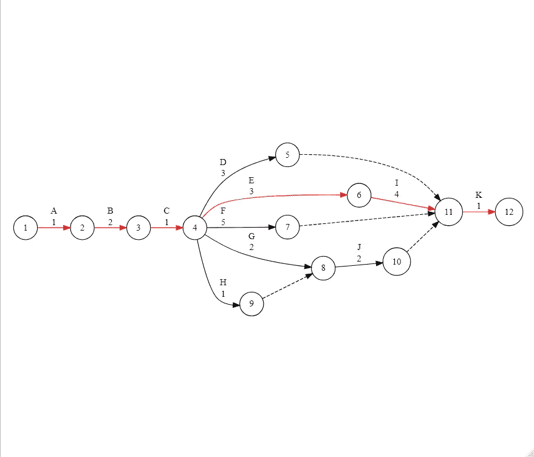
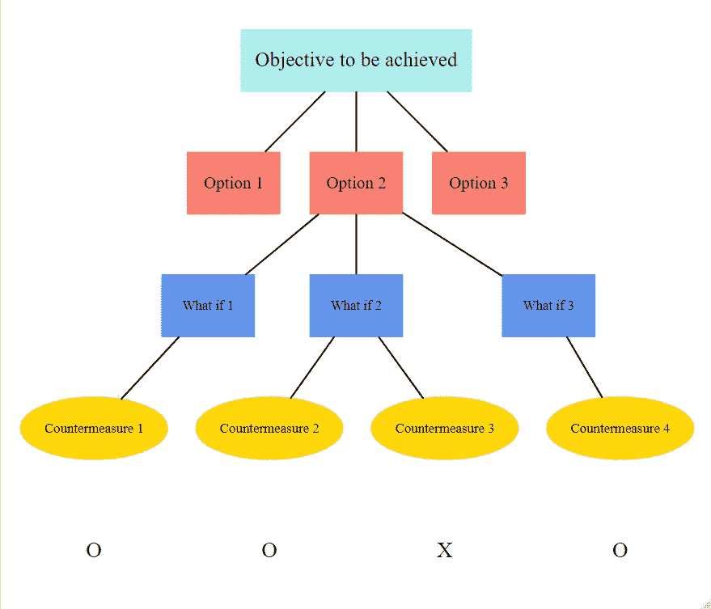

# 7 种新的质量工具

> 原文：<https://medium.datadriveninvestor.com/7-new-quality-tools-with-r-d800726663b6?source=collection_archive---------3----------------------->

## r 代表工业工程师

## 使用 R 包创建新的质量工具

Image by Fauxels available at [Pexels](https://www.pexels.com/photo/people-discuss-about-graphs-and-rates-3184292/)

# 7 种新的质量工具:简介

> *也被称为* ***7 管理和计划工具*** *，或者简称为* ***7 管理工具*** *，这 7 种新的质量工具被定义为*以前未曾使用过的用于实现预期结果的方法。它们可以追溯到 1976 年的日本，当时日本科学家和工程师联盟(UJSE)看到了促进创新、交流信息和成功规划重大项目的工具需求。(美国质量协会)

在组织中纳入 7 种新的质量工具的一些好处包括:更好地组织口头数据、改进规划、确保工作团队之间的充分合作、从不同角度更好地评估情况、更好地澄清期望的情况、更有效地确定任务的优先次序，以及促进组织之间的积极变化。

这 7 种新的质量工具并不打算取代 [7 种基本质量工具](https://towardsdatascience.com/7-basic-tools-of-quality-using-r-49fef5481e07)，而是对它们进行补充，一起使用以提高全面质量管理(TQM)的有效性。

# **亲和力图**

也被称为**亲和图**、**亲和映射**、 **K-J 法**或**主题分析**，亲和图将大量想法组织成它们的自然关系。它是头脑风暴会议的有组织的输出，用于生成、组织和整合与产品、流程、复杂问题相关的信息。它使进一步分析和寻找给定问题的解决方案成为可能。

对于下面的例子，让我们使用 [*图表生成器*](https://cran.r-project.org/web/packages/DiagrammeR/DiagrammeR.pdf) R 包构建一个亲缘关系图空白模板。我们来看看 R 代码！

Affinity Diagram Example

# 相互关系图

也被称为关系图或网络图，相互关系图是一种管理规划工具，它描述了复杂情况下各因素之间的关系。它允许团队系统地识别、分析和分类所有关键问题之间的因果关系。在计划阶段，它有助于获得对全局的清晰认识；促进工作团队达成共识；协助 ti 发展和改变人们的思维；并且能够准确地识别优先级。

对于下面的例子，让我们使用 [*图表生成器*](https://cran.r-project.org/web/packages/DiagrammeR/DiagrammeR.pdf) R 包构建一个相互关系图空白模板。我们来看看 R 代码！

Interrelationship Diagram Example

# 树形图

也被称为**系统图**、**树分析**、**分析树**或**层次图**，树图是一种管理计划工具，它描绘了完成一个目标所需的任务和子任务的层次结构。树形图开发了一系列实现目标的策略。它用于将宽泛的类别细分为越来越细的细节层次。一旦树形图完成，它就像一棵树，有一个主干和多个分支。

对于下面的例子，让我们使用 [*图表生成器*](https://cran.r-project.org/web/packages/DiagrammeR/DiagrammeR.pdf) R 包构建一个树形图空白模板。我们来看看 R 代码！

Tree Diagram Example

# 指示图

箭头图又称**活动网络图**、**网络图**、**活动图**、**节点图**或**关键路径法**，是一种用于确定事件最佳顺序及其相互联系的过程图工具。它用于计划和确定关键路径(即关键步骤的流程，其中延迟会影响整个项目的时间安排，并且增加资源可以加快项目进度。)通过节点(即活动的开始/结束)和箭头(即活动本身)。

有效的箭头图允许在项目开始之前查看整个任务并识别潜在的障碍，从而发现潜在的改进，及时处理计划的意外变化，并改善工作团队之间的沟通。

对于以下示例，让我们考虑完成下表中列出的给定项目所需的活动，以构建箭头图并使用 [*图表生成器*](https://cran.r-project.org/web/packages/DiagrammeR/DiagrammeR.pdf) R 包计算关键路径方法。我们来看看 R 代码！

Arrow Diagram Example

在建立了箭头图之后，确定了关键路径法和项目持续时间。完成该项目所需的最少时间是 15 天。A-B-C-E-I-K 的活动结果是关键的，这意味着如果其中任何一项被延迟，总的项目持续时间将增加，这就是为什么应该对这些活动给予特别关注和分配资源的原因。

# 过程决策程序图

过程决策程序图(PDPC)是一个管理规划工具，它系统地识别正在开发的计划中可能出错的地方。当信息不完整或情况难以预测时，它用于计划解决给定问题所需的活动。当计划必须按计划完成并且失败的代价很高时，在实施一个可能很大很复杂的计划之前使用 PDPCs。

PDPC 由一系列按顺序连接的步骤组成，分为五个层次:1 .要实现的目标，2。可用选项，请按 3。如果，4。可能的对策，和 5。对策选择。

对于下面的例子，让我们使用 [*图表生成器*](https://cran.r-project.org/web/packages/DiagrammeR/DiagrammeR.pdf) R 包构建一个 PDPC 空白模板。我们来看看 R 代码！

Process Decisions Program Chart Example

# 矩阵图

矩阵图也被称为**矩阵**或**矩阵图**，矩阵图允许团队或个人系统地识别、分析和评估两组或多组信息之间关系的存在和强度。用于通过*多维度思考来理清问题。*

六种不同形状的矩阵是可能的:L 形、T 形、Y 形、X 形、C 形和屋顶形，这取决于必须比较多少组。下表总结了应该使用每种矩阵形状的情况。

R 软件并不代表开发矩阵最友好的用户软件，这就是为什么没有包括 R 示例的原因。然而，出于一致性的目的，在本文中包含矩阵图的描述是值得的。

# **优先级矩阵**

也称为**矩阵数据分析**，优先级矩阵是一种管理技术，可以量化和排列矩阵中呈现的数据。工作团队使用它，通过选择、加权和应用标准来比较选择的系统方法来缩小选择范围。它完全基于数字数据，旨在找到区分选项的指标，并试图澄清大量信息。

R 软件并不代表开发优先矩阵的最友好的用户软件，这就是为什么没有包括 R 示例的原因。然而，出于一致性的目的，在本文中包括优先级矩阵的描述是值得的。

# 总结想法

本文研究的 7 个新的基本质量工具代表了对精益六西格玛项目和质量改进计划的规划、开发和管理非常有用的工具。它们的有效使用和实施可以为组织及其客户带来潜在的利益。

工程师必须熟悉和熟悉这些工具，以便从他们的工程工具箱中拿出合适的工具来处理给定系统中的问题，并帮助保持所生产的产品和服务的一致性。

拥有它们的 R 代码的主要优点之一是它们的*再现性，只需修改它们的初始输入。本文并不打算说服读者在开发这些工具时严格使用 R for，而是介绍如何用几行代码在一个免费的开源软件中开发它们。*

**— —**

**如果你觉得这篇文章有用，欢迎在*[*GitHub*](https://github.com/rsalaza4/R-for-Industrial-Engineering/tree/master/Quality%20Tools/New%20Quality%20Tools)*上下载我的个人代码。你也可以直接在 rsalaza4@binghamton.edu 给我发邮件，在*[*LinkedIn*](https://www.linkedin.com/in/roberto-salazar-reyna/)*上找到我。有兴趣了解工程领域的数据分析、数据科学和机器学习应用的更多信息吗？通过访问我的媒体* [*个人资料*](https://robertosalazarr.medium.com/) *来探索我以前的文章。感谢阅读。**

**——罗伯特**