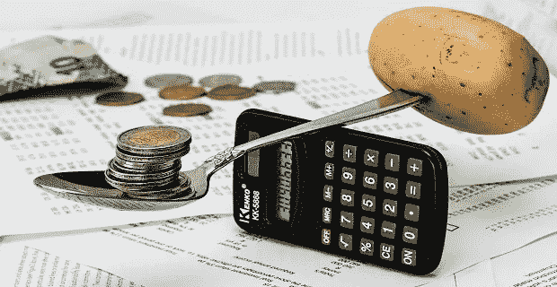

# 帮助你坚持预算的 7 种新方法。

> 原文：<https://medium.datadriveninvestor.com/7-new-ways-that-will-help-you-to-stick-with-your-budget-a7e1e6a260c4?source=collection_archive---------37----------------------->

无论你是靠薪水生活还是经营一家数百万美元的企业，你都需要有一个预算，并坚持下去，妥善管理你的财务。现在，有无数的提示和技巧可以帮助你做到这一点。我们总结了七个最好的和最有创意的财务工具和方法，来帮助你坚持你的预算。

Image by [Steve Buissinne](https://pixabay.com/users/stevepb-282134/?utm_source=link-attribution&utm_medium=referral&utm_campaign=image&utm_content=1015125) from [Pixabay](https://pixabay.com/?utm_source=link-attribution&utm_medium=referral&utm_campaign=image&utm_content=1015125)

利用薄荷。

薄荷是最受欢迎的金融工具之一。这是一个基于网络的免费资源，让你管理自己的储蓄账户、投资、信用卡、退休基金和其他费用，让你对自己的财务健康状况有一个更清晰的了解。Mint 让你更舒适的另一个最重要的任务是为你的家庭分配合理的预算。如果你没有坚持，它也会警告你。此外，它还推荐能让你在长期内存更多钱的金融产品。

**使用你需要的预算(YNAB)。**

YNAB 是一个有用的金融工具和预算软件，你应该用它来帮助你合理分配你的钱。除此之外，你还可以接触到教程、预算技巧和财务知识课程。它还有一个适用于 Android 和 iOS 设备的移动版本。

 [## 预算是获得数据驱动型投资者生活方式的关键

### 谈论财务可能会很艰难，但这种对话是必要的。62%有预算的人说这让他们…

www.datadriveninvestor.com](https://www.datadriveninvestor.com/2019/12/14/budgeting-is-key-in-obtaining-the-lifestyle-you-what/) 

**去掉所有让你在预算上作弊的选项。**

如果你认为你的信用卡是你财务稳定的祸根，那么你要么停止携带它们，除非你需要，要么一劳永逸地摆脱它们。你还应该清除你最喜欢的网上商店的所有存储的支付信息，这样你就不会在发现你喜欢的东西时轻易点击结账按钮。这样做，你就摆脱了任何可能诱惑你超出预算的事情。

**寻找支持。**

当你是同龄人中唯一一个预算紧张的人时，你很容易被诱惑去挥霍。如果你致力于让你的预算发挥作用并坚持下去，你必须找到一群和你一样的人。这可能来自在线论坛、社会团体或其他朋友。这样，你会得到更多关于如何成功理财的建议。

**设置视觉教具。**

如果你在攒钱买什么东西，比如出国旅行或梦想中的汽车，张贴一些图片或其他符号来提醒你你的目标。你也可以有一个大玻璃罐，你可以把零钱放在里面，这可以作为你的备用储蓄。所有这些都会提醒你坚持预算的长期好处。

让自己接受教育。

一些公司组织关于个人理财和金融工具的研讨会和讲习班。好好利用这些活动，因为你会学到很多关于预算的知识。你也可以看播客，阅读关于财务管理的文章和书籍，以准确地知道你需要做什么来成功地坚持你的预算。

遵循定期评估。

你不可能总是知道下周或下个月你会花多少钱。职业的改变可能需要你更新你的衣柜。一场突如其来的疾病可能会迫使你花费相当一部分预算。所以，要为不可避免的事情做好准备，定期评估你的预算。这样，你就会知道你是否在朝着你的长期财务目标前进。

在这些财务工具和技巧的帮助下，你将能够成功地坚持你的预算。

**访问专家视图—** [**订阅 DDI 英特尔**](https://datadriveninvestor.com/ddi-intel)