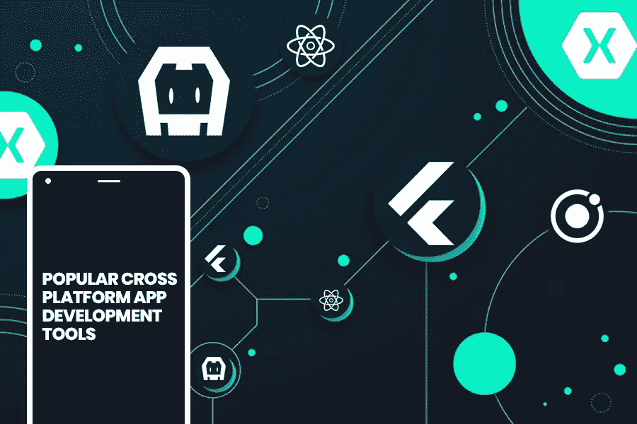
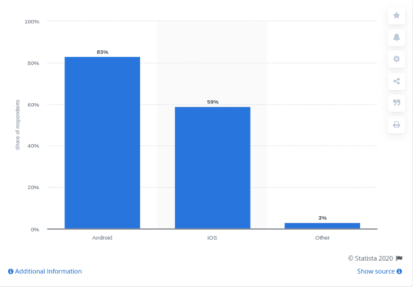
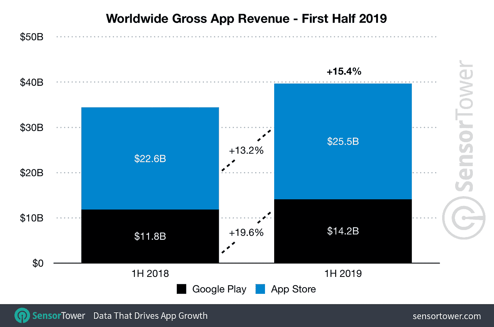
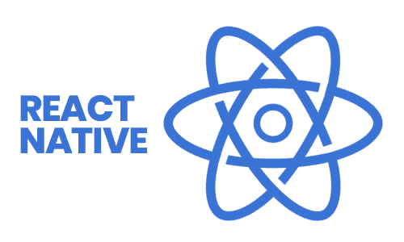
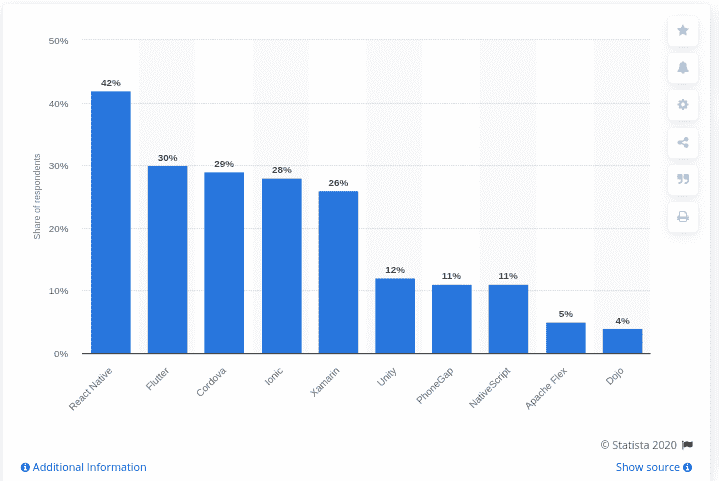
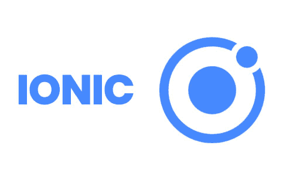
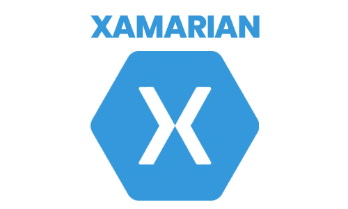
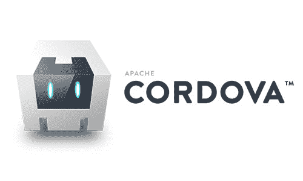
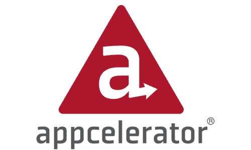
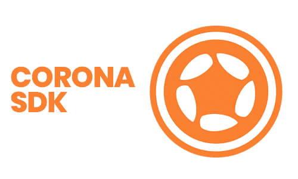

# 7 款流行的跨平台应用开发工具将在 2021 年占据统治地位

> 原文：<https://medium.datadriveninvestor.com/7-popular-cross-platform-app-development-tools-that-will-rule-in-2020-349c80fb51?source=collection_archive---------1----------------------->

随着技术创新的快速增加，开发人员不断关注能够简化他们的工作并最大限度缩短应用开发时间的应用开发工具或框架。无论你是专业开发者还是初学者，以下是 2021 年你需要知道的 7 个最流行的跨平台 app 开发工具。

今天，在竞争激烈的市场，开发者在寻找优秀的 app 开发工具；另一方面，企业正在寻找改善业务的最佳方式。从初创公司到数百万的公司，应用程序在某种程度上为业务增长增加了显著的优势，并以多种方式帮助他们。

> 现在的核心问题是，你将如何为你的企业选择正确的应用程序开发框架？

## **让我们面对现实，帮助你找到前进的正确道路:**

> [根据统计数据](https://www.statista.com/statistics/1078678/software-development-operating-system-mobile/)，83%的企业计划在谷歌 Play 商店推出应用程序，而 59%的受访者为苹果的应用商店开发应用程序。

(Image Source: [https://www.statista.com/statistics/1078678/software-development-operating-system-mobile/)](https://www.statista.com/statistics/1078678/software-development-operating-system-mobile/))

> 来自[传感器塔的预测报告](https://www.businessofapps.com/data/app-revenues/)，iOS 应用商店正在创造 466 亿美元的收入，而 2018 年谷歌 Play 商店的收入为 248 亿美元。
> 
> 根据 [Sensor Tower](https://sensortower.com/blog/app-revenue-and-downloads-1h-2019) 的新报告，2019 年上半年，iOS 应用商店和谷歌 Play 商店合计贡献了 397 亿美元的应用收入，而且这一数字还在快速增长。

(Image Source: [https://sensortower.com/blog/app-revenue-and-downloads-1h-2019](https://sensortower.com/blog/app-revenue-and-downloads-1h-2019))

## **简单地说:**

两个操作平台(OP)都在各自的道路上领先。无论你是一家成熟的企业还是一家初创公司，开发原生 Android 或 iOS 应用程序对你来说总是一笔昂贵的交易。因此，今天，当企业考虑应用开发时，首先想到的是 [**跨平台移动应用开发解决方案**](https://www.xicom.biz/offerings/cross-platform-app-development/) 。甚至创业公司和中小企业也发现跨平台是一项出色的技术，因为它允许他们开发一个可以在多个平台上运行的应用程序，包括 iOS、Android 和 Windows，只需一个代码库集。

 [## 2020 年移动应用发展趋势|数据驱动的投资者

### 不可否认的事实是，智能手机正在改变运营模式、商业模式和市场…

www.datadriveninvestor.com](https://www.datadriveninvestor.com/2020/01/15/mobile-app-development-trends-to-follow-in-2020/) 

> 换句话说，如果你选择雇佣移动应用开发者进行跨平台应用开发，你可以瞄准市场的[重要部分。](https://gs.statcounter.com/os-market-share/mobile/worldwide)

# **那么 2021 年你应该选择哪些领先的跨平台框架呢？**

在你深入挖掘并投入足够的时间进行研究之前，我们已经收集了一些基于以下参数的最佳跨平台移动应用开发框架:

> **业绩&人气**
> 
> **代码可重用性和丰富的知识库**
> 
> **简单易学，支持跨平台 app 开发的方方面面。**
> 
> **强大的社区支持和面向初学者的公平框架文档**
> 
> **访问设备功能的能力。**

# 以下是 2021 年最佳跨平台移动开发工具列表:

## **1。React Native(开发者中跨平台框架的** [**顶级选择**](https://www.statista.com/statistics/869224/worldwide-software-developer-working-hours/)**)**

> **结论:**
> 
> React Native 是跨平台框架的最佳选择，因为它基于 Javascript，是开发企业级应用的理想工具。

React Native 由脸书于 2015 年 3 月推出，并迅速成为懂 JavaScript 的开发者的完美选择。据 Statista 称，42%的开发者仍在考虑用 React Native 开发应用，因为它允许你用主要的本地语言编写模块，包括 C++、Java、Swift、Objective 和 python。此外，使用 React Native 设计应用程序对开发人员来说更快、更舒适，因为它是一个开源框架，允许您在应用程序开发中重用代码库。

> **主要使用案例:**脸书和 Instagram
> 
> **平均应用程序开发成本:**10，000 到 60，000 美元

*(Image source:* [*https://www.statista.com/statistics/869224/worldwide-software-developer-working-hours/*](https://www.statista.com/statistics/869224/worldwide-software-developer-working-hours/)*)*

## **2。Flutter(利用时钟挑战开发跨平台应用的理想框架)**

> **结论:**
> 
> **Flutter 是开发高性能 web 应用程序的理想框架，因为它基于谷歌的内部 Dart 语言，为开发人员提供了更快的代码编写和执行功能。**

Flutter 是谷歌在 2018 年推出的 UI kit 的高级水平之一，非常适合现代应用开发环境。它是一个开源软件开发工具包(SDK)，提供了广泛的 UI 元素、小部件和高性能渲染引擎选择，允许开发人员使用流畅的动画定制应用程序。除此之外，Flutter 还提供了一个热重新加载功能，开发者无需保存就可以查看代码的实时变化。

因为 Flutter 是 Google 的一个婴儿，所以可以保证它在未来会继续成长，并为你提供积极的社区支持。

> **主要用例:**谷歌广告和阿里巴巴
> 
> **平均应用开发成本:** $10，000 到$50，000

## **3。Ionic(一个流行的基于网络技术的跨平台框架)**

> **结论:**
> 
> **凭借强大的社区支持和庞大的原生组件库，它允许开发人员开发适用于 iOS 和 Android 的高性能应用。**

凭借 Ionic 巨大的市场份额和网络使用统计数据，开发人员正积极选择这个框架来构建本地应用和渐进式网络应用。

如果你 [**雇佣移动应用开发者**](https://www.xicom.biz/offerings/hire-mobile-developers/) 进行跨平台应用开发，那么你应该知道 Ionic 是免费使用的开源框架，它为你提供了一个移动优化的可重用 UI 组件、手势和工具的库，以在更短的时间内开发高度互动和引人入胜的应用。

> **主要使用案例:** Pacifica、Market Watch、麦当劳
> 
> **平均应用程序开发成本:**5 万至 10 万美元

## **4。Xamarin(开发跨平台应用程序的著名工具)**

> **结论:**
> 
> **Xamarin 是一个开源平台，广泛用于构建 iOS、Windows 和 Android 应用开发的应用。**

根据调查，Xamarin 是创建高性能跨平台应用的第五大流行工具之一。在微软的支持下，Xamarin 支持 C#代码库，并适合于。net 开发人员。使用 Xamarin 构建高性能应用程序更快、更舒适，因为它具有 TestCloud 功能，可以自动测试您的应用程序，并确保 100%的代码可重用性。

在使用 Xamarin 时，它允许开发人员使用标准的本机 API，为用户提供真实的本机体验。

> **主要使用案例:**阿拉斯加航空公司、奥罗航空公司、MRW 航空公司和 AOX 航空公司
> 
> **平均应用开发成本:** $20，000 到$70，000

## **5。Cordova(简单易学的移动应用开发工具)**

> **结论:**
> 
> **与 React Native 和 Flutter 一样，Apache Cordova 也是一个开源的移动开发框架，允许开发人员为多种操作系统开发应用程序。通过使用标准的 web 技术和插件，开发人员可以快速构建具有广泛功能的应用程序。**

Apache Cordova 是一个开源的移动应用开发框架，归 Adobe 所有，被 157 家公司用于他们的技术栈中。

根据 Stack share，Apache Cordova 已经获得了 [818 个 GitHub stars 和 336 个 GitHub](https://stackshare.io/apache-cordova) forks，并鼓励开发人员通过使用本地资源的属性来创建更强大的应用程序，包括手机的摄像头、加速度计、指南针、联系人、消息、地理位置、网络、通知等。使用 Cordova 开发应用程序既省时又经济，因为它利用了高质量和多组功能来帮助实时开发应用程序。

> 由于 Cordova 利用 HTML5、CSS 和 JavaScript 进行开发，因此，开发者可以在任何操作平台上提交应用程序。

> **主要用例:** Hogangnono，Teleport，沃尔玛
> 
> **平均应用开发成本:** $10，000 到$50，000

## **6。Appcelerator(最流行的移动应用开发工具)**

> **结论:**
> 
> **通过快速原型开发，开发人员可以将构建和获得解决方案的速度加快 70%******，并获得显著的竞争优势。****

**凭借 [8.6 的评审分数和 99%的用户满意度](https://reviews.financesonline.com/p/appcelerator/)，Appcelerator 已经成为跨平台开发框架的首选，使您能够在更短的时间内构建原生应用。用 Appcelerator 创建的应用程序与 iOS、Android 和 Windows phones 等平台兼容。**

**使用 Appcelerator 的另一个好处是，它使您能够跨不同平台重用 90%的代码，这是开发本机应用程序时最显著的优势。**

**第三，该平台通过一个名为 Hyperloop 的功能提供对各种 API 的访问，使您能够直接使用 JavaScript 使用 iOS 和 Android 的 API。**

**除此之外，Appcelerator 已经建立了一个由大约 [200，000+开发人员](https://enricoangelini.com/2012/5-pros-and-cons-of-appcelerators-titanium/)组成的庞大社区，并被用于开发 35，000 个应用程序。**

> ****主要用例:**美体小铺、阿拉斯加和联信银行**
> 
> ****平均应用开发成本:** $40，000 到$70，000**

## ****7。Corona(游戏应用的完美跨平台框架)****

****

> ****结论:****
> 
> ****Corona 是另一个免费使用的跨平台框架，用于开发具有出色图形质量的 2D 游戏应用。****

**无论您是想为移动设备、桌面设备还是电视设备开发游戏应用，Corona 都是创建游戏应用的理想跨平台框架，通过使用单一代码库兼容不同设备上的应用。**

**Corona 是免费使用且易于安装的平台，允许开发人员通过内置的 Corona 模拟器即时查看 Lua 代码的变化，因此无需维护工具集。无论您是专业开发人员还是开发新手，每个级别的开发人员都可以访问该框架的核心功能。**

> ****主要用例:**设计师之城，Zip Zap，失落之城**
> 
> ****平均应用开发成本:** $5，000 到$50，000**

# ****结尾注释****

**在本文的最后，值得一提的是，尽管拥有所有这些具有广泛好处的跨平台应用程序开发框架，但原生应用程序开发框架也有自己的编码优势。**

**没有本地和跨平台应用的性能比较。尽管如此，当谈到节省应用程序开发成本、时间和市场时间时，很大一部分中小企业、初创公司甚至百万美元企业都在为他们的下一个应用程序开发项目选择跨平台框架。**

**如果你有一个复杂的应用程序开发项目，需要最新的技术特性，那么建议雇佣一个 [**移动应用程序开发公司**](https://www.xicom.biz/offerings/mobile-app-development/) 来获得进一步的帮助。**