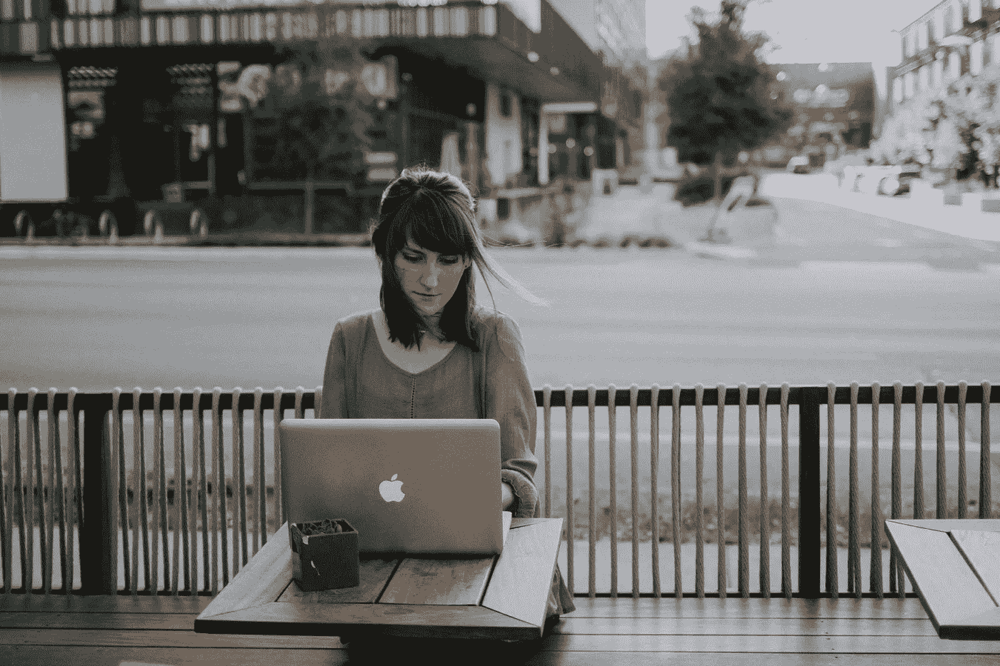

# 来自多年远程工作的 7 条重要人生经验

> 原文：<https://medium.datadriveninvestor.com/7-powerful-life-lessons-from-years-of-remote-work-4dec386bec52?source=collection_archive---------9----------------------->

## 数字游牧如何改变我对生活和工作的看法

Photo by [Christin Hume](https://unsplash.com/@christinhumephoto?utm_source=unsplash&utm_medium=referral&utm_content=creditCopyText) on [Unsplash](https://unsplash.com/s/photos/remote-work?utm_source=unsplash&utm_medium=referral&utm_content=creditCopyText)

数字游牧是一种独特的体验。

你总是在工作和冒险之间保持平衡。你学习如何将职业惯例与传统的办公室环境分开。最后，生产力变成了救命稻草，而不仅仅是一个“好东西”

两年多前，我告别了公司办公室，带走了大部分财产，开始远程工作。

一开始，我把它视为一次学习经历——一种尝试另一种生活方式的方式。

通过许多艰苦的工作、错误和明智的决定，我成功地将远程工作变成了一种永久的生活方式。

作为一项实验开始的东西变成了一项事业。

在智利圣地亚哥的 Airbnb 顶层公寓里工作不再是幻想。这变成了现实。位置独立是我的“新常态”，而不是一个遥远的概念。一年去 10 到 12 个国家旅游已经从一种渴望变成了我生活方式的副产品。

简而言之，远程工作改变了我对生活和工作的看法。

在此基础上，以下是多年远程工作的八条强有力的人生经验。

# **1。办公室只是一个有桌子和一些技术的房间**

在成为全职旅行者之前，我高估了传统办公室的重要性。

我一直认为生产力、责任感和适当的设备只存在于小隔间或其他类型的公司办公室中。

当我开始我的数字漫游之旅时，我不得不质疑这个假设。

作为一名自由作家和摄影师，为了成功发展我的事业，我需要构思一套在任何地方都适用的程序。

换句话说，我需要想办法在旅途中复制我以前的办公环境。

经过一年的反复试验，我找到了窍门。为了在任何地方都保持高效，我应用了以下原则:

*   将与工作相关的习惯与办公室分开。举个例子，我不再使用装有报价的个人咖啡杯，取而代之的是可重复使用的水瓶；
*   投资技术，确保我的远程工作效率；
*   不管环境如何，设计提高生产力的程序；
*   利用交通时间做轻松的工作；
*   提前完成作业；和
*   在旅途中保持健康。

在实施和微调这些习惯后，我有了一个顿悟:

> 办公室只是一个有桌子和一些技术的房间。你的生产力取决于你的习惯、纪律和心态，而不是你的工作场所。

当然，例如，工厂工人和实验室的化学家不能远程执行他们的活动。然而，有人可能会说这些人不在传统的办公室工作。

总而言之，我两年多的旅途经验告诉我，几乎任何工作都可以进行远程工作。因此，我们不应该把传统的办公室放在基座上。

# **2。生产力是一种超级力量**

通过数字游牧，我了解到生产力不依赖于办公室环境。同样，我也发现生产力是一种真正的超能力。

当你离开舒适的办公室时，你会面临各种干扰、沟通问题和其他阻碍生产力的因素。

旅行加剧了这些问题。除了通常的障碍，你还必须解决旅行中的打嗝、语言障碍和不熟悉的地点。

因此，你开始意识到明智地利用你的时间是专业产出的重中之重。

换句话说，你工作多少小时并不重要。

然而，这些时间的结果决定了你事业的成败。

# **3。忙碌和生产力之间有着巨大的差异**

在利用你的时间方面，远程工作也教会了我忙碌和高效的区别。

当今企业界的问题是，一切都是“紧急的”。

看看你的电子邮件收件箱。主题中有多少次包含了“紧急”这个词我猜在 50 到 100 之间。

因为这个术语现在被过度使用，它已经失去了它的意义。这就是忙碌和高效的区别。

高效的人专注于完成重要的事情，而不是试图回应每一个“紧急”的请求。

用 [Inc 杂志](https://www.inc.com/larry-kim/the-differences-between-busy-productive-people.html)的话说，

> “忙碌的人把大部分时间花在扑灭不必要的火灾上，因为他们被本质上并不重要的紧急问题弄得措手不及。[……]极其高产的独角兽知道如何区分紧急任务和重要任务。他们专注于完成重要的事情，而不是把时间花在试图完成不同的紧急任务上。”

远程工作帮助我理解了其中的区别。因此，我学会了如何专注于至关重要的任务，不要在琐碎的细节上浪费时间。

举个例子，每个自由职业客户都给我发邮件说“紧急”。这通常只是提醒截止日期。如果离最后期限还有几天，我不会浪费时间回复。

如果他们想在短时间内改变整个任务，我可能会取消这项工作——因为作为一名自由职业者，为客户服务是一项基本技能。

 [## 健身房 10 年的 10 条人生经验|数据驱动的投资者

### 走错一步，他们就会掉下去。两位登山者优雅地回到了地面。他们在那里…

www.datadriveninvestor.com](https://www.datadriveninvestor.com/2020/02/03/10-life-lessons-from-10-years-in-the-gym/) 

# **4。旅行既能刺激也能阻碍你的职业道德**

数字游牧的主要[好处之一](https://medium.com/datadriveninvestor/the-benefits-and-disadvantages-of-being-a-digital-nomad-9086bdb9c549)是你从不间断旅行中获得的灵感。

正如[塞内卡](https://www.5hundred2.com/quotes/seneca-travel-change-vigor-mind/)曾经说过的，

> "旅行和环境的改变给心灵注入了新的活力."

在这种情况下，探索有趣的地方，与有趣的人联系，克服文化障碍会激发你的好奇心、动力和创造力。

然而，旅行也会产生相反的效果。

尤其是第一次接触数字游牧民会被吸进一个放纵的泡沫。他们忘记了旅行不仅仅是聚会、寒暄和 Instagram。

因此，远程工作教会了我，如果你把旅行带来的灵感转化为创造性能量，你就能提升你的职业道德和生产力。

另一方面，如果你忘记了远程工作的“工作”部分，数字游牧可能不是最好的主意。

# **5。沟通至关重要——无论是在工作中还是在生活中**

作为一名远程工作者，沟通至关重要。

这同样适用于一般的生活。

在国外的头六个月，我有时会忽略与朋友和家人的联系，这成了一个巨大的错误。人们会断断续续地交流，或者完全停止交流，因为我没有尽到自己的责任。

沟通有两个方面。

首先，你需要知道什么时候需要联系，多久联系一次。远程工作告诉我，某些人比其他人想要更多的更新。

在这种背景下，知道人们想要多少交流是一项非常重要的技能，无论是在家里还是在路上。

其次，远程工作有助于您确定最佳的沟通方式。因为你不在现场，很多人会测试你在交流方面的容忍度。

举个例子，在我刚上路的几个月里，我的一个前同事不停地联系我。当我没有及时回复时，她生气了。她还使用了在办公室环境中绝对不会使用的词语。结果，我学会了在传达我的时间限制的同时不冒犯她。

远程工作是提高沟通技能的一种有效方式，这在当今社会变得越来越有价值。

# **6。“工作生活平衡”的概念是一场闹剧**

据《商业资讯》报道，在美国企业界，工作与生活的平衡几乎不存在。

我同意。但是我从不同的角度看待这个问题。

大多数分析人们工作生活平衡的研究——就像 Businesswire 引用的那样——集中在压力因素、连通性和加班上。

然而，远程工作告诉我，在大多数情况下，生活和工作之间的平衡是不可能的。

有两种情况:

*   要么你不喜欢你的工作，你的职业生涯只是一棵摇钱树。
*   或者，你的工作和你的激情重叠了。

首先，工作与生活的平衡是不存在的。有一个简单的*分离*。

不工作就是生活，反之亦然。你的爱好和激情驱动的活动发生在你的职业生活之外，是一种逃避。

因此，你没有试图平衡这两者。你只是用工作来支付你真正想做的事情。

在后一种情况下，你的工作是你的激情所在，在大多数情况下，你的生活包含愉快的活动。在那种情况下，你不需要用休闲活动来“平衡”你的工作。

当然，你可能有与工作无关的爱好，但你追求这些是出于兴趣，而不是抵消工作的辛苦。

正如设计师兼播客[黛比·米尔曼](https://tim.blog/tag/work-life-balance/)在蒂姆·菲利斯的采访系列*导师部落*中所说

> “我不相信工作与生活的平衡。我相信，如果你把自己的工作视为一种召唤，这是一种热爱的劳动，而不是费力的劳动。”

这中间自然存在，即使是最有激情的工作也会有令人讨厌的成分，但工作与生活平衡的概念在这两种情况下都不适用。更糟糕的是，许多公司引诱你相信这个概念，这样你就会在你不喜欢的工作上花更多的时间。

当我成为一名数字流浪者时，我的生活和工作融合成了一种生活方式。

在那之前，我在金融部门工作。我一直认为当时我的工作生活平衡很糟糕。

在路上花了两年时间，工作时间比以往任何时候都多，我意识到没有所谓的工作生活平衡，只有职业选择。

# **7。对抗嫉妒的最好方法是给出有用的建议**

最后，我的数字游牧生活方式向我展示了对嫉妒和消极的人的最佳回应:建设性的反馈。

即使数字游牧现在是一种既定的生活方式，许多人仍然不知道背包客和远程企业家之间的区别。

这就是为什么嫉妒、愤世嫉俗的言论和怨恨在对生活方式一无所知的人中司空见惯。

在这方面，我发现只有一类反应是有积极作用的:*小贴士*。

每次有人评论说“*当你探索金字塔时，有些人被困在办公室里，”我回答说:“*嗯，你可以问问你的老板关于你公司的远程工作安排。**

人们的态度通常会改变。他们不再羡慕我的生活方式，而是开始评估自己的可能性。

总之，我学到了战胜消极的最好方法是积极。

你不能用消极来反驳别人的消极观点。你只能试着给予积极的推动，或许提供改变的催化剂。

## [加入我的电子邮件列表，获得更多关于远程工作和极简主义的想法](https://minimalistfocus.com/email-list/)。

# 你可能也会喜欢

 [## 作为一名数字流浪者，如何平衡工作和冒险

### 作为远程工作者，工作和娱乐相结合的 7 种方式

medium.com](https://medium.com/datadriveninvestor/how-to-balance-work-and-adventure-as-a-digital-nomad-e6c1a089d2f0) 

## 获得专家视图— [订阅 DDI 英特尔](https://datadriveninvestor.com/ddi-intel)