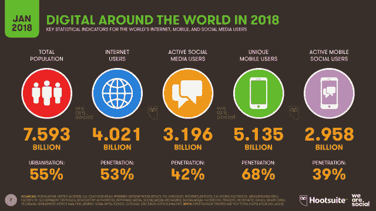
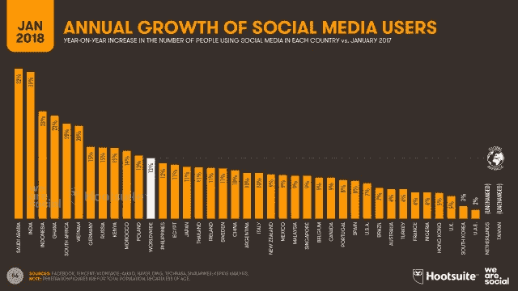
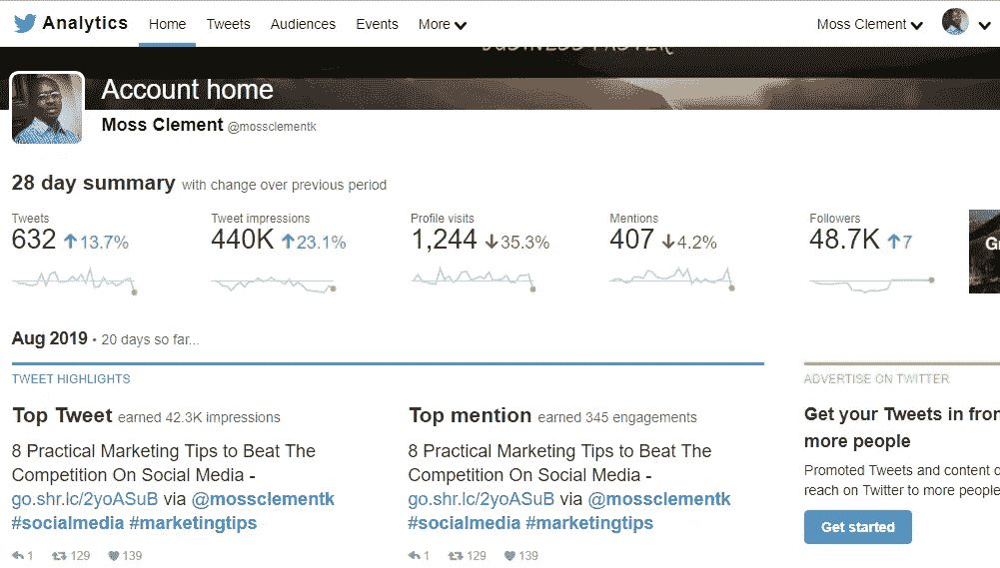
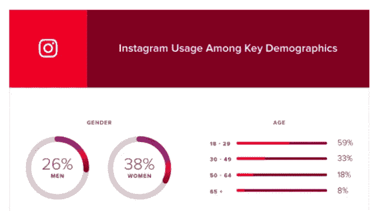

# 将社交媒体关注者转化为付费客户的 7 种有效方法

> 原文：<https://medium.datadriveninvestor.com/7-powerful-ways-to-convert-social-media-followers-to-paying-customers-d8cfd9f864c0?source=collection_archive---------7----------------------->

有助于你将追随者转化为买家的可行建议

Photo by free stocks via [Unsplash](https://unsplash.com/photos/VFrcRtEQKL8)

如何将社交媒体关注者转化为买家或付费客户？你想知道你的社交媒体追随者如何提高你的营销效果吗？你想要获得社交追随者并留住他们的最佳可行技巧吗？

你不需要回答这些问题，但是如果你正在读这篇文章，很明显你已经回答了。是的，已经开始了。作为一名数字营销人员，使用正确的数字营销渠道传达您的品牌信息至关重要，这将带来积极的结果。

 [## 计划者让社交媒体保持正轨|数据驱动的投资者

### 如果想达到并保持最高效率，忙碌的人会坚持使用系统。这是 Tweepsmap 和…背后的前提

www.datadriveninvestor.com](https://www.datadriveninvestor.com/2019/03/11/schedulers-keep-social-media-on-track/) 

最好的沟通渠道之一是“社交媒体”鉴于此，[最近“We Are Social and HootSuite”的研究](https://wearesocial.com/uk/blog/2018/01/global-digital-report-2018)显示，2018 年全球社交媒体用户数量同比增长 13%，超过 30 亿。

Infographic via WeAreSocial

研究显示，在过去的一年里，社交媒体每天吸引近 100 万新用户，相当于每秒钟超过 11 个新的社交媒体用户。沙特阿拉伯和印度分别领先 32%和 31%。

Graphic image via WeAreSocial

尽管如此，在社交网站上持续分享信息内容是非常好的。分享内容材料，帮助您获得更多社交媒体关注者，将他们转化为付费客户，并最大化您的投资回报(ROI)。

但是如果你不能将社交媒体的追随者转化为买家，你所有的努力都将是浪费时间。是的，因为你实施社交媒体营销技术的主要原因是为了盈利。

因此，

这篇文章为你提供了一个关于 **7 个强有力策略的分类，这些策略将帮助你将社交媒体追随者转化为付费客户。**

# 1:发送特别优惠

我喜欢这一步，因为它为你提供了一个获得更多忠实观众和潜在客户的平台；这就是为什么它是排行榜上的第一名。特价和/或独家交易是数字营销的重要组成部分。这种技巧会激励你的目标买家采取行动——知道他们正在以低于通常市场价的价格购买商品。

然而，当你把稀缺的力量注入到你的报价中时，效果最好。怎么会？让你的交易只在有限的时间内有效。这一举措将会刺激你的受众在截止日期前立即采取行动来利用你的报价。您可以为您的追随者提供许多独家交易，包括:

*   比赛
*   折扣
*   优惠券代码
*   赌金的独得

这个概念是为了帮助你吸引和创造一个愿意从你这里购买的忠实追随者的社区。

# 2:发布有价值的内容

有价值的内容是社交媒体营销的标志。所有其他营销策略都排在相关的、信息丰富的内容之后。如果你经常提供高质量的材料，那么可以说你将有效地与你的追随者建立信任。信任因素会促使他们继续回来，寻找更多你的内容。

此外，它打开了与你的目标市场沟通的渠道，因为对他们来说，你的品牌是可信的。

**亲温馨提示:**

*   在社交媒体上向你的追随者发布你没有在网站上分享的精彩内容。如果你不能创造这样的内容与你的观众分享，内容监管是你最好的选择。

# 3:评估每个社交媒体网站

更好地联系你的追随者的最好方法是评估每个社交平台，以确定最适合你的营销活动的平台。你要寻找的基本上是那些你的追随者与你的内容互动最多的社交网站。只有这样，你才能与他们互动，并有可能将他们转化为高质量的潜在客户和付费客户。

**亲温馨提示:**

*   所有主要的社交媒体平台都有一个分析仪表板，您可以访问它并直接查看您的内容的表现。分析将向你展示你的追随者是如何与你的内容互动的，表现最好的内容，等等。
*   使用来自分析的数据创建引人入胜的内容，并只关注为您的活动服务的社交网站。你不必无处不在，这就是为什么衡量你的营销活动是至关重要的，这样你就可以有一个焦点。

例如，你的 [Twitter 分析](https://www.mossmedia.biz/use-twitter-analytics/)仪表盘是一个很好的起点。

它将向您显示:

*   订婚率
*   链接点击
*   印象
*   提及等。

这些信息将帮助您提供更好的价值，将社交媒体关注者转化为买家。

# 4:专注于支持你兴趣的社交网站

一旦你找到了最适合你的社交媒体营销活动的社交网站，接下来要做的就是集中精力在这些网站上。就像我之前说的，你不必无处不在。试图在所有社交平台上都有自己的存在，将意味着把自己分散得太分散。

因此，把你所有的努力都用在支持你的营销方法上。随着时间的推移，当你建立了自己的品牌和可靠的网络，你就可以开始扩展到其他网站。
扩大社交媒体视野的最佳方式是计算受众指标，以确定要探索的平台。

您的受众指标将向您展示:

*   受众年龄
*   性别
*   人口统计数据
*   诸如此类。

例如，如果你的指标显示你的受众年龄在 18 至 29 岁之间，你可以立即得出结论，你的下一个最佳社交媒体平台是 Instagram。为什么？

Graphic image via Sprout Social

因为最近的研究证明，18~29 岁的人是 Instagram 的[初级用户。因此，如果你在 Instagram 上有一个基于该年龄范围的优秀粉丝，那么将你的社交活动扩展到 insta gram 是有意义的。](https://sproutsocial-com.cdn.ampproject.org/v/s/sproutsocial.com/insights/instagram-stats/amp/?amp_js_v=a2&amp_gsa=1&usqp=mq331AQECAFYAQ%3D%3D#referrer=https%3A%2F%2Fwww.google.com&amp_tf=From%20%251%24s&ampshare=https%3A%2F%2Fsproutsocial.com%2Finsights%2Finstagram-stats%2F)

# 5:创建和分享用户生成的内容(UGC)

为什么要用 UGC？因为用户生成内容的[转化率](https://www.l2inc.com/ten-facts-from-l2s-instagram-report/2015/blog)比其他内容类型高 4.5%。

**为什么用户生成的内容如此有用？**

请[阅读这篇文章](https://instapage-com.cdn.ampproject.org/v/s/instapage.com/amp/what-is-user-generated-content?amp_js_v=a2&amp_gsa=1&usqp=mq331AQECAFYAQ%3D%3D#referrer=https%3A%2F%2Fwww.google.com&amp_tf=From%20%251%24s&ampshare=https%3A%2F%2Finstapage.com%2Fblog%2Fwhat-is-user-generated-content)来了解为什么 UGC 如此有用以及如何创建它。因此，在为社交媒体创作内容时，要将它与 UGC 融合在一起。

但是，**怎么才能找到用户生成的内容呢？**

寻找用户生成内容(UGC)最简单的方法之一是举办一场竞赛。例如，在 Instagram 上，你可以发布强有力的图片来提高点击量，并与你的观众互动。但是在举办比赛时，你可以使用任何图像，只要它与你的品牌信息一致，以促进你的活动。

竞赛是一个显著的 UGC 生成器，因为每个人都想赢得一些东西。因此，不费吹灰之力获得有价值的东西的愿望会吸引更多的追随者，你可以将他们转化为付费客户。

# 6:积极主动，定期回复你的追随者

社交媒体的最佳实践包括活跃在你所在的平台上，回应你的追随者的评论或他们可能有的任何问题。

因此，问问你自己:

*   你在社交媒体上活跃吗？
*   你参与并回应追随者吗？

成为定期发布内容并与其他用户互动的有效手段。然而，这并不意味着你应该张贴任何内容。确保你的帖子对你的受众有吸引力和意义。然而，在社交媒体上保持一致性和活跃性并不总是容易的。

许多有预算的营销人员雇佣了社交媒体经理。

但是如果你没有预算，最简单的方法是使用[社交媒体日程安排工具](https://www.socialmedia.biz/top-5-tools-to-automate-your-social-media/)来安排帖子并保持活跃。此外，回应你的追随者是一种建立联系和树立权威的非凡方式。

你的追随者是潜在客户，所以你必须迅速回应他们对你的品牌、产品或服务的任何问题或询问。这将有助于你的长期发展，从而将你的社交媒体追随者转化为买家。

# 7:创建移动优先的登录页面

**移动互联网用户**已经超过了桌面用户，这意味着你必须利用移动页面。谷歌最近也发布了它的[移动优先索引](https://blog.rankwatch.com/how-googles-mobile-first-index-will-change-seo-and-how-to-be-ready-for-it/)战略，表明了它对移动版互联网超过桌面版互联网的积极态度。

ComScore 最近的一项调查显示，移动设备占据了社交媒体上 80%的时间。这意味着更多的访问者通过移动设备从社交媒体访问你的网站和登陆页面。

鉴于此，当创建登录页面以将社交媒体关注者转化为买家时，请确保您的登录页面具有移动响应能力。应用[谷歌加速移动页面](https://www.mossmedia.biz/google-accelerated-mobile-pages/)。它专为速度而设计，将对您的业务产生积极影响。将你的登陆页面中对你的转化活动的成功最重要的元素放在首位。

# 包扎

你可能有其他方法将社交媒体追随者转化为顾客。但与任何在线业务一样，你必须先获得追随者，然后才能把他们留给买家和付费客户。因此，有必要从特别优惠开始，因为这将使你的社交媒体追随者增长并转化为高质量的线索。

以下是我们总结的提示，作为提醒:

*   发出特价信息
*   评估每个社交媒体网站
*   发布有价值的内容
*   专注于支持你兴趣的社交网站
*   创建和共享用户生成的内容(UGC)
*   保持活跃，定期回复你的追随者
*   创建移动优先的登录页面

运用这些技巧，在评论区告诉我们你将社交媒体关注者转化为买家的最佳建议。

*本文首发于*[*www . moss media . biz*](https://www.mossmedia.biz/convert-social-media-followers/)