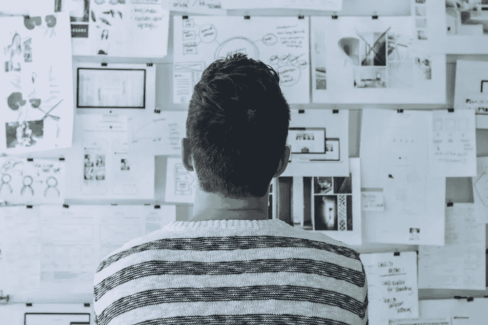
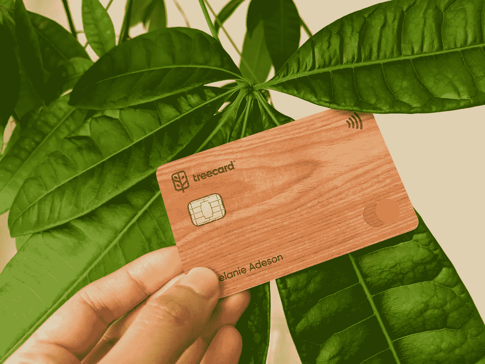
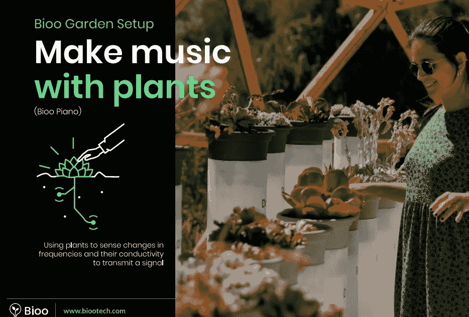
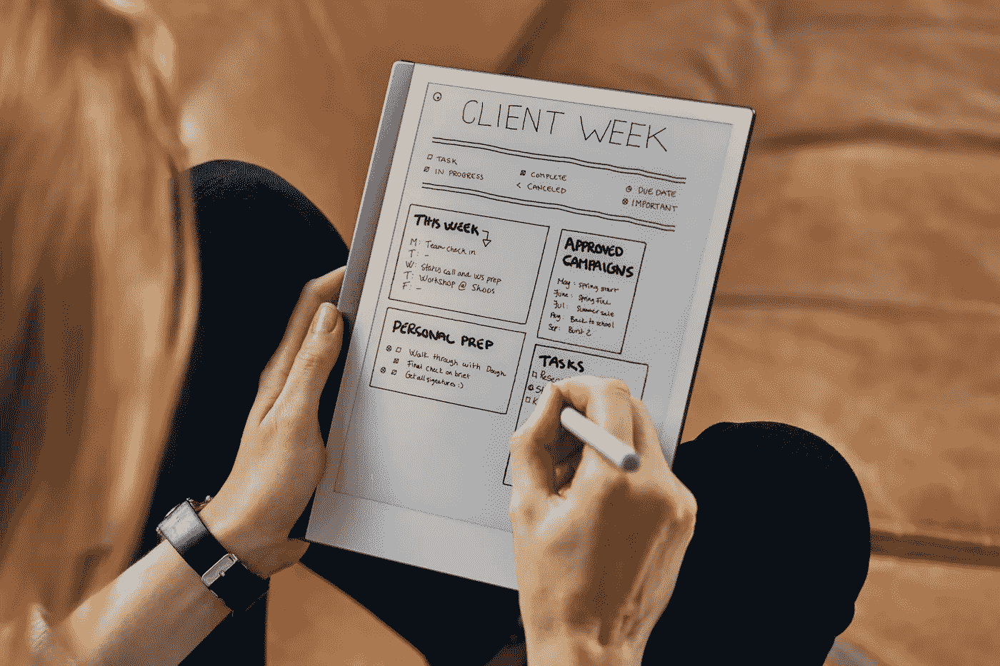
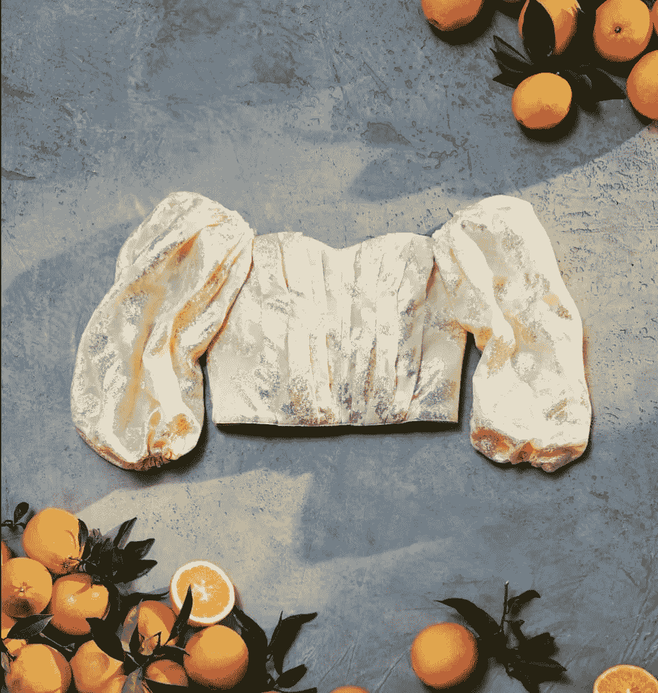
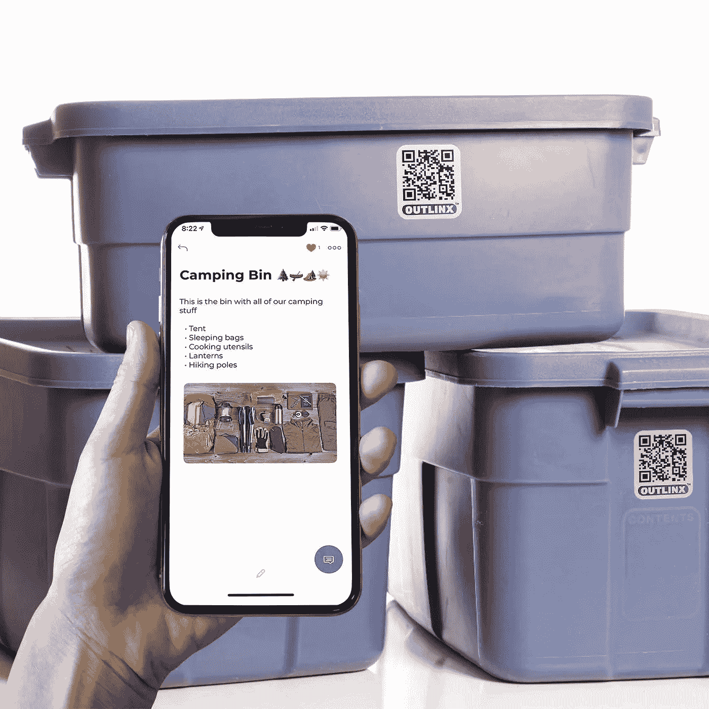
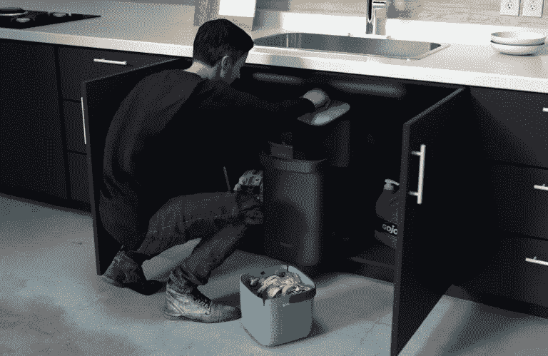

# 7 智能创新将改变我们的未来

> 原文：<https://medium.datadriveninvestor.com/7-smart-innovation-that-will-change-our-future-42020c059ab2?source=collection_archive---------12----------------------->

## 我们都应该知道的创新

Photo by [Startup Stock Photos](https://www.pexels.com/@startup-stock-photos?utm_content=attributionCopyText&utm_medium=referral&utm_source=pexels) from [Pexels](https://www.pexels.com/)

我热衷于研究能够改变我们未来的不同创新。

最近写了一篇关于[电动折叠汽车](https://medium.com/datadriveninvestor/city-transformer-the-first-electric-foldable-car-in-the-world-coming-soon-bae8e4b9000f)的帖子，它将解决人类的问题，并将以电代替石油。所以，我发现了许多这样美丽的创新，它们会以某种方式帮助人类。

这里列出了对人类最有益的 7 项最佳创新。

# **1。TreeCard:世界首张木制借记卡**

Image via producthunt.com

TreeCard 会在你每次付款后种一棵树。它将使用 80%的利润在世界各地的森林恢复项目中植树。

它将很快推出，由对抗气候变化的植树搜索引擎 [Ecosia](https://www.ecosia.org/?c=en) 资助。到目前为止，Ecosia 已经在全世界种植了超过 1 . 19 亿棵树。

该卡对用户是 100%免费的，花 60 美元就可以种一棵树。

> “树木卡”的联合创始人杰米·考克斯说——通过使用你自己的借记卡，你将种植你自己的森林。

一棵树可以制作 30 多万张卡片，而且不会造成塑料污染。树卡可以支持 Apple Pay、Android Pay、Samsung Pay。简而言之，你可以把它当作一张虚拟的借记卡。

他们说，如果他们设法让许多顾客准时到达，每年他们将能够种植 3 . 6 亿棵树。

# 2.生物——来自自然的电

Image via www.biotech.com

Bioo 是一家西班牙初创公司，正在开发由我们脚下的地球提供动力的可再生能源(生物电池)。

电池以封闭面板的形式埋在地下。电池板包含微生物，微生物的活动产生电子和质子，这些电子和质子被发送到电池的阳极和阴极，如果按比例放大，它可能为灯、屏幕或小型电器供电。

他们创造了生活装置。其中，在触摸植物后，你可以激活音乐、灯光、视频和许多其他功能。也许有一天他们可以给我们整个房子供电。

简而言之，他们正在从自然中发电，并将植物转化为生物开关。

**他们最近正在进行许多项目:**

1.  开发世界上第一个家庭公园——植物可以在晚上打开灯。
2.  开发一个活的图书馆——植物在那里储存语音信息，当它们被触摸时，就会以耳语的形式再现出来。[一瞥视频](https://youtu.be/Wq08qRZy_h0)，植物产生音乐。

# 3.引人注目的 2 纸片剂

Image via theverge.com

我最喜欢平板电脑，因为作为一名作家，我能体会在纸上写作的感觉。无论你是学生、员工还是像我一样的作家，记笔记都是一项常见的活动，这款平板电脑给了我们同样的体验。

**几个要点:**

*   显示器看起来像纸，当你在纸上写字或做记号时，听起来就像在纸上一样。
*   手写笔记可以转换成文本，并可轻松用于电子邮件、报告或演示。
*   所有设备都可以访问所有笔记。
*   它有两个星期的电池不用充电。
*   厚度为 0.19 英寸。
*   阅读体验是视觉友好的。

# 4.橙色纤维织物——纺织市场的新绿

Image via orangefiber.it and was sold by H&M Conscious Exclusive in 2019

Orange Fiber 是一家意大利公司，用废弃的柑桔汁生产纺织面料。

根据 2018 年的一份报告，在义大利，几乎[生产了 160 万吨橙子](https://foodcommunitynews.com/oranges-eu-spain/)，而在这 70 万吨橙汁中，剩菜被浪费掉了。因此，时装设计师 Adriana Santanocito 和她的同事找到了一种将柑橘废料转化为高质量丝绸纤维的方法。

这家公司制作了三种原型织物。

1.  白色和黑色蕾丝丝绸。

2.第二种是奶油色的缎子，可以用来做夏装。

3.第三种是类似粘胶的织物，可以用来制作衬衫等日常用品。

# 5.Outlinx QR 智能贴纸—将数字笔记与实物连接起来

Image via outlinx.app

在搬家过程中，从未打开的盒子中寻找物品，并在打包时跟踪你的东西，这可能会令人恼火。

东西混在一起，有时很难找到。让我们用 Outlinx QR 智能贴纸将我们的盒子数字化。

这些是物理标签，可以贴在不同的地方，用智能手机扫描。每个标签——在应用程序上调出一个独特的虚拟记事本，用户可以访问或编辑。

一包 8 张贴纸是给[的 9.50 美元](https://outlinx.app/collections/outlinx-smart-label-books)。

你所要做的就是拍下盒子里的东西，编辑并保存到智能贴纸上，然后贴在盒子上。这样，你的许多杂乱的问题可以很容易地解决。我们可以通过各种方式使用这些智能贴纸:

1.  **整理你的储物盒** —用它来快速记住你在盒子里放了什么。
2.  **保存你的曲奇配方** —在你的曲奇罐上贴上 Outlinx QR 贴纸，写下整个配方，以便每次制作曲奇时记住。这样，当你扫描标签时，任何食谱都很容易被记住。
3.  **告诉客人如何使用你的电器**——用所有需要的说明写下整个过程，并在上面贴上 Outlinx QR 标签。所以你的客人可以毫无问题地使用这些电器。

# 6.CraczyCap——能在 60 秒内消毒水的瓶子

Image via thecracycap.com

许多人无论去哪里都带着自己的水瓶，因为我们都需要干净的水。

这个水瓶是这个问题的完美解决方案。瓶盖使用 UVC 灯在 60 秒内对水进行消毒。该设备有两种模式，一种是净化水龙头或公共喷泉的水——这是正常模式，另一种是净化溪流和池塘的水——这是疯狂模式。

现在，即使是野营者和徒步旅行者也有了更可持续的方式在旅途中补充水分。这样，如果人们开始使用这些瓶子，即使是水瓶浪费也会减少。

**功能:**

*   它能让水 24 小时保持低温，12 小时保持高温。
*   帽子 4 小时后充电。
*   第一代 CrazyCap 瓶装电池仅在自动清洁模式下充电一次可持续 30 天，第二代瓶装电池可持续约 7 天。
*   疯狂上限持续 500，000 水处理或大约 10 年。

# 7.塞普拉——智能垃圾处理器

Image via sepurahome.com

在被倒入下水道后，垃圾填埋场上的食物垃圾量正在一天天增加，因为人们发现从盘子上洗掉食物比把它们刮进垃圾箱更容易。

Sepura 是一个生态友好型处理系统，它将水槽的垃圾处理变成了堆肥系统。

他们让食物垃圾处理变得简单又智能。

**使用 Sepura 的三个简单步骤:**

1.  简单地把你吃剩的食物舀进水槽。你可以扔食物垃圾，比如鳄梨核、骨头、香蕉皮、纸巾等。
2.  打开按钮——固体和液体在几秒钟内被分离成一个无味的密封集合。
3.  清空垃圾箱——在检查显示满度的 LED 灯后。然后把有机物扔进你的堆肥或者路边的收集箱。

# 最后的想法

所有这些聪明的创新如果被更多的人使用，将会给我们的星球带来巨大的变化。因为我们都需要寻找可持续的物品来源，让我们的星球变得绿色。

一步一个脚印会有很大的不同。