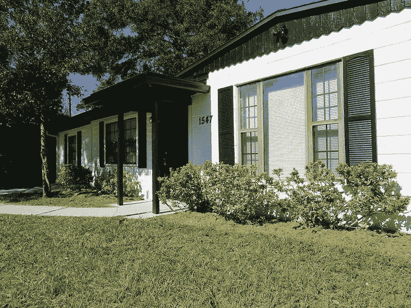

# 为您的下一次 BRRRR 或 flip 准确运行 ARV comps 的 7 个步骤

> 原文：<https://medium.datadriveninvestor.com/7-steps-to-accurately-run-arv-comps-for-your-next-brrrr-or-flip-c14938a751d0?source=collection_archive---------27----------------------->

当考虑使用 BRRRR(购买、修复、租赁、再融资、重复)方法或第一次购买修复后的设备时，试图找出你正在考虑的财产的正确 ARV(修复后价值)可能会令人生畏。因为在考虑是否进行投资时，ARV 是一个非常重要的因素，所以正确地进行分析是非常必要的。你肯定不愿意因为你的 ARV 太低而错过很多机会，或者你追求一项投资却发现你对 ARV 的估计太高。这就是为什么我不依赖任何人，除了我自己或者一个有执照的评估师来计算一个财产的 ARV。在这篇文章中，我将向你展示我自己计算 ARV 的首选方法，这样你在提交报价或传递交易时会感到自信。

# 理解我们的目标

估算 ARV 最重要的部分是使用你的目标物业附近最近出售的可比物业。在确定一处房产的 ARV 时，我们需要使用与我们房产未来的样子类似或*可比的*已售出房产。因此，如果我们的房产有三个卧室、两个浴室和一个车库，我们将搜索具有相同特征的可比房产(comps)。你的目标是得出过去六个月内售出的可比房产的每平方英尺的准确价格。如果绝对没有可比较的销售，那么你可以开始扩大你的搜索范围和/或将销售时间范围扩大到 12 个月。

# 举个例子会让事情更清楚

我将使用一个我们自己的物业的真实例子，这样你们就可以理解了。我将使用 Zillow 作为首选网站，来获取我们进行分析所需的数据。我们的酒店地址是佛罗里达州杰克逊维尔自由大道 8115 号，邮编 32211。[点击这里下载我用公式创建的 excel 电子表格](https://bit.ly/3k0eDlm)，这样你就可以轻松地插入细节并计算出你自己的 ARV。请注意，我提供的 excel 电子表格包含我们截至 2021 年 2 月的数据。众所周知，随着越来越多的房产出售，comps 不断变化。

## 1)打开 excel，在顶部写下房产的详细信息

我们的房产有 3 间卧室，1 间浴室，1064 平方英尺。第一栏是地址，然后是卧室、浴室和平方英尺数。

## 2)在 Zillow 上找到你正在分析的房产

在房产详情页面中，你会看到 Zillow 有一个名为“邻里详情”的部分，显示了房产所在的邻里的名称。关闭酒店详细信息页面，并将小区名称和城市复制/粘贴到 Zillow 的。我们的财产在佛罗里达州杰克逊维尔的林地英亩，所以这就是我们要寻找的。如果您的邻居非常小，您可以单击“移除边界”按钮，让附近的邻居也显示出来。

## 3)选择正确的过滤器

这些是我们在 Zillow 的搜索引擎上选择的过滤器:
。确保选择“已售”作为过滤器
。不要管“价格”
。选择卧室(3)和浴室(1)的数量
。对于“住宅类型”，除了“房屋”
之外，不要选择任何东西。在“更多”下，输入与该房产的平方英尺数最匹配的范围。在这种情况下，它是 1000 到 1250。(如果您没有看到很多结果，并且该房产的平方英尺接近您选择的范围之一，您可以稍微扩大搜索范围。)最后向下滚动并选择“过去 6 个月售出的”下拉菜单。
选择该窗口底部的“完成”。现在，您将看到所有可能成为主题属性的 ARV comp 的属性。

## 4)找到可比较的修复属性

这是最重要的部分之一。这有点耗时，但是使用正确的属性作为复合属性是非常重要的。你不可能得到按照上述标准出售的每一处房产的每平方英尺价格，因为你也可能会与不良房产进行比较。你需要过滤这些属性，找到可比较的。按最新售出的商品来排列你的搜索结果，这样你就可以先看到刚刚售出的商品。如果您计划进行全面修复，那么只选择已经全面修复的酒店。你必须点击每一个出售的列表，快速浏览图片，看看该物业是否已经修复。如果没有恢复，就忽略它。

## 5)将可比较的属性插入到 excel 表格中

对于那些拥有相同数量的卧室、浴室、平方英尺范围的房产，以及与你计划的类似的修复，将它们添加到你的电子表格中。每个属性将在一个新的行，你应该有至少三到四个更准确的 ARV。你也要包括可比房产的售价。在最后一栏中，您将会看到一个非常简单的公式，将售价除以平方英尺数。这将为您提供每平方英尺的价格，每一个可比的财产出售。

## 6)获得每平方英尺的平均价格

是时候做一些简单的数学计算了。把每套房子每平方英尺的价格加起来，然后除以你拥有的房产数量。将每平方英尺的价格加起来，我们得到 360 美元。在这种情况下，我们有 3 个数字样本。将 360 美元除以 3，你会得到每平方英尺的平均价格:120 美元。我们想做的另一个选择是得到每平方英尺的中间价格，这样你就可以得到一个 ARV 的范围，因为分析很少是精确的。

## 7)将每平方英尺的平均价格乘以目标物业的平方英尺数

最后一步！还有一个更简单的等式:每平方英尺的平均价格乘以平方英尺的数量。在我们的例子中，我们将 120 美元乘以 1，064，等于 127，827 美元。如果你想更进一步，那么用每平方英尺的中值价格做同样的计算。在我们的例子中，这是 125 美元乘以 1，064，等于 132，574 美元。我们估计这套独栋住宅的 ARV 价格在 127，827 美元到 132，574 美元之间！

你完了！看起来很简单，对吧？只是需要一点时间来完成它，并执行一些基本的数学运算。但这很重要，因为你想确信你有最准确的 ARV，因为这是你的钱。我希望这篇关于如何轻松计算 ARV 的快速教程对你有所帮助。

## 感谢阅读！

我是艾丽尼斯。我丈夫和我在佛罗里达州杰克逊维尔购置了出租房产，目标是为我们的家庭创造一代财富。[访问我们的简介](https://medium.com/@eleniscamargo)阅读其他关于[我们如何获得我们的投资组合](https://medium.com/makingofamillionaire/how-we-purchased-our-first-3-rental-properties-out-of-state-in-1-year-335c757fd7?source=friends_link&sk=1dfc99c3862c7188de54854279ead091)以及我们如何在外州自我管理的文章。你可以随时问我任何关于出租房产投资或房地产的问题，我会尽我所能回答你。

本文仅用于信息和教育目的。这些信息并不意味着金融、投资或法律建议。虽然提供的信息被认为是准确的，但它可能包含错误或不准确之处。在做出任何和所有投资决定之前，咨询有执照的财务顾问或经纪人。

*最初发表于*[*https://www.biggerpockets.com*](https://www.biggerpockets.com/member-blogs/11360/93756-7-steps-to-accurately-run-arv-comps-for-your-next-brrrr-or-flip)*。*