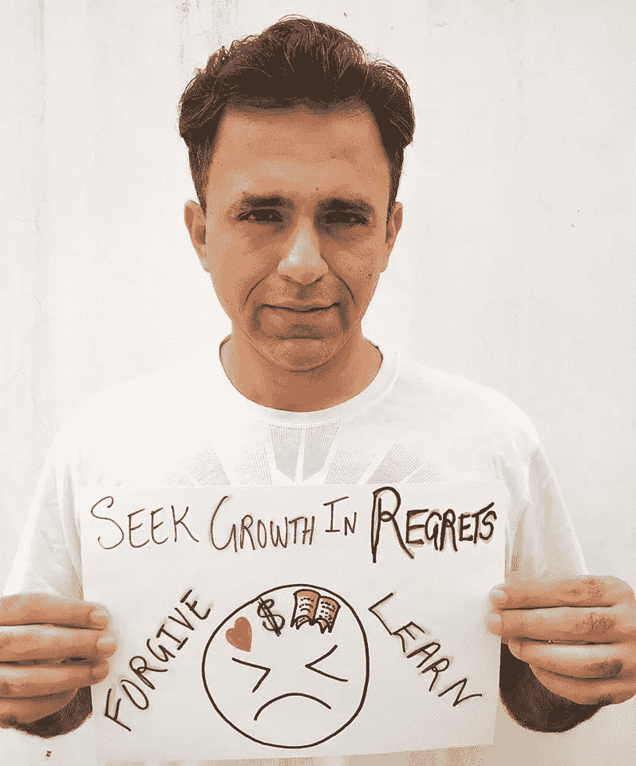

# 从遗憾中获取成长的 7 个步骤

> 原文：<https://medium.datadriveninvestor.com/7-steps-to-extract-growth-from-regrets-729869710ee5?source=collection_archive---------16----------------------->

并且防止后悔阻碍你的飞行道路！

[https://www.facebook.com/photo.php?fbid=10157240915781146&set=a.10153752968771146&type=3&theater](https://www.facebook.com/photo.php?fbid=10157240915781146&set=a.10153752968771146&type=3&theater)

我认为后悔是重温错误的信号，是过去需要进一步检查或纠正的事件。遗憾往往会随着时间而增长，如果得不到解决，会导致巨大的精神和情感压力。

我分享以下 7 个步骤来处理遗憾和寻找个人成长的机会，而不是淹没在过去的哀叹中。

# 第一步:知道什么是后悔

在我们深入探讨之前，让我们先确定遗憾只不过是生于过去的**(一个我们无法控制的时间和地点)，我们选择在现在的* *(一个我们非常能控制的时间和地点)进行并* ***培育它们。****

*遗憾的一个一般类别可能包括，当我们重新审视我们的历史时，没有在个人生活和工作中承担更多风险，没有利用我们赚更多钱的机会，没有追求我们认为对我们更好的关系，没有以我们可以拥有的方式追求知识和教育，或者没有意识到我们不作为或不充分行动的真正机会成本。为了进一步加深遗憾，我们经常把自己和那些做了我们没有做的事情的人或者命运给了他们更好的运气的人相比较。怨恨和嫉妒会催化后悔。*

* [## 良好的生活是习惯的形成|数据驱动的投资者

### 过度思考是过度紧张。仅仅几个简单的习惯就会在一天中产生巨大的影响。那是…

www.datadriveninvestor.com](https://www.datadriveninvestor.com/2020/01/17/a-good-life-is-habit-forming/) 

另一类后悔可能包括做出糟糕和有害的选择，包括在社会上、经济上、情感上甚至身体上伤害他人，或者允许他人以类似的方式伤害我们。

*感慨，不分范畴，因此，成为* ***做出选择的代价*** *，其中包含了不做出选择的选择。*

作为人类，我们会犯错，也会避免犯错。决策是一个复杂的过程，因为它涉及多个变化无常的变量。但是无论我们过去做了什么决定，都是因为我们在特定的时间、特定的环境下获得了特定的信息，产生了对特定风险的感知。我们必须做出决定，我们做到了。

罪恶感、羞耻感、愤怒感、自责感，所有这些都是从我们的选择中产生的。这同样适用于幸福感、自信、成就感、满足感等。确定了后悔是对预测和现实的错误估计，并且依赖于我们的意愿和选择，我们现在可以进入第二步。

# 第二步:什么，什么和为什么

通过回到过去进行自我检查，尽你所能列出发生了什么，后果是什么，以及你为什么后悔。例如，我指导的一个年轻人最近告诉我，他后悔从家乡搬到首都来创业，自那次决定以来，他的生活一直在走下坡路。

他分享了他的反馈如下:

**发生了什么**？3 年前，我从家乡搬到首都，用自己的资金和家人的一些经济支持开办了一家小型零售企业——我妻子和我父母住在一起。

**后果是什么**？生意失败了，婚姻的压力随着与父母的冲突而上升。

**你为什么后悔**？这项冒险的成本跨越了健康、金钱和人际关系。 ***我付出了太大的代价！***

# 第三步:量化遗憾

在 1 到 10 的范围内，10 是你一生中感到最后悔的事，你会把这种情况放在哪里？

他很快就回来了 9！

# 第三步:确认遗憾

我问为什么后悔这么深，年轻人回答说:“我没有把我的一切都奉献给生意，当它开始停滞不前时，我太惭愧了，不能空手而归。我没有准备好，过早地投入进去，迷失了太久。”

在接下来的 10 分钟里，我们的谈话充满了应该、想要和可能。我感同身受地听着，如果我处在他的位置，我也希望别人听我说话。

# 第四步:列出教训

继续第四步，我让这个年轻人列出至少 5 条他所说的从 3 年的折磨中得到的教训。

他的转述清单绝对超出了我的预期:

*   做你的功课，了解当地的商业
*   尽早少花钱，创造性地寻求帮助
*   不要切断你的家庭成员，即使他们不鼓励你冒这个险——他们是在为你着想，并不总是错的
*   学会处理与客户打交道时的情绪
*   学会处理与妻子和父母的关系
*   学会更好地谈判
*   不要和任何人签订口头合同，把一切都写下来
*   不要依赖任何人
*   免费工作 3-6 个月，了解市场如何运作
*   不要在你自己的店里迟到
*   不要买全新的设备，二手的也一样好
*   与房东和供应商保持良好的关系，而不仅仅是中间商
*   保持商店干净
*   不要在手机上玩电子游戏，按时睡觉，按时醒来
*   按时支付员工工资
*   投资安全摄像头和库存管理系统
*   不要在你的下属面前抱怨——这会让你看起来很软弱
*   自己管理库存
*   自己支付水电费
*   亲自向客户进行最终销售

# 第五步:你从这次经历中得到了什么？

他摇摇头说:“我估计这 20 节左右的课吧！”在那一点上，他半笑着，暗示着也许并没有失去一切，有一些意想不到的和非常有价值的知识进入了他的生活。

# 第 6 步:接受并纠正

他承认自己的错误并从错误中吸取教训，这是朝着正确方向迈出的重要一步。他仍然绝望，因为我们刚刚经历了他已经知道的一切，没有人喜欢重温影响当前现实的痛苦记忆。

下一步是探索可以从这种情况中纠正或挽救什么。当他重复了几次“没什么”时，我问他是否还欠谁什么。他想了一会儿说:“非常抱歉，我的父母和妻子，但我不欠任何人的钱。我对家人严厉而固执，有时近乎虐待。这不是借口，而是财务压力太大了。”

另一个建设性的认识是，他有一些个人的，如果不是财务的，松散的结束处理。他同意反思对他所爱的人造成的痛苦，并向他们真诚道歉，提出未来的行动计划，包括他搬回自己的家乡，并立即开始在朋友的工厂工作。

这位年轻人也接受了他可能面临的尴尬——两手空空地回家，所有的工厂员工都知道他在大城市成功的失败尝试。但他也补充道，“我试过了。”

# 第七步:宽恕

我常说，宽恕从来不是“删除过去”，而是“开始你生活的下一段！”这位年轻人对键盘的比喻产生了共鸣，坦率地说:“我已经意识到我过去的许多错误，我应该在精神上和技术上做好更好的准备——如果我可以重来，我会做得更好，但我不能，所以我现在将停止无情地折磨自己——自我惩罚需要结束，否则我会后悔继续活在遗憾中。"

第七步是我发现大多数后悔管理是在我们允许自己再次成长的时候完成的。我们需要这份 self-NOC(无异议证明)来踏上比以前更好的旅程。也许我们最深的遗憾永远不会完全消失，但在适当的时候，通过原谅自己并从过去吸取教训，我们可能会成功地从遗憾中取出众所周知的刺痛，减轻它造成的痛苦，并减少它对我们生活的副作用。*