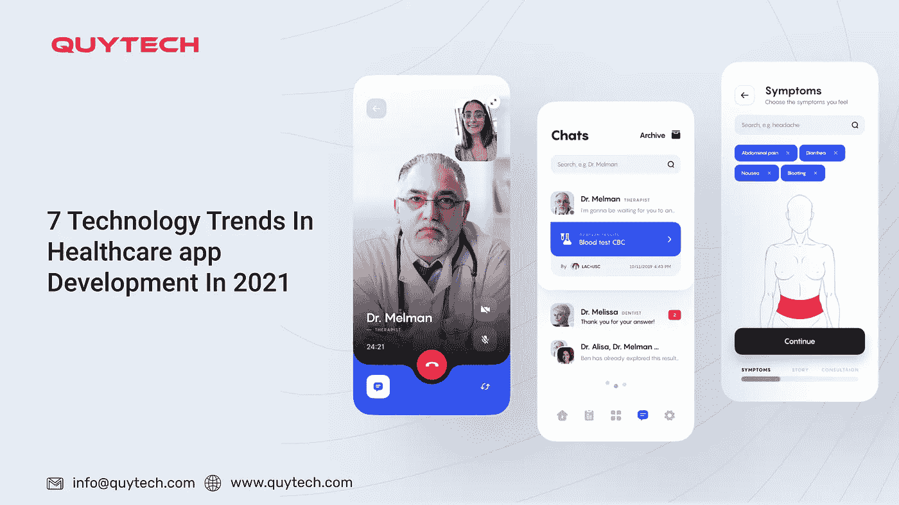
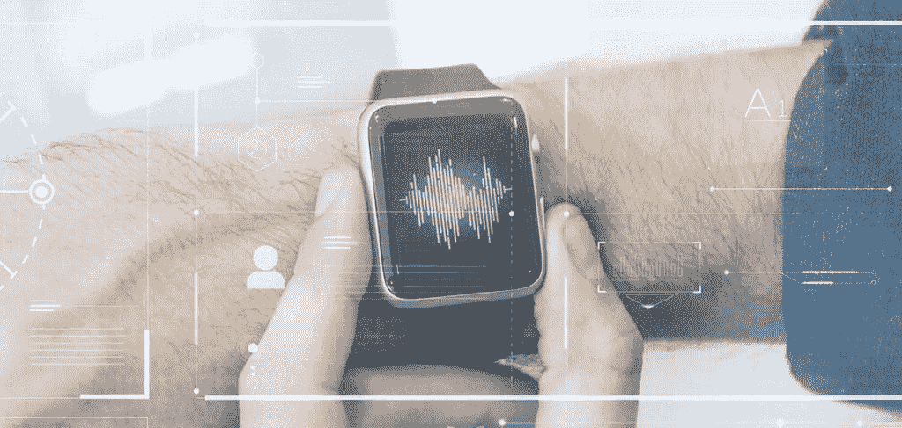

# 2021 年医疗保健应用开发的 7 大技术趋势

> 原文：<https://medium.datadriveninvestor.com/7-technology-trends-in-healthcare-app-development-in-2021-ce1bd2c80a63?source=collection_archive---------15----------------------->

技术日新月异；今天流行的东西可能在几个月后就过时了。因此，必须事先了解即将到来的趋势，通过采用新技术来领先于竞争对手。这些技术变革几乎发生在所有领域，包括医疗保健应用程序开发。是的，随着新技术的出现，医疗保健行业正在经历一场巨大的变革。

那些计划为他们的初创公司开发医疗保健应用程序的人必须格外谨慎，以使他们的应用程序获得期望的受欢迎程度，并提供期望的输出。但是，如果您在创建医疗保健应用程序时考虑以下趋势，那么您可以肯定该应用程序会成功:

1.  **人工智能将成为每个医疗保健应用的一部分**

人工智能或 AI 具有在几秒钟内处理海量数据的潜力。该技术可以从不同来源获取数据，在眨眼之间进行处理，并提供可操作的见解。将这项技术集成到医疗保健应用程序中，将使它们更容易、更快地使用。此外，它还可以帮助提供支持服务，回答患者的健康相关问题。

> *根据埃森哲的报告，到 2021 年，医疗保健领域的人工智能预计将达到 66 亿美元。*

**2。** **区块链的使用**

医疗保健领域的区块链有望成为下一件大事。这一趋势将通过使在线交易快速和安全来提高应用程序的安全性。这将进一步促进医疗账单的在线支付，免去排长队的麻烦。在线支付系统将使整个支付过程既舒适又安全。区块链技术还将确保应用程序上存储的患者数据的安全性。

> *根据国际清算银行的研究，预计到 2025 年，全球医疗保健市场在区块链的支出将达到 56.1 亿美元。*

**3。** **利用大数据**

不可否认，许多医疗保健应用程序仍在使用大数据，但预计它将在 2021 年获得更多关注。该技术可以帮助维护健康记录，提高医疗服务质量，提供预防性护理和许多其他方面。

> *据全球新闻专线报道，预计到 2022 年，医疗保健行业的全球大数据价值将达到 342.7 亿美元。*

**4。** **云计算成为下一件大事**

云计算的出现让所有行业都受到了影响，更不用说医疗保健领域了。在 2021 年，我们希望通过各种托管的按需服务来帮助 it 成为行业的重要组成部分。使用基于云的医疗保健移动应用程序的用户将能够在云上存储他们的健康相关数据，并在任何地方访问这些数据。

> *根据市场与市场报告，医疗保健云计算市场预计到 2025 年将达到 647 亿美元。这个数字在 2020 年是 281 亿美元。*

**5。** **远程医疗将成为获得医疗/保健服务的新方式**

随着越来越多的用户倾向于使用数字平台来获取医疗服务，远程医疗有望成为新的咨询和治疗模式。患者和医生都将从 2021 年的医疗保健应用发展趋势中获得巨大利益。它将消除所有的地理、时间和其他障碍，与医疗保健专业人员联系，并在一天中的任何时间获得咨询。

> *根据《财富商业洞察》,到 2026 年，全球远程医疗市场规模有望达到 2668 亿美元。*

 [## 医疗保健太便宜，无法计量|数据驱动的投资者

### "当世界末日来临时，每个人都将独自购买医疗保健."戴夫“ePatient”德布朗卡特掉了这个…

www.datadriveninvestor.com](https://www.datadriveninvestor.com/2020/11/02/healthcare-too-cheap-to-meter/) 

**6。****AR 和 VR 的兴起**

增强现实和虚拟现实都以提供真实生活体验而闻名。在医疗保健领域，他们可以帮助教育和培训医学实习生如何在不实际在人体上进行的情况下进行各种手术。它还可以帮助中风患者重新获得运动控制。

> *根据 Statista 的预测，到 2028 年，全球医疗保健 AR 和 VR 市场预计将增长到 46.4 亿美元。*

**7。** **可穿戴集成**

集成了可穿戴技术的医疗保健应用程序可以帮助预防各种健康问题的发生，并保持健康。它可以帮助监测和跟踪身体活动。在即将到来的一年，我们预计将看到可穿戴技术在不同医疗保健应用中的大量使用。

> *据知名市场研究公司 IDTechEx 称，可穿戴技术市场预计到 2023 年将达到 1000 亿美元。*

现在，当你知道 2021 年[医疗保健应用程序开发](https://www.quytech.com/solutions-enterprise/healthcare-industry.php)的主要趋势时，创建一个应用程序怎么样？听起来不错？因此，准备一份医疗保健应用想法的列表，并将其中任何想法列入候选名单，以开始医疗应用开发流程。以防万一，如果你没有这样的想法，那就联系一个靠谱的手机 app 开发公司，弄个一样的。确保你选择了正确的公司或雇佣了在医疗保健应用程序开发方面有经验的专业开发人员，让你花的钱物有所值。

**最后的话**

已将一个医疗保健应用创意列入候选名单，并希望继续进行医疗保健应用开发？嗯，这篇文章是你的必读书。在这里，我们提到了将在 2021 年引起[医疗保健应用开发热潮的七大趋势。查看这篇文章，让这些趋势和技术成为您的医疗保健移动应用程序的一部分，以增加其成功的机会。](https://www.quytech.com/healthcare-app-development.php)

**重要的** -考虑到这些趋势并使用最先进的技术来构建一个医疗保健应用程序，联系一家知名且经验丰富的公司或雇佣具有相关经验的专门开发人员。

**访问专家视图—** [**订阅 DDI 英特尔**](https://datadriveninvestor.com/ddi-intel)