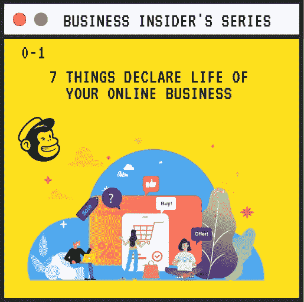
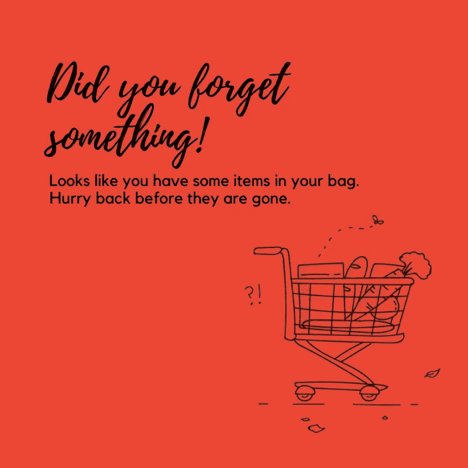
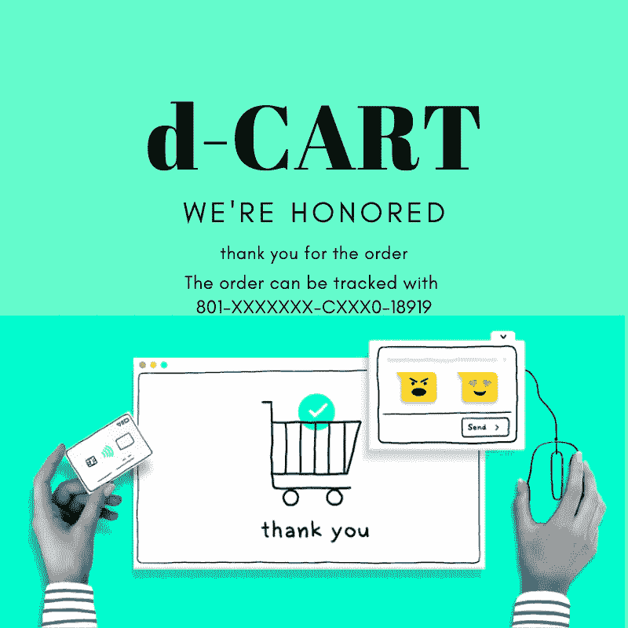

# 7 件事宣告你企业的未来。

> 原文：<https://medium.datadriveninvestor.com/7-things-declare-your-businesss-future-70a8978b21d3?source=collection_archive---------25----------------------->

电子邮件是与客户保持联系的最佳方式之一。我列出了 7 种类型的电子邮件，它们将决定你企业的命运。

这篇文章解释了发送电子邮件的便利性，通过邮件中的特定内容吸引客户，从而提高销售额。

为了提高销售额并在电子商务行业中获得更好的地位，您的企业需要与更广泛的受众建立牢固的关系，并且要以经济高效的方式建立这种关系。自动回复邮件被认为是营销的重要工具。自动化电子邮件可用于实现多种目的，如注册确认、潜在客户培育、销售预警等。如果你的电子商务商店没有使用电子邮件自动化，你就错过了让你的生意更好的大好机会。但是，您是否想知道应该向您的客户发送哪种类型的自动电子邮件？如果是，让我们检查一下您可以用于电子商务的自动电子邮件类型:

Welcome message

**欢迎邮件**
您可以在新用户注册后立即自动向其发送欢迎邮件。确保包括强有力的 CTA，通知他们访问你的网站，在社交媒体平台上关注你或查看你的博客。这将有助于提高品牌认知度和建立跨渠道互动。

**购物车废弃提醒**
说到回收废弃的购物车，提醒邮件是最重要的。在正确的时间发送一系列电子邮件可以增加购物车放弃者注意到你的邮件的机会，并给你一个培养他们的机会。安排一周的购物车恢复电子邮件系列，但确保不要用你的电子邮件轰炸收件箱。使用吸引人的邮件标题来激起收件人的好奇心。给购物车里剩下的商品打折，或者让他们知道库存里只剩下几件商品，制造紧迫感。

**购后跟进**
您可以使用电子邮件自动化进行购后跟进。一定要感谢您的客户购买了产品，并分享货物的跟踪细节。在同一封邮件中，你甚至可以推荐类似的产品。您可以要求您的客户在另一封电子邮件中提供产品的评级和评论。

**追加销售优惠**
自动化电子邮件可用于向您的客户和潜在客户提供追加销售优惠。然而，确保不要在一封邮件中提供太多的产品。对于您现有的客户，您可以将他们之前购买的产品以及一些相关产品包括在内，并以适当的价格组合提供这些产品。

**教育内容**
电子邮件自动化也可用于向消费者提供教育内容。试着为你的顾客提供价值，而不仅仅是试着销售产品。因此，提供对客户有价值的产品的独特信息。

**再次联系电子邮件**
再次联系电子邮件非常有助于提醒你的流失客户他们留在购物车中的产品。您可以根据客户的购买历史发送重新合作提议，因为这样可以提供更好的结果。使用鼓励的语气，让他们采取你想要的行动。或者，你可以尝试最适合你的重新参与电子邮件类型。

**相关更新和信息**
产品等相关更新和信息。可以通过自动发送的电子邮件与
客户分享。你可以通知顾客即将进行的销售、新系列，或者让他们知道下次购物时可以使用的优惠券代码。但是，请确保使用引人注目的语句，如“**新系列**”、“**快速销售**”、“**您的优惠券将于** …”等。把强的**CTA**放在容易看到的地方，这样 **CTR** 增加。

***主题*** *—一个你必须知道的*

*嘿哥们儿，*

你知道 44%的销售人员在一次跟进后就放弃了吗？这让你有机会查看这些潜在客户的收件箱，并进行跟进。如果你想抓住这个机会，一定要让我们知道。

希望能和你一起工作。
感谢
烂作家。(#冰冷的电子邮件-"也会有一篇关于这个的文章。")

我们可以用市场上的许多工具自动完成这 7 件事。因此，我将选择其中一个工具，写一篇文章，介绍如何使用这些工具。所以请关注我，获取关于文章的更新。

# 感谢您阅读这篇文章。随时欢迎反馈。如果你喜欢它，请点击拍手按钮，并分享这篇文章。

可以在[Github](https://github.com/tejamaddimsetty)&[LinkedIn](http://www.linkedin.com/in/tejmaddimsetty)上联系我

[*Tej Maddimsetty*](https://medium.com/@tejmaddimsetty)