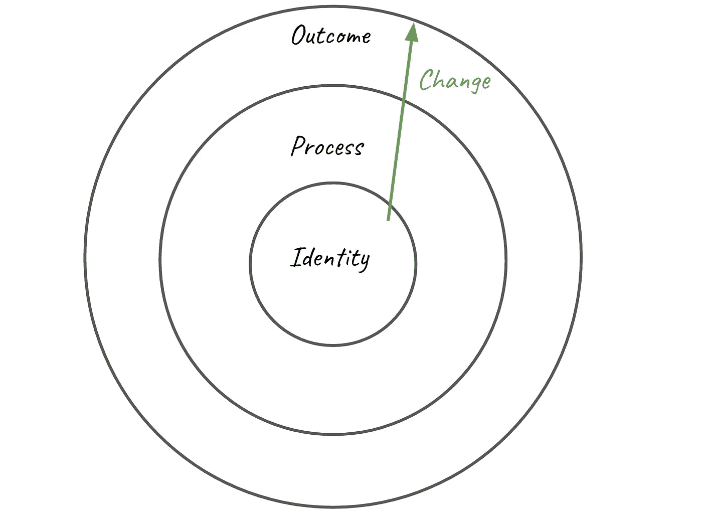
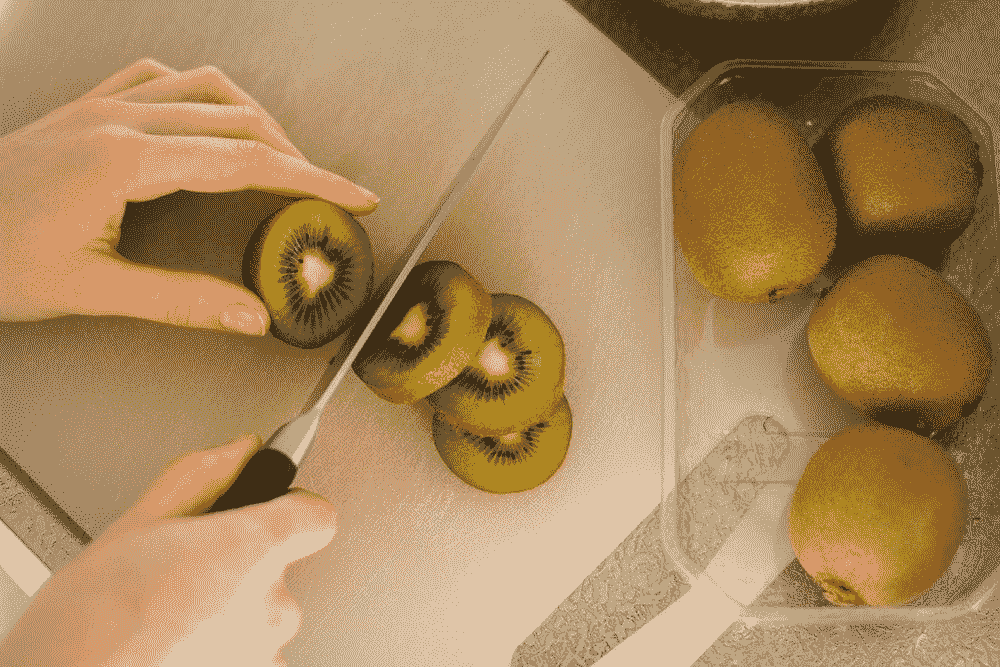
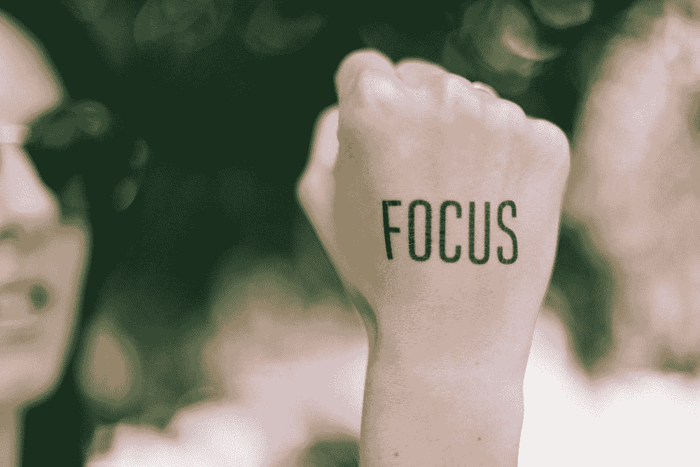
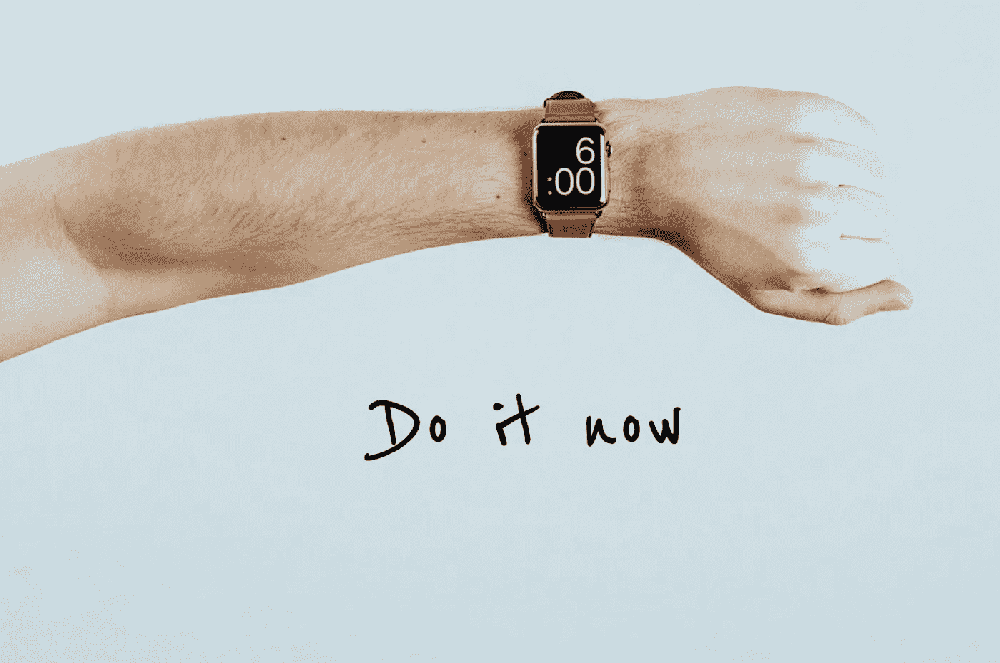

# 高效人士战胜拖延症的 7 条规则

> 原文：<https://medium.datadriveninvestor.com/7-things-everyone-should-do-to-say-bye-to-procrastination-b260dfc5aba3?source=collection_archive---------15----------------------->

## 如何在这个特殊时期用可行的技巧保持高效

我不得不坦白:我对这个叫拖延症的家伙一见钟情。我们十年之久的爱恨情仇仍然没有平息。他并不特别迷人，但我们之间的化学反应非常强烈。我们总是花时间在一起，他希望我全神贯注。它变得有点有毒。我所有的家人和朋友都不喜欢他，希望我们分手。

经过多次心碎和失望，我决定离开他。太棒了！我从未有过如此多的时间来关注对我真正重要的事情。在这篇文章中，我将分享一些我的建议来帮助你，以防你也有这样的关系。

[@kellysikkema](https://unsplash.com/@kellysikkema)

# 1.改变从你的身份开始

这是詹姆斯·克利尔的《原子习惯》一书中解释的一个概念，*。*我们应该努力将我们的行为从【基于结果】转变为【基于身份】。结果是你想要得到的。过程就是你所做的。身份是你所相信的。最强的纪律来自内心，这将帮助你与拖延症分手。这里有一个例子:

*   我喜欢锻炼，因为我是一个积极健康的人。
*   过程:我每周都会进行一系列的健身运动。
*   **结果**:我更健康，更有魅力。

# 2.与其拒绝诱惑，不如避免诱惑

许多事情都让我想起了他:脸书、网飞和随意的 YouTube 视频。当我们关注某件事的时候，欲望就开始出现了。也许这就是为什么他们说爱情就像毒品。一旦尝试就很难抗拒。因此，保持清洁的最好方法就是避免它。

[@sigmund](https://unsplash.com/@sigmund)

一些简单的方法可以做到这一点:

*   **设置屏幕时间**:想想你倾向于在哪些应用上浪费时间，并为这些应用设置时间限制。请其他人保管密码。这里有一个[指南](https://www.commonsensemedia.org/blog/parents-ultimate-guide-to-parental-controls)告诉你如何通过家长控制为不同的设备进行设置。
*   **清理你的工作站**:收起你的手机、iPad、Kindle 等。你应该只把你想要实现的东西放在你的桌子上。
*   只有当你明确打算这样做的时候才放纵自己:这大多是针对我这种自制力不好的人。通常，当我只想看一集的时候，我会狼吞虎咽地看完一集。因此，我尽量只在三种情况下开始表演:(1)当我决定奖励自己一大块放松时间的时候(2)当我可以和有纪律的人一起看表演的时候(3)当我看一个正在进行的表演的时候。

# 3.早上开始你的战斗

拖延是一种控制。他说服我们去追求那些容易的和立即令人满足的东西。有了不好的开始，我们很容易变得更加被动，失去对即时满足的控制。

[@dsmacinnes](https://unsplash.com/@dsmacinnes)

因此，我们需要:

*   限制早上的手机使用量:许多人起床后做的第一件事就是查看手机。不要那样做！有太多的干扰会轻易地让我们偏离最初的计划。即使你能控制自己只浏览一点点，你的大脑仍然会充满不必要的信息，这些信息会在白天突然出现，让你分心。
*   **尽早完成一项重要任务**:做完早上的例行工作后，以一项重要任务开始新的一天是非常有意义的。这将帮助你进入一个富有成效的心态。当你完成这项工作时，你从完成计划中获得的多巴胺会激励你在接下来的一天里取得更大的进步。
*   **计划好你的一天**:最好在开始新的一天时，清楚地知道要做什么以及相应的优先事项。越详细越好。具体说明你什么时候做什么，可能在哪里做。

 [## 在家工作如何提高我的工作效率|数据驱动型投资者

### 在家工作确实激发了我最大的潜能，让我更有效率。因为在家工作给了我…

www.datadriveninvestor.com](https://www.datadriveninvestor.com/2020/07/29/how-working-from-home-increased-my-productivity/) 

# 4.让它轻松开始

当我根本没有开始一项任务时，我通常会拖延。一旦我已经开始取得进步，对我来说取得进步就容易多了。

这就是我们开始如此艰难的原因:

1.  我们没有做的心态。
2.  我们被挑战吓倒了。

以下是我们应对这些挑战的方法:

*   从两分钟的任务开始:例如，你可以从阅读一篇新闻开始，而不是花 30 分钟阅读新闻。一旦你可以开始，继续阅读会容易得多。
*   **前装准备工作**:比如下班后要去健身房。你可以换上你的健身服装，收拾好你的健身器材，这样你一结束工作就可以出发了。这让我们的大脑产生一种错觉，认为我们在开始之前就已经开始做某件事了。

[@yirage](https://unsplash.com/@yirage)

# **5。将最难的部分切成小片**

一般来说，当我们面对具有挑战性、模棱两可和耗时的事情时，我们会很容易不知所措。找出最具挑战性的任务，并把它分成更小的块是很有帮助的，这样可以更快更容易消化。

[@k8_iv](https://unsplash.com/@k8_iv)

例如，当写一篇中型文章时，最困难的部分是起草大纲，因为我想写的主题往往没有完全展开。因此，它有助于将此任务进一步分为:

[1]选择一个主题-> [2]提出几个关于这个主题的方向来研究->[3]研究这些主题并将我的发现总结成论点-> [4]检查我的发现，看看哪些方向值得写-> [5]将总结的论点按逻辑顺序组织在一起

# 6.一次专注于一件事

即使分心是值得的，也尽量不要分心。例如，当我在做一个战略平台时，我的同事发现了我的懈怠。这条信息引导我为她检查测试版本。当我拿出手机做这件事的时候，我发现了一个不相关的 bug，我必须总结出来与 QA 团队分享...这是一个例子，说明当我们陷入未知干扰的兔子洞时，我们是如何容易失去我们最初的思路的。

[@chaseelliottclark](https://unsplash.com/@chaseelliottclark)

相反，如果出现的事情不是非常紧急，就把它写下来或者暂停一下，这样你就可以稍后再来处理它。另一个有效的做法是安排特定的时间来回复邮件。

如果事情很紧急，那就结束你现在正在做的事情。重新安排时间回到这个话题，这样你就可以把注意力集中在紧急的事情上。您将希望尽可能减少上下文切换。

# 7.现在开始

我和他在一起的时候很容易忘记时间(拖延症)。说是 5:47，我看看时间，告诉自己 6:00 开始。然后在 6:00，我正在看一些东西，然后我会告诉自己做 6:30。每当你发现自己不知道什么时候开始做某事，答案总是**现在**。

**如果你正在通过阅读一篇关于拖延的帖子来拖延时间，不要再等了。现在就做！**

remake based on an image from [@mitchures](https://unsplash.com/@mitchures)

## 获得专家观点— [订阅 DDI 英特尔](https://datadriveninvestor.com/ddi-intel)