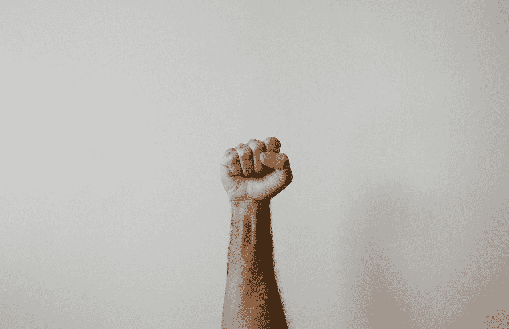

# 你现在就可以开始做的 7 件事，让你以后感到自豪

> 原文：<https://medium.datadriveninvestor.com/7-things-you-can-start-doing-now-to-feel-proud-later-c0a396a7d71e?source=collection_archive---------8----------------------->

Photo by [Clay Banks](https://unsplash.com/@claybanks?utm_source=medium&utm_medium=referral) on [Unsplash](https://unsplash.com?utm_source=medium&utm_medium=referral)

## 这些简单的事情将确保你在未来更加快乐。

我们今天所做的事情为我们未来几天、几周甚至几年的生活定下了基调。一个小小的决定会引起连锁反应，永远改变我们的道路。

持续练习特定的活动可以增加涟漪的强度，并改变我们的生活。

我们在疫情的案例中看到了这一点，一群人的决定扩散到了更大的区域甚至更远的地方。

尽管负面情绪会以更快的速度传播，但正面情绪自然也会产生同样的效果。在这些时候，一种特别的情绪值得提起，那就是骄傲。

现在，你怎么能对最近发生的事情感到自豪呢？

虽然世界上肯定有很多不好的事情在发生——这次疫情，抗议和骚乱，以及最近在黎巴嫩发生的爆炸——但我们仍然可以看到个别的方面。

毕竟，一直沉湎于世界大事的负面情绪不会改变我们自己的生活。总有一天，我们需要把它放在一边，继续我们的生活。

这让我想到了我想与你们分享的这些具体行动。

虽然这些特殊的行为不会让你*感到骄傲，但是*它们肯定会让你*感到骄傲。* [和](https://liberationist.org/why-pride-is-poison-for-your-soul/)是有区别的。骄傲是一种强大的工具，如果你能为自己感到骄傲，这种积极的态度会影响你的生活和你周围的人。

它很小，但我发现最小的行为在我们的生活中扮演着如此重要的角色。

# 开始行动并出现

自从我的私人教练在健身房开业前一个月提出要训练我，我就毫不犹豫地出现在他的住处。现在健身房开放了，我还是一直保持着每周健身三次的常规。

这周标志着我的教练希望我从下周开始每周去四次。毫无疑问，我计划每周去锻炼四次。

所有这些努力都是为了让我从椅子上站起来，开始用我的生活做事。

我越是回顾我的生活，我就越能说没有什么值得我骄傲的。我的写作事业，我对健康的承诺，我赚的钱。这些只是我能看到并说出来的少数几件让我感到自豪的事情。

正是这几件事给我加油，推动我前进，成就更大的事业。

也就是说，我知道其他人和我在同一条船上。也许他们更年轻或更老，但没有什么可以炫耀他们已经建立了多么美好的生活。

不管怎样，重要的是你现在要花时间专注于做事和表现。很多人会想出各种各样的理由——理性的或非理性的——来逃避事情。

人们制定了广泛的计划，或者迷失在永无止境的工作清单中。

人们优先考虑那些不会移动指针的小任务，这样他们会在短时间内自我感觉良好。

我以前也是这样，但是我越是坚持去健身房，看到很少的变化和改善，我就越重视搁置计划，专注于做更多的事情。

计划当然很重要——尤其是如果你正在做一些广泛的事情——然而，更重要的是开始做事情，并投入其中，看看你会做什么。

即使最后失败了，还是有一种自豪感。**你做了一些你原本不会做的事情。这是值得骄傲的事情。**

# 问自己一些问题

提出问题，然后寻找答案是我们这些天来一直在做的事情。无论何时我们有问题——即使是随意的——我们都会谷歌一下，了解更多。

问题是推动我们前进的东西，但还有更深更深刻的问题可以让我们成长更多。

问题是塑造我们自己的现实和我们为自己创造的环境的起点。如果我们想改变它，就要问自己为了改变环境必须做些什么？

我们认为自己的哪一方面是障碍？我们能做些什么来改变我们的生活？

提问是我们为自己感到自豪的一种方式，因为它最终会引导我们找到解决方案。一个解决方案，然后我们可以采取行动，并开始看到我们的生活发生变化。

[提问还有其他好处](https://www.awakenthegreatnesswithin.com/how-asking-questions-can-improve-your-life/)，比如它能让我们思想开放，甚至能让我们面对生活中的艰难处境。

问题可能是痛苦的巨大来源，但它们也是缓解痛苦和增强我们力量的途径。从那里，它可以带领我们到许多伟大的事情。

# 努力建立深刻而有意义的联系

富人给我留下深刻印象的一个方面是他们的整体价值观。虽然肯定有一些可怕的富人，但他们并不代表上层阶级的全部。

当我得知富人不重视更高的收入时，这种期望破灭了。他们最看重的是关系和他们的整个人际网络。

当然，金钱在某种程度上是重要的，富人确实看重这一点，但那些真正渴望金钱的人是例外。大多数情况下，富人不想让别人知道他们很富有。

无论如何，即使你不打算成为一个非常富有的人，为什么不现在就努力在你的生活中拥有那些深刻而有意义的联系呢？

在所有的事情都说过和做过之后，对我们来说世界上最重要的是旅程本身。我们一路走来遇到的人，我们在一起的纽带，以及这些纽带如何指引我们的生活。

没有价格标签的东西:那些才是重要的。

那么，为什么不现在就在我们的生活中形成新的纽带呢？为什么不致力于加强我们与现在的朋友和家人的联系呢？

与我们相处时间最长的人是那些对我们的生活影响最大的人。如果我们在他们身上看到好的一面，看到他们身上有我们想要努力的东西，这些人对我们整个生活的影响就越大。

培养你们之间的联系，因为一切最终都会归结到你认识的人和你交往的人身上。

# 与自己竞争

对自己失去信心的一个快速方法就是把自己和别人比较，不管你在和什么比较。没有人过着和你一样的生活。肯定有一些共同的特点，因为我们都与某些情况有关，但人们在那些情况下结束，并以不同的方式恢复，无论是小的方式还是大的方式。

我并没有进行比较，而是鼓励人们将自己现在的样子与自己想要成为的样子进行比较。我最近一直在通过自己的锻炼来改善我的健康。我想象一个更健康更强壮的自己在某些情况下会做些什么。

尽管我会比和自己比较更进一步:努力让*和自己竞争*。

虽然你并不是在和未来的自己竞争，但现在的你总会有某种心理斗争。像怀疑、消极和缺乏信心这样的事情会在你的脑海中产生声音，促使你停止做你正在做的事情，回到舒适的状态。

舒适是令人愉快的，但过度使用它会导致我们生活的下降。

你所做的是和那种舒适竞争，看看你能在某件事情上走多远。无论是健身还是做一些超出你目前舒适水平的事情。

这让我们为自己感到骄傲，因为我们证明了自己是错的。赢得一场争论会有某种满足感。除此之外，它还能为我们所做的活动创造更多的价值。

# 定义你的身份

这可能看起来很奇怪，但这是我重视的东西，没有多少人提起。那就是，形成你自己的身份和你是谁。

这对我来说是一种骄傲，因为我已经花了几年的时间来组合和调整我想要成为的男人。所有这些都回到问自己问题上。

你代表谁？

你想成为什么样的人？

你看重的品质是什么，为什么？

这一点很重要，因为很多和我年龄相仿或更小的人都不知道他们想做什么。在如此多的例子中，人们被扔进一个他们并没有选择的生活中，并且由于环境而被迫生活在其中。

糟透了。

但是它是可以改变的，而且很大程度上取决于你自己的优先顺序。你一生中想做什么？你的目标是什么？

这种特殊性质的问题可以让我们塑造我们的现实和我们周围的环境。正是这些东西把我们放在自己飞机的驾驶座上，指引我们的方向。这比做一个不知道我们真正要去哪里的乘客要好。

所有这一切都与骄傲有着千丝万缕的联系，那就是我们有能力将自己的生活引向我们选择的方向。我们有足够的理由为此感到自豪，因为我们终于重新掌控了我们的生活和我们正在走的道路。

# 不要放弃，重新调整

自然，我们采取的任何行动都会遇到障碍或失败。我最近在练习按压时经历了这种情况。我发现自己不使用胸部，而是大量使用手臂和肩膀。

到了我不能做那个练习的地步。

然而，我的教练并没有放弃，而是让我做了不同的练习。很快，我就可以毫无问题地做练习了，用我的胸部而不是手臂来做按压。

在我的情况下，我的教练和我把它归因于我不能通过机器使用我的胸部(考虑到我能使用我的胸部做他让我做的运动，加上他也让我做的俯卧撑)。也就是说，每当人们遇到这种停滞点或失败时，他们就会完全停下来。

他们要么回到老习惯，要么停滞不前，不寻求答案或提出问题。

相反——如果你想为自己感到骄傲——努力克服这个障碍。如果有些东西不工作，问问自己问题是什么，你能做些什么来解决这个问题。寻求事物的其他替代和观点。

这个想法是寻找不同的答案，寻找可以用比你最初所想的更新颖的方式来解释的人。这些都为你提供了不同的角度来解决问题并最终克服它。这样，你在面对问题的同时也在成长。

# 反思你的进步

从全局来看，所有这些行动都是微不足道的。在许多情况下，你不会注意到生活中的小变化。但是你继续做得越多，你就会开始注意到这些小变化。

提前注意到它们的一个方法是反思你的进步。这是以后为自己感到骄傲的最终形式，但这需要过去的行动才能奏效。

当我走回我去的健身房的入口时，那里的一位经理问我锻炼的怎么样了。这让我回想起我所取得的进步。

最后，在过去 3 个月左右的训练中，我只减掉了 5 磅。我不认为这是一次失败，因为我已经注意到我生活中的许多小事。

几周前，我的教练注意到我看起来变小了。不像以前那么短，但也不像我以前那么丰满。

我的胸部也开始变平了，虽然只是轻微的。

我背部和二头肌上的肌肉已经开始从锻炼中显露出来。

在健身房之外，我发现做各种各样的活动更容易，而不会大汗淋漓。

这些对我来说都是小小的胜利，也是我为自己迄今为止取得的进步感到自豪的原因。它鼓励我在训练中投入更多，并在健康的各个方面更加努力。

我的健康是一个例子，但我们都有生活中可以反思的各个方面。通过反思，我们看到了一些我们可以做得更好的方法，并从这些经历中成长。

所有这些行为看起来是如此的明显和简单。但是正如我从一开始就提到的，小事情会对我们以后的生活产生重大影响。我们做或不做的每一个决定，无论是大是小，都会对我们以后的人生产生影响。

你越明白这一点，你就越珍惜现在为自己努力，为你已经成为的和以后会成为的人感到骄傲。追求这一目标永远不会太迟。