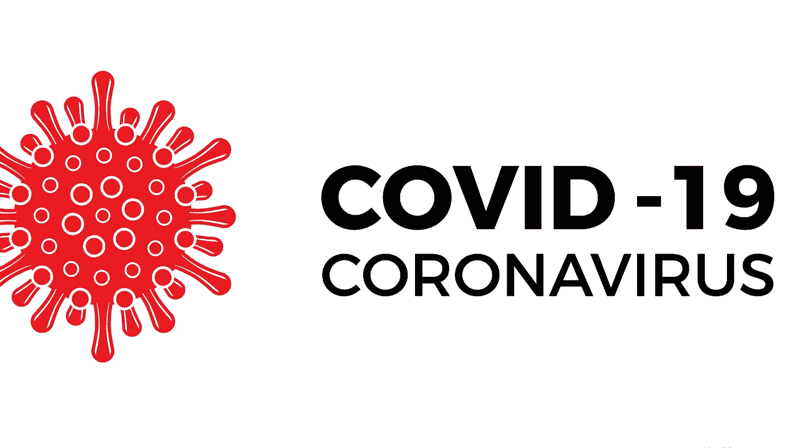
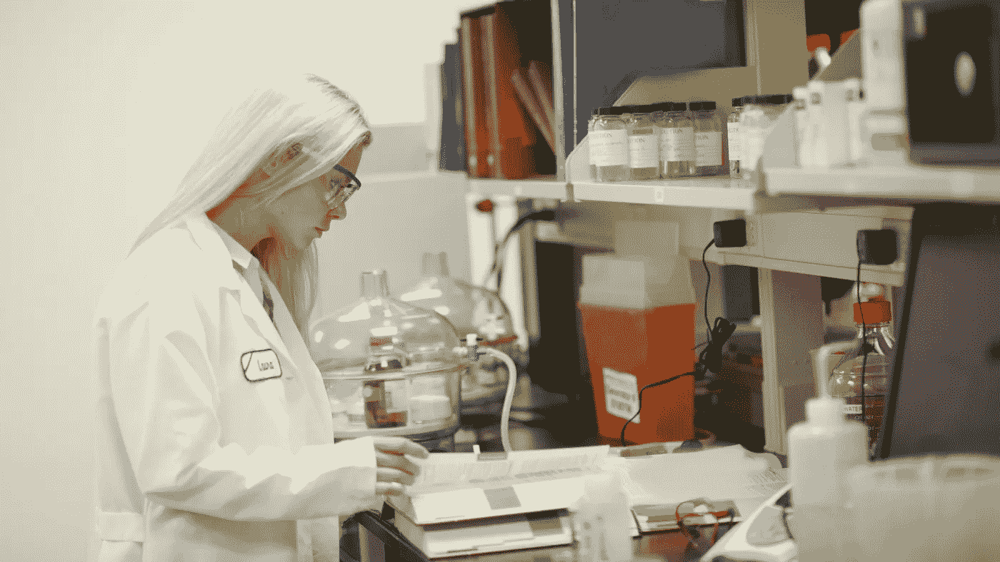

# 2021 年的 7 大趋势

> 原文：<https://medium.datadriveninvestor.com/7-trends-in-2021-6c8e67a84eec?source=collection_archive---------45----------------------->

## 变革之风

## 2020 年来的什么东西留到了 2021 年？

Canva Pro Image

“2020 年是怎样的一年——多么糟糕的一年。”

这是我在 2020 年最后一集播客中的开场白。

我邀请了 13 位在 2020 年内与我交谈过的演讲者，问他们这一年过得如何。

复习需要来年的预演。我们都知道自己要放下什么，要离开过去。

前方的路还没有显露出来。但是做一点猜测和头脑风暴未来会带来什么不会有任何坏处。

在上周的 13 次对话之后，两大趋势将塑造未来 12 个月。

*   数字和
*   健康

作为一个好奇的人，这引起了我的注意，我在网上搜索了下一年即将到来的趋势。

那么我们的神谕建议我们应该关注什么呢？

Canva Pro Image

# COVID 19 之外的世界

它将在 2020 年左右控制社会——毫无疑问。旅行禁令，封锁，cov 白痴——那些相信病毒的人，同时也相信病毒不存在的人。

这个世界被分成了两派，几个月来，一场没有多少情绪，更多关于“寻找科学证据背后的真相”的正常辩论是不可能的。

事实上，坏的一面是，许多已经开始的开发在过去几个月里得到了显著的推动。

不到 9 个月后，第一批候选疫苗被 FDA 和 EMA 批准用于紧急情况，类似于 EMA 的有条件批准。

从来没有一种疫苗或药物以这样的速度被开发出来。

第一批候选人很可能不是最好的，但却是缓解世界上一些政治家焦虑所需要的东西。疫苗意味着我们可以慢慢放松，开始恢复正常。

但我不认为我们会回到 2020 年前的水平。所采取的措施也显示出对减少流感等传染性疾病的巨大积极影响。

SARS Cov 2 的病例较低，但北半球冬季的流感病例似乎明显减少。

**2021 年我们应该保留什么:**

*   **社交距离:**忘记与陌生人的拥抱和握手，享受在商店、餐馆、电影院和每个通常人们聚集的地方与客人之间更大的距离。这有助于避免未来几年流行病的爆发。
*   **卫生:**肥皂和消毒可以消灭病毒。不仅在许多场合应该强制洗手，而且在餐馆、公共交通工具以及每一个用于聚会的地方都应该更经常地清洁。
*   健康的生活方式:我了解到的是，医疗保健系统的问题和 COVID 19 疾病是一个更大问题的症状。欧洲和北美人口的健康状况令人震惊。已经患病的人受这种新型病毒的影响最大，而这些疾病的原因往往是久坐不动的生活方式和不良的饮食习惯。我希望告诉更多的人通过养成正确的饮食和锻炼习惯来改善他们的健康状况。

Canva Pro Image

# 物联网和可穿戴设备

> "我认为大约有五台电脑的世界市场."
> 
> *托马斯·沃森，IBM 总裁，1943 年*

沃森在 1943 年对计算机世界市场规模的预测——嗯，是完全错误的。

一旦人类发现他们可以用计算机在政治和商业上做什么，一些人建议扩展到家庭。

> "没有理由会有人希望家里有一台电脑。"
> 
> *肯·奥尔森，数字设备公司创始人，1977 年*

DEC 是上世纪最大的计算机公司之一，在商业市场方面与 IBM 直接竞争。

DEC 的创始人肯·奥尔森预言，没有人需要在家里有一台电脑。

早在 80 年代，我在学校就从老师那里听到了同样的预测。剩下的就是历史了。

从办公室的一台电脑到每个员工一台电脑，再到一个房子里的另一台电脑，再到房子里每个人一台电脑，再到地球上每个人都有几部智能手机、平板电脑和其他芯片设备。

一个描述半导体、芯片等产品凯旋的长句。

仅仅在 40 年间，世界从一个私人房子里的 0 个芯片变成了一个难以计数的数字。

我的公寓里有电视机、电脑、智能手机和各种电器芯片——我一点也不知道我家有多少芯片。

但这还没有结束。我认为在未来 10 年，将有用的芯片放入任何东西都有很大的潜力。

想象一下[芯片眼镜](https://www.softwaretestinghelp.com/best-augmented-reality-glasses/)可以用于增强现实芯片冰箱，它可以分析冰箱里有什么，并自动订购缺少的食品，以及许多许多更多的想法。

**2021 年可能会发生什么:**

*   可穿戴设备将继续征服市场。
*   **疫苗**在把芯片放在衣服里舒服多了的情况下依然不会植入芯片。此外，升级更容易，只需购买新衣服。
*   **当然，5G 将会推出——猜猜看，为了让 5G 发挥作用，世界各地的半导体公司需要推出什么**

****

**Canva Pro Image**

# **医疗保健、药物开发和预防医学**

> **预防医学不是医生日常工作的一部分，医生的日常工作是分发药物和进行手术。**
> 
> **狄巴克·乔布拉**

**2020 年前，大多数西方人日常生活中不太担心健康。**

**当有一天医生对一个人说，“你生病了”，制药公司提供解决方案。**

**日复一日，和狄巴克·乔布拉描述的一样。**

**这是一个良好的、组织良好的世界，但有一个巨大的缺点，这一点在 2020 年疫情事件中变得很明显。**

## **医疗保健系统存在缺陷。**

**许多欧洲国家为他们一流的医疗保健系统感到自豪。至少我们欧洲人是这么认为的。**

**疫情很快表明，不是这样——软件和数据基础设施已经非常过时了。在疫情收集数据具有挑战性，因为一些人仍然使用旧传真机。**

**几个月前，在奥地利，电话号码 1450 是为那些想通过电话与医生交谈的人发明的。然而，随着许多人在疫情期间被隔离，该系统显示出了它的弱点——一个仅用于音频的电话。**

**使用上世纪 80 年代的设备和流程的支离破碎的非集成数据基础架构不胜枚举。**

## **药物开发**

**在过去的 100 年里，开发新疗法、医疗设备和疫苗是一个漫长的过程。**

**给病人带来一种新疗法至少花了 15 年时间。2020 年展示了制药行业训练有素的力量，有充足的燃料——资本和金钱。**

**仅用了 9 个月，一种疫苗就被带到了病人面前。是的，mRNA 疫苗并不新鲜，研究已超过 25 年，然而，在 9 个月内完成所有临床试验，包括生产和批准，仍然令人印象深刻。好吧，紧急使用和有条件批准，但仍然。**

**我相信，在 2021 年及以后，该行业的知识仍将存在。**

**与此同时，我了解到许多以前对药物开发投资、医疗设备、诊断或数字健康不感兴趣的投资者现在看到了慈善收益。**

**在这种情况下，投资不仅仅是赚钱的手段，更是一种可选的社会责任。**

## **预防医学**

**你知道 25%的德国人口和高达 40%的美国人口已经患有疾病，这是新型冠状病毒感染的主要问题之一吗？**

**大多数严重和致命的病例是在已经患病的人群中观察到的。**

**我的观点是，大多数潜在的健康问题是我们西方生活方式的结果。**

**久坐不动、含有许多化学添加剂的工业食品、酒精、吸烟和药物在过去几十年里毁坏了我们的身体。**

**从统计数据来看，那些生活方式健康的人似乎有更高的预期寿命和更健康的寿命。**

**每个患过像真正的流感这样的严重疾病的人都知道那些健康的日子有多宝贵。真正的流感与其他绝症相比仍然是一件小事，但对一些人来说也是非常严重的。**

**给疾病排序很有挑战性，因为每个人都知道生病在任何情况下都很糟糕。**

**围绕疫情的公开讨论也开启了更大规模的预防医学对话。**

**改善医疗保健系统，以现金形式向制药行业注入更多燃料，并教导人们如何过健康的生活方式，这些都有望与我们同在。**

****2021 年可能会发生什么:****

*   ****世界范围内的医疗保健系统**似乎人手不足，并且使用上个世纪的技术——嗯，这有点夸张，但却是事实。其影响可能是医疗保健领域创造了更多的就业机会，政府投入更多的税收来改善结构性问题。**
*   ****新药和诊断的开发**:新的慈善投资者开始进入这个行业。有些人会成功，很可能会重新投资。它应该会推动更多的资金进入上市前投资市场，并为希望为医疗运动做出贡献的散户投资者提供 IPO 渠道。**
*   **预防医学:我还认为，政治不能忽视这样一个事实，即许多病毒性疾病对已有疾病的人来说是一种负担，使他们更容易感染像新型冠状病毒这样的病毒。还有，我朋友圈子里的很多人已经开始改变他们的生活方式了。在股票市场上，像 Hellofresh 这样的公司在 2020 年开始蓬勃发展。**

****

**Canva Pro Image**

# **电子商务取代了小商店**

> **我们的愿景是成为地球上最以客户为中心的公司；建立一个地方，让人们可以找到并发现他们可能想在网上购买的任何东西。**
> 
> **杰夫·贝索斯——亚马逊愿景声明**

**1994 年，一个年轻人开始着手改变世界，旧经济的首席执行官们笑着贬低他。**

**这个人就是杰夫·贝索斯，2020 年，他是地球上最富有的人。**

**让他成功的是他对以客户为中心的执着。在他的新书中，他描述了亚马逊正在网上销售产品；它帮助客户做出更好的购买决策。**

**有一点是肯定的——他的方法改变了世界。**

**2020 年是把小麦从谷壳中分离出来的一年。**

**由于疫情，许多国家实施了严格的封锁措施。人们不得不呆在家里。除了杂货店和药店，所有的商店都关门了。**

**但是生活还要继续。衣服穿破了，鞋子散架了，孩子们想要娱乐，家具坏掉了。**

**人们不得不买东西，感谢上帝，许多国家的政府没有停止物流。**

**那么人们做了什么？他们上网购买他们需要的一切。**

**我的网上购物行为主要是围绕购买 PS4 的电子书和游戏进行的。**

**自从我搬出父母的房子后，我就养成了周六购物的习惯。**

**那时，我和我的搭档在那些寒冷、黑暗、灰暗的周六购买我们冬天需要的所有东西。事情从早上在餐馆吃了一顿美味的早餐开始，她去买衣服，我调查最新的科技发明。**

**我们吃了一顿交流午餐，下午继续购物。通常，这一天是以晚上看电影结束的，之后，我们回家看我们的猫。**

**真正保守的中产阶级冬季生活方式。**

**我珍惜这个习惯，直到疫情来了。第一个周末，我什么也没买，但正如我所描述的，东西开始散架，需要更换。**

**一步一步，我知道了网上购物比现实生活中购物要好得多。**

**老实说，如果没有疫情和它的封锁，我可能不会发现这种新的自由。**

**这就是为什么我认为电子商务还没有达到顶峰；这才刚刚开始。**

** [## 取代你的风投？企业家的 5 条原则|数据驱动的投资者

### 在 Tau Ventures，我们建议所有企业家将融资过程中的勤奋过程视为双向的…

www.datadriveninvestor.com](https://www.datadriveninvestor.com/2020/11/29/replacing-your-vc-5-principles-for-entrepreneurs/) 

**为什么网购很棒，而且有机会留下来？**

*   **时间:**节省了一整天的时间，否则你就要在交通堵塞时坐在车里，在付款处排队，从一家商店开车到另一家商店，等等。
*   **在线时间:**列清单、采购、购物只需 15 分钟，而不是 8 个小时。几天后，货物到达。
*   社交:我度过了一个愉快的家庭购物周末，但老实说，自从疫情之后——做点别的不是更好吗？和孩子一起去动物园，散步，或者开车去湖边游泳？
*   随着年龄的增长，我发现了超出当地商店商品范围的需求。想想我 2020 年的播客项目——麦克风、相机和环形灯是我想象不到能在奥地利维也纳买到的东西。

网上购物刚刚开始，疫情为顾客打开了大门。

Canva Pro Image

# 博彩业

> 玩电脑游戏的孩子会成为社交障碍者和孤独者。
> 
> 奥地利学校教师，1984 年

80 年代的老师对看电视和电脑游戏的看法非常负面。

大多数最近的研究显示了电脑游戏利弊的更加多样化的图景。

虽然有些可能会因为展示的暴力而产生不良影响，但其他可能会对孩子的生活产生积极影响。

积极的因素包括

*   提高解决问题的技能
*   计算机文化
*   集中注意力
*   教育
*   语言技能
*   和许多其他人

[市场调查](https://newzoo.com/insights/articles/newzoo-games-market-numbers-revenues-and-audience-2020-2023/)显示，全球 27 亿游戏玩家将在电脑游戏上花费约 1600 亿美元。

世界上有 27 亿人每月至少玩一次游戏。

市场仍将继续增长。特许经营者也在学习通过寻找更多的方式来销售游戏中的物品，从而更好地为顾客服务。

随着玩家数量的增长，这个社区正在变得更有组织性。

游戏已经成为一种职业。当我每周玩几个小时，没有真正的职业机会时，在 2020 年，游戏玩家可以赚到真正的钱。

怎么会？

一件事是赞助——就像忍者的红牛交易——其他的是通过 Twitch，YouTube 视频和抖音视频。

所有这些渠道都为创作者建立了商业模式。

根据《福布斯》的一篇文章，2019 年收入最高的十大游戏玩家的收入为 1.2 亿美元，其中《忍者》的收入达到了惊人的 1700 万美元。

疫情无疑让这个行业飞速发展——更多的流量，更多的游戏购买——我的意思是，如果我 20 多岁，被关起来，我会跑——游戏睡觉——重复。

【2021 年会带来什么？

*   游戏是比电影产业更大的娱乐产业。2018 年电影业的数字为 1360 亿美元，2019 年游戏业约为 160 亿美元。
*   随着孩子们年龄的增长，游戏仍在增长；他们玩游戏的时间少了，但购物的钱多了，有些人已经开始从游戏中赚钱了。因此，他们需要进行再投资，以保持收入流的流动。
*   像腾讯、索尼或艺电这样的行业巨头将需要生产更多的内容，创造更多的销售额。
*   电子竞技会让这个行业变得更加有趣。

Canva Pro Image

# 数字支付—加密

> 我认为比特币最终将成为银行的储备货币，扮演着与黄金在银行业早期扮演的角色大致相同的角色。银行可以发行更匿名、重量更轻、交易效率更高的数字现金。
> 
> 哈尔·芬尼

我在最近一篇关于[比特币](https://medium.com/datadriveninvestor/bitcoin-quo-vadis-a011949988e8)的文章中讨论了这样一个理论。

住在奥地利，我体验了数字支付故事的另一面。当我们放弃获得现金的权利时，许多人害怕民主的终结和独裁的开始。

嗯，也许这是为什么这么多人靠薪水生活的一个解释。

据我所知，大多数百万富翁和亿万富翁在所有与现金相关的交易中都已经转向了 99，999，999，999%的数字。

或者有人相信最富有的人会像史高治·麦克老鸭(或德国版迪士尼唐老鸭世界中的达戈伯特鸭)那样把钱藏在钱柜里吗？

当然不是。在我们这个时代，由于互联网，合法赚钱是如此容易，以至于拥有大量的实物现金是荒谬的。

最富有的人持有的唯一现金是用于小额交易，比如在仍不接受数字支付的酒吧里买一杯饮料。

在疫情，几乎所有的商店都转而接受数字支付方式。

我的 apple watch 上存储了所有信用卡，并授权所有日常小额交易。

**数字现金有很多优点:**

*   它不会丢失的。
*   如果它被盗，有人闯入了银行的数字基础设施，并可能投保了此类案件。
*   监控自己的花费是快速、简单和容易的。
*   这意味着跟踪财务状况不是一天一小时的工作。
*   此外，如今监控预算经常被集成到在线银行账户中，当达到一定水平时会自动发出警报。

我仍然在谈论法定货币——政府发行的官方货币。

自 2009 年以来，基于区块链的加密货币一直在增长。它最突出的代表仍然是比特币。

该理论认为比特币可以做两件事:

*   取代黄金保存财富
*   取代美元成为世界储备货币

这两种理论对我来说都有意义。每一代人都想与上一代人不同。由于第二次世界大战以来的和平时期，西方世界积累了财富。

在美国，自美国内战以来，美国本土上还没有更大规模的战争。因此，这个国家还有 3-4 代人来积累财富。

许多千禧一代和 GenZ 生来富有，并学会了管理他们的处境。

他们应该如何表明自己不同于他们的父母和祖父母——嗯，X 世代和婴儿潮一代？

一种可能是购买比特币，而不是黄金。

一旦这一代人掌握了权力——这无论如何都会在未来二十年内发生——这种思想将会传播到政府决策中。

默默地同意比特币作为储备货币似乎是一个可行的方案。

我读过的最新的 BTC 房价预测是 20-30 万/BTC。

无论如何，数字货币革命已经到来，并将继续下去。

**2021 年可能会发生什么:**

*   由于在疫情期间的学习，更多的人将采用数字支付。
*   比特币至少会被确立为一种商品。
*   BTC 很有机会成为数字黄金和世界储备货币
*   支付公司的价值可能会增加。

Canva Pro Image

# 内政部将会继续存在。

> 我穿着浴袍坐在家里的办公室里。同样，我也不会开始打领带，我也不会接受虚伪的礼貌、谎言、办公室政治和暗箭伤人、消极的攻击性和流行词汇。
> 
> **莱纳斯·托沃兹**

自 2006 年以来，我很高兴大部分时间都在家工作。当我开会时，我会跑到与我有关的公司的办公室。

但是我大部分的工作都是在我的公寓里完成的。

女士们先生们，这是一次大摇滚。

作为战略顾问、执行官、顾问委员会成员或投资者，我的工作涉及很多思考。

很抱歉这么说——因为我认为我每天需要独处几个小时。

我确实喜欢与人交往，但我已经成长为一个专注的人。

我的会议主要集中在几个话题上——没有多少闲聊。

就像加里·维纳查克说的:

> [停止 14 分钟的会议一小时](https://www.facebook.com/watch/?v=294229154852033)

家庭办公室有助于加强这种趋势，将重点放在快速会议而不是大规模聚会上。

我的群众集会通常是会议——不幸的是，这在 2020 年是不可能的。

此外，会议数字化了，人们确实看到了优势。我们可以参加更多的会议，以更少的差旅费用在 30 分钟的有意义的会议中同时会见更多的人。

然而，我们仍然需要不时地见面。这是我们的人性。

2020 年给了家庭办公室趋势必要的推动力，促使人们坚持他们的信仰和思维模式。

他们认识到把家庭办公室和真正的办公室混合在一起是多么有益。这可能并不适用于每一种职业，但对于许多在家安静地进行思考工作的上班族来说，每周去办公室开一次会是一个可行的选择。

**2021 年可能会发生什么:**

*   整个工作生活将发生转变，并在移动家庭办公室和办公文具办公室之间进行大规模区分
*   公寓会更大，有独立的办公室和会议室，有摄像头、环形灯和专业音响设备。
*   传统办公室将缩小规模，增加会议空间和口语会议空间。
*   对我们这些办公室英雄来说，工作生活变得虚拟化了。** 

**以上是我对 2021 年的假设和预测。让我在这篇文章的评论里听到你的。**

> **我祝愿我所有的读者节日快乐，2021 年有一个好的开始——祝你们所有人健康、富有、成功和繁荣。**

**自 1999 年以来，我是各行各业公司的执行官、顾问和教练。我专攻企业发展和金融，从种子轮到 IPO 级别，从 2006 年开始专注于生命科学。**

**[**加入我的邮件列表保持联系！**](https://mailchi.mp/5a50875fb5ea/newsletter)**

***本文仅供参考。不应将其视为财务或法律建议。在做任何重大财务决定之前，先咨询财务专家。***

# **读者:**

** [## 2020 年技术趋势|德勤洞察

### 新的突破预示着情感智能界面和超直觉认知能力。我们能不能…

www2.deloitte.com](https://www2.deloitte.com/us/en/insights/focus/tech-trends.html)  [## 理事会邮报:2021 年值得关注的五大技术趋势

### 亚历克斯是 Luminar AI 团队的首席执行官，该团队是面向传播者和创意的下一代图像编辑器

www.forbes.com](https://www.forbes.com/sites/forbestechcouncil/2020/11/30/five-technology-trends-to-watch-for-in-2021/?sh=651fde85c3b4)  [## 2021 年电子商务未来的 5 个趋势

### 观看概述商业的新常态是什么？在 2021 年及以后，你能做些什么来茁壮成长呢？我们采访了…

www.shopify.com](https://www.shopify.com/enterprise/the-future-of-ecommerce)  [## 数字领袖基金(DLF)

### 在日冕大流行的影响下，基督教徒开始了新的生活。朗森·斯坦普芬…

thedlf.de](https://thedlf.de/welt-nach-der-corona-pandemie/)  [## 2021 年电子商务未来的 5 个趋势

### 观看概述。商业的新常态是什么？在 2021 年及以后，你能做些什么来茁壮成长呢？我们采访了…

www.shopify.com](https://www.shopify.com/enterprise/the-future-of-ecommerce)  [## 找不到文章！

### 编辑描述

www.inc.com](https://www.inc.com/anis-uzzaman/top-business-technology-trends-in-2021.html) 

[https://www . PC world . com/article/155984/worst _ tech _ predictions . html](https://www.pcworld.com/article/155984/worst_tech_predictions.html)

[https://www . FAZ . net/aktuell/wirtschaft/corona-warum-deutschlands-gesundheitsaemter-am-limit-sind-17097874 . html](https://www.faz.net/aktuell/wirtschaft/corona-warum-deutschlands-gesundheitsaemter-am-limit-sind-17097874.html)

 [## 亚马逊使命、愿景和价值观

### 亚马逊的使命、愿景和价值观。使命宣言:“亚马逊遵循四个原则:顾客至上…

www.comparably.com](https://www.comparably.com/companies/amazon/mission)  [## 探究顾客购买决定背后的原因

### 让亚马逊的产品发现算法更令人满意的一个方法是确保我们匹配高质量的产品…

www .亚马逊科学](https://www.amazon.science/blog/exploring-the-reasons-behind-customer-purchase-decisions)  [## 法定货币

### 法定货币是一种货币(交换媒介),通常由政府监管，它不…

en.wikipedia.org](https://en.wikipedia.org/wiki/Fiat_money)  [## 2021 年值得关注的 6 大比特币价格预测

### 毫无疑问，你是“为了技术”，这是最受欢迎和最热门的话题，尤其是…

cointelegraph.com](https://cointelegraph.com/news/top-6-bitcoin-price-predictions-to-watch-in-2021)  [## 18 大家庭办公室名言| A-Z 名言

### 享受我们的家庭办公室报价收集。我们成千上万的用户选出的最佳家庭办公室报价！

www.azquotes.com](https://www.azquotes.com/quotes/topics/home-office.html) 

**访问专家视图—** [**订阅 DDI 英特尔**](https://datadriveninvestor.com/ddi-intel)**