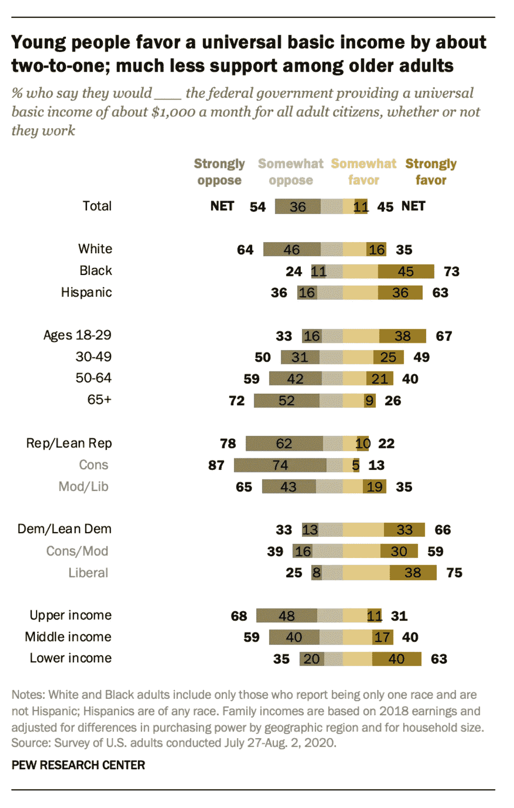

# 来自全球的 7 个普遍基本收入计划

> 原文：<https://medium.datadriveninvestor.com/7-universal-basic-income-programs-from-around-the-globe-cda54175461e?source=collection_archive---------5----------------------->

UBI——普遍基本收入——项目不像 stablecoins 和 DeFi 那样热门，但有越来越多的 UBI 试点项目在世界各地如雨后春笋般涌现。我注意到试点进入实施阶段，也注意到针对一小部分人口推出的 UBI 项目，现在已经增长了数倍。

大多数人都知道瑞典的实验，但并不被认为是一个巨大的成功。从经验和学术角度来看，价值观和文化很重要，因为它们塑造了对自我价值、目标和附加值的认知。与此同时，我们生活在一个价值观正在转变的时代。

我将带你环游世界，并重点介绍一些已经推出的 UBI 计划。首先也是最重要的，阿拉斯加州是自 1980 年以来“成功”运行 UBI 的州，它向每个公民支付从几百美元到几千美元(最近)不等的金额。付款取决于阿拉斯加永久基金的储备(来自石油收入)。衡量成功的标准是贫困的减轻，尤其是土著人口的贫困减轻，以及儿童健康水平的提高。

在美国，UBI 是前民主党总统候选人**杨安泽**竞选的核心主题。皮尤研究中心(PEW Research center)最近在 T4 进行的一项调查显示，54%的人反对，46%的人支持美国每个成年人 1000 美元的 UBI。然而，年轻人对这种 UBI 的青睐比例约为二比一。

COVID 促成了美国当地的小型 UBI 项目，如由旧金山市长发起的项目。他已经为艺术家、文化工作者和教师拨款 600 万美元，他们将在 2021 年获得至少 6 个月每月 1000 美元的津贴。详情见[此处](https://www.artforum.com/news/san-francisco-institutes-universal-basic-income-pilot-program-for-artists-84232)

Twitter 和 Square 的首席执行官杰克·多西正在资助一项 300 万美元的 UBI 实验，由美国 15 个城市的市长参与。

 [## 我们准备好接受全民基本收入了吗？数据驱动的投资者

### 普遍基本收入的想法正在世界各地加快步伐，但我们准备好了吗？你想要一个…

www.datadriveninvestor.com](https://www.datadriveninvestor.com/2019/09/16/are-we-ready-for-a-universal-basic-income/) 

**西班牙和丹麦**已经在疫情期间实施了临时 UBIs。苏格兰已经加快步伐，布莱顿正处于试验阶段。

**印度**正在认真讨论 UBI。

而韩国的发展速度非常快。他们在京畿道开始了一个有 20 万公民的小规模普及基础教育计划，在疫情期间，他们将其扩大到 1300 万公民。这些钱通过信用卡发放，并且只能在当地商店消费(在其他社区没有国际连锁店或商店)。他们也一直在分析汇总的匿名数据，以相应地调整程序。他们的目标是刺激当地经济和小企业。直到该计划的成功是非常积极的。韩国已经是一个自动化水平非常高的国家，来自那里的任何数据对于理解实施 UBI 项目时出现的问题都是有价值的。

 [## 韩国的全民基本收入实验以提振经济

### 10/9/2020 早上 6:13 为了刺激受疫情病毒打击的经济，南韩的一个省已经在试验通用…

www.wsj.com](https://www.wsj.com/video/south-koreas-universal-basic-income-experiment-to-boost-the-economy/80B60141-6AF5-4CB3-9F97-4101B5128A4B.html) 

正如埃隆·马斯克在 2017 年讨论的那样，自动化将创造失业，UBI 将成为必需品。当一个人失业时，挑战将是围绕自我价值和目标的社会问题。

> ***试验和创造适合不同社会的 UBI 计划的唯一方法是部署可编程货币。***

然而，我们将不得不处理人们移居到有更好 UBI 计划的国家的问题，就像人们移居到有更好工作机会的国家一样。

我发现有两个新的举措正在试验加密货币，即钱包和 UBI。这些都不是政府主导的。

**Circles，**power stable coin USDC，每个月将空投 240 个 CRC 代币到你的 [Circles](https://joincircles.net/) 钱包里。Circles 钱包是新的，你需要得到已经在网络中的三个用户的邀请。CRC 令牌只能用于在 Circles 社区内交换产品和服务。因此，这是一个在本地数字社区中使用的 UBI。

社交交易平台 EToro 宣布了一项由 DeFi 支持的 UBI 计划。名为 [GoodDollar](https://www.gooddollar.org/) 的 OpenUBI 项目将使用自己的 stablecoin $G(由$DAI 支持)运行。EToro 已经向 GoodDollar 捐赠了价值 100 万美元的资金，并邀请其他人捐赠。这个非盈利项目将使用 DeFi 产出农业，然后将部分利息返还给支持者，并用于发行新的$G 代币用于 UBI 支付。

该项目正在试验中。在像南非、尼日利亚和委内瑞拉这样的国家，成千上万的钱包被创造出来，等待着 G 美元的代币。前两周已经投放了 100，000 $G 代币。

📌**网页:**【https://efipylarinou.com/】T2

📌订阅我的 **YouTube 频道**，了解我的见解和行业领袖访谈。**每周三新视频:**[https://www.youtube.com/EfiPylarinou](https://www.youtube.com/EfiPylarinou)

**📌领英:**https://www.linkedin.com/in/efipylarinou/

**📌推特:**[https://twitter.com/efipm](https://twitter.com/efipm)

**访问专家视图—** [**订阅 DDI 英特尔**](https://datadriveninvestor.com/ddi-intel)