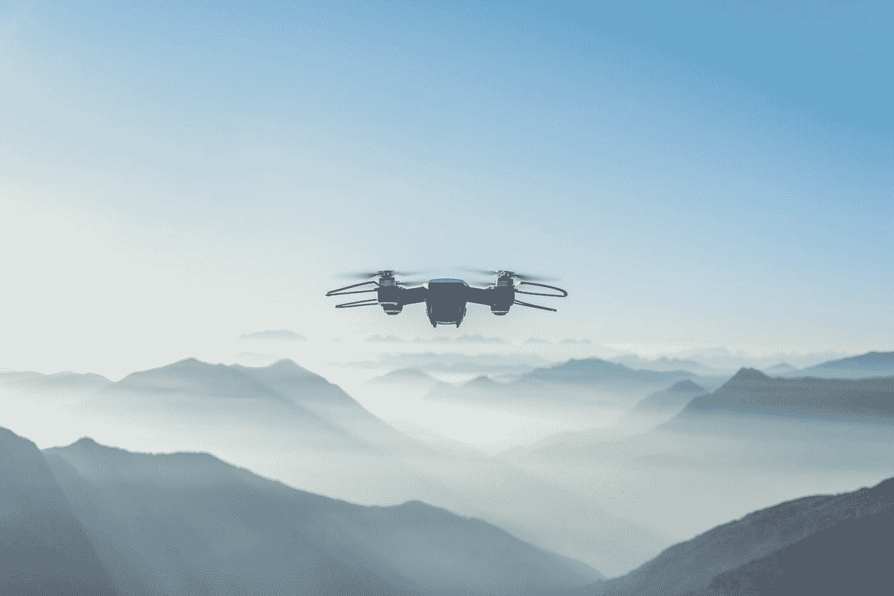
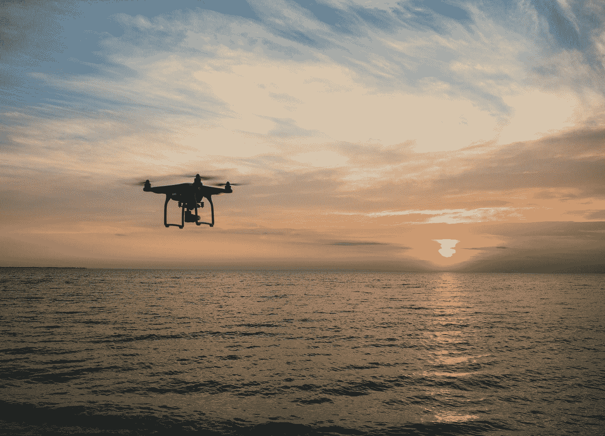

# 5G 技术提升无人机价值的 7 种方式

> 原文：<https://medium.datadriveninvestor.com/7-ways-how-5g-technology-augments-the-value-of-drones-d070f6b62bbf?source=collection_archive---------23----------------------->

Photo by [asoggetti](https://unsplash.com/@asoggetti?utm_source=medium&utm_medium=referral) on [Unsplash](https://unsplash.com?utm_source=medium&utm_medium=referral)

## 2021 年将标志着 5G 无人机的重要一年，因为数据传输能力将它们提升到下一个发展阶段

5G 和无人机是两个行业不可知的事物，它们可以影响的空间，因此一起颠覆行业的时机已经成熟。如其他技术如区块链、人工智能、物联网等。同时发展，上述伙伴关系有巨大的潜力。

**5G 和无人机连接**

5G 是宽带蜂窝网络的第五代技术标准，速度是其突出的特点。5G 网络利用更高的无线电频率以更快的速度传输更大量的数据。5G 技术平均比 4G 快 20 倍，平均延迟低得多(大多数情况下不到 1/5)，这是数据从源到目的地所需的时间(将数据从设备上传到任何目标的时间)。

5G 技术的更高速度和更低延迟是它将推动无人机行业达到前所未有水平的主要原因。这不应该是一个惊喜；无人机收集大量数据，快速传输这些数据的能力是它们最有效创造价值的地方。

Photo by [Aaron Burden](https://unsplash.com/@aaronburden?utm_source=medium&utm_medium=referral) on [Unsplash](https://unsplash.com?utm_source=medium&utm_medium=referral)

## 我们到底有多远？

简短的回答是不太远。就在我们说话的时候，测试已经在世界多个地方进行了。例如，2020 年 11 月，沃达丰和爱立信[在沃达丰位于德国奥尔登霍芬的 5G 移动实验室成功](https://www.ericsson.com/en/news/2020/11/vodafone-and-ericsson-partner-on-drone-delivery)测试了 5G 无人机的天空走廊，以帮助最终实现 5G 无人机的真实使用案例。

大约在同一时间框架内，英国电信宣布了英国首个商用无人机走廊(与一个新的公司和组织财团合作)，其议程与沃达丰和爱立信提供无人机技术的 5G 用例类似。

鉴于此类计划已经在进行中，看到一些用例在 2021 年进行试点可能并不夸张。随着试点项目提供进一步的见解，将会有更多关于此类用例的信息进入主流。

让我们看看 5G 技术将帮助无人机行业在我们的生活中获得更多立足点并进一步成为主流的 7 个总体案例。

Photo by [Ryan Pouncy](https://unsplash.com/@pixelperfect?utm_source=medium&utm_medium=referral) on [Unsplash](https://unsplash.com?utm_source=medium&utm_medium=referral)

## 无人机交通管理

要在道路上驾驶车辆，我们需要规则和安全程序；对于无人机这样的无人驾驶飞行器(UAV ),我们需要一个类似的结构，并且还在不断发展。5G 技术将有助于增强和成熟这种所需的结构，允许无人机比以前的能力更有效和无缝地被跟踪和引导。此外，将低空盘旋的无人驾驶飞机安全可靠地纳入将增加空中交通，从而增加对航班整体运营的管理负担。因此，围绕这一点的生态系统转化为一个连接良好的通信网络就更加重要了。对于那些感兴趣的人来说，这里有一个关于无人机如何威胁现有机场运营的另一面的简要介绍。

Photo by [Kelly Sikkema](https://unsplash.com/@kellysikkema?utm_source=medium&utm_medium=referral) on [Unsplash](https://unsplash.com?utm_source=medium&utm_medium=referral)

## 灾难反应

公共安全事件、自然灾害(地震、野火、风暴、山体滑坡、海啸等)。)，以及其他影响我们、需要在拯救生命和价值方面做出回应的此类事件，是我们可以看到 5G 和无人机合作伙伴关系发挥其魔力的关键领域。

对于这类事件，缓解痛苦的努力几乎总是反动的，从来不是实时的。在能够提供任何支持之前，首先到达事发地点有时也是一种折磨。电力和通信基础设施也经常受到袭击，这使得无法快速向受灾难影响的人提供应急响应。另一方面——即使网络没有受损，它也会因为拯救生命和财产的高使用率而堵塞。数据传输的损失需要得到解决，安装 5G 电池的无人机可以缓解这些问题。

无人机可以帮助快速共享高分辨率图像，并在大规模灾害中执行 3D 绘图，以便为稍后到达的所有救援工作提供焦点和方向。因此，5G 无人机不仅有助于在受灾地区增加临时通信基础设施以帮助共享信息，还能帮助传输急需的数据，以改善随后抵达的救援工作将采取的策略。

Photo by [Jorge Ramirez](https://unsplash.com/@jorgedevs?utm_source=medium&utm_medium=referral) on [Unsplash](https://unsplash.com?utm_source=medium&utm_medium=referral)

## 增加物联网潜力

5G 和无人机的结合将增加物联网和配套传感器的用例。环境监测、灾害管理、智能农业等。场景将需要大量的传感器来进行远程检查。这个生态系统将简化读数的收集和数据的传输。随着 5G 成为主流，以及各司法管辖区对无人机的监管成熟，对传感器的需求将会很大。

Photo by [Macau Photo Agency](https://unsplash.com/@macauphotoagency?utm_source=medium&utm_medium=referral) on [Unsplash](https://unsplash.com?utm_source=medium&utm_medium=referral)

## 管理活动中的通信服务

在拥挤的活动中，如足球比赛、音乐会、公众集会等。蜂窝网络负担着比通常更高的需求，并且必须长时间满负荷工作。结果，最终用户的网络服务受到影响。配备 5G 小蜂窝的无人机可以增加容量，并有助于提供更好的覆盖范围，以降低掉线次数，并改善在这些活动中向需要数据的设备提供的互联网连接。

Photo by [Markus Spiske](https://unsplash.com/@markusspiske?utm_source=medium&utm_medium=referral) on [Unsplash](https://unsplash.com?utm_source=medium&utm_medium=referral)

## **启用人工智能**

从人工智能技术中获得可操作的见解意味着依赖大量数据来识别模式和识别复杂细节中的微小变化，从而产生有说服力的信息。随着 5G 网络加快数据传输，无人机可以配备机载人工智能系统，结合边缘计算，通过对产生的数据洞察采取行动，实时切换场景。这将是无人机在未来几年的主要应用，因为探索大规模的物理环境并定期提供对这些环境的见解，以便能够迭代行动和解决方案，这在很大程度上仍未得到开发。

Photo by [Shahadat Rahman](https://unsplash.com/@hishahadat?utm_source=medium&utm_medium=referral) on [Unsplash](https://unsplash.com?utm_source=medium&utm_medium=referral)

## **实时高清流媒体**

5G 技术可能实现的高速将为飞行员提供高质量的实时成像。实时成像质量将有巨大的提高，这对于需要远程完成的任务将是有用的。使用案例，如检查制造设备或建筑工地、大型变电站的维护、事故现场的远程手术等。能够以比现在更快的速度获得高质量的可视数据。当数据传输的位置不是静态的或未知的时，将 5G 无人机运送到该位置以共享数据或传输无人机在需要监控的场地的旅程中覆盖的累积数据具有巨大的价值。

Photo by [Harley-Davidson](https://unsplash.com/@harleydavidson?utm_source=medium&utm_medium=referral) on [Unsplash](https://unsplash.com?utm_source=medium&utm_medium=referral)

直播无人机比赛。在游戏或观看体育比赛时，第一人称视角更适合某些观众。这一细分市场可用于日益流行的无人机竞速运动。通过允许连续、高质量的第一人称视角流，将会有一个全新的角度(不是双关语)来看待这项运动。

## 结论

我经常关注创造价值的新途径，因为我对那里的骗子和有抱负的企业家很着迷。正如您所看到的，这个空间有很大的潜力，可以以各种方式为我们现有的产品和服务增加价值。谈论的领域只是最终可能实现的一小部分，有足够的例子来说明为什么 5G 和无人机的合作将是人类的革命性发展。

当谈到 5G 和无人机组合时，还有哪些其他领域或具体例子让你感到兴奋？