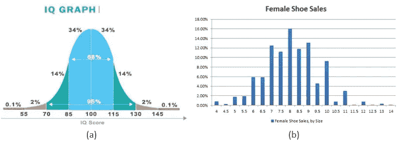
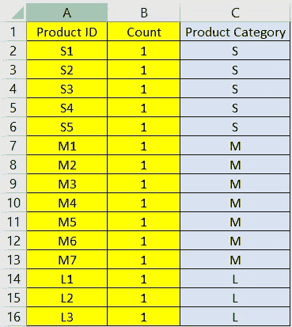
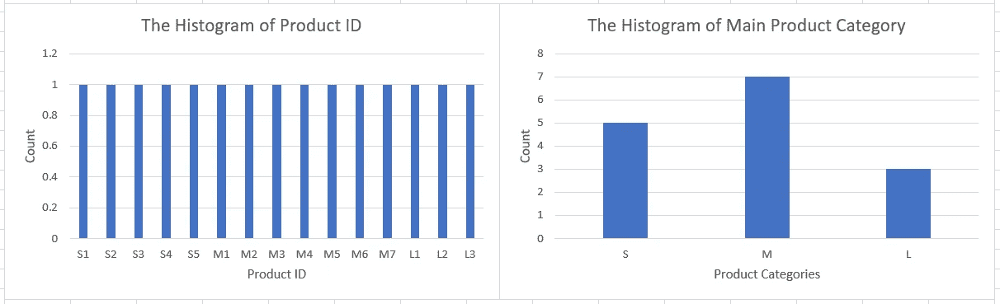
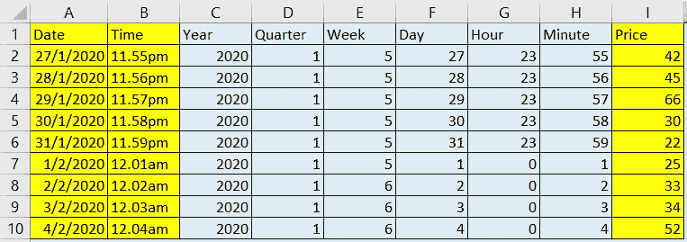
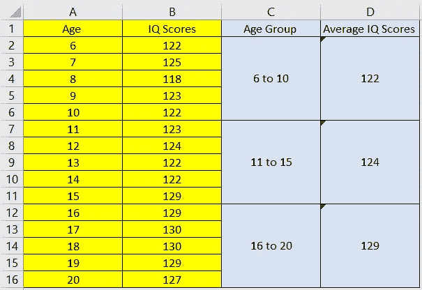
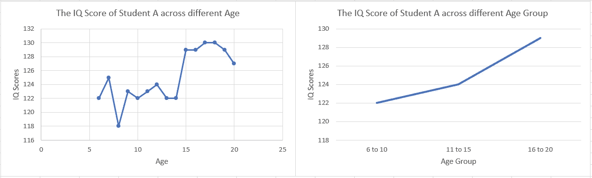
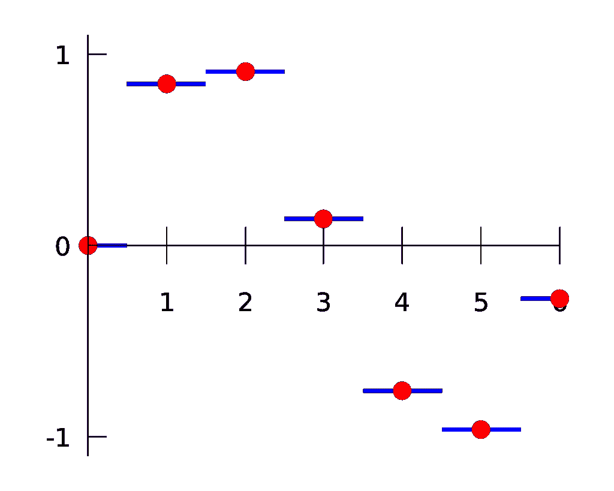
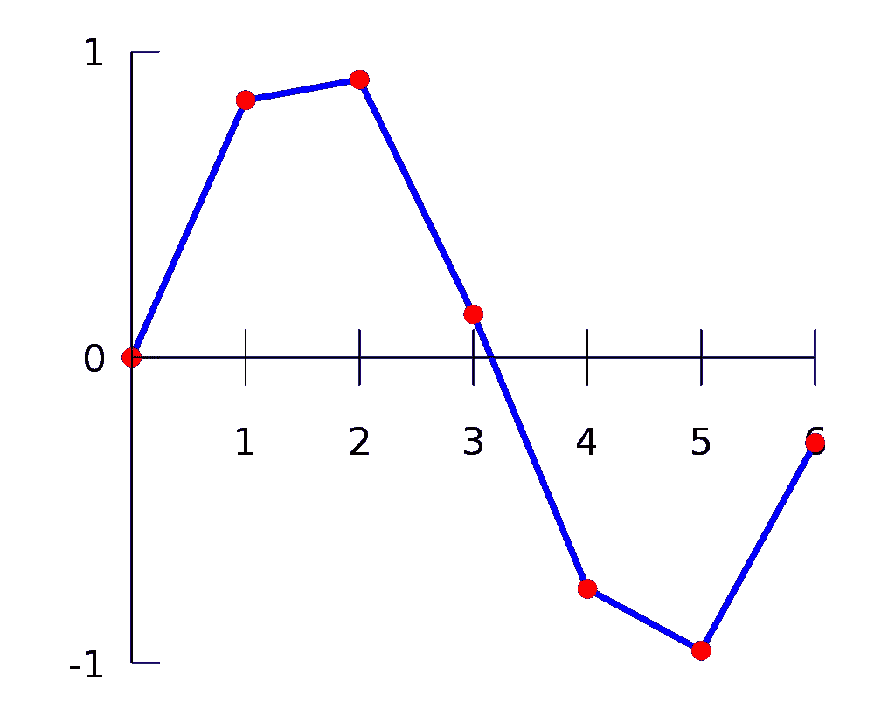
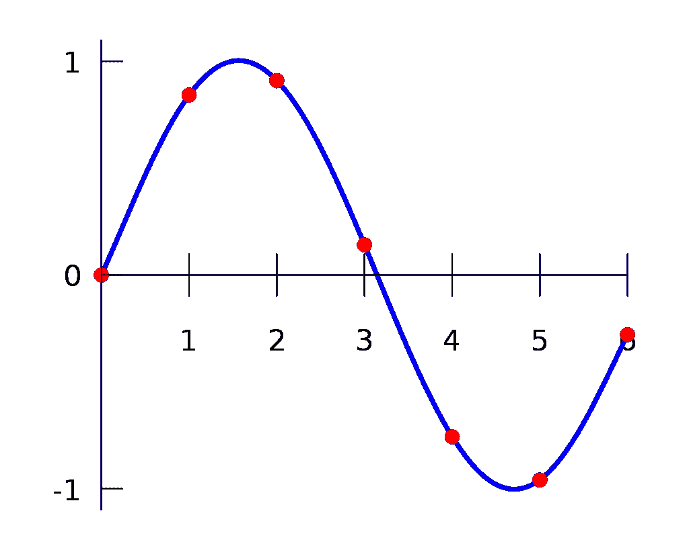
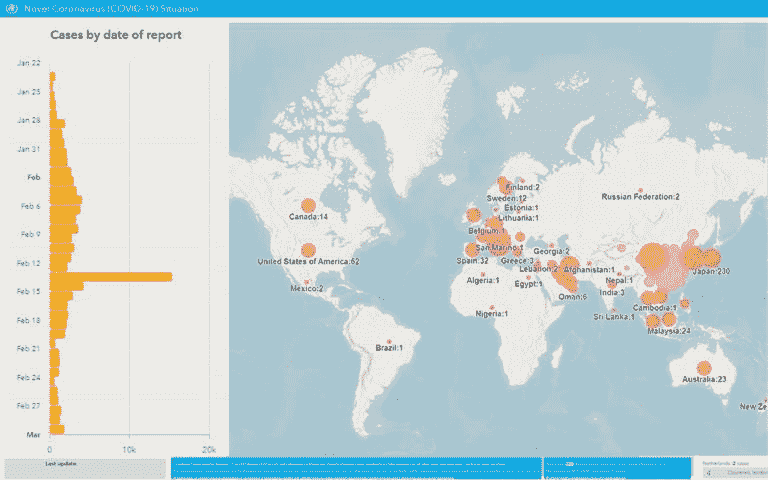

# 从现有表格属性派生新功能的 7 种方法

> 原文：<https://medium.datadriveninvestor.com/7-ways-to-derive-new-features-from-existing-tabular-attributes-3a063c5aa807?source=collection_archive---------3----------------------->

## 将无关紧要的列转换成有用的表示形式

Image taken by Pei Seng at Watsons Bay, Sydney, Australia

在大多数情况下，从客户端收集的数据不够重要和模块化，无法直接应用于建模和可视化。正如大多数数据科学家所提到的，数据预处理始终是决定描述性、诊断性和预测性分析成功与否的主要关键。代替执行特征选择或提取，下面将更多地讨论如何探索和创建新的可能有用的特征，以增加建模和可视化的成功机会。

# 方法 1:对数量属性执行算术运算

从现有属性中获取新要素的最常见方法是在单价、利润、体重或身高等任何定量属性之间执行简单的算术运算。您可以创建的新属性示例包括:

1.  年龄(派生属性)等于当前年份(原始属性)减去出生年份(原始属性)。
2.  公司 A 年销售额(派生属性)的预计金额等于第一个月的平均销售额(派生属性)乘以 12。
3.  体重指数(衍生属性)相当于以千克为单位的体重(原始属性)除以以米为单位的身高(原始属性)的平方。

尽管原始数据集可能没有提供您想要的信息，但是您仍然可以通过使用您已经获得的其他定量属性来派生它们。例如，有了提供的体重和身高信息，您仍然可以获得体重指数的值，尽管它不在原始数据集中。这种方法的缺点包括当它应用于分类或顺序属性时是无用的，因为应用于分类和顺序属性的算术运算的结果是没有意义的。

 [## 数据科学和软件工程哪个更有前途？数据驱动的投资者

### 大约一个月前，当我坐在咖啡馆里为一个客户开发网站时，我发现了这个女人…

www.datadriveninvestor.com](https://www.datadriveninvestor.com/2019/01/23/which-is-more-promising-data-science-or-software-engineering/) 

# 方法 2:对偏态正态分布进行对数变换

正态分布被广泛应用于理解人口中因素的分布，因为正态分布很好地逼近大多数自然现象。正态分布的真实例子包括体重、身高、智商、经济中的收入分布、鞋码等。由于从大量人群中收集小样本时存在偏差，所收集数据的分布倾向于向左或向右倾斜，如图 2 所示。有没有办法把偏态分布转化成正态分布？

Figure 1: Real-life Examples of Normal Distributions: (a) IQ Score (b) Female Shoe Sales versus Size

Figure 2: The Distribution Graph Before and After of Logarithmic Transformation

答案肯定是肯定的，通过执行对数变换。执行对数变换后，分布将完全变为正态分布，但数据集的原始值也将被处理。如果需要保留原始值，这种方法对建模有意义，但对可视化没有意义。

# 方法 3:派生唯一标识符以获得层次结构信息

如果你有一列数据，其中每个值都是唯一的，你会删除它们吗？答案肯定要看情况。唯一标识符的例子包括客户 ID、产品 ID、乘客 ID 等。在大多数情况下，如果客户不提供如图 3 所示的信息，它们可以进一步衍生为更有用的信息，如产品类别，而不是丢弃它们。参考图 4，如果在唯一标识符上实现正确的派生技术，就会发现更多隐藏的信息。产品 ID 间接提供了层级信息，这意味着在产品类别 S 下，有 S1、S2、S3、S4 和 S5。

Figure 3: The new attribute named Product Category is derived from original attributes named Product ID and Count

***注:*** *黄色高亮显示的单元格是原始属性，蓝色高亮显示的单元格是派生属性。*

Figure 4: The hidden information about the count for each product category is uncovered

# 方法 4:展开日期属性

有了一系列日期值，它们可以进一步派生为年、季度、月、周、日、小时、分钟或秒，如图 5 所示。导出的属性可以作为分组线索，对具有相同特征(如相同的月、周或日)的数据进行聚类，这为建模和可视化提供了更多的特征。它也可以被索引用于执行时间序列分析。

Figure 5: Derive date attributes into years, quarters, months….

***注:*** *黄色高亮单元格为原始属性，蓝色高亮单元格为派生属性。*

# 方法 5:将数字属性转换为分类属性

您可以自由地将属性转换成其他类型，而不是保留默认的属性类型。最常见的做法是将名词性属性转换成分类属性。一个很好的例子是人类年龄，人们通常将这个属性记录为数字类型。可以定义一个特定的范围来对这些值进行分组。例如，如图 6 所示，0 到 5 岁的孩子被分组为组 1，6 到 10 岁的孩子被分组为组 2，依此类推。数据分析师大量应用这种技术，将每日缺陷计数转换为每周或每月缺陷计数，如图 7 所示。

Figure 6: Derive new attributes named Age Group and Average IQ Scores from original attributes named Age and IQ Scores

***注:*** *黄色高亮单元格为原始属性，蓝色高亮单元格为派生属性。*

Figure 7: The graph of Average IQ Scores versus Age Group can be plotted by using Age and IQ Scores.

# 方法 6:将离散属性转换为连续属性

通过提供几个离散的采样数据点，是否有可能将它们平滑地连接成一条连续的曲线？答案肯定是肯定的，这种类型的转换被称为插值，其中附加数据点将在原始数据点之间创建，以形成连续的直线曲线。描述 1 个属性 1 维数组的常用插值类型包括最近邻插值(如图 8 所示)、线性插值(如图 9 所示)和多项式插值(如图 10 所示)。

Figure 8: Nearest-Neighbor Interpolation

Figure 9: Linear Interpolation

Figure 10: Polynomial Interpolation

# **方法 7:追加相关数据**

如果您认为附加数据集中的其他属性有用，欢迎您将其导入并加入当前数据集。大多数数据分析师通过从附加数据集中获取城市的坐标(纬度和经度)来可视化城市的位置。除了地理位置之外，客户人口统计数据集总是被导入并与交易数据相结合，以研究客户的购买行为。如图 11 所示的例子，除了按报告日期显示病例外，还导入了城市的坐标，以显示每个国家的冠状病毒总数。

Figure 11: The graph of Coronavirus cases by dates and cities.

# 参考资料:

1.  书:可视化分析与设计【https://www.cs.ubc.ca/~tmm/private/book/book.120803.pdf 
2.  正态分布的 9 个现实生活例子[https://studiousguy . com/Real-Life-Examples-Normal-Distribution/](https://studiousguy.com/real-life-examples-normal-distribution/)
3.  插值[https://en.wikipedia.org/wiki/Interpolation](https://en.wikipedia.org/wiki/Interpolation)
4.  统计学中的数据类型-名义数据、序数数据、区间数据和比率数据类型举例说明[https://www . freecodecamp . org/news/Types-of-Data-in-Statistics-Nominal-Ordinal-Interval-and-Ratio-Data-Types-Explained-with-Examples/](https://www.freecodecamp.org/news/types-of-data-in-statistics-nominal-ordinal-interval-and-ratio-data-types-explained-with-examples/)