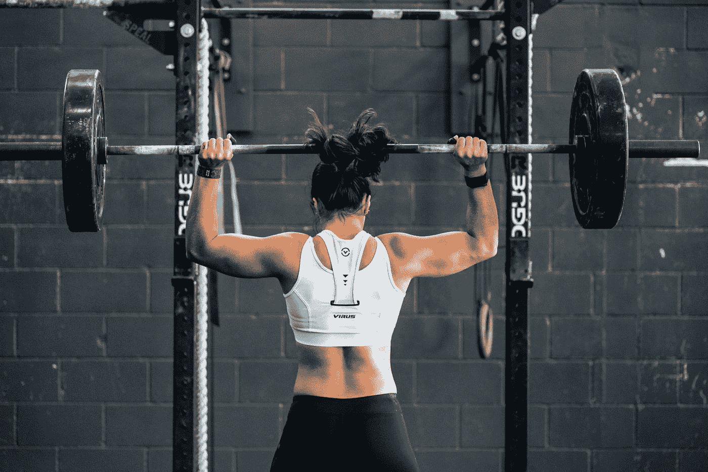

# 疫情期间提高你健康的 7 种方法

> 原文：<https://medium.datadriveninvestor.com/7-ways-to-enhance-your-well-being-during-a-pandemic-341aaf63be79?source=collection_archive---------10----------------------->

## 个人健康+生产力

Photo by [John Arano](https://unsplash.com/@johnarano?utm_source=medium&utm_medium=referral) on [Unsplash](https://unsplash.com?utm_source=medium&utm_medium=referral)

> ***生活中很少有事情能比得上好运。***

虽然我们中的许多人仍在适应疫情时期生活的新规范，但重要的是要提前考虑我们可能会在一段时间内处于一种改变的状态。这可能不仅仅是一个变化的季节。“去健身房”可能会持续一段时间。

旧的常规可能会被搁置，但有一些方法可以让你在疫情期间建立适应力和幸福的生活。这就是为什么我创造了***7*******额外的方法*** 我们可以在 2021 年的新现实中提升我们的福祉。*

# *1.睡得更多(更好)*

*睡眠卫生是提高生产力的真正改变者。过去两个月，我睡得比 2019 年大部分时间都好。为什么？因为我的生活有了更好的平衡。*

*我们每个人都有一辆自行车。我们有些人喜欢早起，有些人喜欢睡懒觉。我们中的一些人在下午工作得更好。一些在晚上。*

*无论你的周期是什么，睡眠的数量和质量是关键。如果你每天早上仍然感到疲惫不堪，那么在疫情期间，你可以好好反思一下，想想为什么会这样，你可以做些什么来改善你的睡眠，这反过来又会增强你的健康，提高你的工作效率。*

*要了解更多关于如何改善睡眠卫生的信息，请查看睡眠基金会的以下建议:*

* [## 什么是睡眠卫生？-国家睡眠基金会

### 睡眠卫生是各种不同的实践和习惯，是良好的夜间睡眠质量所必需的…

www.sleepfoundation.org](https://www.sleepfoundation.org/articles/sleep-hygiene) 

# 2.创建一个舒适的阅读角落

Courtesy: Barnes & Noble

我和我的妻子完全爱上了 Barnes&Noble 的这篇文章。

为什么？

因为环境塑造行为。

看完这张图片后，它进一步重申了我们一直在考虑的决定，在公寓的角落里建一个小小的阅读角。

事实证明，我们设置它的方式实际上可以让我们每天更好地看到日落，并让我们看到附近的河流。我们称之为“河岸景观”。这是从疫情的一本书 nook 创建的价值百万美元的视图。视角就是一切，对吧？

也许你的生活空间中有一个角落你还没有开发。

# 3.做更健康的饭菜

疫情之前的餐点就像大多数阅读这篇文章的人一样。匆忙的，预先准备好的，方便的，大部分价格过高/从当地熟食店买的。

自从世界陷入停滞以来，我和妻子越来越关注食物的成本和食物提供的营养价值。

我们比以往浪费更少，按需分配。我们每 10 天买一次食品，我们总是 ***围着厨房哼着*** 的曲子。对我们来说，这种新的标准是放慢我们的进食速度，在我们自己舒适的家里享受准备过程，而不是出去吃东西。

这也迫使我们更多地交流我们的食物是什么样子，这也极大地增进了我们关系的健康。

***更好的燃料=在我们生活的各个方面都有更好的结果。***

> 吃得更好→活得更好。

# 4.制定一个新的日常计划

赛前惯例在疫情之前就已经改变了游戏规则，今天仍然是更大的游戏规则改变者。如果你是一个晚睡者，在早上 5-7 点或 7-9 点之间制定一个日常计划可以让你的一天走上完全不同的轨道。要了解更多关于建立日常生活的方法，请看这篇文章:

 [## 为什么你应该制定一个日常计划(PDR)

### 改变你的早晨方法——改变你的结果

medium.com](https://medium.com/swlh/why-you-should-develop-a-pre-day-routine-pdr-517a5db49a6) 

# 5.多和你的伴侣联系

我的搭档是一名医疗保健专家。她是真正的英雄。能够更多地呆在家里一起做饭，分担家务，能够更经常地一起散步，这对我们的婚姻来说是一种真正的幸福。

在这次疫情期间，它带来的一个好处是我们能够联系，而不仅仅是交流。

在疫情之前，我们真的很擅长沟通，但是联系很仓促。现在，我们联系的比交流的多。我们大部分的交流都是非语言的，因为我们更加同步。结果——我们的关系健康达到了历史最高水平。

想了解更多关于如何更好地与同事、伙伴和自己沟通的信息，请阅读约翰·C·麦斯威尔的这本不可思议的书:

 [## 每个人都交流，很少有人联系

### 几天前刚开始读这本书，像所有其他麦克斯韦以前的书一样，这本书不是别人，正是…

www.goodreads.com](https://www.goodreads.com/book/show/7715488-everyone-communicates-few-connect) 

# 6.节省更多的钱

我想在这个部门里我不是一个人。

4 月份，我和我的搭档存的钱比我们有记录以来的任何一个月都多。被迫呆在家里也促使我们改变了消费习惯。面对如此多的经济不确定性， ***我们做出了一些令人不快的决定，比如削减我们的流媒体和订阅服务*** 。我们还通过减少食物浪费来节省每月预算。随着食品价格在某些情况下上涨 15%,这是支持我们财务健康的关键一步。

现在是反思我们在室内和室外花费多少的好时机。有很多关于长期衰退的传言，这将迫使我们许多人重新思考我们的奢侈品和我们的钱是怎么花的。18 美元的沙拉可能是不可能的。查看 Tim Denning 的这篇文章，了解更多信息:

 [## 大衰退(实现)

### 在不确定的时期，我们会质疑自己做过什么和知道什么。

medium.com](https://medium.com/mind-cafe/the-great-recession-realization-c5fd59fbb289) 

通过调整和评估你的钱的去向来领先于大“R”是关键。

如果我们的财务状况不健康，就会产生压力和大量的“被迫生产力”，而这些压力和生产力 ***不会给有机创造*** 留出空间。要做好创作，财务状况好很重要。繁荣的经济可以考虑到这一点。经济衰退让创造力变得更加困难。

# 7.我们在读旧书

重读书架上或你的有声读物上的旧书是多么美好的时光啊。现在花时间回去重新阅读一些商业、生产力和/或个人成长方面的书籍是对我们福祉的一项巨大投资。

对我来说，我正在重新阅读塞思·戈丁、蒂姆·费里斯和约翰·C·麦斯威尔的书。自从几年前读了他们的书后，我成长为一名领导者，我发现他们的书以我以前从未发现的新方式冲击着我。

这就像你在看你最喜欢的电影，发现了你以前从未注意到的部分。

也许你家书架上有几本书需要在那个新书角重燃。如果是这样的话，这可能是非常值得花时间在疫情。

在疫情及以后的日子里，你可以通过更多的方式*远程发展，点击下面的链接，拿起我最新的书。*

* [## 如何在远程工作环境中茁壮成长

### 如何在远程工作环境中茁壮成长电子书:法赫、瑞安、费思、乔伊:亚马逊

www .亚马逊. ca](https://www.amazon.ca/dp/B091MSMR2D/ref=sr_1_1?dchild=1&keywords=how+to+thrive+in+remote+working+environment&qid=1617484066&sr=8-1) 

***瑞恩*****