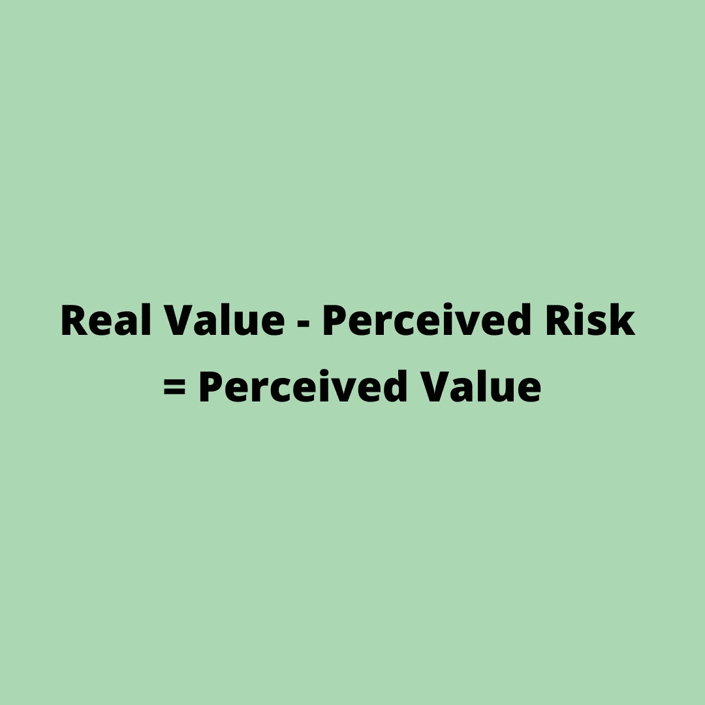

# 提高感知价值和增加销售的 7 种方法

> 原文：<https://medium.datadriveninvestor.com/7-ways-to-increase-perceived-value-and-make-more-sales-47abdcda50fb?source=collection_archive---------6----------------------->

## 3.降低准入门槛

Photo by [Marten Bjork](https://unsplash.com/@martenbjork?utm_source=medium&utm_medium=referral) on [Unsplash](https://unsplash.com?utm_source=medium&utm_medium=referral)

任何营销的最终目标都是销售。收入推动着企业及其运营。因此，如果你的销售没有得到任何牵引，这可能是一个或两个问题。

第一，你没有得到足够的流量来转化。第二，你的网站或报价*没有转化*。

> 收入=流量+转化

如果你的网站没有转化，感知价值是解决方案之一。简单来说，你的报价的感知价值是你的客户为价值交换向你付费的催化剂。

而且必须有交换的价值。如果你只是要求他们向你购买，没有人会付钱给你。如果你用价值换取金钱，每个人都会乐意付钱给你。

# 什么是感知价值

根据定义，感知价值是你的客户如何看待你的产品的价值。报价必须满足他们的需求，并产生一定的欲望，使其在他们眼中有价值。

产品或服务是优惠的主要亮点。但是感知价值是说服人们从你这里购买的东西。人们总是愿意为一个好的报价支付额外费用。他们根据报价的呈现方式来判断报价。

这不是一个骗局或操纵。把它想象成一个包裹。包装从外面看起来越好，你就越会认为它的内部更好。这就是感知价值的工作方式。

# 感知价值的重要性

自从营销转变为以客户为中心的方式，营销人员就开始进行测试以吸引他们的目标受众。他们现在不是推销他们的产品或服务，而是推销他们的产品。

[证明，感知价值更能从竞争中脱颖而出](https://blog.fusebill.com/7-ways-raise-perceived-value-to-customers-grow-recurring-revenue)，增加销售机会。包装越好，卖得越多。营销就是沟通——将潜在客户转化为客户的销售信息。

你的报价有多好将决定你的营销成败。顾客对产品的感知价值是他们从你而不是你的竞争对手那里购买的决定因素。感知价值让你的业务在客户眼中更有吸引力。

# 感知价值如何增加销售额

在我向你展示增加感知价值的方法之前，让我们更深入地了解你的客户是如何看待你的产品的价值的。你必须获得正确的概念，才能知道要改进什么，否则这将是一场灾难。

## 它是如何工作的

感知价值是一种效果。这个世界上出售的任何东西都有两个共同点——真实价值和感知风险。这两者的差就是你的报价的感知价值。

你的提议会有实际价值，让你的客户受益。还会有一些察觉到的风险阻止你的客户购买。

感知价值等式。

Image by the author.

好的一面是你可以随意改变方程中的变量。我们将在本文的后面讨论如何做到这一点。

你应该专注于将感知风险降至最低，然后增加报价的实际价值。因为无论你的提议有多有价值，你的客户都不会做出承诺，除非他们感到放心。

## 感知风险

当涉及到财务问题时，你的客户会非常怀疑。你必须直面这种怀疑。当然不是以粗鲁的方式。

这将间接地向他们保证你理解他们的担忧。保证提供确定性。他们决策过程中的确定性总是会带来销售。

这是所有在线业务的蓝图。

一旦你的客户确信这是对他们最好的决定，他们就会做出决定。这是营销人员的工作，以帮助他们，让他们可以放心地承诺。

## 你的提议的真正价值

任何产品或服务都有某种特性，可以给你的客户带来功能上的好处。这些好处将解决你的客户的问题。然而，是你的产品定位提升了你产品的真正价值。

但是营销人员总是倾向于过分强调他们产品的真正价值。这并不像感知风险那样有助于你的客户购买你的产品。请记住，营销已经转变为以客户为中心的方法。

这意味着在这种情况下，客户的保证才是真正的价值。一旦你采用了这种方法，你将更有可能看到你的营销有所改进。

# 提高你感知价值的 7 种方法

这些提示将告诉你如何通过增加实际价值或降低感知风险来增加你的报价的整体感知价值。重要的是要明白，你不应该过于关注你的提议的真正价值。

相反，你应该更加关注降低感知风险，以说服你的客户对你的提议采取行动。因为无论你如何夸大，你的提议的实际价值都是有限的。

## 1.证明你的真正价值是如何实现的

这一举两得。这将增加你的实际价值，同时降低感知风险。如果你有一个视频解释你的产品或服务如何帮助你的客户，这比简单地陈述你的产品或服务的好处要好得多。

你的产品本身的好处并不能让你的客户相信你的产品可以解决他们的问题。他们想知道它是如何工作的，以及他们能得到什么样的结果。他们会通过演示讲述您的产品如何能更好地帮助他们。

## 2.迎合顾客的情感

如果做得好，这是一个非常强大的价值主张。你的顾客带着情感购买，用逻辑证明他们的决定。越早理解这个概念，你的营销就越好。你如何吸引他们的情绪？

通过指出他们的问题并解释你的提议将如何解决它。你可以通过给他们额外的奖金来增加优惠的力度。比如像“包括免费课程”这样的话。

## 3.降低准入门槛

免费试用有效的原因是它几乎不需要你的客户的承诺。它消除了得不到他们所期望的东西的风险。如果他们不喜欢，可以取消，没什么大不了的。

这是免费试用的秘密。一旦他们发现你的产品或服务适合他们，他们更有可能从你这里购买。因为你已经证明了你的产品是有效的，他们有他们需要的保证。

## 4.利用评论作为杠杆

如今你的顾客购物方式不同了。他们在购买任何东西之前都会做调查。这就是产品或服务评论发挥作用的地方。可信来源的评论增加了你的报价的可信度。

评论是一个风险消除器。它们表明你的提议值得投资，人们正在谈论它。如果评论来自高可信度的网站就更好了。

## 5.充分利用常见问题

人们会对你的提议有疑问。这是显而易见的。如果你能当场回答这些问题，你就有更大的机会让他们改变信仰。常见问题部分会做到这一点。

这一部分的目的不是为了给你的报价增加更多的价值。而是回答运费、退款保证、订阅政策等常见问题。你应该充分利用这一部分来降低感知风险。

## 6.捆绑定价效果更好

捆绑包是有价值的。说够了。您的客户希望以更低的价格获得更多的价值。这就是消费心理。根据 Oberlo 的调查，82%的亚马逊购物者认为价格是一个重要因素。建议为您的报价制定一个可靠的定价策略。

即使你是一个高端品牌，这仍然有效。捆绑定价是增加你的报价的情感吸引力的方法之一。从心理学上讲，东西越多意味着价值越高。但是，它们必须是相关的和高质量的，这样才能生效。

## 7.提供高质量的客户支持

它不会随着销售而结束。不要忘记，如果你的客户没有得到你的支持，他们可以退还你的东西。他们付钱给你是为了给他们持续的价值。但这取决于你的业务。

无论您是一次性购买还是订阅业务，客户支持都是必不可少的。您的客户需要知道万一发生什么事情，他们是否能得到支持。这对他们来说是一个强大的信心助推器。

# 结论

以客户为中心会给你丰厚的回报。专注于降低感知风险，最大化你的感知价值，让你的客户从你的产品中获得最大价值。但永远不要控制欲强。因为它们在一英里外就能闻到。

请记住，任何交易都是一种价值交换。在顾客愿意付钱之前，你需要先提供价值。这就是如今网上交易的方式。