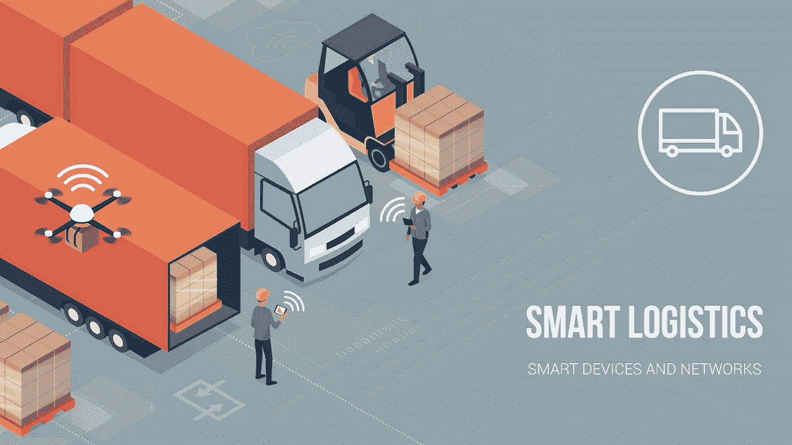
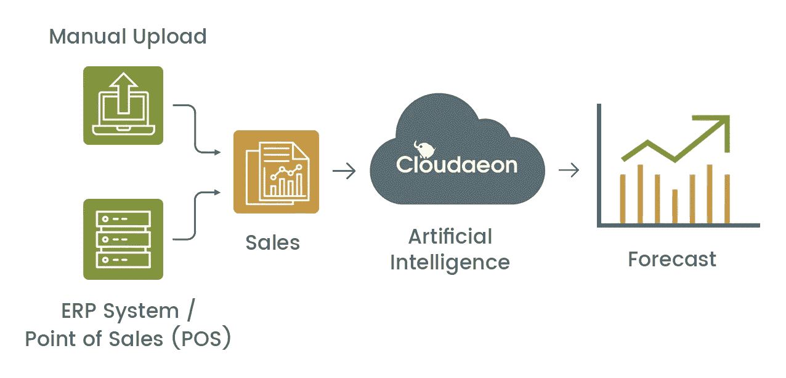

# 物流和供应链的 8 个人工智能用例

> 原文：<https://medium.datadriveninvestor.com/8-ai-use-cases-for-logistics-and-supply-chain-970d5db435da?source=collection_archive---------7----------------------->

麦当劳每秒钟提供超过 75 个汉堡。然而，尽管看起来很简单，一个汉堡需要许多活性成分:面包屑、火腿、蔬菜、油等等。想象一下，从源头开始积累每一种成分，并通过智能供应链系统为其供货。

或许我们肯定会提前两个月提前出版我们的汉堡。这是关于消费者的，想象一个没有商家、供应商和公司供应链的世界。

 [## 物联网解决方案如何改变供应链中的机遇|数据驱动型投资者

### 物联网(IoT)可能开始时规模很小，但它正在成为世界经济中的一个重要因素。事实上…

www.datadriveninvestor.com](https://www.datadriveninvestor.com/2018/11/14/how-iot-solutions-are-shifting-opportunities-in-the-supply-chain/) 

一个没有供应链监控或完全没有这种想法的世界将导致大多数企业的沉没。制造业、零售业甚至医疗保健都严重依赖创新供应链。

没有资源，肯定就没有消费品来满足日益增长的需求。如果没有充足的药物、圆柱形氧气管等等，任何医院的紧急情况病房都会见证最大的噩梦。而且这只是冰山一角。

随着世界经济和消费者需求的发展，世界各地的供应链也在发展。目前，人类人口以及他们在容量上的投资一直居高不下。网络和电子零售商实际上做了了不起的工作，只需一次点击就可以轻松获得几乎所有的东西。

然而，为了维持这个大幅增长的市场，供应链需要一个极端的突破。由人工智能驱动的供应链是所有供应链需求的一站式选择。很难相信人工智能可以服务于像供应链这样广泛的事物的所有方面。我们可能无法讨论所有的使用实例；尽管如此，我们还是为供应链和物流收集了十个领先的人工智能用例:

**需求预测:**

对于任何负责库存管理的人来说，超负荷的库存和热情的消费者失望地离开商店是最丑陋的景象。理想情况下，商店的库存能力需要在规定的时间范围内根据顾客的需求进行调整。但是，我们并不是生活在一个完美的地球上，标准的需求预测工具也缺乏吸收因素的能力，无法考虑消费者需求的上升和下降、供应情况以及不断变化的需求模式。

然而，通过人工智能驱动的需求预测设计，人们可以以 90%以上的准确率预测需求，因此可以防止情景或不足以及库存过剩。借助改进的 Google 需求 ML 模型， [LeewayHertz](https://www.leewayhertz.com/logistics-software-development/?utm_source=Medium_Logistics) 协助该零售商以 80%的精度精确预测目标产品集的需求。

**供应预测:**

市场本地化的日子已经一去不复返了。今天，我们可以坐在旧金山享受印度茶；信用评分进入供应链。然而，供应链效率的提高也增加了它们的脆弱性。一个方面的失败会让你永远失去一个客户。现代供应链面临过剩、供应不足等问题，导致利润下降。

为了让现代供应链打败这些邪恶的力量，所有的信息需要像一个实体，而不是筒仓。人工智能供电的供应 ML 模型从您变化的信息中提供重要的见解，以更好地规划您的供应程序。在 LeewayHertz 构建的供应物流解决方案的帮助下， [TraceRx](https://www.leewayhertz.com/project/tracerx/?utm_source=Medium_Logistics) 将库存结转降低了 50%。

**物流路线优化**

