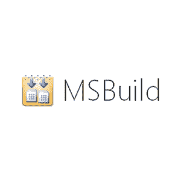
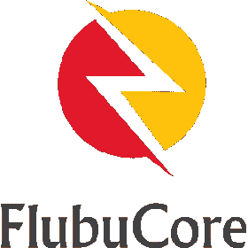

# 8 构建自动化工具开源

> 原文：<https://medium.datadriveninvestor.com/8-build-automation-tools-open-source-1a505ba9e19f?source=collection_archive---------6----------------------->

这 8 个开源工具可以自动构建你的程序

[Joshua Aragon](https://unsplash.com/@goshua13) via [unsplash](https://unsplash.com/photos/EaB4Ml7C7fE)(CC0)

如果你有一个 IDE(集成开发环境)，那么你肯定知道他们提供的舒适的工具。它们帮助您使用自动完成功能键入源代码，帮助您发现错误、测试和编译。

最后一点也可以通过其他工具实现自动化。所谓的构建自动化工具。你可以用你的 IDE 来完成，但是你必须手动完成，并且不能真正使用持续集成(CI)和持续交付(CD)。当你得到一个构建服务器，结合 CI 和 CD，自动化构建工具是有用的，这是软件开发的最佳选择。

通常，您可以通过脚本、命令提示符/控制台窗口或 PowerShell 来控制这些工具。基于云的解决方案由持续集成服务器管理。[1] [2]他们负责项目管理、程序编译、测试以及部署。提供基于网络的管理系统，在团队或多个团队中工作时特别有用。

它们可配置为每天晚上创建自动化构建，在每次提交版本控制系统后进行测试，以尽早发现缺陷。他们还编译您的代码，并将编译后的版本放到二进制存储库管理器中。[3]

我向您介绍 8 个开源工具，在您完成源代码创建后，这些工具可以自动执行您的步骤。

1.  蛋糕(跨平台)
2.  MSBuild
3.  Nuke (for。网，。核心网和单声道)
4.  假的(F#自动化)
5.  氟布科雷
6.  纳克
7.  普萨克
8.  调用构建

# 蛋糕[4]

logo of [cakebuild](https://cakebuild.net/) (all rights reserved)

Cake (C# Make)是一个开源构建自动化系统，它是用 C#和一种特定于领域的语言开发的。它适用于 Windows、macOS 和 Linux，并且还支持。网，。网芯和 Mono。您可以在本地使用 Cake，并与持续集成服务器(如 Azure DevOps、TeamCity、Team Foundation Server、AppVeyor 或 Jenkins)集成。它将负责编译代码、复制文件和/或文件夹、运行单元测试、生成 NuGet 包以及压缩文件。

在顶部，可以连接更多的构建工具，包括 MSBuild。NET Core CLI，MSTest，xUnit，NUnit，NuGet，ILMerge 甚至 WiX。Cake 具有优秀的在线文档。您将找到产品概述、教程、基础知识、关于工具连接和在命令提示符下使用的注释，以及到编辑器的 Atom、Visual Studio 代码和 Visual Studio 的连接。与 MS-Build 一样，该工具也受 MIT 许可证的约束。

# MSBuild [5]

[MSBuild](https://digital.ai/sites/default/files/pictures/styles/maxwidth_300/public/pt_logos/msbuild.png?itok=WqCkaNBE) logo (all rights reserved)

微软提供了 MSBuild(微软构建引擎)，这是它自己用 C#开发的开源工具，用于自动创建。NET 应用程序。该工具是的构建平台。NET 和 Visual Studio。Visual studio 在直接使用的同时，也可以独立使用。构建引擎创建由 XML 文件定义的构建。Visual Studio 还以 XML 语法生成项目文件。在线文档描述了基础知识和高级概念，给出了日志记录的提示，并解释了实用的示例性使用步骤。它还有一个分步指南，指导如何在构建过程之前和之后执行各种任务。该工具受麻省理工学院许可证的约束。

# Nuke (for。网，。NET Core & Mono) [6]

[nuke](https://github.com/nuke-build/nuke) logo (all rights reserved)

Nuke 是一个面向 C#和。NET 是跨平台的并且支持。NET Core。NET 框架和 Mono。Nuke 还可以与 App-Veyor、Azure Pipelines、Bitrise、GitHub、TeamCity 和 Travis CI 等各种持续集成服务器配合使用。Nuke 还提供了对主要开发环境的原生支持，如 Visual Studio、ReSharper、Rider 和 VSCode，具有自动完成、语法着色和调试功能。它通过使用控制台应用程序来实现构建过程。您将获得一个命令行工具来配置构建过程并通过命令执行它们。该工具侧重于简单的操作和使用扩展的可能性。

# 假的(F#自动化)〔7〕

[Fake](https://fake.build/assets/img/logo.svg) Logo (all rights reserved)

FAKE (F# Make)是一种特定于领域的语言和运行时库，用于执行基于脚本的构建过程，这些脚本本身是通过 F#函数式编程语言开发的。该解决方案本身也完全是用 F#实现的，它强调根据个人需求自由设计-构建过程。整个构建过程都是脚本化的。它将任务作为相互依赖的目标对象来管理。例如，这允许您确保在执行进一步的步骤之前完成基本任务。FAKE 的一个特殊特性是 globbing 支持，即在路径和文件夹名称中使用通配符，以便在构建脚本中灵活地包含文件夹和文件。

# 弗卢布科雷[8]

[FlubuCore](https://github.com/flubu-core) logo (all rights reserved)

flub Core(Fluent Builder Core)是一个多平台构建和部署自动化系统。它通过 C#语法中的脚本定义处理过程。我们可以在 Visual Studio 中实现脚本处理，包括自动完成和语法着色，这要归功于 Fluent 接口。FlubuCore 可以通过控制台应用程序来控制，它将任务作为目标对象来管理。您可以为功能扩展绑定程序集，也可以通过 JSON 配置文件获取包、执行外部程序或绑定命令行开关。FlubuCore 提供了一个交互式命令模式。

# Nake [9]

[Nake](https://github.com/yevhen/Nake) logo (all rights reserved)

Nake 让你可以灵活地运行构建任务。开源工具 Nake 专用于任务的执行，因此也可以有效地用于构建过程的自动化。它通过命令行开关控制，并允许处理 Nake 项目文件，通过该文件，任务实现以文本格式和对应于 C#的语法指定。使用 Nake，您可以确定项目目录，在 Visual Studio 中激活错误处理和脚本调试，或者专门执行单个任务。通过 Nake，您可以启动外部程序(如 MSBuild)、处理文件路径和环境变量、执行文件操作(如复制、移动或删除文件和/或文件夹)以及影响任务运行器。

# PSake (PowerShell Make) [10]

[PSake](https://github.com/psake/psake) logo (all rights reserved)

PSake (PowerShell Make)和 Invoke Build 都是自动创建应用程序的解决方案。PSake 使用 PowerShell 脚本，这些脚本反过来执行任务。每个任务本身都用 C#语法编码。单个任务可以相互依赖。这保证了独立任务在相关任务开始之前成功执行。此外，可以在另一个任务开始之前设置某些条件。构建脚本可以处理参数，也可以与 Hudson、Team City 甚至 Cruise Control .NET 交互。

# 调用构建[11]

[Invoke Build](https://www.nuget.org/packages/Invoke-Build/) logo (all rights reserved)

Invoke Build 受 PSake 的启发，但目标是更简单、更强大。除了处理标准任务之外，您还可以开发建立在彼此基础上的任务，或者开发即使在中断后仍能继续的构建。您还可以在不同的工作环境中运行并行构建，或者直接执行测试。您可以定义新的任务类，或者与各种工具和程序(如 MSBuild、VS Code 或 PowerShell ISE)进行交互。联机文档解释了基本概念，提供了有关任务的教程、帮助和扩展信息。

## 继续读

 [## 面向所有人的 HTML DOM 指南

### 关于 HTML 5 中的 DOM 您必须知道的一切

medium.com](https://medium.com/swlh/html-dom-guide-for-everyone-ec07fdca93a1)  [## 游戏引擎:选择正确的指南！

### 如何开发游戏第一步:为你的开发选择合适的引擎

medium.com](https://medium.com/nerd-for-tech/game-engines-guide-to-pick-the-right-16b843905ba6)  [## JavaScript ECMAScript 历史-隐藏的特性

### 关于 ECMAScript 版本中不流行的技巧的 JavaScript 历史指南

towardsdatascience.com](https://towardsdatascience.com/javascript-ecmascript-history-the-hidden-features-acb38af57be8) 

# 参考

[1]构建自动化[https://www.aemcorp.com/devops/build-automation](https://www.aemcorp.com/devops/build-automation)
【2】持续集成[https://www . atlassian . com/Continuous-delivery/Continuous-Integration](https://www.atlassian.com/continuous-delivery/continuous-integration)
【3】二进制库管理器[https://en.wikipedia.org/wiki/Software_repository](https://en.wikipedia.org/wiki/Software_repository)
【4】蛋糕[https://cakebuild.net/](https://cakebuild.net/)
【5】MsBuild[https://github.com/dotnet/msbuild](https://github.com/dotnet/msbuild)
【6】Nuke [山寨](https://github.com/nuke-build/nuke)[https://github.com/fsharp/FAKE](https://github.com/fsharp/FAKE)

## 访问专家视图— [订阅 DDI 英特尔](https://datadriveninvestor.com/ddi-intel)