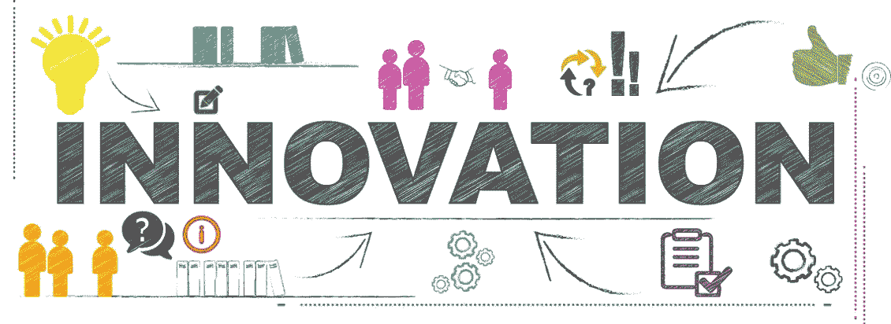
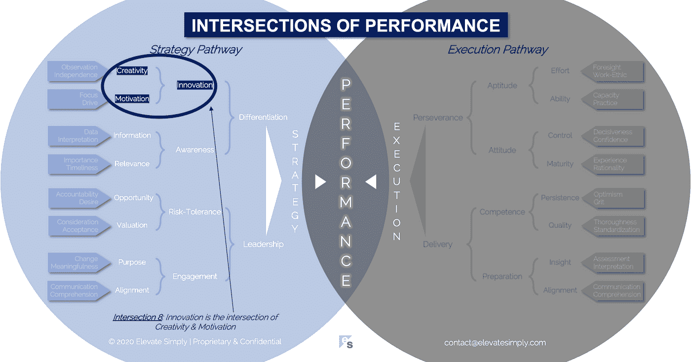

# 8.创新:创造力和动力的交汇点

> 原文：<https://medium.datadriveninvestor.com/8-innovation-the-intersection-of-creativity-motivation-7c1a12e0d5e2?source=collection_archive---------8----------------------->

Image from 123rf.com

有时创新源于需要。其他时候来自选择。无论如何，目标是进步，结果是改变。在发明方面的变化，创造全新的东西，或者在增量方面的变化，改善现有的东西。如果创新能产生显著的积极影响，我们认为创新是成功的。

创新有多种形式。它可以是名词(即创新)或形容词(即创新)，可以描述产品、服务、想法、流程、思维模式、理论、艺术表现、方法、策略、个人、团队、公司等。在标记一个行为时，它也用作动词(如创新)。从经济角度来说，人们普遍希望促进和激励创新，以获得诸多好处。

创新是如何发生的？

评估创新的第一步是确定被考虑的创新是发明还是进步？简单地说，就“产品”而言，它是有史以来第一代 iPhone 还是最新的 iPhone 版本？

思考过程，包括需要回答的问题，在两个场景中都相当简单和相似:

*   费用是多少？
*   从构思到部署需要多长时间？
*   谁需要参与？
*   端到端的流程是怎样的？
*   时机对吗？
*   预期投资回报率(ROI)是多少？
*   将如何营销？
*   将如何销售和购买？
*   它将如何受到保护(即知识产权)？

然而，创新始于想法本身和相关的“为什么”。

*如果是发明:*

*   这个世界需要什么，但目前还没有……为什么？
*   对它的需求已经存在，还是这项发明会创造自己的需求…为什么？
*   发明创造可行吗…为什么它还不存在？

*如果是增量:*

*   存在哪些可以改进的地方…为什么？
*   世界知道增量是一种选择吗？它是需要的吗？为什么或为什么不需要？
*   增量是否可行…为什么还没有完成？

创新者，无论是个人、团队还是公司，都是特殊的。他们以自己独特的方式，在创新的同时回答发明或增量问题。创新不会发生在真空中。创新是建立在一个基础上的，这个基础就是创新交叉点。

**什么是创新交集？**

创新是创造力和动力的交叉点*(见下图交叉点 8)*。这些都是为所有类型的创新提供配方的成分。没有创造力，创新是无聊的。没有动力，创新就不会发生。

*创意*

创造力是创新中的亮点。其结果是“什么”和“如何”。

*   有什么创新？
*   它是如何被带到生活中的？

创造力是对存在更好选择的认识。这是一种能力，不仅能预见到这种选择，还能在适当的背景下使之相关。创造性并不以想法(即“是什么”)结束，而是通过实施(即“如何”)继续下去。我一直很钦佩那些能够将创新从概念变为现实的人，无论他们是艺术家、商人还是公司。

创造力是任何组织寻求差异化创新的秘方。

交叉点 8:创新=创造力+动力

Image by [Brett Simpson](https://medium.com/u/191cf90a65d7?source=post_page-----7c1a12e0d5e2--------------------------------)

*动机*

动机是创新的驱动力。其结果是“为什么”和“什么时候”。

*   为什么要开发创新？
*   什么时候可以访问？

创新发生的原因是因为动机。在创新过程中，变革的机会被认可，价值被赋予，从而创造欲望和/或需求。将事件顺序与可行性结合起来，动机的组成部分就在一起了。创新有许多激励因素，包括:

*   幸存
*   增长
*   收入/利润
*   承认
*   成功
*   内疚
*   贪婪
*   骄傲
*   社会公益

动机是点燃创造力的火花。

**领导者能做什么？**

领导者需要在“创新或死亡”的咒语中承认现实，尤其是在不确定、变化或混乱的时期。他们通过在组织内积极宣传创新的重要性来做到这一点。

1.  让人们知道创造力是有价值的
2.  使用激励来引导努力

听起来很简单，领导者应该鼓励创新思维和行动。明确的鼓励和故意的不气馁是非常不同的。

**总结&下一个**

企业创新始于领导层的接受心态。然后，这渗透到整个组织，并导致一个拥抱变化，承担风险的企业，准备创新。

下一次我们将检查性能的第 9 个交叉点，也就是**目的交叉点**。

在这一系列文章中，我们探索了性能的交集，共有 30 个。绩效的交叉点*框架基于*[*Brett Simpson*](https://www.linkedin.com/in/brettjsimpson/)*[*董事总经理【简称为*](https://www.linkedin.com/company/elevatesimply/)*】20 多年来作为企业家、顾问和投资者在大大小小组织中的领导经验和见解。**

***绩效-文章链接的交集***

*1.[绩效:战略的交集&执行](https://medium.com/the-innovation/1-performance-the-intersection-of-strategy-execution-2bf06329f8d4)*

*2.[战略:领导层的交集&分化](https://medium.com/the-innovation/2-strategy-the-intersection-of-leadership-differentiation-a568b17731ab)*

*3.[领导力:敬业度的交集&风险承受能力](https://medium.com/the-innovation/3-leadership-the-intersection-of-engagement-risk-tolerance-f8c887e6c1d3)*

*4.[差异化:创新的交叉点&意识](https://medium.com/@brettjsimpson/4-differentiation-the-intersection-of-innovation-awareness-a21d053ecf12)*

*5.[接合:目的的交集&对准](https://medium.com/@brettjsimpson/5-engagement-the-intersection-of-purpose-alignment-953747437c26)*

*6.[风险承受能力:机会的交叉点&估值](https://medium.com/@brettjsimpson/6-risk-tolerance-the-intersection-of-opportunity-valuation-29cf4d9a0ac)*

*7.[认知:信息的交集&关联性](https://medium.com/@brettjsimpson/7-awareness-the-intersection-of-information-relevance-f0fd5322bcb7)*

*8.[创新:创造力的交汇点&动机](https://medium.com/@brettjsimpson/8-innovation-the-intersection-of-creativity-motivation-7c1a12e0d5e2)*

*9.[目的:变化的交集&意义](https://medium.com/@brettjsimpson/9-purpose-the-intersection-of-change-meaningfulness-9f12b0153e1)*

*10.[估价:对价的交集&验收](https://medium.com/@brettjsimpson/valuation-the-intersection-of-consideration-acceptance-eebe7b15e763)*

*11.[机遇:欲望的交汇&问责](https://medium.com/the-innovation/opportunity-the-intersection-of-desire-accountability-7e81adb1e195)*

*12.[相关性:重要性的交集&及时性](https://medium.com/@brettjsimpson/relevance-the-intersection-of-importance-timeliness-56cc748eb066)*

*13.[信息:数据的交集&解读](https://medium.com/@brettjsimpson/information-the-intersection-of-data-interpretation-62acc94ba8bf)*

*14.[动机:焦点的交集&驱动](https://medium.com/@brettjsimpson/14-motivation-the-intersection-of-focus-drive-d9ebd3ca9951)*

*15.[创造力:观察的交集&独立性](https://medium.com/@brettjsimpson/15-creativity-the-intersection-of-observation-independence-57f7294acb2b)*

*16.执行:毅力和交付的交叉点*(即将推出！)**

*17.交付:准备与能力的交叉点*(即将推出！)**

*18.毅力:天资与态度的交汇*(即将推出！)**

*19.准备:洞察与对齐的交集*(即将推出！)**

*20.能力:坚持与质量的交集*(即将推出！)**

*21.态度:控制与成熟的交集*(即将推出！)**

*22.资质:努力与能力的交集*(即将推出！)**

*23.洞察力:评估与解释的交集*(即将推出！)**

*24.质量:彻底性和标准化的交汇点*(即将推出！)**

*25.坚持:乐观与勇气的交汇*(即将推出！)**

*26.成熟:经验与理性的交集*(即将推出！)**

*27.控制:果断与自信的交集*(即将推出！)**

*28.能力:能力与实践的交集*(即将推出！)**

*29.努力:远见和职业道德的交集*(即将推出！)**

*30.对齐:传播与综合的交汇点*(即将推出！)**