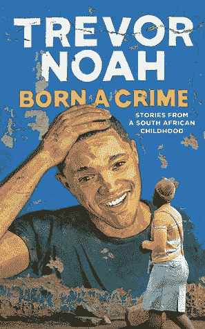
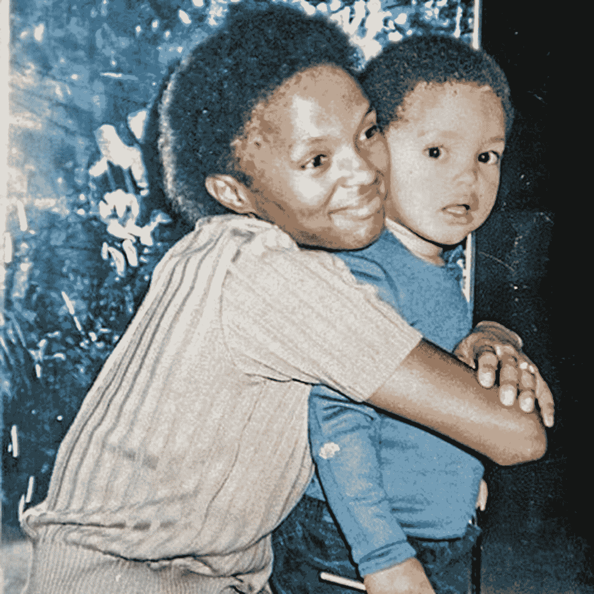

# “生来有罪”的 8 个教训

> 原文：<https://medium.datadriveninvestor.com/8-lessons-from-born-a-crime-584c8f5ad35f?source=collection_archive---------0----------------------->

## 特雷弗·诺亚谈种族隔离时期的成长

[Source](https://i.gr-assets.com/images/S/compressed.photo.goodreads.com/books/1473938533l/30333188.jpg)

特雷弗·诺亚是一名获奖的南非喜剧演员和每日秀的主持人。2016 年，他发布了他的第一本书*生而有罪*，这本书立即成为《纽约时报》的畅销书，销量超过 100 万册。

*生来有罪*是一个故事集，讲述了特雷弗在南非种族隔离的最后几年和随后的动荡时期的童年故事。作为一名瑞士裔德国白人父亲和一名科萨族黑人女子的儿子，特雷弗生来就是一个罪犯，当时跨种族关系在南非是非法的。这是一部快节奏的、经常充满温情的回忆录，尤其是当他写到他慈爱而无畏的母亲时。

无论是被扔出一辆载满歹徒的行驶中的公共汽车，还是因驾驶偷来的汽车而被投入监狱，所有的故事都让我震惊、惊讶或大笑。我想分享我从这本书中学到的 8 条人生经验。

## 了解生活中所有的可能性是至关重要的

> “我们告诉人们要追随自己的梦想，但你只能梦想你能想象到的东西，而且取决于你来自哪里，你的想象力可能相当有限。可能性的最高境界远在你所能看到的世界之外。我母亲向我展示了什么是可能的。”

从很多方面来看，*生来有罪*是一封写给特雷弗母亲帕特丽夏的情书。帕特丽夏选择生下特雷弗，作为对种族隔离的抗议，并独自抚养他长大。最重要的是，她希望特雷弗可以自由地去任何地方，做任何事情，成为任何人。

她也给了他这样做的工具。她把英语作为他的第一语言教他，并经常给他朗读。她会把人们捐赠给她的教堂的成箱的书带回家。她还买了一套百科全书，特雷弗会在空闲时间翻阅。

如果她有一个人生目标，那就是解放特雷弗的思想。她像成年人一样和他说话，这在南非是不寻常的。她经常给他讲圣经中的故事，并询问他这些故事如何应用到他的生活中。她教会了他学校里没有的东西——如何思考。

邻居们和亲戚们认为帕特丽夏疯了。如此多的黑人已经将种族隔离的逻辑内在化，并成为他们自己的逻辑。他们会问，“如果他永远不会离开犹太人区，为什么要让他看世界？”

“因为，”她会说，“即使他从未离开过犹太人区，他也会知道犹太人区不是世界。如果这就是我的全部成就，那我已经做得足够了。”

Trevor and Patricia- [Source](https://lh3.googleusercontent.com/mFhp2UQmc_7snXBVPs6c6xqUjnbSv5TBNr4Oa4ba14XTlKMYuv7PEEazgyBbT_aeOetprUbyseXfuz8HltPYz3NEtr3fxNSQPA=s1500-pp)

## 语言可以统一也可以分裂

> “语言带来了一种身份和一种文化，或者至少是对它的理解。一种共同的语言说“我们是一样的。”语言障碍表明‘我们是不同的。"

从小到大，特雷弗因为肤色浅而受到不同的对待。他的祖母给出了可怕的隐藏，但拒绝殴打特雷弗，因为他擦伤的方式不同于他的堂兄弟。

他的邻居在指路时把他当作路标:“Makhalima 街的房子。在拐角处，你会看到一个浅肤色的男孩。在那里向右转”。

特雷弗很快认识到语言是弥合这一种族鸿沟的最佳途径。他学会了几种语言，因为他生长在一个别无选择的家庭。他的母亲确保英语是他的第一语言，因为这是在种族隔离的南非获得成功的唯一途径。在英语之后，科萨语在家里被广泛使用，祖鲁语和科萨语相似。他的母亲说德语是因为他的父亲，说南非荷兰语是因为“学习你的压迫者的语言是有用的。”

特雷弗用这些语言跨越国界，处理各种情况，在世界上导航。他明白了语言，甚至比颜色更能定义你对人们来说是谁。

一天，特雷弗走在街上，几个祖鲁族人紧跟在他后面。他能听到他们用祖鲁语互相谈论他们将如何抢劫他。

“让我们抓住这个白人。你去他左边，我从他后面跟上。”

知道自己跑不动了，特雷弗转过身，用祖鲁语回答道:

“哟，伙计们，我们为什么不一起抢劫呢？我准备好了，开始吧。”

短暂的震惊之后，这两个家伙突然大笑起来。

“对不起老兄，我们以为你是别的什么东西。我们不想从你身上拿走任何东西。我们试图偷白人的东西”

他们准备暴力伤害特雷弗，直到他们觉得他们是同一个部落的一员。

> “我变成了变色龙。我的颜色没有改变，但我可以改变你对我颜色的看法。如果你用祖鲁语跟我说话，我会用祖鲁语回答你。如果你用茨瓦纳语和我说话，我用茨瓦纳语回答。也许我长得不像你，但如果我说话像你，我就是你。”

## 生活在贫困中的人需要获得成功的手段

高中时，特雷弗开始做音乐盗版生意，刻录流行专辑的 CD，卖给他的同学。然而，当他的一个富有的白人朋友丹尼尔免费送给他 CD 刻录机时，他的生意才真正起步。特雷弗现在能够控制生产、销售和分销——创造一个成功的盗版 CD 生意所需要的一切。

特雷弗有生以来第一次有钱了。关于钱，他学到的第一件事是它给你选择。特雷弗可以选择是在家吃饭还是去麦当劳。他可以选择穿什么，也可以选择买一部新电话。

> “人们不想变得富有。他们希望能够选择”

没有丹尼尔这一切都不可能。他在小范围内的所作所为凸显了赋予被剥夺权利者权利的重要性。

> “丹尼尔是白人。他的家人可以获得教育、资源和电脑。几代人以来，当他的人民准备上大学时，我的人民挤在茅草屋里唱着“二乘二等于四”。三乘以二等于六。

特雷弗的家人被剥夺了丹尼尔认为理所当然的东西。特雷弗有销售的天赋，但如果没有原材料，他将一事无成。

人们总是对穷人说教:“为自己负责！做出点成绩来！”但是穷人用什么原材料来创造自己的东西呢？

人们也喜欢说“给一个人一条鱼，他会饱一天。教一个人钓鱼，他将终生饱腹”。但是这个类比缺少的部分是，“如果你给他一根鱼竿就好了。”

与丹尼尔一起工作是特雷弗第一次明白，你需要一个来自特权世界的人来帮助你提供你需要的东西，并向你展示它是如何工作的。人们说“哦，那是施舍。”不，特雷弗仍然必须努力工作才能从 CD 刻录机中获利。但是没有它，他就没有机会了。

## 简单地没有目标地忙碌是一件危险的事情

高中毕业后，特雷弗在亚历山德拉生活了近三年——这是一个由临时棚屋和棚屋组成的人口稠密的城镇(特雷弗称之为“胡德”)。他开始和他的朋友 Sizwe 一起卖盗版光盘，但这很快演变成一个繁荣的发薪日贷款和典当行业务，基于他们建立的关系。

每天，特雷弗都会从早上 7 点忙到晚上 7 点:我们怎样才能把 10 兰特变成 20 兰特？二十兰特换成五十兰特？五十进一百？这将是一整天的工作角度，会见人和销售的东西。有很多天，他和希兹会觉得很有成效，即使他们又回到了起点。

忙碌对于工作就像滚动社交媒体对于阅读一样。如果你把你一年在网上的阅读量加起来，你已经读了一吨的书。但事实上，你根本没读过书。忙碌是一个仓鼠轮子，最大的努力导致最小的收获。

> “兜帽是一种低压力的生活。你所有的精神能量都投入到生活中，所以你不必问自己任何大问题。我是谁？
> 我应该是谁？
> 我做得够吗？”

就这样，兜帽给人一种奇怪的安慰。但是舒适可能是危险的。**舒适提供了地板，也提供了天花板。**举个例子，特雷弗的一个朋友曾经失业，整天和他的队友混在一起。然而，当他找到工作后，每个人都取笑他的奇装异服和书籍。

一天早上，他没穿上班的衣服，解释说他因为偷窃被解雇了。特雷弗确信他破坏了自己，所以他会被接受回到组里。

> “引擎盖有引力。它不会丢下你，但也不会让你离开。”

 [## 健身房 10 年的 10 条人生经验|数据驱动的投资者

### 走错一步，他们就会掉下去。两位登山者优雅地回到了地面。他们在那里…

www.datadriveninvestor.com](https://www.datadriveninvestor.com/2020/02/03/10-life-lessons-from-10-years-in-the-gym/) 

## 近距离仇恨要难得多

当特雷弗在贫民区混的时候，他经常买卖明知是偷来的货物。朋友们会说，他们以极低的价格出售全新的耐克运动鞋，得到了“员工折扣”。他知道这些都不合法。但守则是永远不要问。

当他天真地询问他们正在购买的汽车音响的来源时，卖家只是耸耸肩说:“别担心，白人有保险。”这就是他所能想到的。

直到特雷弗买了一台数码相机。当他打开它时，里面全是一家人度假的照片。虽然其他被盗物品的影响被不同程度地消除了，但相机有一张脸。

> “我没有偷过相机。我窃取了某人的记忆。我偷走了某人生活的一部分。”

在两年的职业生涯中，特雷弗从未认为自己是个罪犯。这只是人们发现的东西。白人有保险。在社会中，我们互相做可怕的事情，因为我们看不到受影响的人的脸。这也正是当初建造这个罩子的原因，让种族隔离的受害者看不见，想不起来。因为如果白人将黑人视为人类，他们就会明白种族隔离是不合理的。

> “如果我们能看到彼此的痛苦并感同身受，那我们就不值得去犯罪”

## 后悔是一个永恒的问题，你永远不会有答案

> “我不后悔我在生活中做过的任何事情，我做的任何选择。但是我为我没有做的事情，我没有做的选择，我没有说的话感到后悔

作为一个孩子，特雷弗有非常严重的痤疮，他的脸和脖子上长满了大丘疹。贫穷没有帮助，因为他负担不起治疗甚至理发的费用。他的母亲还给他买了大几号的衣服，这样他就可以“长大后穿上”。宽松的裤子，厚重的夹克，小丑鞋。

在学校的时候，特雷弗非常喜欢一个女孩，但是一直没有勇气约她出去。他们会聊上几个小时，但他总是回避这个问题，相信她永远不会喜欢一个看起来像他这样的人。

直到她移居美国，他才发现她也喜欢他。

> “后悔是我们最应该害怕的事情。失败是一个答案。拒绝是一种回答。后悔是一个你永远不会有答案的永恒问题。”如果……"如果……"我想知道会发生什么……"你将永远不会知道，这将在你的余生中萦绕心头。"

## 作为局外人做局内人比作为局内人做局外人容易

无论特雷弗小时候住在哪里，他都是个异类。在希尔布劳，他住在一个没有人看起来像他的白人区。在索韦托，他住在一个黑人区，那里没有人看起来像他。伊甸园公园是一个有色人种(用来描述混血儿的术语)区。在伊甸园公园，每个人看起来都像特雷弗，但他们有着天壤之别。

其他有色人种儿童对他的敌意是特雷弗成长过程中最艰难、最困惑的经历之一。这让他明白了，作为局外人做局内人比作为局内人做局外人容易。

白人会接受一个采用白人习惯的黑人。如果他选择“闭上他的黑眼睛”，打很多高尔夫球，白人会说“我喜欢布莱恩，他很安全”。但是，如果一个白人在仍然生活在白人社区的时候采用了黑人服饰，他就被驱逐了。

> “如果人们认为你是一个试图融入他们世界的局外人，他们就会愿意接受你。但是当他们将你视为试图否认部落的部落成员时，这是他们永远不会原谅的事情”

亚当·格兰特在他的书 *Originals* 中探讨了类似的“横向敌意”概念。与完全对立的意识形态相比，激进团体通常更敌视同一意识形态的温和版本。这些温和派被贬为骗子和叛徒。

当一名失聪妇女赢得美国小姐桂冠时，失聪积极分子抗议说，她不够“失聪”，因为她说的是口头语言，而不是使用手语。激进的环保主义者认为绿色和平组织是一个“受环保利益驱使的无脑怪物”。在达特茅斯心理学家朱迪思·怀特进行的一项研究中，纯素食者对素食者的偏见几乎是对肉食者的三倍。在纯素食者看来，素食者都是崇拜者，如果他们真的关心这项事业，他们会全力以赴。

## 质疑不合逻辑的系统

在整个童年，特雷弗都遇到过不合逻辑的系统。而他被母亲养大的方式，他从来不害怕大声疾呼这些制度，揭露它们固有的漏洞和瑕疵。

种族隔离是这种制度的最好例子。它的致命缺陷是没有意义。比如南非的中国人就被归为黑人。不像印度人，没有足够的中国人来保证他们自己的分类。种族隔离不知道如何处置他们，所以政府决定称他们为黑人。

与此同时，日本人被归类为白人。这是因为南非政府希望与日本建立良好的关系，以进口他们的汽车和电子产品。因此，日本人被授予荣誉白人身份，而中国人仍然是黑人。

小时候，特雷弗也上过天主教学校。星期五弥撒的圣餐规则对他来说毫无意义。他站着，跪着，祈祷了一个多小时，但不能领圣餐，因为他不是天主教徒。他只能看着其他孩子吃耶稣的身体(饼干)和血(葡萄汁)。

于是有一天，他决定溜到祭坛后面，把整袋圣餐吃掉，把那瓶葡萄汁喝掉。在他看来，他没有违反规则，因为规则没有意义。

他被抓只是因为他们违反了自己的规则。另一个孩子在忏悔中出卖了他，牧师报告了这个据说是机密的信息。

有趣的是，他妈妈完全同意他的观点。“你在惩罚一个孩子，因为他想要耶稣的身体和血？为什么他不该有那些东西？"

> “这就是我妈妈奇怪又神奇的地方。如果她同意我的观点，认为一条规则是愚蠢的，她就不会因为我违反了这条规则而惩罚我。唯一让她事与愿违的是，我不断挑战和质疑她。”

这是我从《生来有罪的 T2》中学到的八条经验。特雷弗·诺亚的回忆录生动、有趣、感人，是这位喜剧演员的粉丝以及任何希望了解种族隔离影响的人的必读之作。

## 获得专家观点— [订阅 DDI 英特尔](https://datadriveninvestor.com/ddi-intel)