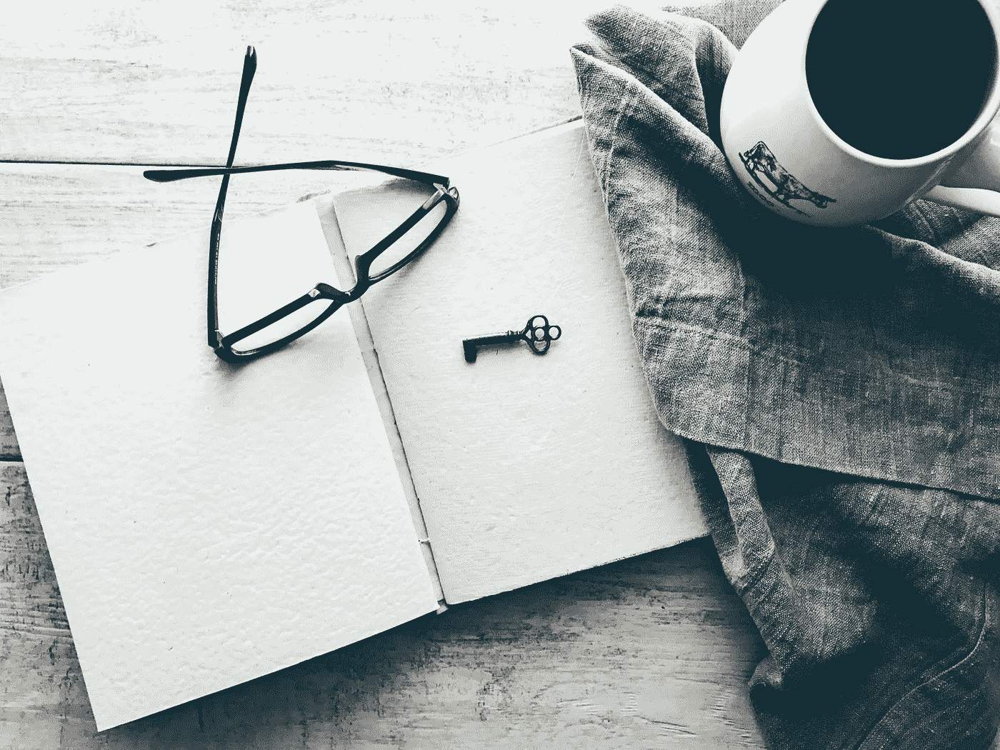

# 8 个有助于你工作效率飙升的小习惯

> 原文：<https://medium.datadriveninvestor.com/8-micro-habits-that-will-help-your-productivity-skyrocket-89e76678ff2?source=collection_archive---------8----------------------->

## 微小的变化会产生巨大的结果

Photo by [S O C I A L. C U T](https://unsplash.com/@socialcut?utm_source=unsplash&utm_medium=referral&utm_content=creditCopyText) on [Unsplash](https://unsplash.com/s/photos/drink-water?utm_source=unsplash&utm_medium=referral&utm_content=creditCopyText)

在我们追求生产力的过程中，我们倾向于寻找改变生活的习惯。

我们一直在寻找一个能改变我们生活的巨大的生产力突破。

然而，这种心态将我们的注意力从能够产生巨大影响的提高生产力的小习惯上转移开了。

有时候，对我们日常生活的一些小调整会超过一两个“大改变”的效果。

这就是微习惯发挥作用的地方。

总之，这些看似微小的行动将创造一个提高生产力的环境。这种环境将产生持续的生产力，而不是孤立的高峰。

简而言之，小习惯为持续的生产力奠定了基础。

在此基础上，这里有八个微习惯，将帮助你的生产力扶摇直上。

# **1。喝大量的水和一些健康的药剂**

许多人低估了大量饮水对健康的好处。

根据[健康热线](https://www.healthline.com/nutrition/7-health-benefits-of-water#7.-Can-aid-weight-loss)的说法，每天喝至少 64 盎司(1.9 升)水的好处包括更好的注意力集中，提高你的身体性能，支持你的减肥旅程。

这听起来可能是显而易见的，但许多人甚至没有注意到没有达到两升的阈值。

这就是我自己的情况。我是零度可乐和咖啡的忠实粉丝，尽管我总是喝很多水，但我从来没有注意过我的实际摄入量。

一旦我开始跟踪我的消费量，我意识到我每天只喝 1.5 升，不足以感受到显著的生产力提升。

我想出了一个简单而有效的方法。

我每天早上装满一个两升的瓶子，放在我的桌子上。这样，我知道如果一天结束时瓶子空了，我就完成了我的用水目标。

随着时间的推移，我把目标提高到了 3 升。三升水意味着更少的零可乐和更少的咖啡。即使我仍然喜欢这两个，水现在是我的优先事项。

好处是巨大的。

在每天喝三升的一个月之后，我一整天都感觉精力充沛，不那么疲惫了。这个小小的改变给我的日常用水带来了巨大的生产力提升，而我的牺牲却很小。

同样，健康的奶昔和富含超级食物的奶昔可以提高你早上的工作效率。不要添加太多的糖或化学物质。关注超级食物。

[像抹茶、马奎果和杏仁这样的配料被称为“超级食物”是有原因的。它们富含氨基酸、天然脂肪和维生素 C，这些都是保证你一整天能量水平的必要营养物质。](https://www.craftsmoothie.co.nz/blog/top-10-superfoods-for-smoothies-and-why-theyre-super)

# **2。尽可能多走楼梯**

另一个可以提高你工作效率的小习惯是爬楼梯。

问问你自己:你多久乘一次电梯到达二楼或三楼？

爬楼梯不会花太多时间，但好处很大。

爬楼梯是一种[低强度有氧运动](https://health.usnews.com/wellness/fitness/the-health-benefits-of-stair-climbing-exercise)，你可以每天都做，不需要太多努力。更好的是，它帮助你保持平衡，同时锻炼多块肌肉。

通过确保一天中持续的运动，你可以减少感觉懒惰和没有动力的风险。

这些简短的有氧运动会让你的身体保持新鲜和活力，帮助你保持高生产率。

# **3。睡觉前列出待办事项**

今天的生产力从昨天晚上开始。

夜间惯例是一个强大的生产力工具，睡觉前列一个待办事项清单是这个过程中不可或缺的一部分。

首先，睡觉前你会觉得很有条理。那种“我已经为明天做好准备”的感觉会让你头脑清醒，提高你的睡眠质量。

其次，你会带着一种目标和意图的感觉醒来。早上，你会知道你必须做什么，因为你前一天晚上做了作业。

结合起来，这个待办事项列表的精神和组织方面将会导致生产力的实质性提高。

 [## 确保早晨成功的 7 个有效的夜间习惯

### 富有成效的早晨从前一天晚上开始

medium.com](https://medium.com/illumination-curated/7-effective-night-habits-that-will-ensure-morning-success-918c29bdd1b7) 

# **4。将贪睡按钮从你的生活中驱逐出去**

就像醒来时有待办事项清单一样，永远避免打盹会节省时间，让早晨更美好。

不按贪睡键可能只会让你的一天增加 10 分钟，但是这 10 分钟会对你的工作效率产生重大影响。

再次，有精神和实际的组成部分。

放弃打盹会给你一种镇定和决心的感觉。你想起床是因为你为今天的挑战做好了准备。

除此之外，你还可以为你的一天增加几分钟——这几分钟你可以用来在晚上起草你的待办事项清单或者多喝一点水。

因此，你的微习惯可以复合并逐渐形成一个提高生产力的环境。

 [## 在家工作如何提高我的工作效率|数据驱动型投资者

### 在家工作确实激发了我最大的潜能，让我更有效率。因为在家工作给了我…

www.datadriveninvestor.com](https://www.datadriveninvestor.com/2020/07/29/how-working-from-home-increased-my-productivity/) 

# **5。写下你所有的想法、问题和解决方案**

我们脑子里都有有趣的想法、问题和解决方案。

我们躺在床上，想象着有趣的家庭办公室设置、应对当前职业挑战的解决方案，以及给我们的关系增添情趣的新方式。

我会记住的。没必要写下来。

这是我们大多数人失败的地方。事实上，大多数这些午夜的想法永远不会实现。解药就是把*每件事*都写下来。

你的大部分笔记将仍然是模糊的想法，但有些会产生结果。

举个例子，我的文章至少有一半是从床头笔记开始的。

在我每晚的阅读过程中，我经常会想到一些不精确的故事概念。我把它们写在日记里，第二天，我把它们转换成适当的轮廓。

Photo by [Debby Hudson](https://unsplash.com/@hudsoncrafted?utm_source=unsplash&utm_medium=referral&utm_content=creditCopyText) on [Unsplash](https://unsplash.com/s/photos/journal?utm_source=unsplash&utm_medium=referral&utm_content=creditCopyText)

# **6。为你的任务计时**

对于[的企业家](https://www.entrepreneur.com/article/332290)和员工来说，时间阻塞是一种广受欢迎的生产力技巧。

不要从一个任务跳到另一个任务，为特定的任务留出一个明确的时间。这些积木会帮助你专注于手头的工作，排除杂念。

假设你的待办事项列表包含以下元素:

*   清理您的电子邮件收件箱；
*   写完作业 X；
*   完成商业计划书 Y；
*   呼叫客户端 Z；和
*   组织下周的会议。

使用块策略，您的一天可能如下所示:

*   上午 8 点到 11 点:写完作业 X；
*   上午 11:30 到下午 12:30:呼叫客户端 Z；
*   下午 1 时 30 分至 3 时 30 分:完成商业计划书 Y；
*   下午 3.45 到 4.45:清理邮箱收件箱；和
*   下午 5 点到 6 点:组织下周的会议。

这个每日计划可能看起来很死板，但是它会防止你一心多用，分散注意力。

考虑到不可预见的细节或紧急情况，在你的日程表上增加一些休息时间。这些孔将确保灵活性，并提供休息时间。

总而言之，定时任务是一个直截了当的过程，但很少有人坚持。我们都有一个时间表，但是我们经常因为一些小事而打断它。

因此，街区原则是一个有效的微习惯，可以训练你的注意力，进一步加强你的纪律性。

# **7。自动回复邮件**

下一个微习惯与你的邮件回复者有关。

我们每天都会收到大量的电子邮件。

很多都是徒劳的。其他的是“让我们以后检查那个。”有些很关键。

自动电子邮件回复器可以解决大多数这样的情况。

你会迅速处理那些不重要的。一个自动应答器，大意是“非常感谢您的请求，我们将尽快处理”“将在不冒犯发送者的情况下赢得宝贵的时间。

如果它仍然是一个不重要的请求，下一个自动响应者可能是:

*谢谢你的请求。在仔细审查您的查询后，我们认为我们目前对您的服务没有任何兴趣。*

您可以为两个响应者设置特定的时间范围。如果一两天后你对电子邮件的内容不感兴趣，第二响应者会自动结案。

这项技术将过滤掉所有无用的垃圾邮件。你将有更多的时间关注那些对你个人或职业发展至关重要的事情。

# **8。不要一天查看社交媒体超过两次**

最后，为社交媒体留出特定的时间是一个强大的微习惯，将会带来难以置信的生产力提升。

首先也是最重要的，起床后不要查看你的脸书、Instagram 和 Twitter。在开始新的一天之前，你的脑子里会充满了娱乐和廉价的娱乐。

找个合适的时间查看社交媒体，其他时间不要打开你的应用。

在这种情况下，我午饭后会花大约 20 分钟在社交媒体上，晚饭后也会重复同样的动作。这些是不用工作的时间——防止社交媒体干扰我的工作日程。

总之，挑战在于确定你在社交媒体上的最佳时机。

确保你可以在这些活动中从娱乐因素中受益，而不要让社交媒体变成分散注意力的。

## 如果你喜欢这篇文章，[加入我的电子邮件列表，保持联系](https://minimalistfocus.com/email-list/)。

# 你可能也会喜欢

 [## 如何在困难时期保持你的生产力

### 艰难时期保持工作成果的 7 种方法

medium.com](https://medium.com/datadriveninvestor/how-to-safeguard-your-productivity-in-difficult-periods-13db0e6a6685) 

## 访问专家视图— [订阅 DDI 英特尔](https://datadriveninvestor.com/ddi-intel)