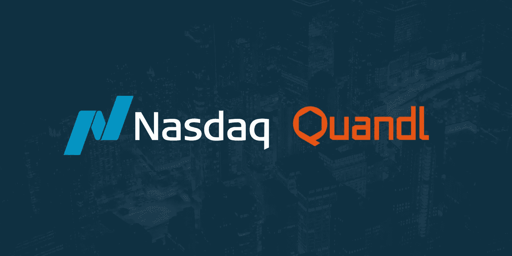

# 距离 2020 年纽约曼哈顿奥运会还有 8 天

> 原文：<https://medium.datadriveninvestor.com/8-more-days-to-qdc2020-manhattan-ny-a3591e5f9d86?source=collection_archive---------14----------------------->

***qdc 2020——当今数据驱动型投资者的思想领袖巅峰。***

***加入世界各地最优秀的头脑，探索埋藏在当今数据洪流中的信号***

> ***DDI 社区专属优惠:***
> 
> ***使用代码“qdc 2020 ddi”***获得通票八五折优惠

领先的替代数据提供商纳斯达克 Quandl 于 2020 年 1 月 23 日(星期四)在纽约市第 46 届会议地点宣布召开第四届年度 **Quandl 数据大会(QDC 2020)** 。

# ***特色演讲嘉宾包括:***

*   Point72 的专有研究主管柯克·麦克欧文(Kirk McKeown)；
*   马修·罗斯曼，高盛董事总经理；
*   O'Shaughnessy 资产管理公司首席投资官克里斯·梅雷迪思(Chris Meredith)；
*   以及 Showtime 的《亿万》执行制片人、《十三罗汉》的联合编剧布赖恩·科佩尔曼的主题演讲

[**点击这里了解更多关于 QDC2020**](http://bit.ly/2QWtLDN)

## 阅读下面我们的热门故事之一，了解替代数据如何改变世界！

[**Quandl 与另类数据革命**](https://www.datadriveninvestor.com/2018/07/30/quandl-and-the-alternative-data-revolution/)

[**替代数据分析— RS 度量金属信号**](https://www.datadriveninvestor.com/2019/09/19/rs-metrics-metalsignals-data-analysis/)

[**使用免费备选数据集寻找交易思路指南**](https://www.datadriveninvestor.com/2019/07/15/guide-to-use-alternative-datasets/)