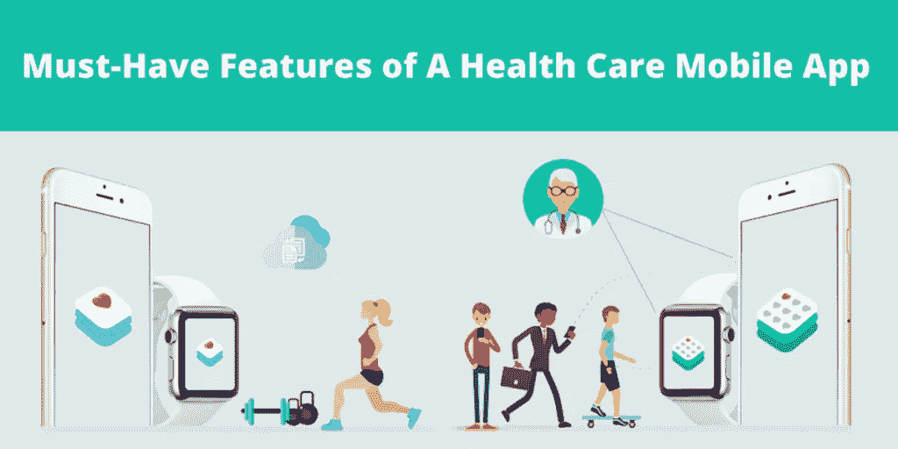

# 下一代医疗保健移动应用的 8 个必备功能

> 原文：<https://medium.datadriveninvestor.com/8-must-have-features-for-your-next-health-care-mobile-app-8ae0b5e8d5a9?source=collection_archive---------3----------------------->

如今，技术已经成为我们生活的重要组成部分，医疗保健行业也不落后。医疗保健行业已经给我们的生活带来了巨大的变化，并且每天都在增长。在今天的智能手机时代，移动应用程序正在接管世界。医疗保健行业在移动应用程序开发行业崭露头角并不奇怪。

 [## 医疗保健的未来正在被一场大型技术入侵所塑造|数据驱动型投资者

### 过去十年，全球经济的所有部门都经历了大规模的数字颠覆，而卫生部门现在…

www.datadriveninvestor.com](https://www.datadriveninvestor.com/2018/11/02/the-future-of-healthcare-is-being-shaped-by-a-big-tech-invasion/) 

医疗保健和医药是相辅相成的。值得注意的是，制药公司正专注于成功交易的在线药品销售和交付应用。有足够多的供应商和医疗保健移动应用程序已经在医疗保健领域引起了轰动。

# 医疗保健移动应用的重要性

市场上有大量的医疗保健应用程序。然而，是什么让最好的 app 脱颖而出呢？是用户友好的 UI 吗？自动填表？下次用药提醒？上门送药？还是以上都有？

**让我们了解医疗保健移动应用的重要性:**

*   医疗保健移动应用程序提供便捷的医疗服务。
*   网上随时可以得到专家的建议。
*   使用医疗保健应用程序方便、可靠、便捷，例如，让药品送货上门。
*   医疗保健应用是你可靠的信息来源。
*   它提供了令人兴奋的机会，如将病人护理扩展到诊所之外的能力。

没有人能否认对可穿戴和医疗保健移动应用的需求增长，因为它们正在主导应用商店。每个制药公司都在投资这些应用程序，因为它们产生收入，这是一个预计在 2020 年达到 6000 万的数字值。

> ***相关阅读:*** [***手机 App 开发最新趋势【2020 年更新】***](https://www.signitysolutions.com/blog/latest-trends-mobile-app-development/)

简而言之，与十年前相比，现在的用户意识更强了。从医学科学，保健提示，症状，每一个信息都可以很容易地在互联网上找到。

# 为医护人员和患者增加的功能:

医疗保健应用和设备与 CRM、大数据、物联网、云计算等工具相集成。，以一种非常微妙和强大的方式主宰医疗保健世界。然而，专业医疗保健移动应用程序中有一些医生和患者必备的功能。为了让你对它们有一个简单的了解，我们列出了 8 个你无论如何都不能错过的特性:

# 1.易于注册和登录:

注册和登录是与患者和医生互动的第一步。确保用户注册时流程简单。他们应该能够通过提供他们的个人信息，如姓名，电子邮件 ID，联系方式等注册。它应该更像是一个点击就走。步骤越少越好。登录也是如此。

用户应该能够在注册时提供的电子邮件、Gmail 或带 OTP 的电话号码的帮助下轻松登录他们的帐户。

# 2.简档访问和修改:

创建配置文件应该简单方便。用户应该被允许上传他们的照片和任何其他他们想分享的信息。但是，对于医生来说，所有需要的信息都应该是可用的，比如他们的专业、经验、诊所地址、联系方式以及他们的注册执业医师编号。用户也应该被允许随时改变和修改他们的个人资料。

# 3.搜索和咨询医生:

最好的医疗保健应用程序应该有一个智能过滤器，根据医生的专业，经验，评论，咨询费，教育，位置等搜索和过滤医生。患者和医生之间的应用内通信应该是容易的。

患者应该可以选择分享关于他们的病情、首选位置和/或医生/医院名称的信息，以便进行搜索。他们应该根据它得到相关的结果。

# 4.选择医生:

病人应该能够选择和选择医生根据他们的搜索结果后，过滤器。一旦他们完成入围，他们应该能够检查医生的个人资料和他的专业，探视时间，咨询费用，和诊所的位置。选择一个之后，患者应该可以选择只从应用程序中预订 OPD 咨询。

如果患者想了解处方药物，他/她应该能够在应用程序中搜索药物。

# 5.约会管理:

如果出于某种原因，医生不想见病人或时间不允许，他们应该获得授权来接受或拒绝会诊请求。只有在医生确认或接受请求后，客户才会收到通知/确认邮件以及 ID。

# 6.护理和药丸提醒:

应提供根据所需服务制定护理计划的选项。咨询费支付集成也应该在应用程序上可用。这项功能非常适合医疗保健移动应用程序，因为它还可以在客户的日程安排之前提醒他们的约会。如果需要的话，也可以加入常规处方药或药丸提醒。

# 7.多语言和云管理:

为了增强医疗保健移动应用程序的使用，用户应该能够以他们想要的语言或母语来操作应用程序。此功能有助于患者对您的服务有一个基本的了解。除了多语言应用程序界面，所有数据现在都可以通过云计算轻松存储。

简而言之，在简档中提供的订单发票、医疗报告、测试、既往病史、预约和其他基本患者信息可以由具有适当授权的患者随时随地访问。

# 8.远程医疗援助:

通过应用内功能联系医生或在应用内获取联系方式可以帮助用户在数英里外联系到他们想要的医生。在任何紧急情况下，远程医疗援助可以帮助医生检查症状并立即识别疾病。之后，基于患者既往病史的医疗建议成为可能。此外，病人仍应与最近的医院取得联系。

美国联邦贸易委员会在监管层面维护着一份移动医疗应用实践清单。然而，由于整个医疗保健行业的监管，开发商很难提供超出特定领域的应用程序。

医疗保健社区的成员已经提出了最佳实践，可以帮助收集意见和创建不损害用户隐私的应用程序，并促进跨渠道的健康沟通。这些实践可以帮助开发人员在不破坏行业标准的情况下构建高质量的应用程序。

# 医疗保健移动应用的必备安全功能

围绕可用于医疗保健专业人员和患者的数据和功能有这么多法规，毫无疑问，开发人员有点困惑。

根据 FTC 的概述，根据组织的需求、利益相关方和专业，美国的医疗保健[移动应用程序开发公司](https://www.signitysolutions.com/mobile-app-development-company-usahttps://www.signitysolutions.com/mobile-app-development-company-usa)应检查以下特性:

# 1.最少的数据收集

根据行业法规，在收集患者数据时，需要进行审查和标准维护。联邦贸易委员会建议只从患者那里收集与产品或服务不可分割的数据和信息。除此之外，应用程序应该有一个安全的路径来传输和存储数据。满足要求后，应根据指导原则删除所有数据。

# 2.有限的访问和权限

从位置、联系人、短信和图片到搜索历史，他们在下载任何应用程序时都需要请求批准。许多客户甚至没有关注或试图去思考任何应用程序会获取某些信息的原因。

医疗保健行业的开发人员必须确保他们不会在 API 访问中滥用用户信息。他们应该尽可能有直接的 UI 交互。这将确保制药行业不使用可信的组件。它将优化数据收集，同时减少不必要的数据收集。

# 3.安全认证

安全的身份认证方法对于医疗记录和信息来说是必不可少的。这些对病人、医疗专业人员甚至黑客来说都是有价值的。应不惜一切代价避免未经授权的访问；在开发过程中，应该优先考虑应用程序级安全性的身份验证。

在设计、实现和测试应用程序身份验证方面的投资应该是开发者和所有者从一开始就要考虑的首要问题。应考虑多因素身份认证，以防出现任何未经授权的访问风险。

最初发布于[https://www . signity solutions . com/blog/health care-mobile-apps/](https://www.signitysolutions.com/blog/healthcare-mobile-apps/)