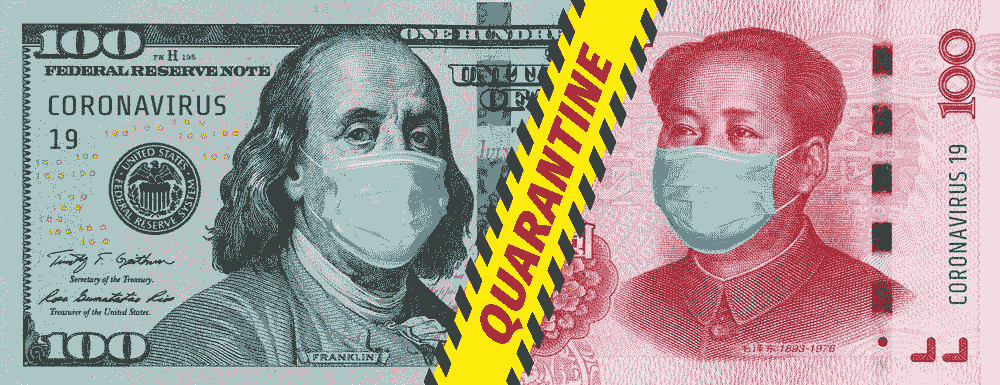
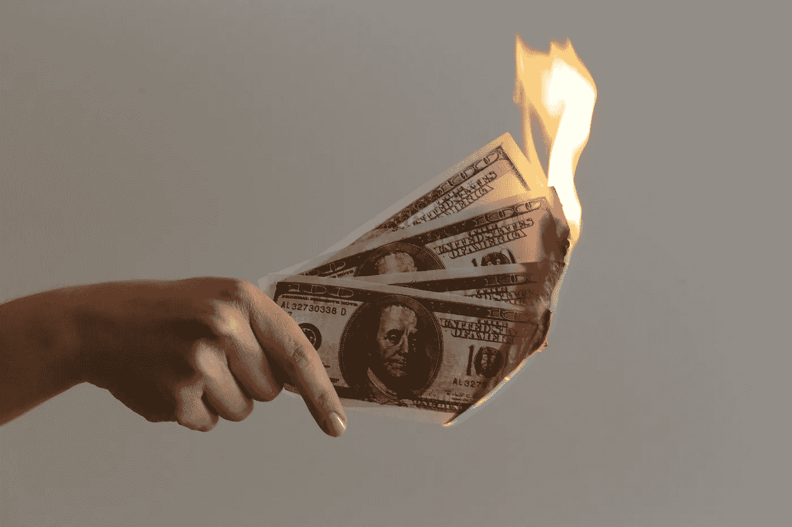
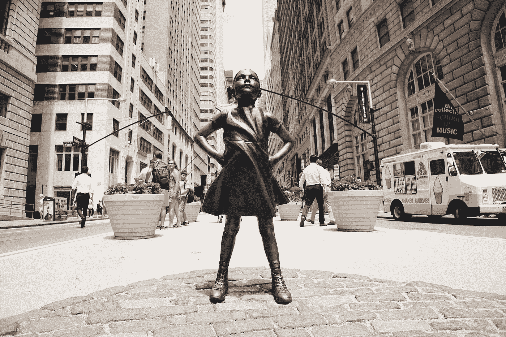

# 金融危机中 8 个必须知道的事实

> 原文：<https://medium.datadriveninvestor.com/8-must-know-facts-in-this-financial-crisis-353a84b8a4b2?source=collection_archive---------13----------------------->

这个世界刚刚被扇了一记耳光。

全球许多人被锁在家里害怕，这还不够。但是，我们也在努力应对自大萧条以来前所未有的经济灾难的影响。

想到所有将要倒闭的企业，以及挣扎着维持生计的人数，令人作呕。

对储蓄和投资的财务影响感到紧张就像一种奢侈。

也就是说，我们这些足够幸运有存款的人不能放松，需要掌握全局。

通过与朋友关于金融市场的谈话，很明显，许多人并没有意识到某些事实，而知道这些事实会让他们受益匪浅。

我不是在提供投资建议，而是列出了每个人在度过这场金融危机时都应该知道的八件事。

# 1.无限制的刺激

美国美联储已承诺无限刺激，以支持金融市场。

这可是件大事。

让我们从一个…

## 2008 年“大金融危机”回顾

从 2008 年 3 月开始，远在雷曼兄弟 9 月份破产之前，H*T 就已经风靡了一整年。当时，救助银行和其他行业极具争议，众议院最初拒绝了拟议的救助计划。

最后，在 10 月份，TARP(问题资产救助计划)获得了 7000 亿美元的救助资金。

TARP 的范围和规模在当时是前所未有的。

现在，十多年后，我们回过头来想想，与我们目前的量化宽松/刺激措施相比，这一切是多么可爱。

## 美联储承诺无限刺激

让我们对比一下 08 年的刺激和目前危机中发生的事情。在市场暴跌的一个月内，美国美联储通过两轮紧急降息将利率下调了 1.5%，目前几乎为零。

此外，他们已经获得批准，将在刺激措施中支出超过 2 万亿美元，预计还会有更多支出。他们已经公开承诺，他们打算无限制地购买资产来拯救经济。

真是难以置信。

尽管从技术上讲，他们这样做是非法的，但美联储一开始就买入了“投资级债券”，这被认为是最安全的公司债券。

在危机时刻，规则总是被扭曲。

他们并没有就此止步。

然后，他们开始购买风险更高、评级更低、违约几率更高的“垃圾债券”，因此出现了“垃圾”一词。

 [## 投资区块链前要问的三个简单问题(也是一个困难的问题)|数据…

### 现在是了解区块链的最佳时机。不同货币之间的增长率，比如…

www.datadriveninvestor.com](https://www.datadriveninvestor.com/2020/03/12/three-simple-questions-and-one-difficult-one-to-ask-before-investing-in-a-blockchain/) 

这并不是说不应该做这些。但理解他们愿意采取的支撑市场的措施是绝对必要的。

## 直升机撒钱

“直升机撒钱”也是这个方案的一部分。

与量化宽松不同，在量化宽松中，美联储购买国债等资产(他们也在这么做)，希望支撑金融市场的措施会惠及普通公民，而直升机撒钱则是普通公民直接从政府那里获得资金。

目前，这笔钱是以每人 1200 美元支票的形式发放的。

太棒了。

避开中间人，给日常生活中的乔买杂货和付房租所需的钱。

## 刺激计划中的其他措施

除了我前面提到的，美联储还通过以下方式提供刺激:

*   通过一个名为 PDCF(一级交易商信贷工具)的项目向证券公司提供贷款
*   重新启动一项名为 MMLF(货币市场共同基金流动性工具)的危机时期贷款给银行的计划。
*   向回购市场提供无限量的资金，以确保银行间借贷市场的顺畅。
*   通过贴现窗口直接贷款给银行，让银行继续运转。
*   暂时放松监管要求，鼓励银行放贷。
*   向中小型企业提供贷款。
*   向市政府和州政府贷款。

## 棚子里有很多工具

我认为，从美联储的所作所为来看，很明显降低利率并不是我们有时被误导的唯一工具。

了解其他政府在过去支撑金融市场的程度也是有益的。

2010 年，为了在 GFC 效应后提振股市，日本央行(BOJ)启动了一项购买股票交易所交易基金(ETF)的计划。

根据英国《金融时报》2019 年 3 月的一篇文章，日本央行持有近 80%的未偿日本 ETF 股票资产，还持有近一半的未偿日本政府债券。

停一会儿，让自己明白这件事的艰巨性。

如果日本银行购买了那么多的股票市场来支撑价格，想想看，如果美联储认为有必要的话，它还可以进一步刺激市场。

此外，所有有能力这样做的国家都在效仿美联储，推出自己前所未有的刺激计划。

# 2.什么是追加保证金通知，它们是如何加剧股市崩盘的

## 什么是追缴保证金

如果你错过了看黛米·摩尔的《元素》，那么你应该看看电影《追加保证金》。

这是一部不可思议的电影(不仅仅是因为它有一个更老的黛米)，描述了一个基于高盛的虚构公司的事件，在 2008 年危机中驾驭其账面上愚蠢的杠杆数量。

那么，什么是追缴保证金？

当一个人用保证金投资时，这意味着他们在贷款并用借来的钱购买资产。当所购买资产的价格下跌，贷方要求你增加账户资金或者清算/卖出现有资产时，就会发生追加保证金的情况。

在这个时代，金融世界就是一个极端杠杆的世界。想想罗伯特·清崎(《富爸爸穷爸爸》的作者)，尽管他的公司在 2012 年宣布破产，但他仍在宣扬利用杠杆致富的好处。然而，他仍然在全世界推销他的课程。

公平地说，当事情进展顺利时，杠杆将成倍增加你的回报，但当资产价格下跌时，它将摧毁你。这是众所周知的双刃剑。

## 追缴保证金是如何运作的一个例子

让我们看一个简单的例子来理解保证金追缴是如何运作的:

我开了一个经纪账户，用自己的 5 万美元现金和 5 万美元保证金/贷款(从经纪人那里借来的钱)买了价值 10 万美元的 SPY(标准普尔 500 ETF)。

在这种情况下，经纪人可以执行 25%的维持保证金。这意味着我的资产的数值/名义价值必须超过账户总价值的 25%，减去贷款的 50，000 美元。

所以，假设我以 10 万美元买入的间谍 ETF 价值暴跌 40%，现在价值 6 万美元。现在，不包括贷款，我的资产价值已经从 50，000 美元下降到了 10，000 美元。这是因为我还欠经纪人我借的 50，000 美元，所以我从我持有的股票现在价值的 60，000 美元中减去这个数额，我自己的钱只有 10，000 美元。

在这种情况下，我现在低于 25%的保证金维持水平，因为我的 10，000 美元只占总账户规模 60，000 美元的 16.67%。

我现在需要在我的经纪账户上增加 5000 美元，以达到要求的 25%的保证金水平。如果我不这样做，那么经纪人会清算足够的股票，使我达到需要的水平。

## 为什么这很重要

你可以看到，在我们以投资为目的的过度杠杆化的金融世界中，随着追加保证金通知的触发，股价的突然大幅下跌将导致更多的抛售，从而导致市场进一步走低。

追缴保证金是加剧近期股市暴跌的一个重要因素。不过，他们似乎暂时平静下来了。

# 3.我们正处于一个新的金融时代

老生常谈在生活中无处不在，被认为是真理，直到它们不再正确。

这就是典型的 60/40 投资组合，你将 60%的储蓄投资于股票，40%投资于债券。基本原理是，当你持有的股票价值在市场崩盘中暴跌时，你持有的债券将跑赢大盘，从而抵消股票的损失。

这在过去一直有效…直到现在。

金融市场现在真的有些不同了。我们在《金融 101》中学到，当利率下降时，债券价格会上涨，因为现有债券的息票/利率变得更有吸引力。

然而，随着这次股市崩盘，美国国债价格也下跌了。

这是不应该发生的。

美国国债被认为是一个人可以拥有的最安全的资产，因为美国有能力印钞为其融资。此时的抛售只能说明美国国债不再被认为是无风险的了。

如果利率现在为零，这确实合乎逻辑。

为什么有人会花钱购买无息债券等资产，如果这意味着你只能在债券 2 年、10 年或 20 年后到期时收回原始投资资本。请记住，通货膨胀会摧毁你最终拿回的钱的实际价值。

我们现在生活在一个怪异的时代，以前被接受的规范不再适用。

如果有疑问，看看石油市场就知道了。石油合同价格下跌，这意味着你可以从别人那里拿走石油而得到报酬！

# 4.金子金子金子。

我以前写过关于黄金的文章，以及我们这个时代最聪明、最成功的投资者是如何增持黄金的。

最近的事件只是加强了拥有这种黄色金属的理由。我还确信，同样是这些伟大的投资者似乎在重复同样的信息，即“条条大路通更高的金价”。

每一个有能力印钞票的国家都处于他们自己的刺激之中——量化宽松火箭筒是通过印他们的货币来融资的。

美联储已经直截了当地表示了这一点，而其它所有国家或多或少都暗示，它们已经准备好启动市场。

这种无休止的印钞只会导致货币完全贬值。如果你遵循这个逻辑，那么你就能明白为什么你需要花费更多的货币来购买实物商品，包括黄金。

这仅仅是金属的硬商品论点，没有考虑它的避险品质。

由于每个人和他们的母亲都试图购买实物金条，现在到处都是头条新闻。

这似乎是未来价格上涨的前兆。

# 5.为比特币搭建舞台

没有比加密货币更有争议的资产类别了。

我并不支持或反对它，但如果比特币作为一种资产将成为主流，那么我们正在为它进入一个完美的设置。

自从比特币在 2017 年达到 2 万美元的水平后，价格和歇斯底里爆发以来，人们就不再谈论比特币了。但是从那以后，在后台发生了很多事情。

富达等大型金融机构已经解决了托管问题，现在向客户提供托管服务。

全球范围内的家族理财室一直在通过直接购买加密货币和该行业现有大型成熟企业的股票来投资该领域。

现在有一个相当不错的上市期权市场，股票 ETF 仍在等待 SEC 的批准。

每个大型企业集团似乎都参与了加密货币或区块链项目。

比特币的起源来自于对法定货币(指美元、欧元、日元等)缺乏信心。等等。).与任何支持黄金的观点类似，如果全球货币的有形价值和政治信心都在贬值，那么不难理解为什么人们会对加密技术敞开大门。

到目前为止，广泛使用欧元的国家包括委内瑞拉和津巴布韦，这两个国家的官方货币已经变得一文不值。

如果比特币在此次危机后没有成为主流，那么它可能根本就不值得拥有。

现在买几个比特币，过几年就忘了它可能不是最糟糕的主意。

# 6.你不会后悔袖手旁观的

如果在 2008 年金融危机期间，你已经足够成熟，可以成为成人世界的一部分，那么你可能有同事、朋友或家人在那段时间出于恐惧而出售资产。

如果他们这样做了，那么可以很有把握地认为，一旦事情平息下来，他们就不会再回来了，因为他们仍然很害怕。

如果他们只是持有从高峰到低谷下跌了 40%的股票头寸，那么他们的持有量会在短短几年后回到最初的峰值水平，并在随后的几年里增加一倍以上。

当人们谈论 9/11 和互联网泡沫等其他市场崩溃时的经历时，这些轶事随处可见。

如果你没有先见之明，在市场抛售之前卖出你的股票，那么你最好还是等一等。

我听到有人提出这样的观点:如果你的投资组合上涨 30%时你不感到烦恼，那么当它下跌 30%时，你也没有理由感到紧张。

# 7.股市不是经济

每个人似乎都在挠头，想知道股市是如何从几个月前的崩盘中恢复过来的，现在只比之前的高点低 15%。

当经济一片混乱时，我们怎么可能处于技术上的“牛市”呢？

答案很简单，也是许多投资者在职业生涯早期学到的一课:

> “股市不是经济”

这么想吧。

目前，20%的股份只由五家公司组成——著名的方股票+微软。换句话说，脸书、苹果、网飞、谷歌和微软占据了 20%的股票市场。所有这些都是在这场危机中蓬勃发展的技术名称。

因此，当夫妻店纷纷宣布破产时，他们却做得很好。这就是野兽的本性。股票市场由最大的企业集团组成，他们会做得很好。特别是在政府的财政支持下。

此外，全球资产管理行业的运作方式是，管理人员不得持有超过一定数量的现金。因此，他们绝对会继续持有甚至买入更多股票。

你可以看到这是怎样的脱节。这种脱节就是人们所说的华尔街对主街。

一般来说，当政府干预时，受益最大的是代表华尔街的大公司和其他机构股东。

我正在密切关注美联储是否会宣布购买股票的计划，因为如果他们这样做，我肯定会蜂拥而入。

华尔街有句名言:

> “不要和美联储作对”

# 8.一生一次的机会

SARS 在香港流行时，我 18 岁，因此对当时的经济后果一无所知。

然而，当我几年后搬到那里时，我仍然会听到那些精明的人在这个城市购买房产的故事。后来他们积累了一笔财富。

这正是沃伦·巴菲特在其职业生涯中反复做的事情，也是为什么他有一句名言“当别人恐惧时，要贪婪”

当一个勇敢的人在恐慌中把钱投入到工作中是很困难的，但是所有的事情都会发生，那些足够冷静的人会记住这一点，一旦生活继续前进，他们就会走在前面。

只要回顾一下上一次金融危机，即 2008 年的 GFC，你就会看到那些有能力的人利用了巨大的机会。

由于 GFC 是由房地产市场崩溃引起的，那些投资于价格大幅下跌的房地产的人在随后的几年里表现得非常好。

不过，风险在于试图抓住所谓的“落刀”。追溯到 2008 年，当花旗集团(Citigroup)等公司的股价从 500 美元至 250 美元下跌 50%时，许多人购买了它们的股票，结果却看到股价进一步下跌 96%，跌至 11 美元。

此外，在你出去购买游轮和航空公司股票之前，要知道他们可以在任何时候申请第 11 章破产，并继续照常营业。如果发生这种情况，股东(可能是你)会将你的持股一笔勾销。

危机中会有机会，但最好是静观其变，让尘埃落定。

尘埃还远未落定，所以先冷静一下。

在上周末的伯克希尔·哈撒韦年度股东大会上，沃伦·巴菲特公开宣布他正在这么做。因为他不确定事情会如何发展，他还没有购买任何新的股票，甚至已经卖出了所有的航空公司股票。

# 保持冷静，坚持下去

在这样的时刻，当你的首要任务是你和你爱的人的人身安全时，考虑你的财务状况可能会觉得多余。

但事实并非如此。

你需要全神贯注，因为没有人知道经济何时会完全复苏。你可能不得不把你未雨绸缪的积蓄投入到工作中。

也就是说，事情最终会过去，我们有希望在一个可能相同也可能不同的世界里继续我们的生活。

现在有太多的事情超出了我们的控制，我们应该尽我们所能去控制我们所能控制的。

仔细阅读，注意金融事件的发展，因为你希望完整无缺地从另一边走出来，甚至过得更好。

保持安全，保持健康，当然也要保持金融头脑。