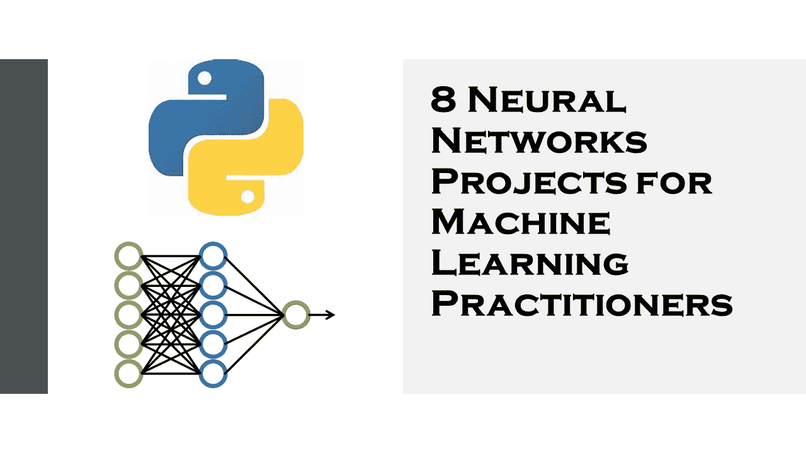

# 解决并解释了 8 个神经网络项目

> 原文：<https://medium.datadriveninvestor.com/8-neural-networks-projects-solved-and-explained-a4f142bc10c?source=collection_archive---------0----------------------->

自从人们开始谈论人工智能以来，神经网络和大脑如何工作的各种其他模型就一直存在。在本文中，我将向您介绍一些非常有用的神经网络项目，您可以在您的机器学习投资组合中使用它们。

# 神经网络项目

## 用神经网络预测燃油效率

在预测燃油效率的这些类型的机器学习问题中，我们的目标是预测连续值的输出，例如价格或概率。在这个项目中，我将带您了解我们如何通过机器学习来预测燃油效率。在这里，我将使用机器学习实践者中著名的数据集之一 Auto MPG dataset 来创建一个模型，以预测 20 世纪 70 年代末和 80 年代初车辆的燃油效率。

为此，我们将为模型提供这一时期许多汽车的描述。该描述包括气缸、排量、马力和重量等属性。

 [## 用机器学习预测燃油效率

### 在这些类型的预测燃油效率的机器学习问题中，我们的目标是预测一个连续的…

thecleverprogrammer.com](https://thecleverprogrammer.com/2020/09/02/predict-fuel-efficiency-with-machine-learning/) 

## 基于神经网络的文本分类

我将带您了解 TensorFlow Hub 和 Keras 迁移学习的基本应用。我将使用 IMDB 数据集，其中包含来自互联网电影数据库的 50，000 条电影评论的文本。

这些分为 25，000 次培训评估和 25，000 次测试评估。训练集和测试集在某种程度上是平衡的，它们包含相同数量的正面和负面评论。

 [## 机器学习中基于张量流的文本分类

### 在本文中，我将向您介绍一个文本分类模型，该模型将电影评论上的 TensorFlow 分为正面或…

thecleverprogrammer.com](https://thecleverprogrammer.com/2020/08/31/text-classification-with-tensorflow-in-machine-learning/) 

## 基于神经网络的图像分类

在这里，您将了解如何使用 TensorFlow 为图像分类任务训练神经网络模型。对于那些刚接触 TensorFlow 的人来说，TensorFlow 是一个用于机器学习的端到端开源平台。

 [## 人工智能、深度学习和医疗实践|数据驱动的投资者

### 人工智能和深度神经学习的效用看起来可能是合法和有前途的，特别是…

www.datadriveninvestor.com](https://www.datadriveninvestor.com/2020/06/24/disclosure-and-resolution-program-wont-prevent-physicians-from-practicing-defensive-medicine/) 

它拥有一个全面而灵活的工具、库和社区资源生态系统，允许研究人员推动 ML 的前沿进展，开发人员轻松构建和部署基于机器学习的应用程序。

 [## 基于 PyTorch 机器学习的图像识别

### 人类没有努力去区分狗、猫或飞碟。但是这个过程对于一台电脑来说是相当困难的…

thecleverprogrammer.com](https://thecleverprogrammer.com/2020/08/26/image-recognition-with-machine-learning-using-pytorch/) 

## 基于神经网络的服装推荐系统

与其他领域不同，时尚推荐不应该仅仅基于顾客的个人品味和以往活动。有许多外部因素(其中许多是情感因素)使得创建一个时尚推荐系统变得更加复杂。

必须考虑到公众的看法，以及时尚规则、着装规则和当前趋势。

 [## 时尚推荐系统

### 在本文中，我将带您了解如何使用机器学习创建一个时尚推荐系统，它将…

thecleverprogrammer.com](https://thecleverprogrammer.com/2020/08/16/fashion-recommendation-system/) 

## 基于神经网络的性别分类模型

的确，两个人永远不可能有相同的指纹，它在每个人身上都是独一无二的。但是使用指纹我们可以区分性别，是男是女。在这个项目中，我将带你通过一个性别分类模型，我将使用深度学习和卷积神经网络来训练它。

 [## 性别分类模型

### 在这篇文章中，我将带你通过一个性别分类模型，我将使用深度学习和…

thecleverprogrammer.com](https://thecleverprogrammer.com/2020/08/02/gender-classification-model/) 

## 基于神经网络的人脸标志点检测

你有没有想过 Snapchat 是如何根据你的脸来应用令人惊叹的滤镜的？它已经被编程来检测你脸上的一些标记，并根据这些标记投射一个过滤器。

在机器学习中，这些标记被称为面部标志。在这个项目中，我将指导你如何使用机器学习来检测人脸标志。

 [## 人脸标志检测

### 你有没有想过 Snapchat 是如何根据你的面部应用惊人的滤镜的？它被编程为…

thecleverprogrammer.com](https://thecleverprogrammer.com/2020/07/22/face-landmarks-detection/) 

## 基于神经网络的下一个单词预测模型

智能手机中的大多数键盘都提供了下一个单词预测功能；谷歌也使用基于我们浏览历史的下一个单词预测。所以我们智能手机的键盘功能中也存储了一个预载数据，以正确预测下一个单词。

在这个项目中，我将使用 Python 训练一个用于下一个单词预测的深度学习模型。对于下一个单词预测模型，我将使用 Python 中的 Tensorflow 和 Keras 库。

 [## 下一个单词预测模型

### 智能手机中的大多数键盘都提供了下一个单词预测功能；谷歌也使用下一个单词预测基于…

thecleverprogrammer.com](https://thecleverprogrammer.com/2020/07/20/next-word-prediction-model/) 

我希望你喜欢这篇关于你的机器学习文件夹中的神经网络项目的文章。欢迎在下面的评论区提出你有价值的问题。

**进入专家视角—** [**订阅 DDI 英特尔**](https://datadriveninvestor.com/ddi-intel)