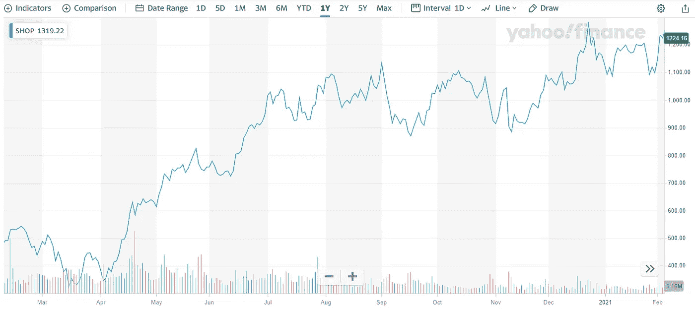

# 8 个防疫情的领域，让你成为百万富翁

> 原文：<https://medium.datadriveninvestor.com/8-pandemic-proof-sectors-that-wouldve-made-you-a-billionaire-178f957ccddd?source=collection_archive---------14----------------------->

## …您是否在 12 个月前投资了这些股票

Photo by [Jonathan Saavedra](https://unsplash.com/@jonathansaavedraphoto?utm_source=medium&utm_medium=referral) on [Unsplash](https://unsplash.com?utm_source=medium&utm_medium=referral)

我现在正在咬掉我的手指。字面上。

全球疫情推出了一系列消费[趋势](https://medium.com/datadriveninvestor/12-key-business-trends-emerging-from-the-global-pandemic-e3289d1aed29)；新冠肺炎并没有像预期的那样迅速消失，而且看起来也不会很快消失。

回想起来，我希望我意识到新冠肺炎不会在几个月后离开。

我希望我考虑过这可能意味着什么，哪些行业和公司可能从人们呆在家里中受益，这将如何改变消费和趋势。

如果我这样做了，并在我当时得出的逻辑结论后面放了一些钱，我可能就不需要贷款来支付我们未来 30 年的房子了。

马后炮。

但是现在该怎么办呢？为时已晚——还是仅仅是开始？

作为投资者，你能在还有时间的时候利用这些趋势吗？

以下是目前看起来极具吸引力的 8 个热门行业，以及你应该如何参与其中。

## #1.电动汽车

这个领域有很多股票，其中最“性感”的当然是特斯拉。

2020 年，特斯拉在全球疫情期间实现了交付不到 50 万辆汽车的[壮举](https://www.fool.com/investing/2021/02/05/guess-how-much-tesla-plans-to-grow-vehicle-deliver/)(他们的年度目标)。

特斯拉自称收入为 107.4 亿美元，本季度首次突破 100 亿美元的里程碑。

请看这份季度报告中的[语录](https://www.nasdaq.com/articles/guess-how-much-tesla-plans-to-grow-vehicle-deliveries-in-2021-2021-02-05):

> “在多年的时间范围内，我们预计汽车交付量将实现 5 **0%的年平均增长率**。在某些年份，我们可能会增长得更快，我们预计 2021 年会是这种情况。”

汽车交付量同比增长 50%——考虑到现有的销量，这是一个相当高的目标！

通用和福特等其他公司也在涉足电动汽车领域。通用汽车推出了自己的电动汽车部门，并刚刚开始与纳威司达合作销售电动卡车。

这些公司覆盖了电动汽车领域的零售和商业运输领域，目前看起来很有吸引力。

对于特斯拉(TSLA 股票代码)来说，这意味着在过去的一年里增长了 **452%** 。

Tesla’s stock [growth](https://finance.yahoo.com/quote/TSLA/chart?p=TSLA#eyJpbnRlcnZhbCI6ImRheSIsInBlcmlvZGljaXR5IjoxLCJ0aW1lVW5pdCI6bnVsbCwiY2FuZGxlV2lkdGgiOjUuNDA0NzYxOTA0NzYxOTA1LCJmbGlwcGVkIjpmYWxzZSwidm9sdW1lVW5kZXJsYXkiOnRydWUsImFkaiI6dHJ1ZSwiY3Jvc3NoYWlyIjp0cnVlLCJjaGFydFR5cGUiOiJsaW5lIiwiZXh0ZW5kZWQiOmZhbHNlLCJtYXJrZXRTZXNzaW9ucyI6e30sImFnZ3JlZ2F0aW9uVHlwZSI6Im9obGMiLCJjaGFydFNjYWxlIjoibGluZWFyIiwic3R1ZGllcyI6eyLigIx2b2wgdW5kcuKAjCI6eyJ0eXBlIjoidm9sIHVuZHIiLCJpbnB1dHMiOnsiaWQiOiLigIx2b2wgdW5kcuKAjCIsImRpc3BsYXkiOiLigIx2b2wgdW5kcuKAjCJ9LCJvdXRwdXRzIjp7IlVwIFZvbHVtZSI6IiMwMGIwNjEiLCJEb3duIFZvbHVtZSI6IiNmZjMzM2EifSwicGFuZWwiOiJjaGFydCIsInBhcmFtZXRlcnMiOnsid2lkdGhGYWN0b3IiOjAuNDUsImNoYXJ0TmFtZSI6ImNoYXJ0In19fSwicGFuZWxzIjp7ImNoYXJ0Ijp7InBlcmNlbnQiOjEsImRpc3BsYXkiOiJUU0xBIiwiY2hhcnROYW1lIjoiY2hhcnQiLCJpbmRleCI6MCwieUF4aXMiOnsibmFtZSI6ImNoYXJ0IiwicG9zaXRpb24iOm51bGx9LCJ5YXhpc0xIUyI6W10sInlheGlzUkhTIjpbImNoYXJ0Iiwi4oCMdm9sIHVuZHLigIwiXX19LCJzZXRTcGFuIjpudWxsLCJsaW5lV2lkdGgiOjIsInN0cmlwZWRCYWNrZ3JvdW5kIjp0cnVlLCJldmVudHMiOnRydWUsImNvbG9yIjoiIzAwODFmMiIsInN0cmlwZWRCYWNrZ3JvdWQiOnRydWUsImV2ZW50TWFwIjp7ImNvcnBvcmF0ZSI6eyJkaXZzIjp0cnVlLCJzcGxpdHMiOnRydWV9LCJzaWdEZXYiOnt9fSwiY3VzdG9tUmFuZ2UiOm51bGwsInJhbmdlIjpudWxsLCJzeW1ib2xzIjpbeyJzeW1ib2wiOiJUU0xBIiwic3ltYm9sT2JqZWN0Ijp7InN5bWJvbCI6IlRTTEEiLCJxdW90ZVR5cGUiOiJFUVVJVFkiLCJleGNoYW5nZVRpbWVab25lIjoiQW1lcmljYS9OZXdfWW9yayJ9LCJwZXJpb2RpY2l0eSI6MSwiaW50ZXJ2YWwiOiJkYXkiLCJ0aW1lVW5pdCI6bnVsbCwic2V0U3BhbiI6bnVsbH1dfQ--) over 1 year

## #2.网络购物

亚马逊、Etsy 和 Wayfair 等公司从消费者在家购物中获益匪浅。

有一个问题是，随着实体商店重新开业，这种情况是否会持续下去，还是会逐渐消失。

然而，这不太可能很快发生。有一种观点认为，消费者的行为现在已经转向了这种纯数字的消费方式。

由于人们已经习惯这样做几乎整整一年了，你可以说这很可能会继续下去。

在过去的一年里， **Esty 的股票(股票代码 ETSY)** 增长了 358%。

Wayfair 的？仅次于 **200%** 。鉴于其最初的强大基础，亚马逊在此期间的增长率为 57%。

Etsy’s stock [growth](https://finance.yahoo.com/quote/ETSY/chart?p=ETSY#eyJpbnRlcnZhbCI6ImRheSIsInBlcmlvZGljaXR5IjoxLCJ0aW1lVW5pdCI6bnVsbCwiY2FuZGxlV2lkdGgiOjQuNTIxOTEyMzUwNTk3NjEsImZsaXBwZWQiOmZhbHNlLCJ2b2x1bWVVbmRlcmxheSI6dHJ1ZSwiYWRqIjp0cnVlLCJjcm9zc2hhaXIiOnRydWUsImNoYXJ0VHlwZSI6ImxpbmUiLCJleHRlbmRlZCI6ZmFsc2UsIm1hcmtldFNlc3Npb25zIjp7fSwiYWdncmVnYXRpb25UeXBlIjoib2hsYyIsImNoYXJ0U2NhbGUiOiJsaW5lYXIiLCJwYW5lbHMiOnsiY2hhcnQiOnsicGVyY2VudCI6MSwiZGlzcGxheSI6IkVUU1kiLCJjaGFydE5hbWUiOiJjaGFydCIsImluZGV4IjowLCJ5QXhpcyI6eyJuYW1lIjoiY2hhcnQiLCJwb3NpdGlvbiI6bnVsbH0sInlheGlzTEhTIjpbXSwieWF4aXNSSFMiOlsiY2hhcnQiLCLigIx2b2wgdW5kcuKAjCJdfX0sInNldFNwYW4iOnsibXVsdGlwbGllciI6MSwiYmFzZSI6InllYXIiLCJwZXJpb2RpY2l0eSI6eyJwZXJpb2QiOjEsImludGVydmFsIjoiZGF5In19LCJsaW5lV2lkdGgiOjIsInN0cmlwZWRCYWNrZ3JvdW5kIjp0cnVlLCJldmVudHMiOnRydWUsImNvbG9yIjoiIzAwODFmMiIsInN0cmlwZWRCYWNrZ3JvdWQiOnRydWUsImV2ZW50TWFwIjp7ImNvcnBvcmF0ZSI6eyJkaXZzIjp0cnVlLCJzcGxpdHMiOnRydWV9LCJzaWdEZXYiOnt9fSwiY3VzdG9tUmFuZ2UiOm51bGwsInN5bWJvbHMiOlt7InN5bWJvbCI6IkVUU1kiLCJzeW1ib2xPYmplY3QiOnsic3ltYm9sIjoiRVRTWSIsInF1b3RlVHlwZSI6IkVRVUlUWSIsImV4Y2hhbmdlVGltZVpvbmUiOiJBbWVyaWNhL05ld19Zb3JrIn0sInBlcmlvZGljaXR5IjoxLCJpbnRlcnZhbCI6ImRheSIsInRpbWVVbml0IjpudWxsLCJzZXRTcGFuIjp7Im11bHRpcGxpZXIiOjEsImJhc2UiOiJ5ZWFyIiwicGVyaW9kaWNpdHkiOnsicGVyaW9kIjoxLCJpbnRlcnZhbCI6ImRheSJ9fX1dLCJzdHVkaWVzIjp7IuKAjHZvbCB1bmRy4oCMIjp7InR5cGUiOiJ2b2wgdW5kciIsImlucHV0cyI6eyJpZCI6IuKAjHZvbCB1bmRy4oCMIiwiZGlzcGxheSI6IuKAjHZvbCB1bmRy4oCMIn0sIm91dHB1dHMiOnsiVXAgVm9sdW1lIjoiIzAwYjA2MSIsIkRvd24gVm9sdW1lIjoiI2ZmMzMzYSJ9LCJwYW5lbCI6ImNoYXJ0IiwicGFyYW1ldGVycyI6eyJ3aWR0aEZhY3RvciI6MC40NSwiY2hhcnROYW1lIjoiY2hhcnQiLCJwYW5lbE5hbWUiOiJjaGFydCJ9fX19) over 1 year

## #3.社交购物

与此相关，像 Pinterest 这样的公司已经成为疫情的赢家。

直接从应用程序中“购买 pin”的能力，将客户重定向到 Etsy、亚马逊或独立在线商店等网站，使该公司和 e-comm 生态系统中的其他公司受益。

Pinterest(股票代码)的股价同比上涨 **223%** :

Pinterest’s stock [growth](https://finance.yahoo.com/quote/PINS/chart?p=PINS#eyJpbnRlcnZhbCI6ImRheSIsInBlcmlvZGljaXR5IjoxLCJ0aW1lVW5pdCI6bnVsbCwiY2FuZGxlV2lkdGgiOjQuNTIzODA5NTIzODA5NTI0LCJmbGlwcGVkIjpmYWxzZSwidm9sdW1lVW5kZXJsYXkiOnRydWUsImFkaiI6dHJ1ZSwiY3Jvc3NoYWlyIjp0cnVlLCJjaGFydFR5cGUiOiJsaW5lIiwiZXh0ZW5kZWQiOmZhbHNlLCJtYXJrZXRTZXNzaW9ucyI6e30sImFnZ3JlZ2F0aW9uVHlwZSI6Im9obGMiLCJjaGFydFNjYWxlIjoibGluZWFyIiwicGFuZWxzIjp7ImNoYXJ0Ijp7InBlcmNlbnQiOjEsImRpc3BsYXkiOiJQSU5TIiwiY2hhcnROYW1lIjoiY2hhcnQiLCJpbmRleCI6MCwieUF4aXMiOnsibmFtZSI6ImNoYXJ0IiwicG9zaXRpb24iOm51bGx9LCJ5YXhpc0xIUyI6W10sInlheGlzUkhTIjpbImNoYXJ0Iiwi4oCMdm9sIHVuZHLigIwiXX19LCJzZXRTcGFuIjp7Im11bHRpcGxpZXIiOjEsImJhc2UiOiJ5ZWFyIiwicGVyaW9kaWNpdHkiOnsicGVyaW9kIjoxLCJpbnRlcnZhbCI6ImRheSJ9LCJtYWludGFpblBlcmlvZGljaXR5Ijp0cnVlLCJmb3JjZUxvYWQiOnRydWV9LCJsaW5lV2lkdGgiOjIsInN0cmlwZWRCYWNrZ3JvdW5kIjp0cnVlLCJldmVudHMiOnRydWUsImNvbG9yIjoiIzAwODFmMiIsInN0cmlwZWRCYWNrZ3JvdWQiOnRydWUsImV2ZW50TWFwIjp7ImNvcnBvcmF0ZSI6eyJkaXZzIjp0cnVlLCJzcGxpdHMiOnRydWV9LCJzaWdEZXYiOnt9fSwiY3VzdG9tUmFuZ2UiOm51bGwsInN5bWJvbHMiOlt7InN5bWJvbCI6IlBJTlMiLCJzeW1ib2xPYmplY3QiOnsic3ltYm9sIjoiUElOUyIsInF1b3RlVHlwZSI6IkVRVUlUWSIsImV4Y2hhbmdlVGltZVpvbmUiOiJBbWVyaWNhL05ld19Zb3JrIn0sInBlcmlvZGljaXR5IjoxLCJpbnRlcnZhbCI6ImRheSIsInRpbWVVbml0IjpudWxsLCJzZXRTcGFuIjp7Im11bHRpcGxpZXIiOjEsImJhc2UiOiJ5ZWFyIiwicGVyaW9kaWNpdHkiOnsicGVyaW9kIjoxLCJpbnRlcnZhbCI6ImRheSJ9LCJtYWludGFpblBlcmlvZGljaXR5Ijp0cnVlLCJmb3JjZUxvYWQiOnRydWV9fV0sInN0dWRpZXMiOnsi4oCMdm9sIHVuZHLigIwiOnsidHlwZSI6InZvbCB1bmRyIiwiaW5wdXRzIjp7ImlkIjoi4oCMdm9sIHVuZHLigIwiLCJkaXNwbGF5Ijoi4oCMdm9sIHVuZHLigIwifSwib3V0cHV0cyI6eyJVcCBWb2x1bWUiOiIjMDBiMDYxIiwiRG93biBWb2x1bWUiOiIjZmYzMzNhIn0sInBhbmVsIjoiY2hhcnQiLCJwYXJhbWV0ZXJzIjp7IndpZHRoRmFjdG9yIjowLjQ1LCJjaGFydE5hbWUiOiJjaGFydCIsInBhbmVsTmFtZSI6ImNoYXJ0In19fX0-) over 1 year

## #4.电子商务平台

由于在线购物和社交购物的兴起，支撑在线商店的平台表现良好。

在过去的一年里，Shopify(股票商店)实现了 168% 的健康增长。Wix 等竞争对手也表现出色，Wix 在此期间增长了 92%。

Shopify’s stock [growth](https://finance.yahoo.com/quote/SHOP/chart?p=SHOP#eyJpbnRlcnZhbCI6ImRheSIsInBlcmlvZGljaXR5IjoxLCJ0aW1lVW5pdCI6bnVsbCwiY2FuZGxlV2lkdGgiOjQuNTIzODA5NTIzODA5NTI0LCJmbGlwcGVkIjpmYWxzZSwidm9sdW1lVW5kZXJsYXkiOnRydWUsImFkaiI6dHJ1ZSwiY3Jvc3NoYWlyIjp0cnVlLCJjaGFydFR5cGUiOiJsaW5lIiwiZXh0ZW5kZWQiOmZhbHNlLCJtYXJrZXRTZXNzaW9ucyI6e30sImFnZ3JlZ2F0aW9uVHlwZSI6Im9obGMiLCJjaGFydFNjYWxlIjoibGluZWFyIiwicGFuZWxzIjp7ImNoYXJ0Ijp7InBlcmNlbnQiOjEsImRpc3BsYXkiOiJTSE9QIiwiY2hhcnROYW1lIjoiY2hhcnQiLCJpbmRleCI6MCwieUF4aXMiOnsibmFtZSI6ImNoYXJ0IiwicG9zaXRpb24iOm51bGx9LCJ5YXhpc0xIUyI6W10sInlheGlzUkhTIjpbImNoYXJ0Iiwi4oCMdm9sIHVuZHLigIwiXX19LCJzZXRTcGFuIjp7Im11bHRpcGxpZXIiOjEsImJhc2UiOiJ5ZWFyIiwicGVyaW9kaWNpdHkiOnsicGVyaW9kIjoxLCJpbnRlcnZhbCI6ImRheSJ9LCJtYWludGFpblBlcmlvZGljaXR5Ijp0cnVlLCJmb3JjZUxvYWQiOnRydWV9LCJsaW5lV2lkdGgiOjIsInN0cmlwZWRCYWNrZ3JvdW5kIjp0cnVlLCJldmVudHMiOnRydWUsImNvbG9yIjoiIzAwODFmMiIsInN0cmlwZWRCYWNrZ3JvdWQiOnRydWUsImV2ZW50TWFwIjp7ImNvcnBvcmF0ZSI6eyJkaXZzIjp0cnVlLCJzcGxpdHMiOnRydWV9LCJzaWdEZXYiOnt9fSwiY3VzdG9tUmFuZ2UiOm51bGwsInN5bWJvbHMiOlt7InN5bWJvbCI6IlNIT1AiLCJzeW1ib2xPYmplY3QiOnsic3ltYm9sIjoiU0hPUCIsInF1b3RlVHlwZSI6IkVRVUlUWSIsImV4Y2hhbmdlVGltZVpvbmUiOiJBbWVyaWNhL05ld19Zb3JrIn0sInBlcmlvZGljaXR5IjoxLCJpbnRlcnZhbCI6ImRheSIsInRpbWVVbml0IjpudWxsLCJzZXRTcGFuIjp7Im11bHRpcGxpZXIiOjEsImJhc2UiOiJ5ZWFyIiwicGVyaW9kaWNpdHkiOnsicGVyaW9kIjoxLCJpbnRlcnZhbCI6ImRheSJ9LCJtYWludGFpblBlcmlvZGljaXR5Ijp0cnVlLCJmb3JjZUxvYWQiOnRydWV9fV0sInN0dWRpZXMiOnsi4oCMdm9sIHVuZHLigIwiOnsidHlwZSI6InZvbCB1bmRyIiwiaW5wdXRzIjp7ImlkIjoi4oCMdm9sIHVuZHLigIwiLCJkaXNwbGF5Ijoi4oCMdm9sIHVuZHLigIwifSwib3V0cHV0cyI6eyJVcCBWb2x1bWUiOiIjMDBiMDYxIiwiRG93biBWb2x1bWUiOiIjZmYzMzNhIn0sInBhbmVsIjoiY2hhcnQiLCJwYXJhbWV0ZXJzIjp7IndpZHRoRmFjdG9yIjowLjQ1LCJjaGFydE5hbWUiOiJjaGFydCIsInBhbmVsTmFtZSI6ImNoYXJ0In19fX0-) over 1 year

## #5.基因组学(基因测序)

生物技术是一个热门领域，技术进步使得这个领域越来越有吸引力。这是一个令人兴奋的研究领域，资金正涌入该领域。

基因测序被认为是一种有前途的癌症治疗方法。

像**10X Genomics(TXG 股票代码)**这样的公司已经在整个疫情获胜。在过去的一年里，该公司的股票增长了 110%。

10x Genomics’ stock [growth](https://finance.yahoo.com/quote/TXG/chart?p=TXG#eyJpbnRlcnZhbCI6ImRheSIsInBlcmlvZGljaXR5IjoxLCJ0aW1lVW5pdCI6bnVsbCwiY2FuZGxlV2lkdGgiOjQuNTQxODMyNjY5MzIyNzEsImZsaXBwZWQiOmZhbHNlLCJ2b2x1bWVVbmRlcmxheSI6dHJ1ZSwiYWRqIjp0cnVlLCJjcm9zc2hhaXIiOnRydWUsImNoYXJ0VHlwZSI6ImxpbmUiLCJleHRlbmRlZCI6ZmFsc2UsIm1hcmtldFNlc3Npb25zIjp7fSwiYWdncmVnYXRpb25UeXBlIjoib2hsYyIsImNoYXJ0U2NhbGUiOiJsaW5lYXIiLCJwYW5lbHMiOnsiY2hhcnQiOnsicGVyY2VudCI6MSwiZGlzcGxheSI6IlRYRyIsImNoYXJ0TmFtZSI6ImNoYXJ0IiwiaW5kZXgiOjAsInlBeGlzIjp7Im5hbWUiOiJjaGFydCIsInBvc2l0aW9uIjpudWxsfSwieWF4aXNMSFMiOltdLCJ5YXhpc1JIUyI6WyJjaGFydCIsIuKAjHZvbCB1bmRy4oCMIl19fSwic2V0U3BhbiI6eyJtdWx0aXBsaWVyIjoxLCJiYXNlIjoieWVhciIsInBlcmlvZGljaXR5Ijp7InBlcmlvZCI6MSwiaW50ZXJ2YWwiOiJkYXkifSwibWFpbnRhaW5QZXJpb2RpY2l0eSI6dHJ1ZSwiZm9yY2VMb2FkIjp0cnVlfSwibGluZVdpZHRoIjoyLCJzdHJpcGVkQmFja2dyb3VuZCI6dHJ1ZSwiZXZlbnRzIjp0cnVlLCJjb2xvciI6IiMwMDgxZjIiLCJzdHJpcGVkQmFja2dyb3VkIjp0cnVlLCJldmVudE1hcCI6eyJjb3Jwb3JhdGUiOnsiZGl2cyI6dHJ1ZSwic3BsaXRzIjp0cnVlfSwic2lnRGV2Ijp7fX0sImN1c3RvbVJhbmdlIjpudWxsLCJzeW1ib2xzIjpbeyJzeW1ib2wiOiJUWEciLCJzeW1ib2xPYmplY3QiOnsic3ltYm9sIjoiVFhHIiwicXVvdGVUeXBlIjoiRVFVSVRZIiwiZXhjaGFuZ2VUaW1lWm9uZSI6IkFtZXJpY2EvTmV3X1lvcmsifSwicGVyaW9kaWNpdHkiOjEsImludGVydmFsIjoiZGF5IiwidGltZVVuaXQiOm51bGwsInNldFNwYW4iOnsibXVsdGlwbGllciI6MSwiYmFzZSI6InllYXIiLCJwZXJpb2RpY2l0eSI6eyJwZXJpb2QiOjEsImludGVydmFsIjoiZGF5In0sIm1haW50YWluUGVyaW9kaWNpdHkiOnRydWUsImZvcmNlTG9hZCI6dHJ1ZX19XSwic3R1ZGllcyI6eyLigIx2b2wgdW5kcuKAjCI6eyJ0eXBlIjoidm9sIHVuZHIiLCJpbnB1dHMiOnsiaWQiOiLigIx2b2wgdW5kcuKAjCIsImRpc3BsYXkiOiLigIx2b2wgdW5kcuKAjCJ9LCJvdXRwdXRzIjp7IlVwIFZvbHVtZSI6IiMwMGIwNjEiLCJEb3duIFZvbHVtZSI6IiNmZjMzM2EifSwicGFuZWwiOiJjaGFydCIsInBhcmFtZXRlcnMiOnsid2lkdGhGYWN0b3IiOjAuNDUsImNoYXJ0TmFtZSI6ImNoYXJ0IiwicGFuZWxOYW1lIjoiY2hhcnQifX19fQ--) over 1 year

## #6.密码挖掘和存储

这并不令人惊讶:鉴于最近的发展，加密货币的世界，特别是比特币已经爆炸式增长。

机构投资已流入加密货币，并在 1 月份将其推升至 4 万美元的新高。

随着[宣布](https://www.bbc.co.uk/news/business-55939972)特斯拉正在购买价值 15 亿美元的比特币，并将比特币视为其自身的未来支付方式，这些新的高度再次被超越。

**Riot block chain(ticker Riot)**是一家加密采矿公司，旨在“成为北美最大、成本最低的比特币生产商之一”。

和这个领域的其他公司一样，这只股票最近表现非常好。**过去一年增长 1938%**；称之为超越！

Riot Blockchain’s explosive stock [growth](https://finance.yahoo.com/quote/RIOT/chart?p=RIOT#eyJpbnRlcnZhbCI6ImRheSIsInBlcmlvZGljaXR5IjoxLCJ0aW1lVW5pdCI6bnVsbCwiY2FuZGxlV2lkdGgiOjQuNTAzOTY4MjUzOTY4MjU0LCJmbGlwcGVkIjpmYWxzZSwidm9sdW1lVW5kZXJsYXkiOnRydWUsImFkaiI6dHJ1ZSwiY3Jvc3NoYWlyIjp0cnVlLCJjaGFydFR5cGUiOiJsaW5lIiwiZXh0ZW5kZWQiOmZhbHNlLCJtYXJrZXRTZXNzaW9ucyI6e30sImFnZ3JlZ2F0aW9uVHlwZSI6Im9obGMiLCJjaGFydFNjYWxlIjoibGluZWFyIiwicGFuZWxzIjp7ImNoYXJ0Ijp7InBlcmNlbnQiOjEsImRpc3BsYXkiOiJSSU9UIiwiY2hhcnROYW1lIjoiY2hhcnQiLCJpbmRleCI6MCwieUF4aXMiOnsibmFtZSI6ImNoYXJ0IiwicG9zaXRpb24iOm51bGx9LCJ5YXhpc0xIUyI6W10sInlheGlzUkhTIjpbImNoYXJ0Iiwi4oCMdm9sIHVuZHLigIwiXX19LCJsaW5lV2lkdGgiOjIsInN0cmlwZWRCYWNrZ3JvdW5kIjp0cnVlLCJldmVudHMiOnRydWUsImNvbG9yIjoiIzAwODFmMiIsInN0cmlwZWRCYWNrZ3JvdWQiOnRydWUsImV2ZW50TWFwIjp7ImNvcnBvcmF0ZSI6eyJkaXZzIjp0cnVlLCJzcGxpdHMiOnRydWV9LCJzaWdEZXYiOnt9fSwiY3VzdG9tUmFuZ2UiOm51bGwsInN5bWJvbHMiOlt7InN5bWJvbCI6IlJJT1QiLCJzeW1ib2xPYmplY3QiOnsic3ltYm9sIjoiUklPVCIsInF1b3RlVHlwZSI6IkVRVUlUWSIsImV4Y2hhbmdlVGltZVpvbmUiOiJBbWVyaWNhL05ld19Zb3JrIn0sInBlcmlvZGljaXR5IjoxLCJpbnRlcnZhbCI6ImRheSIsInRpbWVVbml0IjpudWxsLCJzZXRTcGFuIjp7Im11bHRpcGxpZXIiOjEsImJhc2UiOiJ5ZWFyIiwicGVyaW9kaWNpdHkiOnsicGVyaW9kIjoxLCJpbnRlcnZhbCI6ImRheSJ9fX1dLCJzdHVkaWVzIjp7IuKAjHZvbCB1bmRy4oCMIjp7InR5cGUiOiJ2b2wgdW5kciIsImlucHV0cyI6eyJpZCI6IuKAjHZvbCB1bmRy4oCMIiwiZGlzcGxheSI6IuKAjHZvbCB1bmRy4oCMIn0sIm91dHB1dHMiOnsiVXAgVm9sdW1lIjoiIzAwYjA2MSIsIkRvd24gVm9sdW1lIjoiI2ZmMzMzYSJ9LCJwYW5lbCI6ImNoYXJ0IiwicGFyYW1ldGVycyI6eyJ3aWR0aEZhY3RvciI6MC40NSwiY2hhcnROYW1lIjoiY2hhcnQiLCJwYW5lbE5hbWUiOiJjaGFydCJ9fX0sInNldFNwYW4iOnsibXVsdGlwbGllciI6MSwiYmFzZSI6InllYXIiLCJwZXJpb2RpY2l0eSI6eyJwZXJpb2QiOjEsImludGVydmFsIjoiZGF5In19fQ--) over the past year

## #7.远距离医学

随着越来越多的人被困在家里，对数字护理服务的需求也在不断增长。医院已经被预留给最严重的病例，许多人担心进去会感染新冠肺炎病毒或其变种。

当我需要的时候，我发现拿起电话，第二天第一件事就是立即预约，这比去全科医生那里解决小问题要容易得多，也更放心。

**Teladoc(股票代码 TDOC)** 是市场的领导者，将自己定位为“世界上最值得信赖的远程医疗服务提供商”。

在过去的 12 个月里，该公司的股票增长了 **165%** 。

Teladoc’s stock [growth](https://finance.yahoo.com/quote/TDOC/chart?p=TDOC#eyJpbnRlcnZhbCI6ImRheSIsInBlcmlvZGljaXR5IjoxLCJ0aW1lVW5pdCI6bnVsbCwiY2FuZGxlV2lkdGgiOjQuNTIzODA5NTIzODA5NTI0LCJmbGlwcGVkIjpmYWxzZSwidm9sdW1lVW5kZXJsYXkiOnRydWUsImFkaiI6dHJ1ZSwiY3Jvc3NoYWlyIjp0cnVlLCJjaGFydFR5cGUiOiJsaW5lIiwiZXh0ZW5kZWQiOmZhbHNlLCJtYXJrZXRTZXNzaW9ucyI6e30sImFnZ3JlZ2F0aW9uVHlwZSI6Im9obGMiLCJjaGFydFNjYWxlIjoibGluZWFyIiwicGFuZWxzIjp7ImNoYXJ0Ijp7InBlcmNlbnQiOjEsImRpc3BsYXkiOiJURE9DIiwiY2hhcnROYW1lIjoiY2hhcnQiLCJpbmRleCI6MCwieUF4aXMiOnsibmFtZSI6ImNoYXJ0IiwicG9zaXRpb24iOm51bGx9LCJ5YXhpc0xIUyI6W10sInlheGlzUkhTIjpbImNoYXJ0Iiwi4oCMdm9sIHVuZHLigIwiXX19LCJzZXRTcGFuIjp7Im11bHRpcGxpZXIiOjEsImJhc2UiOiJ5ZWFyIiwicGVyaW9kaWNpdHkiOnsicGVyaW9kIjoxLCJpbnRlcnZhbCI6ImRheSJ9LCJtYWludGFpblBlcmlvZGljaXR5Ijp0cnVlLCJmb3JjZUxvYWQiOnRydWV9LCJsaW5lV2lkdGgiOjIsInN0cmlwZWRCYWNrZ3JvdW5kIjp0cnVlLCJldmVudHMiOnRydWUsImNvbG9yIjoiIzAwODFmMiIsInN0cmlwZWRCYWNrZ3JvdWQiOnRydWUsImV2ZW50TWFwIjp7ImNvcnBvcmF0ZSI6eyJkaXZzIjp0cnVlLCJzcGxpdHMiOnRydWV9LCJzaWdEZXYiOnt9fSwiY3VzdG9tUmFuZ2UiOm51bGwsInN5bWJvbHMiOlt7InN5bWJvbCI6IlRET0MiLCJzeW1ib2xPYmplY3QiOnsic3ltYm9sIjoiVERPQyIsInF1b3RlVHlwZSI6IkVRVUlUWSIsImV4Y2hhbmdlVGltZVpvbmUiOiJBbWVyaWNhL05ld19Zb3JrIn0sInBlcmlvZGljaXR5IjoxLCJpbnRlcnZhbCI6ImRheSIsInRpbWVVbml0IjpudWxsLCJzZXRTcGFuIjp7Im11bHRpcGxpZXIiOjEsImJhc2UiOiJ5ZWFyIiwicGVyaW9kaWNpdHkiOnsicGVyaW9kIjoxLCJpbnRlcnZhbCI6ImRheSJ9LCJtYWludGFpblBlcmlvZGljaXR5Ijp0cnVlLCJmb3JjZUxvYWQiOnRydWV9fV0sInN0dWRpZXMiOnsi4oCMdm9sIHVuZHLigIwiOnsidHlwZSI6InZvbCB1bmRyIiwiaW5wdXRzIjp7ImlkIjoi4oCMdm9sIHVuZHLigIwiLCJkaXNwbGF5Ijoi4oCMdm9sIHVuZHLigIwifSwib3V0cHV0cyI6eyJVcCBWb2x1bWUiOiIjMDBiMDYxIiwiRG93biBWb2x1bWUiOiIjZmYzMzNhIn0sInBhbmVsIjoiY2hhcnQiLCJwYXJhbWV0ZXJzIjp7IndpZHRoRmFjdG9yIjowLjQ1LCJjaGFydE5hbWUiOiJjaGFydCIsInBhbmVsTmFtZSI6ImNoYXJ0In19fX0-) over 1 year

## #8.房地产和租赁

这可能看起来矛盾，但在线房地产平台在过去的一年里飞速发展。

在此期间，Redfin(股票代码 RDFN) 的股价上涨了 **252%** 。Airbnb 也受益于当地的假期，以及为此采取的巧妙营销策略。

Redfin’s stock [growth](https://finance.yahoo.com/quote/RDFN/chart?p=RDFN#eyJpbnRlcnZhbCI6ImRheSIsInBlcmlvZGljaXR5IjoxLCJ0aW1lVW5pdCI6bnVsbCwiY2FuZGxlV2lkdGgiOjQuNTIzODA5NTIzODA5NTI0LCJmbGlwcGVkIjpmYWxzZSwidm9sdW1lVW5kZXJsYXkiOnRydWUsImFkaiI6dHJ1ZSwiY3Jvc3NoYWlyIjp0cnVlLCJjaGFydFR5cGUiOiJsaW5lIiwiZXh0ZW5kZWQiOmZhbHNlLCJtYXJrZXRTZXNzaW9ucyI6e30sImFnZ3JlZ2F0aW9uVHlwZSI6Im9obGMiLCJjaGFydFNjYWxlIjoibGluZWFyIiwicGFuZWxzIjp7ImNoYXJ0Ijp7InBlcmNlbnQiOjEsImRpc3BsYXkiOiJSREZOIiwiY2hhcnROYW1lIjoiY2hhcnQiLCJpbmRleCI6MCwieUF4aXMiOnsibmFtZSI6ImNoYXJ0IiwicG9zaXRpb24iOm51bGx9LCJ5YXhpc0xIUyI6W10sInlheGlzUkhTIjpbImNoYXJ0Iiwi4oCMdm9sIHVuZHLigIwiXX19LCJzZXRTcGFuIjp7Im11bHRpcGxpZXIiOjEsImJhc2UiOiJ5ZWFyIiwicGVyaW9kaWNpdHkiOnsicGVyaW9kIjoxLCJpbnRlcnZhbCI6ImRheSJ9LCJtYWludGFpblBlcmlvZGljaXR5Ijp0cnVlLCJmb3JjZUxvYWQiOnRydWV9LCJsaW5lV2lkdGgiOjIsInN0cmlwZWRCYWNrZ3JvdW5kIjp0cnVlLCJldmVudHMiOnRydWUsImNvbG9yIjoiIzAwODFmMiIsInN0cmlwZWRCYWNrZ3JvdWQiOnRydWUsImV2ZW50TWFwIjp7ImNvcnBvcmF0ZSI6eyJkaXZzIjp0cnVlLCJzcGxpdHMiOnRydWV9LCJzaWdEZXYiOnt9fSwiY3VzdG9tUmFuZ2UiOm51bGwsInN5bWJvbHMiOlt7InN5bWJvbCI6IlJERk4iLCJzeW1ib2xPYmplY3QiOnsic3ltYm9sIjoiUkRGTiIsInF1b3RlVHlwZSI6IkVRVUlUWSIsImV4Y2hhbmdlVGltZVpvbmUiOiJBbWVyaWNhL05ld19Zb3JrIn0sInBlcmlvZGljaXR5IjoxLCJpbnRlcnZhbCI6ImRheSIsInRpbWVVbml0IjpudWxsLCJzZXRTcGFuIjp7Im11bHRpcGxpZXIiOjEsImJhc2UiOiJ5ZWFyIiwicGVyaW9kaWNpdHkiOnsicGVyaW9kIjoxLCJpbnRlcnZhbCI6ImRheSJ9LCJtYWludGFpblBlcmlvZGljaXR5Ijp0cnVlLCJmb3JjZUxvYWQiOnRydWV9fV0sInN0dWRpZXMiOnsi4oCMdm9sIHVuZHLigIwiOnsidHlwZSI6InZvbCB1bmRyIiwiaW5wdXRzIjp7ImlkIjoi4oCMdm9sIHVuZHLigIwiLCJkaXNwbGF5Ijoi4oCMdm9sIHVuZHLigIwifSwib3V0cHV0cyI6eyJVcCBWb2x1bWUiOiIjMDBiMDYxIiwiRG93biBWb2x1bWUiOiIjZmYzMzNhIn0sInBhbmVsIjoiY2hhcnQiLCJwYXJhbWV0ZXJzIjp7IndpZHRoRmFjdG9yIjowLjQ1LCJjaGFydE5hbWUiOiJjaGFydCIsInBhbmVsTmFtZSI6ImNoYXJ0In19fX0-) over 1 year

# 我们将何去何从？

新冠肺炎疫情将一些行业及其领导者推向了风口浪尖。

问题是，接下来会发生什么？

我不知道你是怎么想的，但是当我环顾四周，我感觉到这些部门正在蓬勃发展。它们看起来不像是明天即将消失在空气中的快速时尚。

相反，这些股票正在积聚动能。他们在上升。

那么，我该如何识别和投资这样的优胜股呢？

我使用[自由贸易团队](https://medium.com/u/c727c9d21230?source=post_page-----178f957ccddd--------------------------------)的超级光滑和零佣金交易平台。

我花了 5 分钟来设置，又花了 5 分钟来学习平台和开始交易。

这款应用让选股变得非常直观。通过简单的仪表盘，您的投资表现一目了然，易于理解。使用 Google 或 Apple Pay 在几分钟内就可以给你的账户充值，就在那里。

到目前为止，我的投资组合也表现不错:比几天前，也就是我开户的时候，好了 13%!

这是今天的情况:

以下是我目前的一些投资:

您可以通过**使用我的个人链接** [**就在这里**](https://bit.ly/FreeTradeStocks) 为自己抢到一个免费账户，并获得价值高达 200 英镑的免费股份。

如果你这样做，没有额外的费用，我们都将在注册后 7-10 天内收到一份免费的份额！

最精彩的部分？你只需要在你的账户里存一点钱就可以申请了，这是完全免费的。没有附加条件。没什么可失去的。

当我的未婚妻报名时，我们都在几天内收到了我们的免费份额。

为什么不试一试？

本文仅供参考。不应将其视为财务或法律建议。并非所有信息都是准确的。在做任何重大财务决定之前，先咨询财务专家。