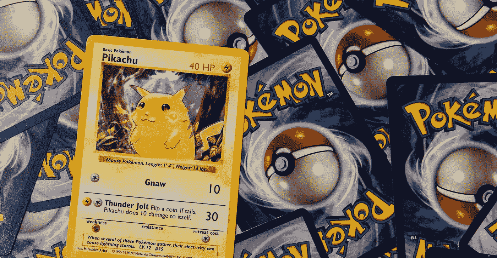
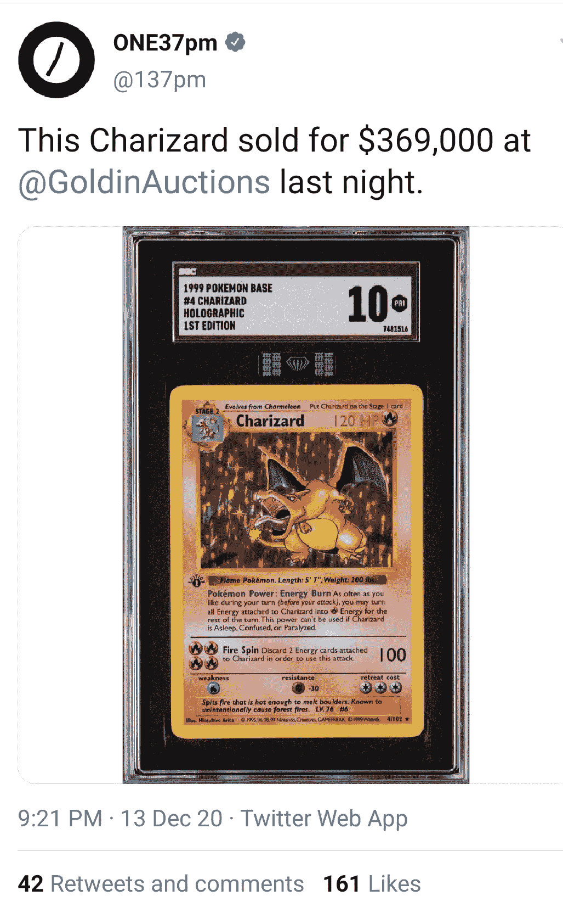
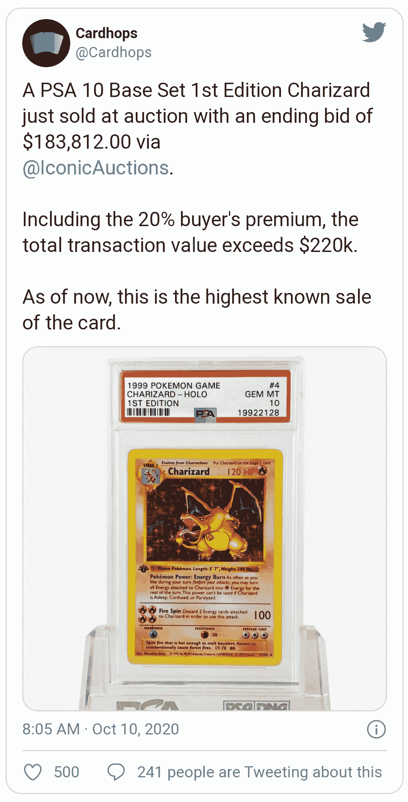
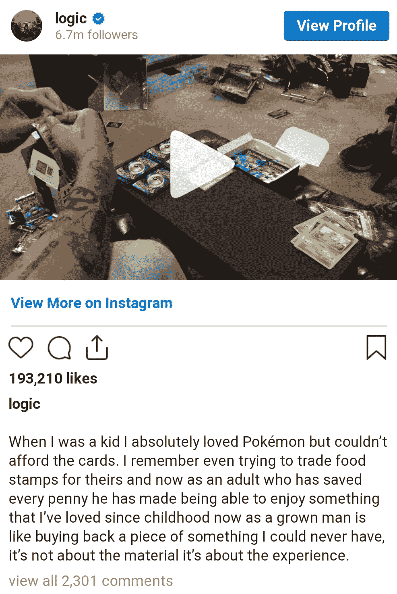
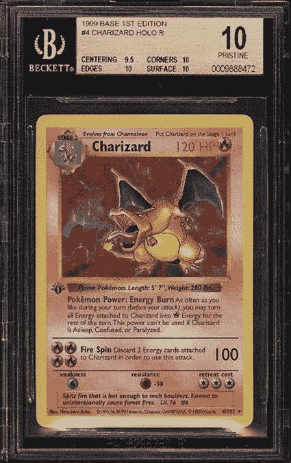
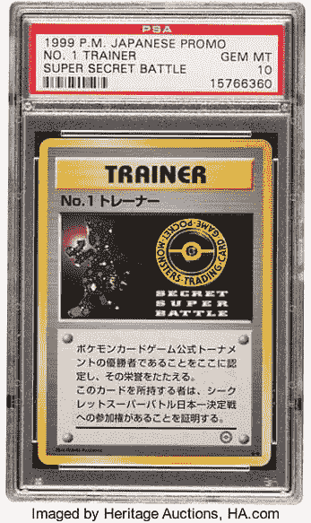
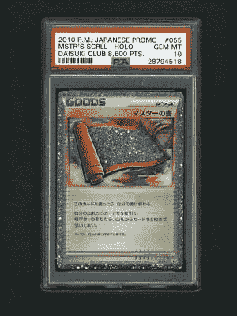
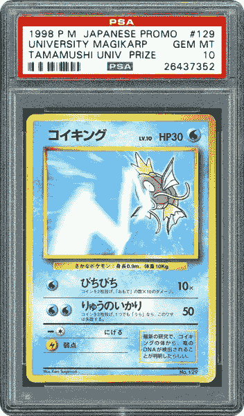
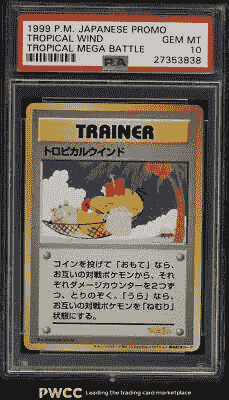

# 8 张神奇宝贝卡片卖了很多钱

> 原文：<https://medium.datadriveninvestor.com/8-pok%C3%A9mon-cards-which-sold-for-hilarious-money-f2abd4baf3d5?source=collection_archive---------10----------------------->

## 一个在 2020 年 12 月以 36.9 万美元售出

Photo via [lifestyleasia.com](https://www.lifestyleasia.com/ind/culture/entertainment/still-own-your-90s-pokemon-cards-you-might-hit-a-us200000-jackpot/)

如果你是 90 年代的孩子，你一定见过口袋妖怪电视剧、纸牌游戏、电子游戏和玩具。

作为一个更年轻的孩子，你一定用口袋妖怪卡片交易过，认为它只是一张纸板纸，但似乎前几代的一些物品似乎并没有失去对收藏家和粉丝的价值。

最近，一张罕见的卡以 369，000 美元的价格售出。看来老是金。所以去你童年的盒子里找找口袋妖怪卡片吧，你可能会在里面发现一笔财富。

我指定了 8 张这样的神奇宝贝卡片，它们被卖了很多钱。

# 1.第一版的 10 张 Charizard 卡卖了 369，000 美元

Photo via [Twitter](https://twitter.com/137pm/status/1338149672469327875?ref_src=twsrc%5Etfw%7Ctwcamp%5Etweetembed%7Ctwterm%5E1338149672469327875%7Ctwgr%5E%7Ctwcon%5Es1_&ref_url=https%3A%2F%2Fmanofmany.com%2Fentertainment%2Fmovies-tv%2Fcharizard-pokemon-card-record)

最近，如果你一定看到了新闻，那么 1999 年的口袋妖怪基地#4 Charizard 全息第一版卡以 369，000 美元的价格售出，这保持了 39 张皮卡丘插画卡中最贵的口袋妖怪卡的记录。

这张卡是一位收藏家在 2009 年出于怀旧目的以 700 美元的价格带来的。当他重温童年时，他没有想过它的未来价值，但最近它以疯狂的价格被卖掉了，这令人难以置信。

# 2.一张 PSA 10 基础套装第一版 Charizard 卡售价 22 万美元

Photo via [Twitter](https://twitter.com/Cardhops/status/1314756458668412928?ref_src=twsrc%5Etfw%7Ctwcamp%5Etweetembed%7Ctwterm%5E1314756458668412928%7Ctwgr%5E%7Ctwcon%5Es1_&ref_url=https%3A%2F%2Fd-14722645531837542725.ampproject.net%2F2011252111003%2Fframe.html)

这张卡是说唱歌手 Logic 购买的，他在 2020 年 7 月完成最后一张专辑后从音乐界退休。他的真名是罗伯特·布莱森爵士二世。

他在 Instagram 上写了他小时候对口袋妖怪卡的热爱，但当时因为钱的原因无法购买。他省下了每一分钱，买下了它，这样他就可以再次体验童年。他说这不是物质的问题，而是体验的问题。

Photo via [Logic Instagram](https://www.instagram.com/logic/?hl=en)

# 3.2019 年 10 月，口袋妖怪插画卡售价为 224，250 美元

Photo via [hypebeast.com](https://hypebeast.com/2019/10/pokemon-trading-cards-auction-pikachu-illustrator-sold-expensive-200000-usd)

口袋妖怪插画交易卡被认为是现存的最稀有的卡片，1998 年只生产了 39 张，并送给了《口袋妖怪》科罗科罗漫画插画比赛的获胜者。

当 Weiss Auction 出售这张完全相同的卡时，他们感到惊讶，根据 Kotaku 发现的[拍卖，它以 195，000 美元的价格出售，但包括买家的溢价，它以 224，250 美元的价格出售。](https://kotaku.com/the-most-expensive-pokemon-card-on-earth-sold-for-195-1839401186)

该卡的另一个特点是——右下角的钢笔符号图标，这是唯一一张顶部写着 ILLUSTRATOR 的卡。

 [## 首次创业的 4 个资金管理技巧|数据驱动的投资者

### 超过 82%的企业倒闭是由于财务管理不善和现金流问题。开始新的…

www.datadriveninvestor.com](https://www.datadriveninvestor.com/2020/10/23/4-money-management-tips-for-first-time-entrepreneurs/) 

# 4.1999 年，口袋妖怪第一版《查理德·赫萝》卖了 55650 美元

Photo via [beckett.com](https://www.beckett.com/news/1999-pokemon-1st-edition-charizard-holo-sells-50000/)

2017 年 8 月，[在易贝以 55650 美元](https://www.ebay.com/p/19003650099?iid=401386806307)的价格出售了一个 1999 年的口袋妖怪第一版《查理德·赫萝》《BGS 10》。

如果你在这张卡片上看到，四个路基中的三个(边、角和表面)都是 10。它唯一保持完美的原始 BGS 等级是 9.5 对中。这张卡变得有价值，因为它在 BGS 10 质朴的等级罕见。

据说当时提交给巴凯特的 305 张卡片中，只有两张被授予 BGS 10 奖。

# 5.1 号教练卡售价 9 万美元

Image via [Heritage Auction](https://comics.ha.com/heritage-auctions-press-releases-and-news/rare-pokemon-trainer-card-sells-for-record-90-000-at-heritage-auctions.s?releaseId=3900)

这张卡片被授予 1999 年在日本东京举行的秘密超级战斗锦标赛的决赛选手。为了赢得地区锦标赛并获准进入决赛，这张卡被用作参赛选手的入场券。

据说只举行了七次地区锦标赛，并且人们认为只制作了七张第一教练卡。2020 年 7 月，[在一场遗产拍卖会上，这张卡片以 9 万美元的价格售出](https://comics.ha.com/heritage-auctions-press-releases-and-news/rare-pokemon-trainer-card-sells-for-record-90-000-at-heritage-auctions.s?releaseId=3900)，它是最稀有的卡片之一，但不是最有价值的。它的对应卡是 2 号教练和 3 号教练。

# 6.大师的卷轴卡卖了 30，100 美元

Photo via [eBay.com](https://www.ebay.com/itm/POKEMON-PSA-10-GEM-MINT-MASTER-SCROLL-TROPHY-CARD-JAPANESE-PROMO-DAISUKI-55-L-P/184476561462?pageci=e6a4b628-8f2e-4dd0-9446-07e9e162b431#vi__app-cvip-panel)

获得 8600 分的 Daisuki 会员获得了大师卷轴卡。这是最后颁发的最高奖项，而且从未以英文发行。

这张卡获得了最高等级，PSA 10 Gem Mint，最近在[易贝以超过 3 万美元的价格售出。这张卡从来没有打包出售，也没有在日本以外的地方出售。](https://www.ebay.com/itm/POKEMON-PSA-10-GEM-MINT-MASTER-SCROLL-TROPHY-CARD-JAPANESE-PROMO-DAISUKI-55-L-P/184476561462?pageci=e6a4b628-8f2e-4dd0-9446-07e9e162b431#vi__app-cvip-panel)

获得的唯一途径是通过 2010 年的口袋妖怪大树俱乐部。

# 7.大学鲤鱼王卡售价 50，100 美元

Photo via [eBay.com](https://www.ebay.com/itm/1998-Pokemon-Japanese-Promo-Tamamushi-University-Prize-Magikarp-129-PSA-10-GEM/143792832259?_trkparms=aid%3D1110006%26algo%3DHOMESPLICE.SIM%26ao%3D1%26asc%3D20160323102634%26meid%3D8545f8dd59b341718a90814f9cd54981%26pid%3D100623%26rk%3D2%26rkt%3D5%26mehot%3Dpp%26sd%3D143792850728%26itm%3D143792832259%26pmt%3D0%26noa%3D1%26pg%3D2047675%26algv%3DDefaultOrganic&_trksid=p2047675.c100623.m-1#vi__app-cvip-panel)

该卡是在 1998 年 6 月举行的“Tamamushi 大学超级测试”活动的比赛结束后作为一种价格发放的。其中参与者参加了一系列测试，通过测试的人被邀请参加在大阪举行的一场特殊比赛，获胜者将得到一张卡片。

该卡的平均价格为 17，000 美元，但最近在 2020 年 10 月底出售的 GEM-MT 10 在易贝以 50，100 美元的价格[售出。据说，几乎不可能在公开市场上买到这种卡，因为这种卡的数量很少。](https://www.ebay.com/itm/1998-Pokemon-Japanese-Promo-Tamamushi-University-Prize-Magikarp-129-PSA-10-GEM/143792832259?_trkparms=aid%3D1110006%26algo%3DHOMESPLICE.SIM%26ao%3D1%26asc%3D20160323102634%26meid%3D8545f8dd59b341718a90814f9cd54981%26pid%3D100623%26rk%3D2%26rkt%3D5%26mehot%3Dpp%26sd%3D143792850728%26itm%3D143792832259%26pmt%3D0%26noa%3D1%26pg%3D2047675%26algv%3DDefaultOrganic&_trksid=p2047675.c100623.m-1#vi__app-cvip-panel)

# 8.热带大作战-热带风以 65，100 美元售出

Photo via [eBay.com](https://www.ebay.com/itm/1999-Pokemon-Japanese-Promo-Tropical-Mega-Battle-Tropical-Wind-PSA-10-GEM-MINT/143792850728?pageci=d048fd29-1e41-4a6d-81b4-87dba2384532#vi__app-cvip-panel)

1999 年口袋妖怪日本宣传片热带大作战热带风 PSA 10 宝石薄荷最近于 2020 年 10 月在[易贝以 65100 美元](https://www.ebay.com/itm/1999-Pokemon-Japanese-Promo-Tropical-Mega-Battle-Tropical-Wind-PSA-10-GEM-MINT/143792850728?pageci=d048fd29-1e41-4a6d-81b4-87dba2384532#vi__app-cvip-panel)售出。据说，这种卡很少存在，所以试图在公开市场上获得这种卡实际上是不可能的。

这张卡片被授予 1999 年夏威夷锦标赛的冠军。这项赛事是来自加拿大、拉丁美洲、欧洲、美国和日本的 50 名选手之间的一场战斗。

# 定论

因为口袋妖怪卡片对 90 年代的孩子来说是一种狂热，我猜每个人都玩过那些卡片。所以，想起那段记忆，看看现在的售价，你会起鸡皮疙瘩。

1999 年，《巴尔的摩太阳报》对孩子们购买口袋妖怪卡片如此着迷，以至于他[写道](https://webcache.googleusercontent.com/search?q=cache:9nta4yxQiaAJ:https://www.baltimoresun.com/news/bs-xpm-1999-10-30-9910300316-story.html+&cd=13&hl=en&ct=clnk&gl=us)“如果达芬奇今天还活着，他不会在画蒙娜丽莎；他会画口袋妖怪卡片。”

## 获得专家观点— [订阅 DDI 英特尔](https://datadriveninvestor.com/ddi-intel)